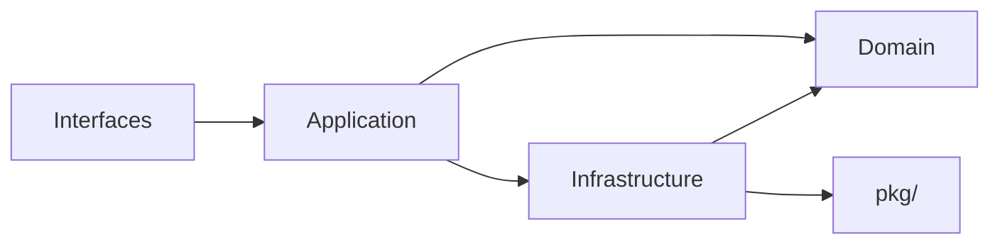

# ModelCraft Go 编码规范

详细规范请 Refer to @ai-metadata/backend/development/ 下的各文档，本文仅保留项目特有的关键流程。

## 架构分层（DDD）

```mermaid
graph TD
    subgraph ["Shared Kernel (pkg/)"]
        P["pkg/"]
    end
    subgraph ["Domain 领域层"]
        D["Domain (internal/domain)"]
    end
    subgraph ["Infrastructure"]
        I["Infrastructure (internal/infrastructure)"]
    end
    subgraph ["Application 应用层"]
        A["Application (internal/app/)"]
    end
    subgraph ["Interfaces 接口层"]
        IF["Interfaces (graphql/http)"]
    end
    P --> D
    I --> D
    A --> D
    A --> I
    IF --> A
```

### 依赖方向（单向，不可逆）



### 各层依赖规则

| 层 | 可依赖 | 禁止依赖 |
|----|--------|----------|
| Interfaces | Application、同层 | Infrastructure、Domain（直接） |
| Application | Domain、Infrastructure | Interfaces |
| Infrastructure | Domain、pkg/ | Application、Interfaces |
| Domain | **仅 pkg/** | 所有 internal 层 |
| pkg/ | 无 | 所有 internal 层 |

## 错误处理流程

项目有两套错误包，**不可混用**：

| 包 | 路径 | 用途 |
|----|------|------|
| `bizerrors` | `pkg/bizerrors/` | 业务错误，跨层传递，暴露给客户端 |
| `shared.RepositoryError` | `internal/domain/shared/repository_error.go` | Repository 层技术错误，不暴露给客户端 |

**禁止直接使用标准库 `errors`**，所有通用错误包装使用 `pkg/bizerrors`。

### 错误流转流程

```
Repository.Find()
    ├─ sql.ErrNoRows → return (nil, nil) 或 (nil, NotFoundError)
    ├─ 其他 DB 错误           → return (nil, RepositoryError)
    └─ 成功                   → return (entity, nil)

App.UseCase()
    ├─ err != nil            → ConvertRepositoryError → BusinessError(SYSTEM_ERROR)
    ├─ entity == nil         → NewErrorFromContext    → BusinessError(NOT_FOUND.XXX)
    └─ 成功                  → return entity

Interfaces (Resolver)
    └─ BusinessError → adapter/*_error_adapter.go → GraphQL 联合错误
        （错误转换前必须记录 logfacade.Stack(err)，唯一允许打堆栈的地方）
```

### RecordNotFound 两种模式

| 场景 | 返回值 | 不存在时 | 示例方法 |
|------|--------|----------|----------|
| 必须存在的记录 | `(value, error)` | 返回 `NotFoundError` | `GetByID`, `GetByName` |
| 可能不存在的查询 | `(value, bool, error)` | 返回 `(value, false, nil)` | `FindIDByExternalID` |

**禁止在 Repository 层直接返回 `bizerrors.ModelNotFound`。**

### 日志与堆栈规则

| 层 | 使用方式 | 是否用 Stack() |
|----|----------|----------------|
| Repository | 不打印错误日志 | 否 |
| Application | `logger.Error(..., logfacade.Err(err))` | 否 |
| Interfaces (错误转换点) | `logger.Error(..., logfacade.Err(err), logfacade.Stack(err))` | **是** |

## 事务流程

- 事务在 Application 层（UseCase）开启和提交，Repository 接收 `dbgen.Querier` 无感知
- `defer tx.Rollback()` 保证回滚，成功时显式 `tx.Commit()`

## Repository 层规范

Triggered by globs: `internal/infrastructure/**/*.go`

- 接收 `querier` 接口（`dbgen.Querier`），支持事务和非事务
- 使用 `ExecWithErrorHandling` / `QueryWithSQLErrorHandling` 包装 DB 操作
- 返回 `shared.RepositoryError`，不返回 `*BusinessError`
- 使用辅助函数处理 `sql.Null*` 类型（`NullStrToPtr`、`PtrToNullStr` 等）

## 三条 API 通道

| 通道 | Schema 来源 | 用途 |
|------|-------------|------|
| 设计时 GraphQL | `api/graph/schema/*.graphql` | 模型/字段/枚举/项目/集群 CRUD |
| REST (OpenAPI) | `api/openapi/*.yaml` | 认证、组织管理、Webhook |
| 运行时 GraphQL | 运行时动态生成 | 用户数据查询/变更 |

**业务域功能只走设计时 GraphQL，禁止添加到 REST API。**

## 数据库（sqlc）

- 所有数据库操作使用 **sqlc**，SQL 查询定义在 `db/queries/*.sql`，生成代码位于 `internal/infrastructure/dbgen/`
- **禁止使用 ORM**
- **禁止运行 `task regenerate-gql`**（会删除自定义 resolver 实现）
- 修改 `.graphql` 文件后运行 `task generate-gql`

## 日志与工具

- 使用 `logfacade` 包，禁止裸用 `log`
- 复杂对象用 `bizutils.MarshalToStringIgnoreErr` 输出
- 禁止裸用 `go func`，必须使用 `bizutils.GoWithCtx`
- Context 工具（`ctxutils`）：`GetUserIDFromContext`、`GetOrgNameFromContext`、`GetPermissionsFromContext`、`GetRequestID`，值缺失时返回 `error`，必须检查

## 参考文档

| 主题 | 文件 |
|------|------|
| 架构分层详解 | Refer to @ai-metadata/backend/development/architecture.md |
| 代码风格规范 | Refer to @ai-metadata/backend/development/code-style.md |
| 错误处理规范 | Refer to @ai-metadata/backend/development/error-handling.md |
| Repository 层开发规范 | Refer to @ai-metadata/backend/development/repo-develop.md |
| 错误码定义 | Refer to @pkg/bizerrors/common_errors.go |
| BusinessError 结构 | Refer to @pkg/bizerrors/business_error.go |
| RepositoryError / Sentinel | Refer to @internal/domain/shared/repository_error.go |
| SQL 错误分类 | Refer to @internal/infrastructure/repository/sql_error_analyzer.go |
| GraphQL 错误适配器 | Refer to @internal/interfaces/graphql/adapter/*_error_adapter.go |
