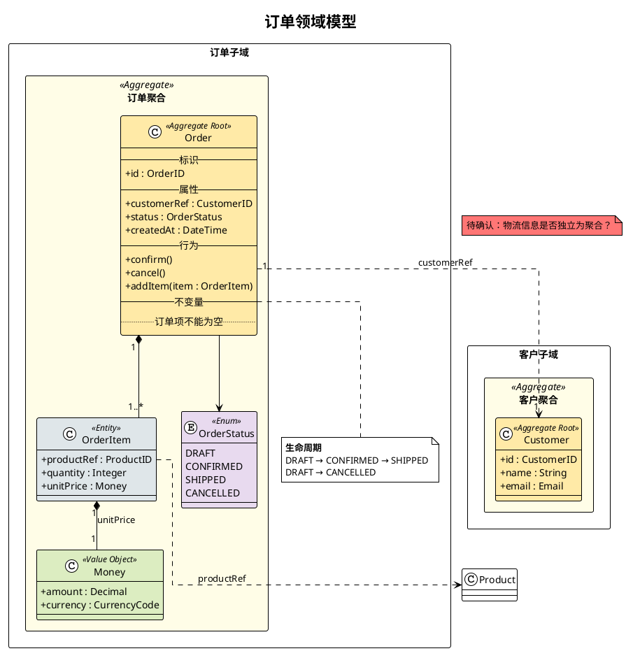

# PlantUML DDD 建模语法参考

## 基本结构

所有 `.puml` 文件使用 PlantUML Class Diagram 语法。


## 构造型（Stereotypes）

用构造型区分 DDD 战术元素：

| 元素 | 构造型 | 颜色 |
|------|--------|------|
| 聚合根 | `<<Aggregate Root>>` | `#FFEAA7` |
| 实体 | `<<Entity>>` | `#DFE6E9` |
| 值对象 | `<<Value Object>>` | `#DCEDC1` |
| 领域服务 | `<<Domain Service>>` | `#FAD9C1` |
| 枚举 | `<<Enum>>` | `#E8DAEF` |

## 实体与聚合根

```puml
class Order <<Aggregate Root>> #FFEAA7 {
  --标识--
  + id : OrderID
  --属性--
  + customerRef : CustomerID
  + status : OrderStatus
  + totalAmount : Money
  + createdAt : DateTime
  --行为--
  + confirm()
  + cancel()
  + addItem(item : OrderItem)
  --不变量--
  .. 订单项不能为空 ..
  .. 已取消的订单不可修改 ..
}
```

## 值对象

```puml
class Money <<Value Object>> #DCEDC1 {
  + amount : Decimal
  + currency : CurrencyCode
  --相等性--
  .. amount + currency 全匹配 ..
}
```

## 枚举

```puml
enum OrderStatus <<Enum>> #E8DAEF {
  DRAFT
  CONFIRMED
  SHIPPED
  CANCELLED
}
```

## 领域服务

```puml
class PricingService <<Domain Service>> #FAD9C1 {
  + calculateTotal(order : Order) : Money
  + applyDiscount(order : Order, strategy : DiscountStrategy) : Money
}
```

## 聚合边界

用 `package` 表示聚合边界：

```puml
package "订单聚合" as OrderAggregate <<Aggregate>> #FFFDE7 {
  class Order <<Aggregate Root>> #FFEAA7 {
    + id : OrderID
    + status : OrderStatus
  }

  class OrderItem <<Entity>> #DFE6E9 {
    + productRef : ProductID
    + quantity : Integer
    + unitPrice : Money
  }

  class ShippingAddress <<Value Object>> #DCEDC1 {
    + street : String
    + city : String
    + zipCode : String
  }

  Order "1" *-- "1..*" OrderItem
  Order "1" *-- "1" ShippingAddress
}
```

## 关系类型

```puml
' 组合（生命周期绑定，聚合内部）
Order "1" *-- "1..*" OrderItem : 包含

' 聚合（整体-部分，可独立存在）
Department "1" o-- "0..*" Employee : 归属

' 跨聚合引用（通过 ID，虚线）
Order "1" ..> "1" Customer : customerRef
OrderItem "1" ..> "1" Product : productRef

' 关联基数标注
' "1"       恰好一个
' "0..1"    零或一个
' "1..*"    一个或多个
' "0..*"    零或多个
' "*"       多个
```

## 生命周期（状态图片段）

在聚合 package 外，用 note 描述关键生命周期：

```puml
note bottom of Order
  <b>生命周期</b>
  DRAFT → CONFIRMED → SHIPPED
  DRAFT → CANCELLED
  CONFIRMED → CANCELLED
end note
```

## 领域划分（多子域）

用 `rectangle` 分隔子域：

```puml
rectangle "订单子域" as OrderSubdomain {
  package "订单聚合" as OA <<Aggregate>> #FFFDE7 {
    class Order <<Aggregate Root>> #FFEAA7 { }
  }
}

rectangle "客户子域" as CustomerSubdomain {
  package "客户聚合" as CA <<Aggregate>> #FFFDE7 {
    class Customer <<Aggregate Root>> #FFEAA7 { }
  }
}

Order ..> Customer : customerRef
```

## 待确认问题

用浮动 note 标记：

```puml
note "待确认：折扣是否需要独立为聚合？" as N1 #FF7675
```

## 完整示例


