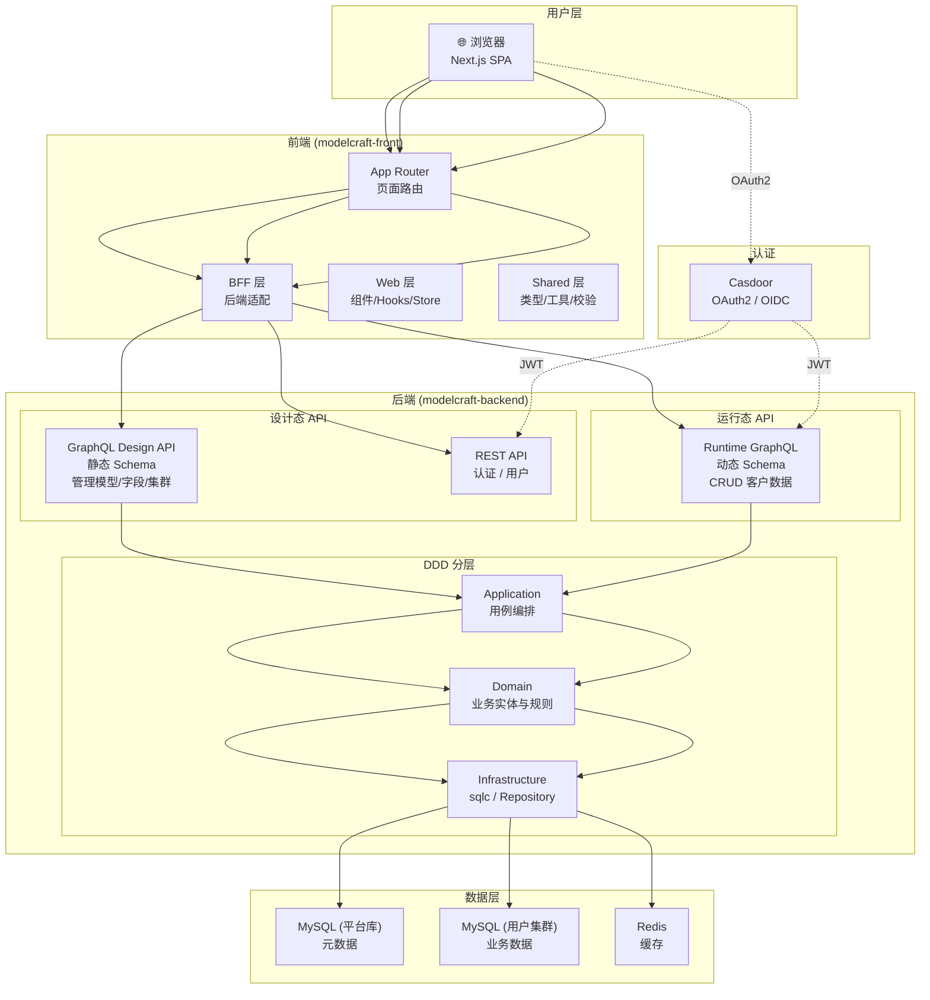

**ModelCraft** 是一个面向开发团队的低代码数据模型管理平台，核心价值链为：**可视化设计模型 → 自动同步数据库 Schema → 自动生成 GraphQL API**。用户无需编写后端代码，即可完成从数据建模到 API 消费的完整链路。本文档将从架构全景、技术栈、核心领域、工程组织四个维度，为你建立对整个项目的系统性认知。

Sources: [core-principles.md](ai-metadata/backend/design/core-principles.md#L1-L103), [README.md](modelcraft-backend/README.md#L1-L30)

## 架构全景

ModelCraft 采用**设计态与运行态**完全解耦的双阶段架构，这是理解整个系统设计的基石。设计态负责元数据定义与模型管理，运行态负责根据模型定义动态生成 GraphQL API 供客户端消费。两态通过"同步到目标数据库"这一显式操作衔接，确保设计变更不会实时冲击运行态的可用性。

Sources: [core-principles.md](ai-metadata/backend/design/core-principles.md#L14-L26)

下面的架构总览图展示了系统从用户浏览器到数据库的完整数据流：



Sources: [routes.go](modelcraft-backend/internal/interfaces/http/routes.go#L1-L80), [architecture.md](modelcraft-front/src/README.md#L1-L30)

### 双 GraphQL 入口

系统存在两个独立的 GraphQL 入口，Schema 生成方式完全不同：

| 维度 | 设计态 GraphQL | 运行态 GraphQL |
|------|---------------|---------------|
| **路径** | `/org/{orgName}/design/graphql` | `/{orgName}/{projectSlug}/{db}/{model}` |
| **Schema** | 静态（`.graphql` 文件定义） | 动态（根据模型定义实时生成） |
| **职责** | 管理模型、字段、集群、项目 | 查询和操作客户业务数据 |
| **消费者** | ModelCraft 管理界面 | 客户端应用 |
| **认证** | Casdoor JWT / ModelCraft JWT | API Key / Casdoor JWT |

设计态操作的是 ModelCraft 自身的元数据，Schema 固定，适合静态定义；运行态操作的是客户的业务数据，每个模型结构不同，必须动态生成。两者职责边界清晰，互不干扰。

Sources: [core-principles.md](ai-metadata/backend/design/core-principles.md#L44-L59), [graphql_app.go](modelcraft-backend/internal/app/modelruntime/graphql_app.go#L1-L10)

## 技术栈全景

ModelCraft 采用前后端分离的架构，每个子项目都有独立的技术选型和工具链：

| 层级 | 后端 (modelcraft-backend) | 前端 (modelcraft-front) |
|------|--------------------------|------------------------|
| **语言** | Go 1.25 | TypeScript 5 |
| **Web 框架** | Gin (REST) + Chi (路由) + gqlgen (GraphQL) | Next.js 14 (App Router) |
| **数据层** | sqlc (SQL 代码生成) + database/sql | Apollo Client + TanStack Query |
| **数据库** | MySQL 8.0 (平台库 + 用户集群) | — |
| **缓存** | Redis 7 | — |
| **认证** | Casdoor (OAuth2/OIDC) + Casbin (RBAC) | Casdoor SDK + JWT |
| **状态管理** | — | Zustand |
| **UI 框架** | — | shadcn/ui + Radix UI + Tailwind CSS |
| **表单** | — | React Hook Form + Zod |
| **代码生成** | sqlc, gqlgen, oapi-codegen | graphql-codegen |
| **测试** | Go testing + testify | Cucumber.js (BDD) + Vitest |
| **容器化** | Docker Compose (MySQL + Redis + Casdoor) | — |

Sources: [go.mod](modelcraft-backend/go.mod#L1-L43), [package.json](modelcraft-front/package.json#L1-L40), [docker-compose.yml](modelcraft-backend/docker-compose.yml#L1-L186)

## 核心领域模型

ModelCraft 的领域模型围绕**组织 → 项目 → 数据库集群 → 模型 → 字段**的层级关系组织，同时包含认证、权限、枚举等横切关注点。核心价值链中的每个概念都对应一个 DDD 领域聚合根：

| 领域实体 | 职责 | 关键属性 |
|---------|------|---------|
| **Organization** | 租户隔离的单位 | orgName, displayName |
| **Project** | 业务项目，承载多个模型 | slug, orgName |
| **DatabaseCluster** | 目标数据库连接 | host, port, credentials(加密) |
| **Model** | 数据模型定义（核心产物） | modelName, fields, locator |
| **FieldDefinition** | 模型字段（类型/校验/关系） | name, type, format, validation |
| **EnumDefinition** | 枚举定义（系统配置） | name, values |
| **LogicalForeignKey** | 逻辑外键关系 | sourceField, targetModel |
| **Permission/Role** | Casbin RBAC 权限 | subject, resource, action |

Sources: [model.go](modelcraft-backend/internal/domain/modeldesign/model.go#L1-L50), [field_definition.go](modelcraft-backend/internal/domain/modeldesign/field_definition.go#L1-L47), [index.md](ai-metadata/index.md#L1-L100)

模型的本质是 **HTTP API 的蓝图**。模型设计的一切都围绕"生成高质量的 HTTP API"展开——输入是设计态的模型定义，输出是自动生成的 GraphQL CRUD API 端点和对应的数据库 Schema：

```
输入: 模型定义 (Design-Time Schema)
输出: HTTP API Endpoint + CRUD 能力
  ├── GraphQL API (当前实现)
  └── RESTful API (未来扩展)
```

Sources: [model-design-specification.md](modelcraft-backend/docs/model-design-specification.md#L1-L21)

### 字段类型体系

ModelCraft 的字段类型是**语义类型**，描述"是什么"而非物理存储方式。物理存储由产物生成层根据语义类型自动决定：

| 字段类型 | 语义 | 可选 Format | 物理存储示例 |
|---------|------|------------|-------------|
| **STRING** | 文本 | UUID, EMAIL 等 | VARCHAR(255) |
| **NUMBER** | 数值 | INTEGER, DECIMAL | INT / DECIMAL(10,2) |
| **BOOLEAN** | 布尔 | — | TINYINT(1) |
| **DATETIME** | 日期时间 | DATE, TIME, DATETIME | DATE / DATETIME |
| **JSON** | JSON 结构 | — | JSON |
| **ENUM** | 枚举引用 | — | VARCHAR(枚举值) |
| **RELATION** | 模型关联 | — | 外键 / 关联表 |

Sources: [model-design-specification.md](modelcraft-backend/docs/model-design-specification.md#L107-L175)

## 项目仓库结构

ModelCraft 的 Git 仓库采用 **Submodule + Subtree 混合管理**模式：

| 管理方式 | 路径 | 用途 |
|---------|------|------|
| **Git Submodule** | `modelcraft-backend/` | Go 后端子项目 |
| **Git Submodule** | `modelcraft-front/` | Next.js 前端子项目 |
| **Git Subtree** | `modelcraft-backend/api/` → `modelcraft-front/contract/` | API Contract 单一真相源共享 |

根仓库通过 `.agents/` 目录统一管理 AI Agent 配置（包括 Claude、CodeBuddy 等多个 AI 工具），其他 `.claude/`、`.codebuddy/` 等目录均为指向 `.agents/` 的符号链接。

Sources: [CLAUDE.md](CLAUDE.md#L1-L70)

```
modelcraft/                          # 根仓库
├── modelcraft-backend/              # Go 后端（Submodule）
│   ├── internal/                    # DDD 分层核心代码
│   │   ├── app/                     # Application 层 — 用例编排
│   │   ├── domain/                  # Domain 层 — 业务实体与规则
│   │   ├── infrastructure/          # Infrastructure 层 — 技术实现
│   │   ├── interfaces/              # Interfaces 层 — API 入口
│   │   ├── middleware/              # 中间件（JWT/权限/租户）
│   │   └── models/                  # 传输模型
│   ├── api/                         # API Contract（Subtree 真相源）
│   ├── db/                          # 数据库 Schema + SQL 查询
│   ├── pkg/                         # 公共工具包
│   └── configs/                     # 配置文件
├── modelcraft-front/                # Next.js 前端（Submodule）
│   ├── src/
│   │   ├── app/                     # Next.js App Router 页面
│   │   ├── bff/                     # BFF 层 — 后端适配
│   │   ├── web/                     # Web 层 — 组件/Hooks/Store
│   │   ├── shared/                  # Shared 层 — 类型/工具
│   │   └── generated/               # GraphQL Codegen 产出
│   ├── contract/                    # API Contract（Subtree 消费端，只读）
│   └── prototypes/                  # HTML-First 原型
├── tests-bdd/                       # BDD 验收测试（Cucumber.js）
├── ai-metadata/                     # 知识文档唯一存放位置
├── .agents/                         # AI Agent 配置（单一真相源）
└── plans/                           # 技术规划文档
```

Sources: [CLAUDE.md](CLAUDE.md#L35-L70), [index.md](ai-metadata/index.md#L1-L60)

## 基础设施与部署

ModelCraft 的本地开发环境通过 Docker Compose 一键拉起，包含以下服务：

| 服务 | 镜像 | 端口 | 说明 |
|------|------|------|------|
| **modelcraft-app** | 自建 Dockerfile | 8080 | Go 后端应用 |
| **modelcraft-mysql** | mysql:8.0 | 6033 | 平台元数据库 |
| **modelcraft-redis** | redis:7-alpine | 6379 | 缓存服务 |
| **casdoor** | casbin/casdoor:latest | 8000 | 认证服务 |
| **casdoor-db** | mysql:8.0 | — | Casdoor 数据库 |
| **modelcraft-front** | Next.js dev server | 3000 | 前端开发服务器 |

后端应用在启动时会自动执行数据库迁移（`migrate_on_startup: true`），无需手动执行 SQL 脚本。生产环境支持切换到外部 MySQL 实例，并通过环境变量覆盖所有敏感配置。

Sources: [docker-compose.yml](modelcraft-backend/docker-compose.yml#L1-L186), [config.yaml](modelcraft-backend/configs/config.yaml#L1-L110)

## 测试体系

ModelCraft 采用**测试金字塔**策略，确保从单元到端到端的多层质量保障：

| 测试层级 | 工具 | 覆盖范围 |
|---------|------|---------|
| **后端单元测试** | Go testing + testify | Domain 层业务规则、Repository 层数据操作 |
| **BDD 验收测试** | Cucumber.js + Gherkin | 认证、模型、字段、枚举、外键、组织、Profile |
| **前端组件测试** | Vitest | 组件逻辑、Hooks |
| **前端 Mock** | MSW (Mock Service Worker) | API 层模拟 |

BDD 验收测试位于项目根目录的 `tests-bdd/` 中，覆盖 7 个核心业务模块，通过 Gherkin 场景描述驱动测试实现，确保产品行为与代码实现一致。

Sources: [features/](tests-bdd/features/), [cucumber.js](tests-bdd/cucumber.js)

## 推荐阅读路径

作为入门开发者，建议按以下顺序深入探索 ModelCraft：

1. **搭建环境** → [快速启动：环境搭建与本地运行](2-kuai-su-qi-dong-huan-jing-da-jian-yu-ben-di-yun-xing)
2. **理解仓库** → [Git 仓库结构：Submodule 与 Subtree 协作模型](3-git-cang-ku-jie-gou-submodule-yu-subtree-xie-zuo-mo-xing)
3. **核心架构** → [设计态与运行态双阶段架构](5-she-ji-tai-yu-yun-xing-tai-shuang-jie-duan-jia-gou)
4. **后端分层** → [DDD 分层架构：Domain → Application → Infrastructure → Interfaces](6-ddd-fen-ceng-jia-gou-domain-application-infrastructure-interfaces)
5. **前端分层** → [前端分层架构：App → Web → BFF → Shared](12-qian-duan-fen-ceng-jia-gou-app-web-bff-shared)