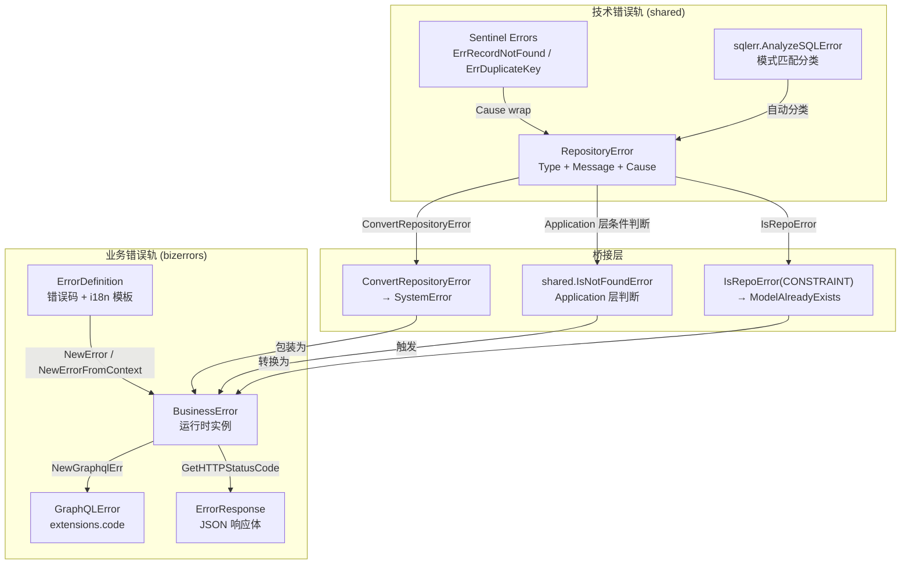
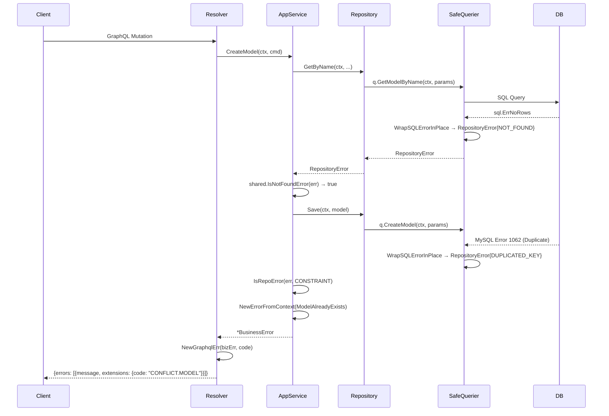

ModelCraft 后端采用**双轨错误体系**来清晰分离「业务语义错误」与「基础设施技术错误」：**bizerrors** 包承载面向用户的业务错误（含 i18n、HTTP 状态码映射、GraphQL 扩展字段），**RepositoryError** 承载数据库层的技术错误分类（连接超时、约束冲突、死锁等）。两层通过 `ConvertRepositoryError` 桥接，确保底层技术细节不会泄漏到 API 响应中。

Sources: [errors.go](modelcraft-backend/pkg/bizerrors/errors.go#L1-L25), [repository_error.go](modelcraft-backend/internal/domain/shared/repository_error.go#L1-L132)

## 设计哲学：为什么需要双轨？

在一个典型的 DDD 分层架构中，错误产生的源头截然不同：**Domain/Application 层**产生的是"模型不存在""参数无效""操作被拒绝"等业务语义错误；**Infrastructure 层**产生的是"连接超时""唯一约束冲突""死锁"等技术错误。如果将二者混为一谈，会导致 API 响应中泄漏技术细节（如 SQL 错误消息），或者反过来让底层代码依赖上层的错误码定义。

ModelCraft 的解法是在两个层级各自建立独立的错误模型，再通过**单向桥接**连接：Application 层可以感知并转换 Repository 层错误，但 Repository 层完全不知道 BusinessError 的存在。



Sources: [business_error.go](modelcraft-backend/pkg/bizerrors/business_error.go#L164-L181), [repository_error.go](modelcraft-backend/internal/domain/shared/repository_error.go#L51-L89)

## 业务错误轨：bizerrors 包

### ErrorDefinition —— 静态错误定义

`ErrorDefinition` 是一个值对象，每个业务错误在包级别声明为一个 `var`，包含**错误码**、**英文消息模板**和**中文消息模板**三要素。错误码采用 `TYPE.DOMAIN` 格式，其中 `TYPE` 部分决定 HTTP 状态码和错误分类，`DOMAIN` 部分用于精确定位。

| 错误类型常量 | 错误码前缀 | HTTP 状态码 | 语义 |
|---|---|---|---|
| `ErrorTypeNotFound` | `NOT_FOUND` | 404 | 资源不存在 |
| `ErrorTypeParamInvalid` | `PARAM_INVALID` | 400 | 输入验证失败 |
| `ErrorTypeOperationFailed` | `OPERATION_FAILED` | 403 | 权限不足、状态不允许 |
| `ErrorTypeConflict` | `CONFLICT` | 409 | 重复创建、并发冲突 |
| `ErrorTypeAuthentication` | `AUTHENTICATION_FAILED` | 401 | 登录失败、token 过期 |
| `ErrorTypeUnauthorized` | `UNAUTHORIZED` | 401 | 缺少认证信息 |
| `ErrorTypeSystemError` | `SYSTEM_ERROR` | 500 | 系统内部错误 |

`GetErrorType()` 方法通过解析错误码中第一个 `.` 之前的部分来提取类型前缀，使得 `NOT_FOUND.MODEL` 和 `NOT_FOUND.FIELD` 都能被统一识别为"资源不存在"类别。

Sources: [definition.go](modelcraft-backend/pkg/bizerrors/definition.go#L1-L97), [business_error.go](modelcraft-backend/pkg/bizerrors/business_error.go#L78-L98)

### 错误码分层设计

错误码的命名遵循 `TYPE.DOMAIN[.SUBDOMAIN]` 三级结构。下表展示了各领域的错误码定义分布：

| 领域 | NOT_FOUND | CONFLICT | OPERATION_FAILED | PARAM_INVALID |
|---|---|---|---|---|
| Model | `NOT_FOUND.MODEL` | `CONFLICT.MODEL` / `CONFLICT.MODEL.TABLE` | — | — |
| Field | `NOT_FOUND.FIELD` | `CONFLICT.FIELD` | `OPERATION_FAILED.RELATION` | — |
| Enum | `NOT_FOUND.ENUM` | `CONFLICT.ENUM` | `OPERATION_FAILED.ENUM` | — |
| Project | `NOT_FOUND.PROJECT` | `CONFLICT.PROJECT` | `OPERATION_FAILED.PROJECT` | — |
| Cluster | `NOT_FOUND.CLUSTER` | `CONFLICT.CLUSTER` | `OPERATION_FAILED.CLUSTER` / `.DB_CONNECTION` | — |
| Group | `NOT_FOUND.GROUP` | `CONFLICT.GROUP` | — | `PARAM_INVALID.GROUP` |
| User | `NOT_FOUND.USER` | `CONFLICT.USER` | — | — |
| FK | `NOT_FOUND.FK` | — | `OPERATION_FAILED.FK` | `PARAM_INVALID.FK` / `.FK.FIELD_COUNT` |
| APIKey | `NOT_FOUND.API_KEY` | — | `OPERATION_FAILED.API_KEY` | — |
| Record | `NOT_FOUND.RECORD` | `CONFLICT.RECORD` | — | — |

Sources: [common_errors.go](modelcraft-backend/pkg/bizerrors/common_errors.go#L1-L375)

### BusinessError —— 运行时实例

`BusinessError` 是运行时错误实例，携带以下上下文信息：

- **info**：关联的 `ErrorDefinition`（错误码 + 消息模板）
- **msg**：根据模板和参数在创建时生成的最终消息
- **wrappedError**：可选的原始错误（不对外暴露，仅用于内部调试）
- **requestId**：链路追踪 ID（通过 `NewErrorFromContext` 自动提取）
- **language**：消息语言（通过 context 自动提取）

消息模板支持 `{0}`, `{1}` 占位符，在创建时通过 `GetMessageWithParams` 一次性替换。例如 `ModelAlreadyExists` 的模板为 `"Model already exists: {0}"`，调用 `NewError(ModelAlreadyExists, "my_model")` 即生成 `"Model already exists: my_model"`。

Sources: [business_error.go](modelcraft-backend/pkg/bizerrors/business_error.go#L1-L137), [i18n.go](modelcraft-backend/pkg/bizerrors/i18n.go#L1-L47)

### 创建方式选择

| 工厂函数 | 适用场景 | Context 感知 |
|---|---|---|
| `NewError(code, params...)` | 简单场景、不依赖请求上下文 | ✗ |
| `NewErrorFromContext(ctx, code, params...)` | HTTP/GraphQL 请求处理中 | ✓ 自动提取 lang、requestId |
| `WrapError(err, code, params...)` | 包装已有 error 为业务错误 | ✗ |
| `ConvertRepositoryError(ctx, repoErr)` | 将 Repository 错误统一转为 SystemError | ✓ |

Sources: [business_error.go](modelcraft-backend/pkg/bizerrors/business_error.go#L100-L181)

## 技术错误轨：RepositoryError

### Sentinel Errors 与类型化错误

`RepositoryError` 定义在 `internal/domain/shared` 包中，这本身就说明了它的定位——属于 Domain 层共享的基础设施抽象。它包含三个字段：

- **Type**：`RepositoryErrorType` 枚举，用于分类（`CONNECTION`、`TIMEOUT`、`CONSTRAINT`、`NOT_FOUND`、`DUPLICATED_KEY` 等）
- **Message**：技术错误描述
- **Cause**：原始错误链

同时，包级别声明了两个 Sentinel Error：`ErrRecordNotFound` 和 `ErrDuplicateKey`，支持标准库 `errors.Is()` 检查。便捷构造函数 `NewNotFoundError` 和 `NewDuplicateKeyError` 会自动将对应的 Sentinel Error 设为 Cause，使得下游既可以通过 `errors.Is(err, shared.ErrRecordNotFound)` 判断，也可以通过 `IsRepoError(err, shared.ErrTypeNotFound)` 判断。

Sources: [repository_error.go](modelcraft-backend/internal/domain/shared/repository_error.go#L1-L132)

### RepositoryErrorType 分类

| 类型常量 | 语义 | 典型触发场景 |
|---|---|---|
| `CONNECTION` | 连接失败 | MySQL 连接拒绝/重置 |
| `TIMEOUT` | 操作超时 | context deadline exceeded |
| `TRANSACTION` | 事务错误 | 死锁、锁等待超时 |
| `CONSTRAINT` | 约束违反 | 外键约束 (1451/1452) |
| `DUPLICATED_KEY` | 重复键 | 唯一索引冲突 (1062) |
| `NOT_FOUND` | 记录不存在 | `sql.ErrNoRows` |
| `CONVERSION` | 数据转换失败 | 类型断言失败 |
| `DDL_SYNTAX_ERR` | DDL 语法错误 | 建表语句错误 |
| `DML_SYNTAX_ERR` | DML 语法错误 | SQL 语法错误 (1064) |
| `NO_ROWS_AFFECTED` | 影响行数为 0 | UPDATE 未匹配到记录 |
| `PERMISSION` | 权限不足 | 数据库用户权限不足 |
| `UNKNOWN` | 未知错误 | 未匹配任何模式 |

Sources: [repository_error.go](modelcraft-backend/internal/domain/shared/repository_error.go#L27-L49)

## 自动分类引擎：sqlerr 包

`sqlerr` 包是将原始 SQL 错误转换为 `RepositoryError` 的桥梁。其核心是 `AnalyzeSQLError` 函数，执行三层分类策略：

1. **Fast path**：如果已经是 `RepositoryError`，直接返回
2. **sql.ErrNoRows**：转为 `NOT_FOUND` 类型，自动 wrap `ErrRecordNotFound`
3. **Pattern matching**：按优先级匹配 MySQL 错误码和通用错误模式

模式匹配列表按**精确度从高到低**排列。MySQL 特定错误码（如 `error 1062`、`error 1451`）优先于通用字符串模式（如 `duplicate entry`、`timeout`），确保分类准确。

Sources: [sqlerr.go](modelcraft-backend/internal/infrastructure/sqlerr/sqlerr.go#L1-L102)

## Safe Querier：错误包装的统一入口

`SafeQuerier` 是通过 gowrap 自动生成的装饰器，为 sqlc 生成的每一个 Querier 方法调用后自动执行 `WrapSQLErrorInPlace(&err)`。这意味着**所有从数据库层抛出的原始 SQL 错误在到达 Repository 实现之前就已经被分类为 `RepositoryError`**。

Repository 构造函数中将原始 Querier 包装为 SafeQuerier：

```go
func NewSqlModelDesignRepository(q dbgen.Querier) modeldesign.ModelRepository {
    return &SqlModelDesignRepository{q: dbgenwrap.NewSafeQuerier(q)}
}
```

Sources: [safe_querier_gen.go](modelcraft-backend/internal/infrastructure/dbgenwrap/safe_querier_gen.go#L1-L80), [error_wrap.go](modelcraft-backend/internal/infrastructure/dbgenwrap/error_wrap.go#L1-L9), [sql_modeldesign_repository.go](modelcraft-backend/internal/infrastructure/repository/sql_modeldesign_repository.go#L263-L271)

## 双轨桥接：Application 层的转换策略

Application 层是两条错误轨交汇的地方。桥接遵循三条明确模式：

### 模式一：ConvertRepositoryError —— 无条件转 SystemError

当 Application 层不需要区分 Repository 错误的具体类型时（例如查询 API Key 列表失败），使用 `ConvertRepositoryError` 将任意 Repository 错误统一包装为 `SYSTEM_ERROR`：

```go
keys, err := s.apiKeyRepo.ListByUserID(ctx, userID)
if err != nil {
    return nil, bizerrors.ConvertRepositoryError(ctx, err)
}
```

Sources: [api_key_service.go](modelcraft-backend/internal/app/auth/api_key_service.go#L46-L53)

### 模式二：条件判断 + 语义转换

当 Application 层需要根据 Repository 错误类型做出不同业务决策时，先判断后转换：

```go
existingModel, err := s.modelRepo.GetByName(ctx, orgName, db, name, slug)
if err != nil && !shared.IsNotFoundError(err) {
    return "", fmt.Errorf("failed to check uniqueness: %w", err)
}
if err == nil && existingModel != nil {
    return "", bizerrors.NewErrorFromContext(ctx, bizerrors.ModelAlreadyExists, name)
}
```

在事务中保存模型时的约束冲突检测：

```go
if err := modelRepository.Save(ctx, orgName, model); err != nil {
    if shared.IsRepoError(err, shared.ErrTypeConstraint) {
        return bizerrors.NewErrorFromContext(ctx, bizerrors.ModelAlreadyExists, name)
    }
    return err
}
```

Sources: [model_app.go](modelcraft-backend/internal/app/modeldesign/model_app.go#L117-L168)

### 模式三：直接透传

对于 Repository 层已经返回的 `RepositoryError`（如 `shared.NewNotFoundError`），Application 层在无需特殊处理时可以直接透传，由上层 Gateway/Resolver 统一处理。

Sources: [sql_modeldesign_repository.go](modelcraft-backend/internal/infrastructure/repository/sql_modeldesign_repository.go#L282-L315)

## GraphQL 错误适配

GraphQL Resolver 层通过 `WithGraphqlErrorHandler` 或手动类型断言将 `BusinessError` 转换为 GraphQL 格式错误。转换后的错误在 `extensions.code` 字段中携带业务错误码（如 `NOT_FOUND.MODEL`、`CONFLICT.FIELD`），前端可据此进行精确的错误处理和用户提示。

`ClusterErrorAdapter` 展示了更精细的适配模式：将 `BusinessError` 映射为 GraphQL Schema 中定义的联合错误类型（如 `GetClusterError`、`UpdateClusterError`），实现类型安全的错误返回。

Sources: [graphql_handler.go](modelcraft-backend/pkg/bizerrors/graphql_handler.go#L1-L28), [graphql_error.go](modelcraft-backend/pkg/bizerrors/graphql_error.go#L1-L18), [cluster_error_adapter.go](modelcraft-backend/internal/interfaces/graphql/org/adapter/cluster_error_adapter.go#L1-L130)

## 错误流转全景



Sources: [sqlerr.go](modelcraft-backend/internal/infrastructure/sqlerr/sqlerr.go#L47-L69), [model_app.go](modelcraft-backend/internal/app/modeldesign/model_app.go#L117-L168), [graphql_handler.go](modelcraft-backend/pkg/bizerrors/graphql_handler.go#L11-L27)

## stdlib errors 的统一包装

`bizerrors` 包还承担了一个隐藏职责：通过重新导出 `github.com/pkg/errors` 的全部函数（`New`、`Errorf`、`Wrap`、`Wrapf`、`WithStack`、`Cause`、`Is`、`As`、`Unwrap`），使得项目代码中 `import "modelcraft/pkg/bizerrors"` 后可以直接使用 `bizerrors.New()` / `bizerrors.Wrap()` 替代标准库 `errors` 包，统一获得带堆栈信息的错误链能力。

Sources: [errors.go](modelcraft-backend/pkg/bizerrors/errors.go#L1-L25)

---

> **下一步阅读**：了解错误从 Repository 层向上传播经过的分层架构，参见 [DDD 分层架构：Domain → Application → Infrastructure → Interfaces](6-ddd-fen-ceng-jia-gou-domain-application-infrastructure-interfaces)；了解 SafeQuerier 的代码生成细节，参见 [数据层：sqlc 代码生成与 Safe Querier 模式](9-shu-ju-ceng-sqlc-dai-ma-sheng-cheng-yu-safe-querier-mo-shi)；了解前端如何消费 GraphQL 错误码，参见 [三种 Apollo Client 实例策略与 GraphQL 操作层约定](13-san-chong-apollo-client-shi-li-ce-lue-yu-graphql-cao-zuo-ceng-yue-ding)。