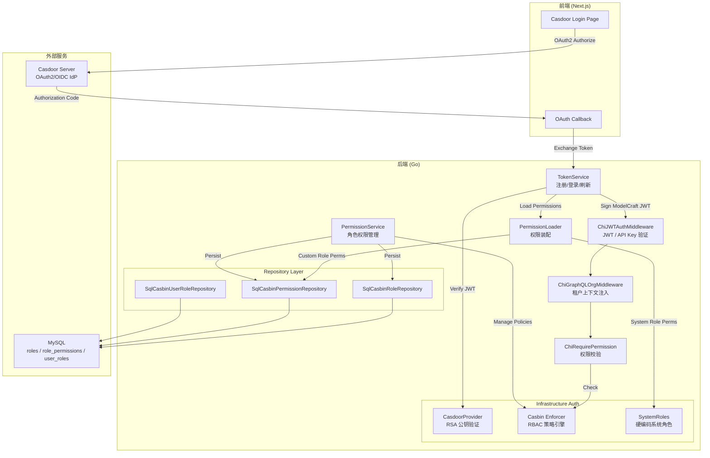
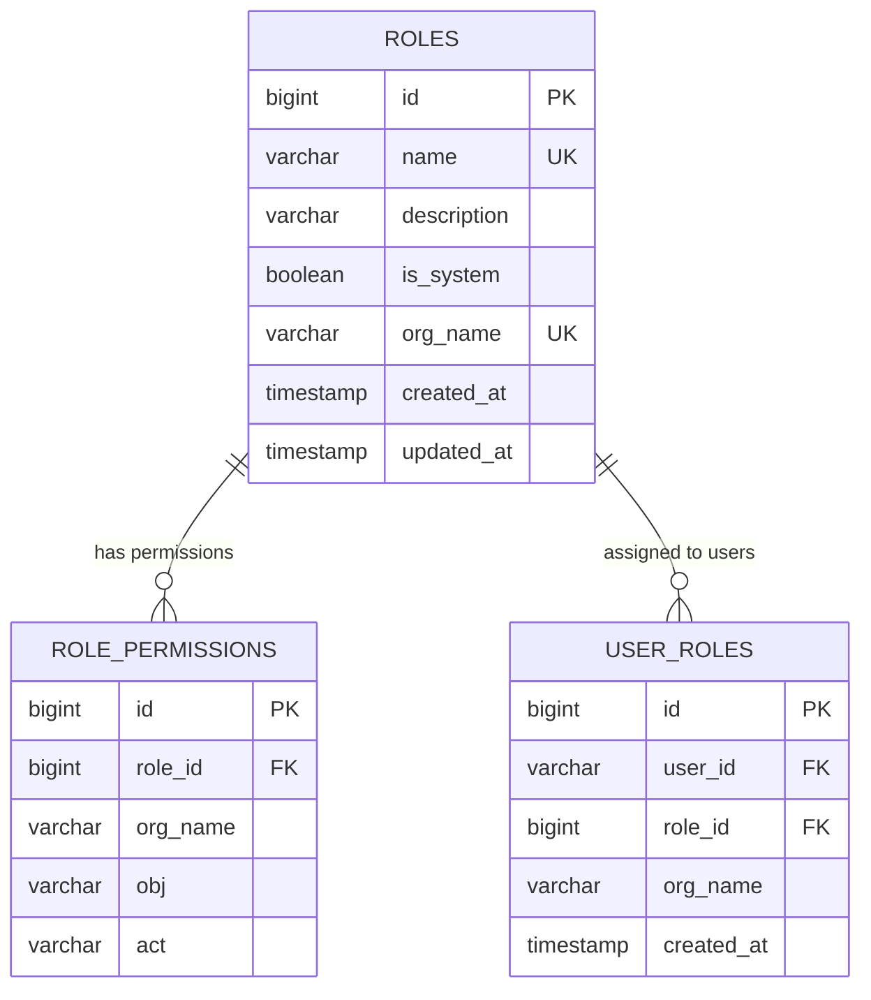
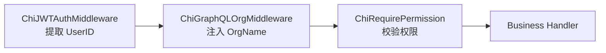

ModelCraft 采用 **Casdoor 委托认证 + Casbin RBAC 权限控制** 的双层安全架构。Casdoor 作为外部身份提供者（IdP）负责用户注册、登录和 OAuth2/OIDC 令牌签发；Casbin 作为策略引擎在应用层实现基于角色的访问控制（RBAC）。两层之间的桥梁是 ModelCraft 自身的 JWT 体系——后端在验证 Casdoor 令牌后，会签发携带角色和权限声明的 ModelCraft JWT，使得后续请求无需再查询外部服务即可完成鉴权。本文将深入剖析这一架构的设计意图、数据模型、认证流程与权限校验机制的实现细节。

Sources: [provider.go](modelcraft-backend/internal/domain/auth/provider.go#L1-L21), [casdoor_provider.go](modelcraft-backend/internal/infrastructure/auth/casdoor_provider.go#L1-L104), [casbin_enforcer.go](modelcraft-backend/internal/infrastructure/auth/casbin_enforcer.go#L1-L140)

## 架构全景：认证与授权的双层分离

在设计认证授权体系时，ModelCraft 遵循一个核心原则：**身份认证（Authentication）与访问控制（Authorization）完全解耦**。Casdoor 仅负责"证明你是谁"，Casbin 仅负责"判断你能做什么"，而 ModelCraft 的应用层在两者之间完成身份映射和权限装配。



Sources: [chi_jwt_auth.go](modelcraft-backend/internal/middleware/chi_jwt_auth.go#L1-L101), [chi_permission.go](modelcraft-backend/internal/middleware/chi_permission.go#L1-L112), [chi_tenant.go](modelcraft-backend/internal/middleware/chi_tenant.go#L1-L51)

## Casdoor 委托认证：外部身份提供者集成

### AuthProvider 策略接口

认证提供者通过领域层的 `AuthProvider` 接口抽象，使得 ModelCraft 可以在不修改业务逻辑的前提下切换身份提供者（Casdoor、Keycloak 或通用 OIDC）：

| 方法 | 职责 | Casdoor 实现 |
|------|------|-------------|
| `GetPublicKey(ctx)` | 返回 JWT 签名验证所需的公钥 | 从 X.509 PEM 证书中解析 RSA 公钥并缓存 |
| `GetSigningMethod()` | 返回 JWT 签名算法标识 | 固定返回 `"RS256"` |
| `Type()` | 返回提供者类型标识 | 固定返回 `"casdoor"` |

`CasdoorProvider` 在初始化时接收 `CasdoorConfig` 配置结构体，包含 Casdoor 服务端点（endpoint）、客户端凭证（client_id / client_secret）、组织名称（organization）、应用名称（application）以及 X.509 证书（certificate）。公钥解析采用延迟初始化策略——首次调用 `GetPublicKey` 时解析 PEM → X.509 → RSA Public Key，之后直接返回缓存结果，避免重复解析开销。

Sources: [provider.go](modelcraft-backend/internal/domain/auth/provider.go#L1-L21), [casdoor_provider.go](modelcraft-backend/internal/infrastructure/auth/casdoor_provider.go#L12-L103)

### Casdoor SDK Client 封装

在基础设施层，`casdoor.Client` 封装了 `casdoor-go-sdk`，提供组织管理（`CreateOrganization`、`GetOrganization`）和用户管理（`GetUser`、`UpdateUserOrganization`）能力。这些操作主要用于注册流程中自动创建个人组织、以及用户加入组织时同步 Casdoor 侧的组织归属关系。Client 在创建时执行严格的配置校验——endpoint、client_id、client_secret、certificate 四项为必填项，缺失即返回错误。

Sources: [client.go](modelcraft-backend/internal/infrastructure/casdoor/client.go#L1-L157)

### 双令牌迁移策略

配置文件中的 `auth.design` 节点揭示了 ModelCraft 正处于从 Casdoor JWT 到 ModelCraft JWT 的**双令牌迁移期**：

| 配置项 | 默认值 | 说明 |
|--------|--------|------|
| `accept_casdoor_jwt` | `true` | 接受 Casdoor 签发的 JWT（旧流程） |
| `accept_modelcraft_jwt` | `true` | 接受 ModelCraft 签发的 JWT（新流程） |
| `skip_jwt_validation` | `false` | 跳过 JWT 验证（仅开发环境） |
| `default_provider` | `"casdoor"` | 默认认证提供者 |

这一设计确保前后端可以平滑迁移——旧客户端携带 Casdoor JWT，新客户端携带 ModelCraft JWT，后端同时兼容两种令牌格式。

Sources: [config.yaml](modelcraft-backend/configs/config.yaml#L34-L67)

## TokenService：认证流程的核心枢纽

### 注册流程

`TokenService.Register` 方法实现了完整的用户注册链路：校验用户名 → 校验手机号 → 校验密码强度 → 检查唯一性 → 哈希密码 → 生成 UUIDv7 → 创建用户实体 → 创建初始 Profile → **同事务持久化 user + profile** → 调用 `CreateOrganizationService` 自动创建个人组织。整个流程在同一个数据库事务中完成，确保用户、Profile 和组织的一致性。

Sources: [token_service.go](modelcraft-backend/internal/app/auth/token_service.go#L64-L171)

### 令牌类型与 Claims 结构

ModelCraft 定义了两套 JWT Claims 结构，分别服务于不同的认证场景：

**ModelCraftClaims**（完整认证令牌）——携带用户身份、组织归属、角色列表和权限列表，是权限校权的数据来源：

| 字段 | 类型 | 说明 |
|------|------|------|
| `user_id` | string | ModelCraft 用户 UUID |
| `external_id` | string | Casdoor 用户 ID（来自 sub 声明） |
| `organization` | string | 当前活跃组织 |
| `roles` | []string | 角色名称列表，如 `["owner", "editor"]` |
| `permissions` | []string | 权限字符串列表，如 `["model:read", "*:*"]` |
| `memberships` | []MembershipClaimInfo | 组织成员关系（限 10 条，控制 JWT 体积） |
| `iss` | string | 固定为 `"modelcraft"` |

**UserClaims**（简化身份令牌）——仅携带 `user_id`，用于 API Key 认证路径和中间件的快速身份提取。

`ModelCraftClaims` 内置了 `HasPermission`、`HasAnyPermission`、`HasRole` 等便捷方法，以及严格的 `Validate` 校验——要求 user_id 非空、issuer 为 `"modelcraft"`、令牌未过期、所有权限字符串非空。

Sources: [modelcraft_claims.go](modelcraft-backend/internal/domain/auth/modelcraft_claims.go#L1-L115), [user_claims.go](modelcraft-backend/internal/domain/auth/user_claims.go#L1-L51)

### Refresh Token 轮换机制

`RefreshToken` 实体采用**有状态的 opaque token** 设计：明文 token 的 SHA256 哈希存入数据库，明文仅通过 `LoginResult.RefreshToken` 返回给 BFF 层存入 HttpOnly Cookie。每次刷新时执行**令牌轮换**——旧 token 被标记为 `revoked_at`，同时签发新 token，从而支持盗用检测（如果已轮换的 token 再次被使用，说明存在安全风险）。Token 生成使用 32 字节 CSPRNG，编码为 64 位 hex 字符串，提供 256 bit 的安全熵。

Sources: [refresh_token.go](modelcraft-backend/internal/domain/auth/refresh_token.go#L1-L33), [token_generator.go](modelcraft-backend/internal/app/auth/token_generator.go#L10-L21)

## Casbin RBAC：三层权限模型

### Casbin 策略模型定义

ModelCraft 的 Casbin 模型采用经典的 **(sub, obj, act)** 三元组 RBAC 模型，其核心 Matcher 表达式为：

```
m = g(r.sub, p.sub) && (p.obj == "*" || r.obj == p.obj) && (p.act == "*" || r.act == p.act)
```

这意味着权限检查需要同时满足三个条件：**请求者通过角色继承链（g）匹配策略主体**；**请求对象匹配策略对象（支持通配符 `*`）**；**请求动作匹配策略动作（支持通配符 `*`）**。多租户隔离在应用层通过 `org_name` 过滤实现，而非在 Casbin 模型中引入 domain 字段——这一设计决策保持了策略配置的简洁性。

Sources: [casbin_model.conf](modelcraft-backend/internal/infrastructure/auth/casbin_model.conf#L1-L24), [casbin_enforcer.go](modelcraft-backend/internal/infrastructure/auth/casbin_enforcer.go#L29-L68)

### 单例 Enforcer 与策略管理

`GetEnforcer()` 通过 `sync.Once` 确保全局唯一的 Casbin Enforcer 实例。Enforcer 不使用数据库 Adapter，而是通过编程式 API 管理策略——系统角色权限在启动时通过 `LoadSystemRolePermissions` 加载，自定义角色权限在运行时通过 `AddPolicy` / `RemovePolicy` 动态调整。Enforcer 提供的核心操作包括：

| 函数 | 签名 | 职责 |
|------|------|------|
| `AddUserRole` | `(e, userID, roleName)` | 将用户映射到角色（GroupingPolicy） |
| `RemoveUserRole` | `(e, userID, roleName)` | 解除用户与角色的映射 |
| `AddCustomRolePermission` | `(e, roleName, obj, act)` | 为自定义角色添加权限策略 |
| `RemoveCustomRolePermission` | `(e, roleName, obj, act)` | 移除自定义角色的权限策略 |
| `CheckPermission` | `(e, userID, obj, act) → bool` | 执行权限检查（核心鉴权入口） |

Sources: [casbin_enforcer.go](modelcraft-backend/internal/infrastructure/auth/casbin_enforcer.go#L70-L140)

### 系统角色与硬编码权限

ModelCraft 定义了四个**不可变系统角色**，其权限在 `SystemRolePermissions` 中硬编码，通过 `org_name = '__SYSTEM__'` 标识，启动时加载到 Casbin Enforcer：

| 角色 | 权限 | 说明 |
|------|------|------|
| **owner** | `*:*`（全局通配） | 组织拥有者，拥有所有资源的全部操作权限 |
| **admin** | `*:*`（全局通配） | 组织管理员，与 owner 权限相同但不涉及用户管理 |
| **editor** | `*:create`, `*:read`, `*:update` | 编辑者，可创建/读取/更新所有资源，**不可删除** |
| **viewer** | `*:read` | 查看者，仅拥有所有资源的只读权限 |

系统角色通过 `IsSystemRole()` 判定（检查 `is_system` 标志或 `org_name == '__SYSTEM__'`），其 `CanModify()` 和 `CanDelete()` 均返回 `false`，确保系统角色在任何上下文中都不被篡改或删除。自定义角色不允许使用系统角色的名称（owner/admin/editor/viewer），也不允许使用 `__SYSTEM__` 作为 org_name。

Sources: [system_roles.go](modelcraft-backend/internal/infrastructure/auth/system_roles.go#L1-L48), [role.go](modelcraft-backend/internal/domain/permission/role.go#L1-L140)

### Permission 值对象

`Permission` 是一个值对象，由 `Obj`（资源对象）和 `Act`（操作动作）两个维度组成，格式化为 `"obj:act"` 字符串（如 `"model:read"`、`"*:*"`）。它支持三种匹配模式：

| 模式 | 示例 | 匹配范围 |
|------|------|----------|
| 全局通配 | `*:*` | 匹配任意资源和任意动作 |
| 资源通配 | `resource:*` | 匹配指定资源的任意动作 |
| 精确匹配 | `resource:action` | 仅匹配指定的资源-动作组合 |

Sources: [permission.go](modelcraft-backend/internal/domain/permission/permission.go#L1-L103)

## 数据持久化：三表 RBAC 存储模型

权限数据通过三个数据库表持久化，由 sqlc 生成的 Querier 操作，经 `Safe Querier` 包装后供 Repository 实现调用：



**SqlCasbinRoleRepository** 管理 `roles` 表：创建角色（自动填充 `LastInsertId`）、按 ID 或 名称+组织 查询、按组织列表查询（可选包含系统角色）、更新描述（name/is_system/org_name 不可变）、删除角色（级联删除关联的 user_roles 和 role_permissions）。

**SqlCasbinPermissionRepository** 管理 `role_permissions` 表：为角色添加权限、移除指定权限、按角色或角色+组织列出权限、按角色删除全部权限。

**SqlCasbinUserRoleRepository** 管理 `user_roles` 表：分配角色、撤销角色、按用户+组织列表查询、按角色+组织列表查询用户、按角色删除全部绑定。三者均通过编译期接口检查确保满足领域层定义的 Repository 接口。

Sources: [sql_casbin_repository.go](modelcraft-backend/internal/infrastructure/repository/sql_casbin_repository.go#L1-L360)

## 权限装配：PermissionLoader 的双路径加载

`PermissionLoader` 是认证流程中权限装配的核心组件，负责在用户登录或令牌刷新时加载其全部权限并注入 JWT Claims。它采用**双路径加载策略**：

- **系统角色路径**：直接从内存中的 `SystemRolePermissions` 映射表读取，无需数据库查询，零延迟
- **自定义角色路径**：通过 `PermissionRepository.ListPermissionsByRole` 从数据库查询，支持动态扩展

加载过程为：查询 `user_roles` → 遍历每个角色 → 判断 `IsSystemRole()` → 走对应路径获取权限 → 去重后返回 `"obj:act"` 格式的字符串数组。`LoadUserPermissionsAndRoles` 变体则返回 `map[roleName]*RolePermissionInfo` 结构，同时保留角色名到权限列表的映射关系，供前端展示角色信息使用。

Sources: [permission_loader.go](modelcraft-backend/internal/app/auth/permission_loader.go#L1-L188)

## 中间件链：请求鉴权的执行管道

ModelCraft 的 HTTP 请求鉴权通过 Chi 中间件链实现，严格遵循以下执行顺序：



**ChiJWTAuthMiddleware** 从 `Authorization: Bearer <token>` 头提取令牌。它支持两条认证路径：若令牌以 `mc_` 前缀开头，走 API Key 验证路径（通过 `APIKeyVerifier` 查询哈希数据库）；否则走 JWT 验证路径（使用 HMAC-SHA256 密钥验证 ModelCraft JWT，提取 `UserClaims.UserID`）。验证成功后，将 `UserID` 注入请求上下文。

**ChiRequirePermission** 系列中间件提供三种权限检查模式：`ChiRequirePermission`（单一权限）、`ChiRequireAnyPermission`（任一权限满足即通过）、`ChiRequireAllPermissions`（所有权限必须全部满足）。`CheckPermission` 函数实现与 Casbin Matcher 一致的通配符匹配逻辑——`*` 全局匹配、`resource:*` 资源级匹配、`resource:action` 精确匹配。权限列表从请求上下文中读取（由上游中间件或 BFF 层注入），检查失败返回 `403 Forbidden`。

Sources: [chi_jwt_auth.go](modelcraft-backend/internal/middleware/chi_jwt_auth.go#L27-L70), [chi_permission.go](modelcraft-backend/internal/middleware/chi_permission.go#L10-L112)

## PermissionService：角色权限的统一管理入口

`PermissionService` 在应用层提供权限管理的业务逻辑，确保**数据库持久化与 Casbin 策略同步更新**。以 `AddPermissionToRole` 为例，其执行流程为：

1. 构造 `Permission` 值对象并校验合法性
2. 通过 `RoleRepository` 获取角色实体
3. **系统角色保护**：调用 `role.CanModify()` 检查是否为系统角色，若不可修改则返回 `OPERATION_DENIED` 错误
4. 持久化到数据库（`permRepo.AddPermission`）
5. 同步到 Casbin Enforcer（`enforcer.AddPolicy`）——此步骤失败仅记录日志，不回滚数据库操作

`ListRolePermissions` 方法则实现了**合并读取**：对系统角色返回硬编码权限，对自定义角色查询数据库，上层调用者无需关心权限的存储来源。

Sources: [permission_service.go](modelcraft-backend/internal/app/permission/permission_service.go#L1-L182)

## 总结：设计决策与关键权衡

| 设计决策 | 选择 | 权衡考量 |
|----------|------|----------|
| 认证提供者 | Casdoor（外部 IdP） | 将用户管理、OAuth 流程委托给成熟方案，降低自行实现的安全风险 |
| 权限引擎 | Casbin（嵌入式） | 无网络开销的策略执行，配合编程式 API 灵活管理策略 |
| 多租户隔离 | 应用层 org_name 过滤 | 简化 Casbin 模型（无需 domain 字段），但要求每个查询都带 org_name 条件 |
| 系统角色权限 | 代码硬编码 | 零查询开销、不可被误改；缺点是修改需重新部署 |
| 自定义角色权限 | 数据库持久化 | 支持租户级灵活扩展，查询性能通过 Safe Querier 保证 |
| JWT 权限携带 | 登录时装配进 Claims | 避免每次请求都查数据库；代价是权限变更需等待令牌刷新才生效 |
| Refresh Token | 有状态 opaque + 轮换 | 支持盗用检测和即时撤销；比无状态 JWT 增加了存储开销 |

理解了认证授权的内部机制后，建议接下来阅读 [认证流程：Casdoor OAuth2/OIDC 集成与 Token 生命周期管理](15-ren-zheng-liu-cheng-casdoor-oauth2-oidc-ji-cheng-yu-token-sheng-ming-zhou-qi-guan-li) 了解前端视角的 OAuth 集成实现，以及 [领域模型体系：认证、租户、项目、模型、集群、权限](8-ling-yu-mo-xing-ti-xi-ren-zheng-zu-hu-xiang-mu-mo-xing-ji-qun-quan-xian) 理解权限领域在整体领域模型中的位置。