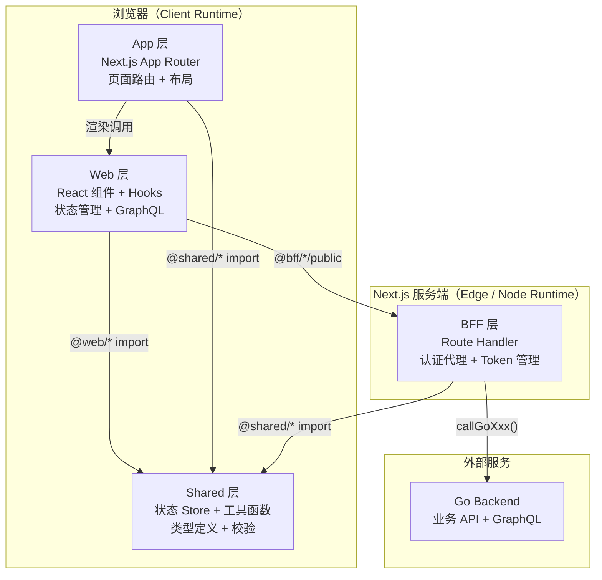
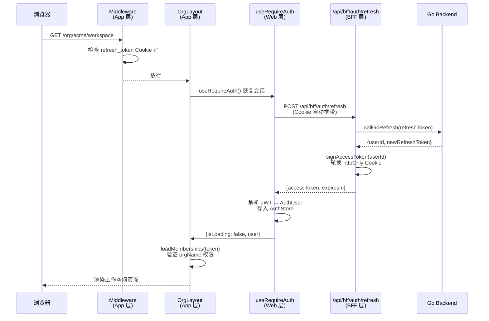

ModelCraft 前端采用 **四层分离架构**，基于 Next.js App Router 构建，将路由与页面渲染（App）、业务组件与交互逻辑（Web）、服务端代理与认证中间层（BFF）、跨层复用的基础设施（Shared）严格解耦。这种分层不是简单的目录约定——**TypeScript path alias** 将其编译为期校验的依赖边界：`@web/*` 不能直接 import `@bff/*` 的内部模块，必须通过 `public.ts` 桶文件访问，从而在工程层面强制实施了依赖方向规则。

Sources: [tsconfig.json](modelcraft-front/tsconfig.json#L22-L27), [layout.tsx](modelcraft-front/src/app/layout.tsx#L1-L61)

## 架构总览与分层意图

在深入各层之前，需要理解一个核心设计决策：**BFF 层运行在 Next.js Route Handler（服务端）中，而 Web 层运行在浏览器中**。这一分界决定了 Token 管理策略——Refresh Token 存储在 httpOnly Cookie 中，只有 BFF 的 Route Handler 才能读取；Access Token 由 BFF 自行签发，通过 JSON 响应传递给客户端，存储在 Zustand 内存状态中。浏览器永远不接触 Refresh Token，从根本上防范了 XSS 窃取。



> **阅读提示**：上图展示了四层之间的依赖方向。箭头表示"依赖"关系，所有路径最终汇聚到 Shared 层，而 BFF 是唯一与 Go Backend 通信的中间人。

Sources: [middleware.ts](modelcraft-front/src/middleware.ts#L1-L55), [tsconfig.json](modelcraft-front/tsconfig.json#L22-L27)

## 目录结构与 Path Alias 映射

TypeScript `paths` 配置定义了四个 alias，每个对应一个架构层：

| Path Alias | 物理路径 | 职责 | 运行时环境 |
|:---|:---|:---|:---|
| `@/*` | `./src/*` | 根引用（通用） | Client + Server |
| `@bff/*` | `./src/bff/*` | BFF 层：认证、Apollo Client 工厂、CMS 查询构建 | Client + Server |
| `@web/*` | `./src/web/*` | Web 层：组件、Hooks、GraphQL 操作、Stores | Client |
| `@shared/*` | `./src/shared/*` | Shared 层：跨层复用的 Store、工具、类型 | Client + Server |

```
src/
├── app/          ← App 层：Next.js 文件系统路由
│   ├── api/      │   Route Handler（BFF 入口点）
│   │   ├── bff/  │   ─→ auth/login, auth/refresh, auth/logout, auth/register
│   │   ├── auth/ │   ─→ token, refresh（直接代理）
│   │   ├── org/  │   ─→ init
│   │   └── user/ │   ─→ memberships
│   ├── login/    │   页面路由
│   ├── org/      │   动态路由 [orgName]/workspace, projects, settings...
│   └── layout.tsx    根布局：字体、Provider 嵌套
│
├── bff/          ← BFF 层：服务端业务逻辑
│   ├── api/      │   Route Handler 实现（被 app/api/ re-export）
│   ├── apollo/   │   Apollo Client 工厂（三种作用域客户端）
│   ├── auth/     │   认证全链路：go-auth-client → jwt-utils → cookie-utils
│   ├── cms/      │   运行时 GraphQL 动态查询构建器
│   └── model-enum/  模型枚举领域逻辑
│
├── web/          ← Web 层：客户端业务
│   ├── components/  UI 组件（ui/ 基础 + features/ 业务 + cms/ 表单渲染）
│   ├── graphql/     GraphQL Document 节点（queries/ + mutations/）
│   ├── hooks/       React Hooks（auth, model, project, organization...）
│   ├── providers/   全局 Provider（ApolloWrapper, QueryWrapper）
│   ├── routing/     智能路由重定向
│   └── stores/      Zustand 状态管理（app, project, model, enum, cluster）
│
└── shared/       ← Shared 层：跨层复用
    ├── stores/   │   auth-store（Token 状态）, organization（租户上下文）
    ├── cache/    │   memberships-cache（多级缓存）
    ├── cms/      │   schema-transformer, validation
    ├── model/    │   system-field
    ├── utils/    │   uuid, 通用工具
    ├── constants/   reserved-usernames
    ├── errors/      model-enum-error-mapper
    ├── types/    │   全局类型定义（auth, model, project, enum...）
    └── validation/  auth 校验
```

Sources: [tsconfig.json](modelcraft-front/tsconfig.json#L22-L27), [bff/auth/public.ts](modelcraft-front/src/bff/auth/public.ts#L1-L12), [web/graphql/index.ts](modelcraft-front/src/web/graphql/index.ts#L1-L5)

## App 层：Next.js 文件系统路由与全局布局

App 层是整个前端应用的**入口壳**，由 Next.js App Router 驱动。它不包含业务逻辑，而是负责三件事：**路由定义、全局 Provider 嵌套、认证中间件**。

根布局 `layout.tsx` 按照严格的 Provider 嵌套顺序组装应用壳：`MSWProvider`（Mock Service Worker）→ `ApolloWrapper`（GraphQL 客户端）→ `QueryWrapper`（React Query）→ `ErrorProvider`（全局错误边界）。这个顺序至关重要——Apollo Client 必须在 QueryWrapper 之前初始化，因为部分组件同时依赖两种数据源。

认证中间件 `middleware.ts` 实现了**轻量级 Cookie 门禁**：只检查 `refresh_token` httpOnly Cookie 是否存在，不做 Token 验证（避免每次请求都调用后端）。公共路由（`/login`、`/register`、`/auth/callback`）和所有 `/api/*` 路由无条件放行。Token 的实际验证发生在客户端加载后，通过 `useRequireAuth` Hook 触发静默刷新。

**页面路由结构**遵循多租户模型：`/` 首页做会话恢复与智能跳转；`/org/[orgName]/*` 是组织作用域下的所有功能页面（workspace、projects、settings、team）；`/login` 和 `/register` 是公开认证页。组织布局 `org/[orgName]/layout.tsx` 承担了**组织访问权限验证**——在渲染子页面前，它会调用 `loadMemberships` 加载用户所属组织列表，验证当前 URL 中的 `orgName` 是否在列表中，不匹配则重定向到fallback 组织或创建页。

Sources: [app/layout.tsx](modelcraft-front/src/app/layout.tsx#L40-L61), [middleware.ts](modelcraft-front/src/middleware.ts#L15-L55), [app/page.tsx](modelcraft-front/src/app/page.tsx#L1-L55), [org/[orgName]/layout.tsx](modelcraft-front/src/app/org/[orgName]/layout.tsx#L1-L86)

## Web 层：客户端组件、Hooks 与状态管理

Web 层是前端业务的**核心主体**，包含所有客户端渲染的组件、自定义 Hooks、GraphQL 操作定义和 Zustand Store。它通过 `@web/*` alias 被引用，并且**只运行在浏览器环境**中。

**组件体系**按照功能领域组织：`ui/` 目录包含 shadcn/ui 基础组件（Button、Dialog、Form 等 30+ 个）；`features/` 目录按业务领域划分子目录（auth、database、model-editor、organization、project、copilot 等）；`cms/` 包含运行时动态表单渲染器 `FormRenderer`。这种组织方式遵循"功能优先于类型"的原则——开发者能在同一目录下找到某个功能的所有相关组件。

**GraphQL 操作层**在 `web/graphql/` 下按照 `queries/` 和 `mutations/` 分目录组织，每个领域一个文件（cluster、enum、model、profile、project、user），通过 `index.ts` 统一导出。Web 层定义的是**设计态 GraphQL 操作**（项目/模型/字段管理），运行时动态查询则由 BFF 层的 `runtime-query-builder` 构建。

**Hooks 体系**封装了所有数据获取和业务逻辑：`use-auth.ts` 提供会话恢复（`useRequireAuth`）和用户信息（`useUser`）；`use-models.ts`、`use-projects.ts`、`use-organization.ts` 等封装了各领域的 CRUD 操作；`use-graphql-error-handler.ts` 统一处理 GraphQL 错误。Hooks 通过 `@bff/auth/public` 和 `@shared/stores/*` 访问底层能力，体现了层次间的依赖方向。

**状态管理**采用 Zustand，按领域拆分为多个 Store：`app.ts`（全局 UI 状态：选中项目/集群/数据库、侧边栏折叠）；`project.ts`、`model.ts`、`enum.ts`、`cluster.ts`（领域数据）；`error.ts`（错误收集与展示）。`app.ts` 使用了 `devtools + persist` 中间件，将选中状态持久化到 localStorage。

Sources: [web/stores/app.ts](modelcraft-front/src/web/stores/app.ts#L1-L80), [web/hooks/auth/use-auth.ts](modelcraft-front/src/web/hooks/auth/use-auth.ts#L1-L63), [web/providers/apollo-wrapper.tsx](modelcraft-front/src/web/providers/apollo-wrapper.tsx#L1-L183), [web/routing/smart-redirect.ts](modelcraft-front/src/web/routing/smart-redirect.ts#L24-L50)

## BFF 层：服务端代理、认证全链路与运行时查询构建

BFF（Backend for Frontend）层是整个前端架构的**安全中间层**，运行在 Next.js Route Handler 的服务端环境中。它的核心价值在于：**隐藏后端细节、管理 Token 生命周期、聚合与裁剪后端响应**。

### 认证全链路

BFF 实现了完整的 **Token 交换与轮换机制**，这是四层架构中最精巧的设计：

| 步骤 | 登录流程 (`/api/bff/auth/login`) | Token 刷新流程 (`/api/bff/auth/refresh`) |
|:---|:---|:---|
| 1 | 客户端发送 `{identifier, identifierType, password}` | BFF 从 httpOnly Cookie 读取 Refresh Token |
| 2 | BFF 调用 `callGoLogin()` 转发至 Go Backend | BFF 调用 `callGoRefresh()` 转发至 Go Backend |
| 3 | Go Backend 返回 `{userId, refreshToken, ...}` | Go Backend 返回 `{userId, newRefreshToken}` |
| 4 | BFF 用 `signAccessToken(userId)` 自行签发 JWT | BFF 用 `signAccessToken(userId)` 自行签发 JWT |
| 5 | BFF 通过 `setRefreshTokenCookie()` 设置 httpOnly Cookie | BFF 轮换 httpOnly Cookie（新 Refresh Token） |
| 6 | 响应返回 `{accessToken, expiresIn, userId, ...}` | 响应返回 `{accessToken, expiresIn}` |

关键设计点：BFF **不透传** Go Backend 的 Refresh Token 给浏览器。Go Backend 签发的 Refresh Token 被封存在 httpOnly Cookie 中（`Secure`、`SameSite=Strict`、7 天有效期），浏览器只能通过 `credentials: 'same-origin'` 自动携带，JavaScript 永远无法读取。BFF 自行用 `jose` 库签发 HS256 JWT 作为 Access Token（1 小时过期），只包含 `user_id` 声明。

客户端的 `auth-client.ts` 通过 `fetch('/api/bff/auth/refresh')` 触发静默刷新，并实现了**并发请求合并**（`_isRefreshing` + `_refreshPromise` 单例模式），确保多个组件同时检测到 Token 过期时只发一次刷新请求。

### Route Handler 双文件模式

BFF 层采用了**逻辑与路由分离**的模式：`bff/api/` 目录包含 Handler 的实现逻辑，`app/api/` 目录则通过 re-export 将其注册为 Next.js Route Handler。例如 `app/api/user/memberships/route.ts` 只有一行 `export { GET } from '@bff/api/user/memberships'`。这种模式保持了 BFF 逻辑的内聚性，同时满足 Next.js 文件系统路由的要求。

### 运行时 GraphQL 查询构建器

BFF 层的 `cms/runtime-query-builder.ts` 是一个**动态 GraphQL 生成引擎**，根据模型元数据在运行时构建 CRUD 查询。它使用 `gql-query-builder` 库，为每个模型生成 `findMany`、`findUnique`、`findFirst`、`count` 四种查询以及 `create`、`update`、`delete` 三种变更。`buildFieldSelections()` 函数处理了 RELATION 类型字段的子选择（请求 `id` 和 `_displayName`），确保关联字段的自动展开。

Sources: [bff/auth/go-auth-client.ts](modelcraft-front/src/bff/auth/go-auth-client.ts#L107-L130), [bff/auth/jwt-utils.ts](modelcraft-front/src/bff/auth/jwt-utils.ts#L13-L25), [bff/auth/cookie-utils.ts](modelcraft-front/src/bff/auth/cookie-utils.ts#L7-L23), [bff/auth/auth-client.ts](modelcraft-front/src/bff/auth/auth-client.ts#L103-L142), [app/api/user/memberships/route.ts](modelcraft-front/src/app/api/user/memberships/route.ts#L1-L2), [bff/cms/runtime-query-builder.ts](modelcraft-front/src/bff/cms/runtime-query-builder.ts#L68-L120)

## Shared 层：跨层共享基础设施

Shared 层是**唯一被其他三层共同依赖**的层。它包含两类内容：**运行时共享状态**和**纯工具函数/类型定义**。

### 状态 Store 的归属策略

项目对 Zustand Store 采用了**按访问模式归属**的策略：`auth-store` 和 `organization` 放在 Shared 层，因为它们被 BFF 层（auth-client 读写 Token 状态、Apollo Client 读取组织上下文）和 Web 层（Hooks 消费认证和组织数据）共同访问。而 `app`、`project`、`model`、`enum`、`cluster` 等 Store 放在 Web 层，因为只有客户端组件需要它们。

### Memberships 多级缓存

`shared/cache/memberships-cache.ts` 实现了一个**三级缓存体系**：内存缓存（最快）→ localStorage 缓存（次快，TTL 5 分钟）→ API 请求（最终回源）。它还使用**单例请求模式**（`ongoingRequest` Promise）防止并发重复请求，确保在多个组件同时加载组织成员关系时只产生一次网络调用。

### 模块导出边界

BFF 层通过 `public.ts` 桶文件严格约束导出接口：`bff/auth/public.ts` 只暴露 `getToken`、`refreshAccessToken`、`getUserInfoFromToken` 等函数；`bff/apollo/public.ts` 只暴露 `useDesignTimeClient`、`useProjectScopedClient`、`createModelRuntimeClient` 等工厂和 Hook。内部实现如 `go-auth-client.ts`、`jwt-utils.ts`、`cookie-utils.ts` 不对外暴露，Web 层无法直接调用后端认证接口或操作 Cookie。

Sources: [shared/stores/auth-store.ts](modelcraft-front/src/shared/stores/auth-store.ts#L1-L31), [shared/stores/organization.ts](modelcraft-front/src/shared/stores/organization.ts#L35-L132), [shared/cache/memberships-cache.ts](modelcraft-front/src/shared/cache/memberships-cache.ts#L105-L194), [bff/auth/public.ts](modelcraft-front/src/bff/auth/public.ts#L1-L12), [bff/apollo/public.ts](modelcraft-front/src/bff/apollo/public.ts#L1-L10)

## 四层协作：一个完整请求的生命周期

以"用户打开模型编辑器页面"为例，追踪一次完整的跨层协作：



**步骤解读**：① Middleware 只检查 Cookie 存在性（不验证），快速放行或拦截；② 页面组件挂载后，`useRequireAuth` 检测内存中无 Access Token（页面刷新场景），发起静默刷新；③ BFF Route Handler 从 Cookie 取出 Refresh Token，调用 Go Backend 的 Token 轮换接口；④ BFF 自行签发新的 Access Token 返回，同时轮换 Cookie；⑤ 客户端恢复认证状态后，组织布局验证用户对目标组织的访问权限。

Sources: [middleware.ts](modelcraft-front/src/middleware.ts#L23-L48), [web/hooks/auth/use-auth.ts](modelcraft-front/src/web/hooks/auth/use-auth.ts#L16-L42), [app/api/bff/auth/refresh/route.ts](modelcraft-front/src/app/api/bff/auth/refresh/route.ts#L1-L31), [app/org/[orgName]/layout.tsx](modelcraft-front/src/app/org/[orgName]/layout.tsx#L19-L74)

## 依赖规则与模块导出约定

| 规则 | 说明 | 示例 |
|:---|:---|:---|
| App → Web | 页面和布局组件 import Web 层的组件、Hooks、Providers | `layout.tsx` import `ApolloWrapper` |
| App → BFF（通过 route re-export） | `app/api/` 只做 re-export，不包含业务逻辑 | `route.ts: export { GET } from '@bff/api/...'` |
| App → Shared | 页面可使用 Shared 类型、工具 | — |
| Web → BFF（仅 public.ts） | 通过 `@bff/*/public` 桶文件访问 | `import { getToken } from '@bff/auth/public'` |
| Web → Shared | 自由访问 Store、类型、工具 | `import { useAuthStore } from '@shared/stores/auth-store'` |
| BFF → Shared | 访问认证 Store、组织 Store、工具 | `import { useAuthStore } from '@shared/stores/auth-store'` |
| BFF → Go Backend | 唯一允许的后端通信层 | `callGoLogin()`, `callGoRefresh()` |
| Web → Go Backend | **禁止** | — |

**反模式警告**：`app/api/bff/auth/login/route.ts` 直接 import 了 `@/bff/auth/go-auth-client` 和 `@/bff/auth/jwt-utils`（而非通过 public.ts），这是因为 Route Handler 作为 BFF 层的一部分，需要访问内部实现。但对于 Web 层组件，必须严格通过 `public.ts` 访问 BFF 能力。

Sources: [tsconfig.json](modelcraft-front/tsconfig.json#L22-L27), [app/api/user/memberships/route.ts](modelcraft-front/src/app/api/user/memberships/route.ts#L1-L2), [bff/auth/public.ts](modelcraft-front/src/bff/auth/public.ts#L1-L12)

## 推荐阅读路径

理解本页的前端分层架构后，建议按以下顺序深入各子系统：

1. [三种 Apollo Client 实例策略与 GraphQL 操作层约定](13-san-chong-apollo-client-shi-li-ce-lue-yu-graphql-cao-zuo-ceng-yue-ding) — 理解 `bff/apollo/clients.ts` 中三种作用域客户端的设计意图
2. [认证流程：Casdoor OAuth2/OIDC 集成与 Token 生命周期管理](15-ren-zheng-liu-cheng-casdoor-oauth2-oidc-ji-cheng-yu-token-sheng-ming-zhou-qi-guan-li) — 深入 BFF 认证全链路的完整细节
3. [状态管理：Zustand Stores 与缓存策略](16-zhuang-tai-guan-li-zustand-stores-yu-huan-cun-ce-lue) — Web 层和 Shared 层 Store 的设计模式
4. [API Contract 单一真相源：Git Subtree 同步机制](18-api-contract-dan-zhen-xiang-yuan-git-subtree-tong-bu-ji-zhi) — 理解 `contract/` 目录中 GraphQL Schema 和 OpenAPI 规范如何跨前后端同步