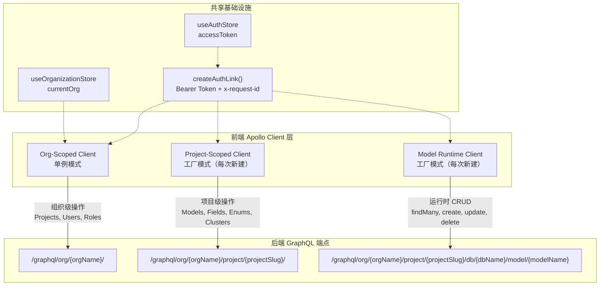

本文解析 ModelCraft 前端架构中 Apollo Client 的三种实例化策略，以及与之配合的 GraphQL 操作层（Queries / Mutations / 动态查询构建器）的组织约定。理解这一分层设计，是掌握整个前端数据流——从设计态元数据操作到运行时动态 CRUD——的关键入口。

## 架构总览：三层 Client 对应三个后端端点

ModelCraft 的后端 GraphQL API 按租户-项目-模型三级路径暴露，前端因此需要三种不同作用域的 Apollo Client 实例，分别指向不同的端点 URL。这种设计确保了**缓存隔离**（不同项目/模型的数据不会混淆）和**认证一致性**（所有实例共享同一个 Auth Link 工厂）。



Sources: [clients.ts](modelcraft-front/src/bff/apollo/clients.ts#L1-L220), [apollo-wrapper.tsx](modelcraft-front/src/web/providers/apollo-wrapper.tsx#L1-L183)

## 实例策略一：Org-Scoped Client（组织级单例）

**生命周期**：全局单例，应用启动后首次调用时创建，整个生命周期只存在一个实例。

**端点**：`/graphql/org/{orgName}/`——动态从 `useOrganizationStore` 读取当前组织名拼接 URL。当组织尚未加载时，回退到 `/api/graphql`。

**职责范围**：组织级别的操作，包括项目列表（Projects）、用户管理（Users）、角色管理（Roles）、组织设置（Organization）。

**关键实现细节**：

| 特性 | 值 |
|---|---|
| 创建方式 | `getOrgScopedClient()` 懒初始化单例 |
| URI 策略 | 函数式 `uri: (operation) => ...`，每次请求动态读取 store |
| 缓存策略 | `InMemoryCache`，配置 `Model.keyFields=['id']`、`Field.keyFields=['name']` |
| 错误策略 | `errorPolicy: 'all'`（所有操作） |
| 认证方式 | `createAuthLink()` 注入 Bearer Token + x-request-id |

这个单例通过 `ApolloWrapper` 组件注入到 React 树中，作为 `ApolloProvider` 的默认 client，使所有未指定 client 的 `useQuery`/`useMutation` 调用自动使用它。同时 `useDesignTimeClient()` hook 也返回这个单例（已标记 `@deprecated`，保留向后兼容）。

Sources: [clients.ts#L44-L84](modelcraft-front/src/bff/apollo/clients.ts#L44-L84), [clients.ts#L159-L171](modelcraft-front/src/bff/apollo/clients.ts#L159-L171), [apollo-wrapper.tsx#L130-L161](modelcraft-front/src/web/providers/apollo-wrapper.tsx#L130-L161)

## 实例策略二：Project-Scoped Client（项目级工厂）

**生命周期**：工厂模式，每次调用 `createProjectScopedClient()` 创建全新实例——**不是单例**。这是为了避免不同项目之间的缓存冲突。

**端点**：`/graphql/org/{orgName}/project/{projectSlug}/`——静态 URI，创建时即确定。

**职责范围**：项目级的设计态操作，包括模型管理（Models）、字段管理（Fields）、枚举管理（Enums）、逻辑外键（Logical Foreign Keys）、集群/数据库（Clusters/Databases）。

**核心 Hook**：`useProjectScopedClient(projectSlug?, orgNameOverride?)`，根据参数决定返回哪种 client：

```
┌─ 有 projectSlug + resolvedOrg → createProjectScopedClient(org, slug)  [新实例]
│
└─ 无 projectSlug 或无 org      → getOrgScopedClient()                  [单例]
```

`orgNameOverride` 参数的设计意图是解决 URL 参数已提供 orgName、但 store 中 `currentOrg` 尚未设置的竞态边界情况。调用方在 URL params 已可用的场景下，应显式传入此参数。

**典型调用场景**：

- `useDatabases(projectSlug)` —— 通过 `useProjectScopedClient(projectSlug)` 获取项目级 client 查询数据库列表
- `ModelRecordWorkspace` —— 同时使用 projectClient（查模型元数据）和 runtimeClient（查运行时数据）
- `useModelEnumContext(params)` —— 使用 projectClient 查询枚举字段上下文
- `ImportModelDialog`、`InsertFieldSheet` 等组件 —— 均通过此 hook 获取正确的 client

Sources: [clients.ts#L94-L126](modelcraft-front/src/bff/apollo/clients.ts#L94-L126), [clients.ts#L185-L198](modelcraft-front/src/bff/apollo/clients.ts#L185-L198), [use-databases.ts#L55](modelcraft-front/src/web/hooks/database/use-databases.ts#L55)

## 实例策略三：Model Runtime Client（运行时工厂）

**生命周期**：工厂模式，每次调用 `createModelRuntimeClient()` 创建全新实例。通常通过 `useMemo` 缓存，依赖 `[orgName, projectSlug, databaseName, modelName]` 四个变量。

**端点**：`/graphql/org/{orgName}/project/{projectSlug}/db/{databaseName}/model/{modelName}`——最深层级的路径，每个模型对应独立的 GraphQL schema。

**职责范围**：运行时动态 CRUD 操作。这些操作不在编译期定义，而是在运行时根据模型的 JSON Schema 动态构建 GraphQL Document。

**与动态查询构建器的协作**：Runtime Client 本身只提供连接和认证，真正定义操作的是 `bff/cms/runtime-query-builder.ts` 中的构建器函数，它们使用 `gql-query-builder` 库在运行时生成 `DocumentNode`：

| 构建器函数 | 操作类型 | 说明 |
|---|---|---|
| `buildFindManyQuery(model, fields)` | Query | 分页查询，返回 `{ timeCost, reqId, items }` |
| `buildFindUniqueQuery(model, fields)` | Query | 唯一条件查询，返回 `{ reqId, timeCost, item }` |
| `buildFindFirstQuery(model, fields)` | Query | 取第一条匹配记录 |
| `buildCountQuery(model)` | Query | 计数查询 |
| `buildCreateMutation(model)` | Mutation | 创建记录，返回 `{ id }` |
| `buildUpdateMutation(model)` | Mutation | 更新记录，返回 `{ success }` |
| `buildDeleteMutation(model)` | Mutation | 删除记录，返回 `{ success }` |

**辅助函数**：
- `extractFieldsFromSchema(schema)` —— 从 JSON Schema 的 properties 中提取字段名列表
- `extractWritableFieldNamesFromSchema(schema)` —— 同上，但排除 `readOnly: true` 的字段
- `sanitizeMutationInputData(data, allowedFields)` —— 过滤掉 schema 中不存在的字段，保留显式 `null`
- `buildFieldSelections(fields)` —— 将字段定义转换为 gql-query-builder 格式，RELATION 类型字段自动展开为 `{ fieldName: ['id', '_displayName'] }`

**典型调用链**（以 `ModelRecordWorkspace` 为例）：

```typescript
// 1. 获取 project-scoped client 查模型元数据
const projectClient = useProjectScopedClient(projectSlug)
const { data } = useQuery(GET_MODEL_RECORD_WORKSPACE, { client: projectClient })

// 2. 从模型元数据解析 JSON Schema，构建 runtime client
const runtimeClient = useMemo(
  () => createModelRuntimeClient(orgName, projectSlug, model.databaseName, model.name),
  [orgName, projectSlug, model?.databaseName, model?.name]
)

// 3. 用 runtime-query-builder 动态构建查询，发送到 runtime client
const FIND_MANY = buildFindManyQuery(modelName, runtimeFields)
const { data } = useQuery(FIND_MANY, { client: runtimeClient })
```

Sources: [clients.ts#L132-L157](modelcraft-front/src/bff/apollo/clients.ts#L132-L157), [runtime-query-builder.ts](modelcraft-front/src/bff/cms/runtime-query-builder.ts#L1-L301), [public.ts](modelcraft-front/src/bff/cms/public.ts#L1-L15), [ModelRecordWorkspace.tsx#L123-L169](modelcraft-front/src/web/components/features/model-editor/ModelRecordWorkspace.tsx#L123-L169)

## 共享认证链接：createAuthLink 工厂

三种 Client 实例共享同一个认证链接工厂 `createAuthLink()`，它通过 `setContext` 为每个请求注入：

- **`authorization`**：从 `useAuthStore.getState().accessToken` 读取 Bearer Token
- **`x-request-id`**：通过 `generateUUID()` 为每个请求生成唯一追踪 ID

注意这里直接读取 Zustand store 的 `.getState()` 而非使用 React hook，因为 `setContext` 回调运行在 React 渲染周期之外。同时使用 `typeof window !== 'undefined'` 守卫确保 SSR 安全。

Sources: [clients.ts#L26-L37](modelcraft-front/src/bff/apollo/clients.ts#L26-L37), [auth-store.ts](modelcraft-front/src/shared/stores/auth-store.ts#L1-L31)

## GraphQL 操作层约定

### 静态操作层（设计态）

静态 GraphQL 操作按**领域实体**组织在 `web/graphql/` 目录下，遵循统一的文件结构：

```
web/graphql/
├── index.ts              # 统一导出入口
├── noop.ts               # NOOP_QUERY / NOOP_MUTATION（占位操作）
├── queries/
│   ├── index.ts           # 汇总导出
│   ├── project.ts         # GET_PROJECTS, GET_PROJECT, LIST_TABLES
│   ├── model.ts           # GET_MODELS, GET_MODEL, GET_MODEL_GROUPS, ...
│   ├── cluster.ts         # GET_CLUSTER, LIST_DATABASES
│   ├── enum.ts            # GET_ENUMS, GET_ENUM, GET_ENUM_REFERENCES
│   ├── user.ts            # GET_ME, GET_MY_ORGANIZATIONS, GET_ROLES, ...
│   └── profile.ts         # MY_USER_PROFILE
└── mutations/
    ├── index.ts           # 汇总导出
    ├── project.ts         # CREATE_PROJECT, UPDATE_PROJECT, DELETE_PROJECT, ...
    ├── model.ts           # CREATE_MODEL, UPDATE_MODEL, DELETE_MODEL, SYNC_MODEL_SCHEMA, ...
    ├── cluster.ts         # TEST_CLUSTER_CONNECTION
    ├── enum.ts            # CREATE_ENUM, UPDATE_ENUM, DELETE_ENUM
    ├── user.ts            # UPDATE_ORGANIZATION, CREATE_ROLE, DELETE_ROLE
    └── profile.ts         # UPDATE_MY_PROFILE
```

**命名约定**：

- Query 以 `GET_` 前缀 + 实体名（大写），如 `GET_MODELS`、`GET_PROJECT`
- 列表类 Query 使用复数形式，如 `GET_ENUMS`、`GET_ROLES`
- Mutation 以动词前缀 + 实体名，如 `CREATE_MODEL`、`UPDATE_MODEL`、`DELETE_MODEL`
- 特殊操作使用描述性名称，如 `SYNC_MODEL_SCHEMA`、`TEST_CLUSTER_CONNECTION`

**响应结构约定**：所有设计态 Mutation 统一返回 `{ data, error }` 模式，error 使用 GraphQL union type 区分具体错误类型（`ModelNotFound`、`InvalidInput`、`ProjectNotFound` 等）。Query 则使用 cursor-based 分页（`edges`/`pageInfo`/`totalCount`）或直接返回数组。

Sources: [queries/index.ts](modelcraft-front/src/web/graphql/queries/index.ts#L1-L7), [mutations/index.ts](modelcraft-front/src/web/graphql/mutations/index.ts#L1-L7), [noop.ts](modelcraft-front/src/web/graphql/noop.ts#L1-L14)

### 动态操作层（运行时）

运行时操作不使用预定义的 `.ts` 文件，而是在组件中通过 `runtime-query-builder` 根据模型的 JSON Schema 动态生成。这些操作通过 Runtime Client 发送到模型专属的 GraphQL 端点。

运行时 API 使用与设计态完全不同的操作名称和类型系统：

| 维度 | 设计态 API | 运行时 API |
|---|---|---|
| 操作命名 | `models`、`createModel` 等 | `findMany`、`create`、`update`、`delete` 等通用名 |
| 类型命名 | `CreateModelInput!` 等具名类型 | `{ModelName}CreateInput!` 等动态类型 |
| 响应格式 | 实体特定结构 | 统一 `{ timeCost, reqId, items/item/success }` |
| Schema 来源 | gqlgen 代码生成 | 后端根据模型定义动态生成 |

Sources: [runtime-query-builder.ts#L68-L92](modelcraft-front/src/bff/cms/runtime-query-builder.ts#L68-L92), [runtime-query-builder.ts#L255-L300](modelcraft-front/src/bff/cms/runtime-query-builder.ts#L255-L300)

## 三种实例策略对比总结

| 维度 | Org-Scoped | Project-Scoped | Model Runtime |
|---|---|---|---|
| **实例模式** | 全局单例 | 工厂（每次新建） | 工厂（每次新建） |
| **端点深度** | `/graphql/org/{org}/` | `.../project/{slug}/` | `.../db/{db}/model/{model}` |
| **URI 确定时机** | 每次请求时动态读取 | 创建时静态确定 | 创建时静态确定 |
| **缓存隔离** | 组织内共享 | 项目间完全隔离 | 模型间完全隔离 |
| **InMemoryCache** | Model/Field keyFields 配置 | Model/Field keyFields 配置 | 默认（无自定义 keyFields） |
| **错误处理** | ApolloWrapper 全局 errorLink | errorPolicy: 'all' | errorPolicy: 'all' |
| **典型操作** | 项目 CRUD、用户/角色管理 | 模型/字段/枚举/集群管理 | findMany/create/update/delete |
| **对应 API 阶段** | 设计态（组织级） | 设计态（项目级） | 运行态（模型级） |
| **主要消费者** | ApolloWrapper、useProjects | useModels、useDatabases、ModelRecordWorkspace | ModelRecordWorkspace、FormRenderer、RelationPicker |

Sources: [clients.ts](modelcraft-front/src/bff/apollo/clients.ts#L1-L220), [apollo-wrapper.tsx](modelcraft-front/src/web/providers/apollo-wrapper.tsx#L1-L183)

## BFF 层的公共导出约定

BFF 层通过 `public.ts` 文件向 Web 层暴露精简的公共 API，Web 层**不直接** import BFF 内部模块：

- `bff/apollo/public.ts` 导出 `useDesignTimeClient`、`createProjectScopedClient`、`createModelRuntimeClient`、`buildRuntimeEndpoint`、`getOrgScopedClient`、`useProjectScopedClient`
- `bff/cms/public.ts` 导出所有运行时查询构建器函数和类型

这种 `public.ts` barrel export 模式是项目前端分层架构的关键边界守卫——Web 层只能通过 `@bff/apollo/public` 和 `@bff/cms/public` 访问 BFF 能力，内部实现细节被封装。

Sources: [bff/apollo/public.ts](modelcraft-front/src/bff/apollo/public.ts#L1-L10), [bff/cms/public.ts](modelcraft-front/src/bff/cms/public.ts#L1-L15)

## 从这里出发

- 了解前端整体分层（App → Web → BFF → Shared），参见 [前端分层架构：App → Web → BFF → Shared](12-qian-duan-fen-ceng-jia-gou-app-web-bff-shared)
- 了解后端三套 GraphQL 端点的设计态与运行态区分，参见 [三大 API 通道：设计态 GraphQL、REST、运行时动态 GraphQL](7-san-da-api-tong-dao-she-ji-tai-graphql-rest-yun-xing-shi-dong-tai-graphql)
- 了解 GraphQL Schema 如何通过代码生成流水线产出 TypeScript 类型，参见 [GraphQL Codegen 与 oapi-codegen 代码生成流水线](19-graphql-codegen-yu-oapi-codegen-dai-ma-sheng-cheng-liu-shui-xian)