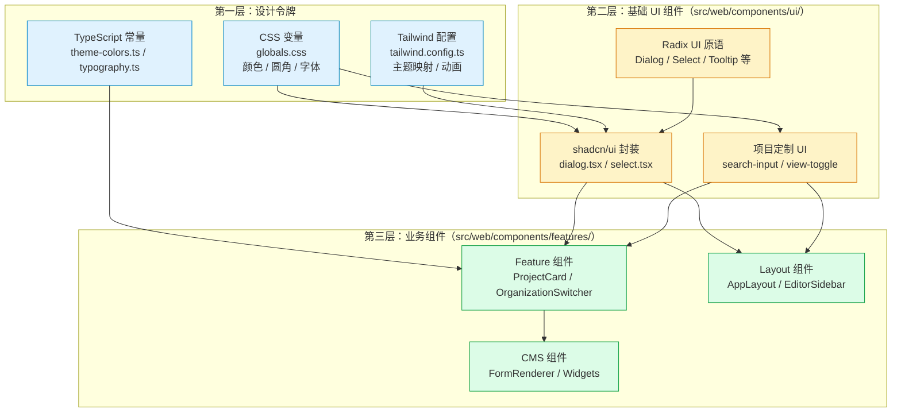

ModelCraft 前端采用 **shadcn/ui + Radix UI + Tailwind CSS** 三层叠加的设计系统架构。这套体系并非简单的技术栈组合，而是一种精确的职责分层：Radix UI 提供无障碍的原语（Primitive），shadcn/ui 提供可定制的组合层，Tailwind CSS 贯穿视觉表达的全链路。对于初学者而言，理解这三者如何协同工作，是高效参与前端开发的第一步。

Sources: [components.json](modelcraft-front/components.json#L1-L23), [tailwind.config.ts](modelcraft-front/tailwind.config.ts#L1-L151), [globals.css](modelcraft-front/src/app/globals.css#L1-L133)

## 架构总览：三层分工模型

在深入每个组件之前，先从宏观角度理解整个设计系统的分层逻辑。下面的图展示了从底层原语到上层业务组件的完整调用链路。



**核心理解**：你日常开发中接触最多的是第三层（业务组件）和第二层（UI 组件）。当你需要一个按钮，直接从 `@web/components/ui/button` 导入即可——它已经封装了 Radix 的无障碍能力和 Tailwind 的视觉样式。

Sources: [ui/ directory](modelcraft-front/src/web/components/ui/), [features/ directory](modelcraft-front/src/web/components/features/)

## shadcn/ui 配置：项目级入口

项目的 shadcn/ui 配置文件定义了组件生成的行为和风格。这是整个设计系统的"基因档案"。

Sources: [components.json](modelcraft-front/components.json#L1-L23)

| 配置项 | 值 | 含义 |
|--------|-----|------|
| `style` | `new-york` | 使用 New York 风格模板（圆角更小、间距更紧凑） |
| `rsc` | `true` | 支持 React Server Components |
| `tsx` | `true` | 使用 TypeScript + JSX 语法 |
| `tailwind.css` | `src/app/globals.css` | CSS 变量定义在此文件 |
| `tailwind.baseColor` | `gray` | 基于 gray 色调构建中性色系 |
| `tailwind.cssVariables` | `true` | 启用 CSS 变量驱动主题 |
| `iconLibrary` | `lucide` | 使用 Lucide 图标库 |
| `aliases.ui` | `@/components/ui` | UI 基础组件路径别名 |

**特别注意**：shadcn/ui 的核心哲学是"代码所有权归你"——组件代码直接存在于你的项目中，而非作为 npm 依赖。这意味着你可以自由修改任何 UI 组件的行为，但也要承担维护责任。

Sources: [components.json](modelcraft-front/components.json#L1-L23)

## Radix UI 原语：无障碍基础设施

项目使用了 **18 个 Radix UI 原语包**，它们为 UI 组件提供了键盘导航、焦点管理、ARIA 属性等无障碍能力。你通常不会直接使用这些原语，而是通过 shadcn/ui 的封装层间接消费。

Sources: [package.json](modelcraft-front/package.json)

| Radix 原语包 | 对应 UI 组件 | 提供的核心能力 |
|-------------|-------------|---------------|
| `react-dialog` | Dialog, Sheet | 模态层管理、焦点锁定、Esc 关闭 |
| `react-select` | Select | 列表导航、键盘选择、异步搜索 |
| `react-dropdown-menu` | DropdownMenu | 上下文菜单、子菜单、对齐定位 |
| `react-alert-dialog` | AlertDialog | 确认对话框、危险操作防护 |
| `react-tooltip` | Tooltip | 悬浮提示、延迟显示、定位引擎 |
| `react-popover` | Popover | 弹出面板、锚点定位 |
| `react-checkbox` | Checkbox | 勾选状态、indeterminate 态 |
| `react-switch` | Switch | 开关切换、ARIA 角色 |
| `react-toggle` / `react-toggle-group` | Toggle, ViewToggle | 单选/多选按钮组 |
| `react-tabs` | Tabs（自定义实现） | 标签页切换 |
| `react-collapsible` | Collapsible | 折叠/展开动画 |
| `react-scroll-area` | ScrollArea | 自定义滚动条 |
| `react-separator` | Separator | 分隔线、语义化分割 |
| `react-avatar` | Avatar | 头像加载、fallback |
| `react-label` | Label, FormLabel | 表单关联、无障碍标注 |
| `react-slot` | Button, FormControl | 多态渲染（asChild 模式） |

**初学者要点**：当你看到 `import * as DialogPrimitive from "@radix-ui/react-dialog"` 这样的导入时，说明这个 shadcn/ui 组件正在将 Radix 原语包装为项目风格。你不需要学习 Radix 的 API——shadcn/ui 的导出接口已经足够友好。

Sources: [dialog.tsx](modelcraft-front/src/web/components/ui/dialog.tsx#L1-L3), [select.tsx](modelcraft-front/src/web/components/ui/select.tsx#L1-L5), [button.tsx](modelcraft-front/src/web/components/ui/button.tsx#L2)

## Tailwind CSS 主题系统：CSS 变量驱动

### 设计令牌（Design Tokens）

项目的视觉风格全部由 CSS 变量驱动，定义在 `globals.css` 中。这种模式让主题切换（明暗模式）只需切换一组变量值即可完成。

Sources: [globals.css](modelcraft-front/src/app/globals.css#L33-L129)

**颜色体系**（Light Mode 为例）：

| 语义变量 | HSL 值 | 视觉效果 | 典型用途 |
|----------|--------|----------|----------|
| `--primary` | `221 83% 53%` | 蓝色 (#2563eb) | 主按钮、链接、聚焦环 |
| `--secondary` | `214 95% 93%` | 浅蓝 (#dbeafe) | 次要按钮、标签背景 |
| `--background` | `0 0% 100%` | 纯白 | 页面底色 |
| `--foreground` | `224 71.4% 4.1%` | 深色 | 正文文字 |
| `--muted` | `220 14.3% 95.9%` | 浅灰 | 禁用背景、辅助区域 |
| `--muted-foreground` | `220 8.9% 46.1%` | 中灰 | 辅助文字、占位符 |
| `--destructive` | `0 84.2% 60.2%` | 红色 | 危险操作、错误提示 |
| `--selected` | `215 20% 88%` | 石板灰 | 选中态、悬浮高亮 |
| `--border` | `220 13% 91%` | 浅边框 | 输入框、卡片边框 |

**暗色模式**通过在 `<html>` 标签添加 `class="dark"` 触发，覆盖同名变量为暗色调。例如 `--primary` 在暗色模式下变为 `213 97% 87%`（浅蓝色），确保在深色背景上仍有足够对比度。

Sources: [globals.css](modelcraft-front/src/app/globals.css#L89-L129)

### Tailwind 配置映射

`tailwind.config.ts` 将 CSS 变量映射为 Tailwind 工具类。这意味着你可以直接写 `bg-primary`、`text-muted-foreground` 这样的类名，它们会自动解析为对应的 CSS 变量值。

Sources: [tailwind.config.ts](modelcraft-front/tailwind.config.ts#L38-L101)

**字体系统**是配置中的一个重点：

| 字体家族 | CSS 变量 | 用途 | 具体字体 |
|----------|---------|------|---------|
| `font-sans` | `--font-inter` | 正文、UI 元素、表单 | Inter |
| `font-heading` | `--font-space-grotesk` | 标题、显示文本 | Space Grotesk |
| `font-mono` | `--font-fira-code` | 代码、技术标识符 | Fira Code |

**自定义动画**方面，项目定义了四种内置动画：

| 动画名 | 效果 | 持续时间 |
|--------|------|---------|
| `accordion-down/up` | 折叠面板展开/收起 | 0.2s ease-out |
| `fade-in` | 淡入 + 上移 4px | 0.25s ease-out |
| `slide-in-right` | 从右侧滑入 | 0.25s ease-out |

Sources: [tailwind.config.ts](modelcraft-front/tailwind.config.ts#L102-L145)

### TypeScript 常量层

为了在 TypeScript 代码中获得类型安全的样式引用，项目提供了两个关键的共享模块：

**排版系统**（`typography.ts`）提供了语义化的排版组合。例如 `TYPOGRAPHY.pageTitle` 等价于 `font-heading font-bold text-2xl`，`TYPOGRAPHY.code` 等价于 `font-mono font-medium text-sm`。这种命名让你无需记忆具体的 Tailwind 类组合。

Sources: [typography.ts](modelcraft-front/src/shared/typography.ts#L64-L134)

**主题颜色**（`theme-colors.ts`）提供了常用组件样式常量，如 `CARD_CONTAINER_CLASS`、`CONTAINER_BG_CLASS` 等，确保卡片、容器等元素的视觉一致性。

Sources: [theme-colors.ts](modelcraft-front/src/shared/theme-colors.ts#L17-L57)

## 工具函数层：cn() 与 cva()

### cn() — 类名合并器

项目中几乎每个组件都会用到 `cn()` 函数。它是 `clsx`（条件类名拼接）和 `tailwind-merge`（Tailwind 冲突解决）的组合：

```typescript
// cn() 的实现
import { clsx, type ClassValue } from "clsx"
import { twMerge } from "tailwind-merge"
export function cn(...inputs: ClassValue[]) {
  return twMerge(clsx(inputs))
}
```

**作用**：当你同时传入 `cn("px-4", "px-6")` 时，`tailwind-merge` 会智能保留后者（`px-6`），而 `clsx` 负责处理条件表达式如 `cn("base-class", isActive && "active-class")`。

Sources: [utils.ts](modelcraft-front/src/shared/utils.ts#L1-L6)

### cva() — 变体定义器

`class-variance-authority`（CVA）用于定义组件的**多维度变体**。以 Button 组件为例：

```typescript
const buttonVariants = cva("基础样式...", {
  variants: {
    variant: {
      default: "bg-primary text-primary-foreground shadow",
      destructive: "bg-destructive text-destructive-foreground",
      outline: "border border-input bg-background",
      ghost: "hover:bg-accent",
      // ...
    },
    size: {
      default: "h-9 px-4 py-2",
      sm: "h-8 px-3 text-xs",
      lg: "h-10 px-8",
      icon: "size-9",
    },
  },
})
```

这种模式让你通过 `<Button variant="destructive" size="sm">` 这样的声明式 API 来控制外观，而非手写大量类名。

Sources: [button.tsx](modelcraft-front/src/web/components/ui/button.tsx#L7-L35)

## UI 基础组件库：完整清单

项目维护了一套完整的 UI 基础组件，全部位于 `src/web/components/ui/` 目录下。按照功能分类如下：

Sources: [ui/ directory](modelcraft-front/src/web/components/ui/)

| 分类 | 组件 | Radix 原语 | 典型场景 |
|------|------|-----------|---------|
| **表单输入** | Button, Input, Textarea, Select, Checkbox, Switch | react-select, react-checkbox, react-switch | 数据录入、设置项 |
| **表单结构** | Form, Label | react-label, react-hook-form | 表单校验、字段关联 |
| **弹层** | Dialog, Sheet, Drawer, AlertDialog | react-dialog, vaul | 模态交互、确认操作 |
| **导航** | Tabs, Breadcrumb, Sidebar | 自定义 Context | 页面内导航、侧边栏 |
| **数据展示** | Card, Table, Badge, Avatar, Skeleton | — | 数据列表、状态标记 |
| **菜单** | DropdownMenu, Command, Popover | react-dropdown-menu, cmdk | 上下文操作、命令面板 |
| **布局** | Separator, ScrollArea, Collapsible | react-scroll-area, react-collapsible | 分隔、滚动、折叠 |
| **反馈** | Tooltip, ToggleGroup, Alert | react-tooltip, react-toggle-group | 提示信息、视图切换 |
| **项目定制** | SearchInput, ViewToggle, LoadingSpinner, EditorSidebar, IdentityFormSection | cva + lucide | 搜索、视图切换、编辑器侧栏、身份表单 |

### Radix 封装模式：以 Dialog 为例

理解一个典型的 Radix 封装组件，是掌握整个组件体系的关键。以 `dialog.tsx` 为例，它展示了三段式结构：

**第一步：透传原语**。`Dialog = DialogPrimitive.Root` 直接导出 Radix 的 Root 组件，不做任何包装。

**第二步：样式封装**。`DialogContent` 将 Radix 的 Content 原语包装，添加 Tailwind 类实现居中定位、遮罩层、动画效果：

```typescript
const DialogContent = React.forwardRef<...>(({ className, children, ...props }, ref) => (
  <DialogPortal>
    <DialogOverlay />
    <DialogPrimitive.Content
      ref={ref}
      className={cn(
        "fixed left-[50%] top-[50%] z-50 grid w-full max-w-lg ...",
        className  // ← 允许外部覆盖
      )}
      {...props}
    >
      {children}
      <DialogPrimitive.Close className="...">
        <X className="size-4" />  {/* ← Lucide 图标 */}
      </DialogPrimitive.Close>
    </DialogPrimitive.Content>
  </DialogPortal>
))
```

**第三步：组合导出**。通过 `export { Dialog, DialogTrigger, DialogContent, DialogHeader, ... }` 导出一组协作组件，使用者按需组合。

Sources: [dialog.tsx](modelcraft-front/src/web/components/ui/dialog.tsx#L1-L120)

### asChild 模式：多态渲染

Radix UI 的 `Slot` 组件实现了一种称为 **asChild** 的多态模式。当 Button 设置 `asChild={true}` 时，它不会渲染自身的 `<button>` 元素，而是将所有 props（className、事件处理等）合并到子元素上：

```typescript
const Comp = asChild ? Slot : "button"
```

这让你可以将 Button 的样式和交互能力"注入"到任何元素上，例如让一个 React Router 的 `<Link>` 拥有 Button 的全部外观和行为。

Sources: [button.tsx](modelcraft-front/src/web/components/ui/button.tsx#L43-L55)

## 业务组件：组合模式

### Feature 组件：UI 组件的业务编排

Feature 组件是 UI 基础组件的业务编排层。以 `ProjectCard` 为例，它组合了 Card、Badge、DropdownMenu 等多个 UI 组件：

```tsx
export function ProjectCard({ project, onSelect, onEdit, onDelete }: ProjectCardProps) {
  return (
    <Card className="group cursor-pointer ...">
      <CardHeader>
        <CardTitle>{project.title}</CardTitle>
        <DropdownMenu>
          <DropdownMenuTrigger asChild>
            <Button variant="ghost" size="icon">...</Button>
          </DropdownMenuTrigger>
          <DropdownMenuContent>
            <DropdownMenuItem onClick={() => onEdit(project)}>编辑</DropdownMenuItem>
          </DropdownMenuContent>
        </DropdownMenu>
      </CardHeader>
      <CardContent>
        <Badge>{getStatusBadge(project.status)}</Badge>
      </CardContent>
    </Card>
  )
}
```

**模式总结**：Feature 组件负责三件事——① 引入 UI 组件 ② 绑定业务数据 ③ 编排交互逻辑。它不关心 Dialog 如何实现模态聚焦，只关心"点击编辑按钮时，传入正确的 project 数据"。

Sources: [ProjectCard.tsx](modelcraft-front/src/web/components/features/project/ProjectCard.tsx#L1-L107)

### 常见组合模式对照

| 交互模式 | 使用的 UI 组件 | 示例 Feature 组件 |
|---------|--------------|-----------------|
| 卡片列表 + 操作菜单 | Card + DropdownMenu + Badge | ProjectCard |
| 下拉选择器 + 路由跳转 | Select + SelectTrigger/Content/Item | OrganizationSwitcher |
| 侧抽屉表单 | Drawer + Input + Select + Switch + Label | InsertFieldSheet |
| 表格 + 删除确认 | Table + AlertDialog + Badge | RoleTable |
| 密码输入 | Input + Lucide 图标（组合包装） | PasswordInput |
| 搜索 + 视图切换 | SearchInput + ViewToggle | 工作区页面 |

Sources: [organization-switcher.tsx](modelcraft-front/src/web/components/features/organization/organization-switcher.tsx#L1-L85), [InsertFieldSheet.tsx](modelcraft-front/src/web/components/features/model-editor/InsertFieldSheet.tsx#L1-L34), [RoleTable.tsx](modelcraft-front/src/web/components/features/settings/RoleTable.tsx#L1-L80), [password-input.tsx](modelcraft-front/src/web/components/common/password-input.tsx#L1-L42)

## 辅助库生态

除 Radix UI 和 shadcn/ui 核心之外，项目还引入了几个关键的辅助库：

| 库 | 版本 | 用途 | 对应组件 |
|----|------|------|---------|
| `cmdk` | ^1.1.1 | 命令面板（Cmd+K） | Command |
| `vaul` | ^1.1.2 | 底部抽屉（移动端友好） | Drawer |
| `lucide-react` | ^0.294.0 | 图标库（200+ 图标） | 所有组件的图标 |
| `tailwindcss-animate` | ^1.0.7 | Tailwind 动画插件 | 进入/退出动画 |
| `class-variance-authority` | ^0.7.1 | 组件变体定义 | Button, SearchInput 等 |
| `tailwind-merge` | ^2.6.1 | Tailwind 类冲突解决 | cn() 函数 |
| `clsx` | ^2.1.1 | 条件类名拼接 | cn() 函数 |

Sources: [package.json](modelcraft-front/package.json)

## 开发指南：何时在何处创建组件

当你需要新增 UI 功能时，遵循以下决策路径：

**第一问：是否已有现成的 UI 组件？**
检查 `src/web/components/ui/` 目录。项目已有 30+ 个基础组件覆盖了大部分场景。

**第二问：是否需要全新 UI 原语？**
如果基础组件不满足需求，先考虑使用 `npx shadcn@latest add <component>` 添加新的 shadcn/ui 组件。如果 shadcn/ui 没有对应的组件，再在 `ui/` 目录下创建自定义组件（参考 `search-input.tsx` 的 cva 模式）。

**第三问：是否属于业务逻辑？**
如果是特定业务场景（如"项目卡片"、"组织切换器"），在 `src/web/components/features/` 对应子目录下创建 Feature 组件，组合已有的 UI 基础组件。

**样式规范**：始终使用 `cn()` 合并类名；始终使用 CSS 变量引用颜色（如 `bg-primary` 而非 `bg-blue-600`）；始终通过 cva 定义变体而非硬编码类名。

Sources: [search-input.tsx](modelcraft-front/src/web/components/ui/search-input.tsx#L1-L84), [view-toggle.tsx](modelcraft-front/src/web/components/ui/view-toggle.tsx#L1-L63), [loading-spinner.tsx](modelcraft-front/src/web/components/ui/loading-spinner.tsx#L1-L26)

## 延伸阅读

- [前端分层架构：App → Web → BFF → Shared](12-qian-duan-fen-ceng-jia-gou-app-web-bff-shared) — 理解 UI 组件在整体架构中的位置
- [前端架构与开发实践](12-qian-duan-fen-ceng-jia-gou-app-web-bff-shared) — 完整的前端技术栈解析
- [HTML-First 原型工作流](17-html-first-yuan-xing-gong-zuo-liu) — 原型如何转化为本文描述的组件代码
- [状态管理：Zustand Stores 与缓存策略](16-zhuang-tai-guan-li-zustand-stores-yu-huan-cun-ce-lue) — UI 组件如何与状态层协作