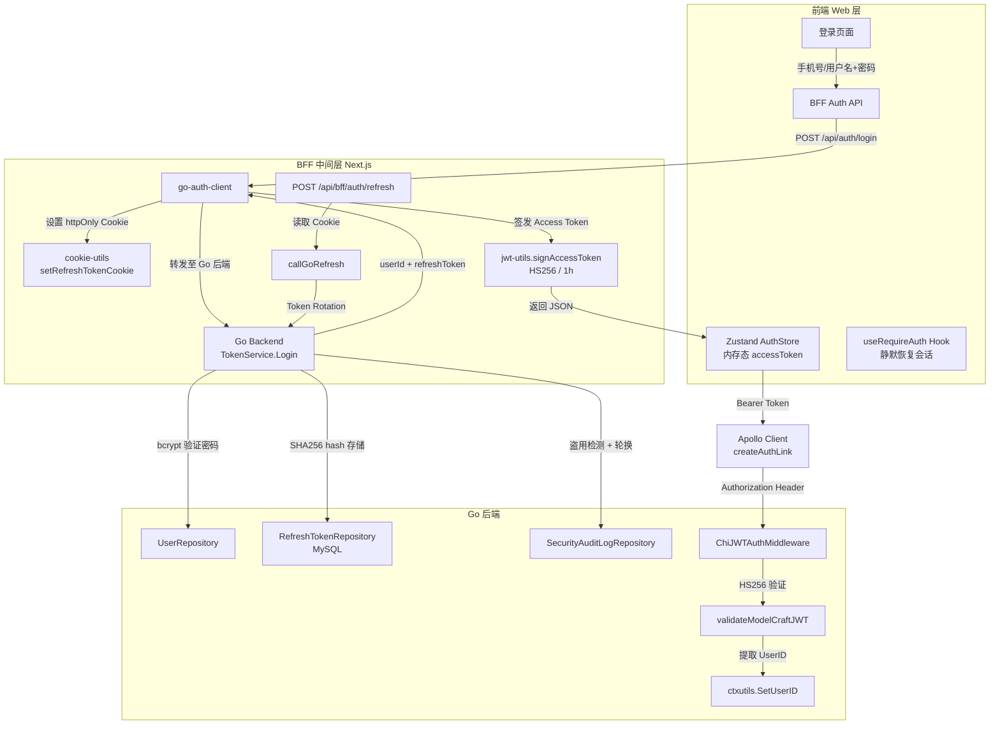
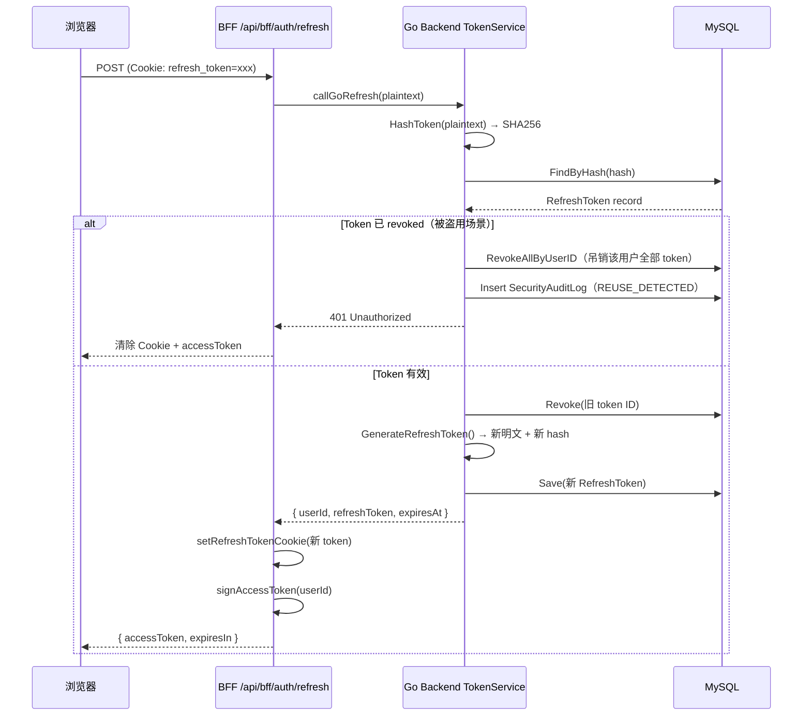

ModelCraft 采用了一套**双令牌（Dual-Token）认证架构**：后端 Go 服务管理用户凭证与 Refresh Token 的持久化生命周期，Next.js BFF 层负责签发短期 Access Token（JWT）并管理 Cookie 安全传输，前端通过 Zustand 内存态存储与静默刷新机制维持会话。Casdoor 作为基础设施层提供组织与用户的身份管理能力，但系统并不直接依赖 Casdoor 的 OAuth2 授权码流程——而是实现了自有的手机号/用户名 + 密码认证通道。本文将完整解析从用户输入凭证到 API 请求鉴权的全链路设计。

Sources: [user_claims.go](modelcraft-backend/internal/domain/auth/user_claims.go#L1-L51), [auth-client.ts](modelcraft-front/src/bff/auth/auth-client.ts#L1-L154)

## 架构全景：三层令牌协作模型

在深入每个阶段之前，理解整体架构中各层的职责边界至关重要。下图展示了从用户登录到 API 鉴权的完整数据流：



这个架构的核心设计决策是**令牌签发权的分离**：后端不签发 Access Token，它只负责验证用户凭证并颁发长期 Refresh Token；BFF 层利用共享密钥（`JWT_SECRET`）自行签发短期 JWT，使得前端请求无需每次回源验证。

Sources: [token_service.go](modelcraft-backend/internal/app/auth/token_service.go#L1-L62), [jwt-utils.ts](modelcraft-front/src/bff/auth/jwt-utils.ts#L1-L26), [cookie-utils.ts](modelcraft-front/src/bff/auth/cookie-utils.ts#L1-L24)

## 认证入口：注册与登录

### 注册流程（Register）

注册通道仅支持**手机号 + 用户名 + 密码**的组合。整个流程在同一数据库事务中完成用户创建、Profile 初始化和个人组织创建三个步骤：

1. **输入校验**：用户名格式校验（3-32 字符，字母/下划线/连字符开头）、手机号格式校验、密码强度校验
2. **唯一性检查**：验证 userName 和手机号未被占用（含数据库唯一索引的兜底检查）
3. **密码哈希**：使用 bcrypt 算法生成密码哈希
4. **事务持久化**：在同一事务中创建 User 记录和初始 Profile 记录
5. **自动建组织**：调用 `CreateOrganizationService` 为新用户创建个人组织，并设置 owner 角色

注册成功后返回 `userId`、`orgName`（个人组织 slug）和 `profile` 快照，但**不直接签发任何令牌**——用户需要通过登录流程获取凭证。

Sources: [token_service.go](modelcraft-backend/internal/app/auth/token_service.go#L66-L171), [handler.go](modelcraft-backend/internal/interfaces/http/handlers/auth/handler.go#L29-L62)

### 登录流程（Login）

登录支持两种标识符类型，通过 `identifierType` 字段区分：

| 标识符类型 | `identifierType` 值 | 查询方式 |
|---|---|---|
| 手机号 | `PHONE`（默认） | `UserRepository.GetByPhone` |
| 用户名 | `USERNAME` | `UserRepository.GetByName` |

登录的核心步骤如下：

1. **标识符解析**：根据 `identifierType` 路由到对应的用户查询逻辑，兼容旧接口的 `phone` 字段
2. **密码验证**：`bcrypt.Compare` 比对密码哈希，失败返回 `AUTHENTICATION_FAILED`
3. **生成 Refresh Token**：32 字节 CSPRNG → 64 位 hex 字符串，SHA256 哈希后存入数据库
4. **查询用户组织**：通过 `MembershipRepository.ListByUserWithDetails` 获取用户首个组织名
5. **返回结果**：`userId`、`userName`、`orgName`、明文 `refreshToken`、`expiresAt`

Sources: [token_service.go](modelcraft-backend/internal/app/auth/token_service.go#L219-L316), [commands.go](modelcraft-backend/internal/app/auth/commands.go#L1-L83)

## Token 生命周期：双令牌架构详解

### 令牌类型对比

| 维度 | Access Token | Refresh Token |
|---|---|---|
| **签发方** | BFF 层（Next.js，jose 库） | Go 后端（TokenService） |
| **签名算法** | HS256（HMAC-SHA256） | 无签名（opaque token） |
| **存储方式** | 前端 Zustand 内存态 | 后端 MySQL（SHA256 hash） |
| **传输方式** | Authorization: Bearer Header | httpOnly Cookie（Secure, SameSite=Strict） |
| **有效期** | 1 小时 | 7 天 |
| **载荷内容** | `user_id` + 标准 JWT claims | 无载荷（纯随机字符串） |
| **吊销能力** | 无法主动吊销（等待自然过期） | 支持主动吊销与轮换 |

Sources: [jwt-utils.ts](modelcraft-front/src/bff/auth/jwt-utils.ts#L1-L26), [token_generator.go](modelcraft-backend/internal/app/auth/token_generator.go#L1-L48), [cookie-utils.ts](modelcraft-front/src/bff/auth/cookie-utils.ts#L1-L24)

### Refresh Token 生成与存储

Refresh Token 的生成使用密码学安全的随机数生成器（`crypto/rand`），生成 32 字节随机数据后编码为 64 位 hex 字符串。存储时仅保留其 SHA256 哈希值——这是标准的 opaque token 模式，即使数据库泄露也无法还原出可用的 token 明文。

```go
// 生成流程：CSPRNG → hex 明文 → SHA256 hash
func GenerateRefreshToken() (plaintext, hash string, err error) {
    b := make([]byte, 32)
    _, err = rand.Read(b)
    plaintext = hex.EncodeToString(b)        // 返回给客户端
    sum := sha256.Sum256([]byte(plaintext))
    hash = hex.EncodeToString(sum[:])         // 存入数据库
    return
}
```

数据库中的 `RefreshToken` 实体包含 `ID`、`UserID`、`TokenHash`、`ExpiresAt`、`CreatedAt`、`RevokedAt` 字段，通过 `IsRevoked()` 和 `IsValid()` 方法封装有效性校验逻辑。

Sources: [token_generator.go](modelcraft-backend/internal/app/auth/token_generator.go#L10-L21), [refresh_token.go](modelcraft-backend/internal/domain/auth/refresh_token.go#L1-L33)

### Access Token 签发（BFF 层）

BFF 层使用 Node.js `jose` 库签发 Access Token，签名密钥 `JWT_SECRET` 与后端共享，确保后端中间件可以验证该 token：

```typescript
// BFF 层签发 Access Token
export async function signAccessToken(userId: string): Promise<string> {
  return new SignJWT({ user_id: userId })
    .setProtectedHeader({ alg: 'HS256' })
    .setIssuer('modelcraft')
    .setIssuedAt()
    .setExpirationTime('1h')
    .sign(getJWTSecret())
}
```

后端的 `UserClaims` 结构体与之对应，包含 `user_id` 字段和标准 `RegisteredClaims`，验证时要求 issuer 必须为 `"modelcraft"` 且 token 未过期。

Sources: [jwt-utils.ts](modelcraft-front/src/bff/auth/jwt-utils.ts#L13-L25), [user_claims.go](modelcraft-backend/internal/domain/auth/user_claims.go#L14-L51)

## BFF 层：Cookie 管理与会话恢复

### Cookie 安全配置

Refresh Token 通过 httpOnly Cookie 传输，配置参数体现了严格的安全策略：

| 参数 | 值 | 说明 |
|---|---|---|
| `httpOnly` | `true` | JavaScript 无法读取，防止 XSS 窃取 |
| `secure` | 生产环境 `true` | 仅 HTTPS 传输 |
| `sameSite` | `'strict'` | 阻止跨站请求携带 Cookie |
| `maxAge` | 7 天 | Cookie 有效期与 Refresh Token 一致 |
| `path` | `'/'` | 所有路由均可读取，包括 middleware |

Sources: [cookie-utils.ts](modelcraft-front/src/bff/auth/cookie-utils.ts#L1-L24)

### Next.js Middleware 路由守卫

前端的路由守卫采用了**轻量级存在性检查**策略——中间件仅验证 `refresh_token` Cookie 是否存在，不验证其有效性。这避免了对后端的每次请求都发起校验调用，将性能开销降到最低：

- **公开路由**（`/login`、`/register`、`/auth/callback`、`/api/*`）直接放行
- **受保护路由**：检查 Cookie 存在性，缺失时重定向至 `/login?returnUrl=原始路径`
- **有效 Token 的实际验证**：推迟到 BFF 层的 refresh 调用或后端的 JWT 中间件执行

Sources: [middleware.ts](modelcraft-front/src/middleware.ts#L1-L56)

### 会话恢复：useRequireAuth Hook

页面刷新后 Zustand 内存态的 Access Token 丢失，`useRequireAuth` Hook 负责静默恢复会话：

```typescript
// 会话恢复逻辑
let token = getToken()                           // 尝试从内存获取
if (!token) {
  token = await refreshAccessToken()             // 静默刷新（Cookie 自动携带）
}
if (token) {
  setUser(getUserInfoFromToken(token))           // 解析用户信息
}
```

`refreshAccessToken` 函数通过 `POST /api/bff/auth/refresh` 发起请求，Cookie 中的 Refresh Token 由浏览器自动附加。该函数还实现了**并发去重**——多个组件同时触发刷新时共享同一个 Promise，避免重复请求。

Sources: [use-auth.ts](modelcraft-front/src/web/hooks/auth/use-auth.ts#L1-L63), [auth-client.ts](modelcraft-front/src/bff/auth/auth-client.ts#L94-L142)

## Token 刷新与轮换：安全核心机制

### Token Rotation 流程

Token 刷新遵循 **Rotation（轮换）** 模式——每次刷新后旧 Refresh Token 立即失效，颁发全新的 Refresh Token。这是 OAuth 2.1 推荐的最佳实践：



### 盗用检测（Reuse Detection）

这是 Token Rotation 安全模型中最关键的一环。当检测到已被 revoked 的 Refresh Token 被再次使用时，系统执行**连锁吊销**：

1. **检测条件**：`token.IsRevoked() == true` 且数据库中仍能查到该 token 记录
2. **响应动作**：立即吊销该用户的**所有** Refresh Token（`RevokeAllByUserID`）
3. **审计记录**：写入 `SecurityAuditLog`，事件类型为 `REUSE_DETECTED`，包含 token ID
4. **用户影响**：该用户在所有设备上被强制登出，需要重新输入凭证

这种设计假设：如果攻击者拿到了一个已轮换的旧 token 并尝试使用，说明 Refresh Token 的传输通道可能已泄露。连锁吊销虽然会导致用户体验中断，但能有效阻止进一步的未授权访问。

Sources: [token_service.go](modelcraft-backend/internal/app/auth/token_service.go#L373-L440), [go-auth-client.ts](modelcraft-front/src/bff/auth/go-auth-client.ts#L170-L190)

## 后端 JWT 鉴权中间件

### 双路径验证

后端 `ChiJWTAuthMiddleware` 支持两种认证路径，通过 Bearer Token 的前缀区分：

| 路径 | Token 格式 | 验证方式 | 用途 |
|---|---|---|---|
| JWT 路径 | 标准 JWT 字符串 | HMAC-SHA256 签名验证 | 常规用户认证 |
| API Key 路径 | `mc_` 前缀的 Base62 字符串 | 数据库哈希查找 | 服务间调用 / 自动化 |

```go
// JWT 验证核心逻辑
func validateModelCraftJWT(secret []byte, tokenString string) (*auth.UserClaims, error) {
    token, err := jwt.ParseWithClaims(tokenString, &auth.UserClaims{},
        func(token *jwt.Token) (interface{}, error) {
            // 强制 HMAC 算法，防止算法混淆攻击
            if _, ok := token.Method.(*jwt.SigningMethodHMAC); !ok {
                return nil, jwt.ErrSignatureInvalid
            }
            return secret, nil
        })
    // ...
}
```

验证成功后，中间件将 `UserID` 注入请求上下文（`ctxutils.SetUserID`），下游的 GraphQL handler 和 REST handler 均可通过 `ctxutils.GetUserID` 获取当前用户身份。

Sources: [chi_jwt_auth.go](modelcraft-backend/internal/middleware/chi_jwt_auth.go#L1-L101)

### 路由级中间件挂载

JWT 鉴权中间件在路由注册时通过 Chi 的 `r.Use()` 挂载，覆盖所有设计态和运行态 GraphQL 端点：

- **Org GraphQL**：`/graphql/org/{orgName}` → JWT 验证 + 组织上下文中间件
- **Project GraphQL**：`/graphql/org/{orgName}/project/{projectSlug}` → JWT 验证 + 组织 + 项目上下文中间件
- **Runtime GraphQL**：`/graphql/org/{orgName}/project/{projectSlug}/db/{db}/model/{model}` → JWT 验证 + 缓存控制中间件

开发环境可通过 `SkipValidation` 配置跳过 JWT 验证，便于本地调试。

Sources: [routes.go](modelcraft-backend/internal/interfaces/http/routes.go#L229-L311), [routes.go](modelcraft-backend/internal/interfaces/http/routes.go#L433-L454)

## 前端 Apollo Client 认证集成

### Auth Link 自动注入

所有 Apollo Client 实例共享同一个 `createAuthLink` 工厂函数，自动从 Zustand AuthStore 读取 Access Token 并注入 `Authorization: Bearer` 请求头：

```typescript
function createAuthLink() {
  return setContext((_, { headers }) => {
    const token = useAuthStore.getState().accessToken
    return {
      headers: {
        ...headers,
        authorization: token ? `Bearer ${token}` : '',
        'x-request-id': generateUUID(),
      },
    }
  })
}
```

同时注入的还有 `x-request-id` 请求头，用于后端全链路日志追踪。

### Token 临近过期检测

AuthStore 的 `isTokenExpired` 方法实现了**5 分钟提前量策略**——在 Access Token 实际过期前 5 分钟即判定为过期，触发静默刷新。`auth-client.ts` 中的 `isTokenNearExpiry` 函数默认也使用 300 秒（5 分钟）阈值。

Sources: [clients.ts](modelcraft-front/src/bff/apollo/clients.ts#L1-L37), [auth-store.ts](modelcraft-front/src/shared/stores/auth-store.ts#L1-L31), [auth-client.ts](modelcraft-front/src/bff/auth/auth-client.ts#L54-L61)

## Casdoor 基础设施角色

### Casdoor Provider 与 SDK Client

Casdoor 在当前架构中主要承担**身份基础设施**角色，而非运行时认证网关。后端包含两个 Casdoor 相关组件：

**CasdoorProvider**（`infrastructure/auth/casdoor_provider.go`）实现了 `AuthProvider` 接口，负责从 Casdoor 的 X.509 证书中提取 RSA 公钥。该 Provider 支持 RS256 签名验证，公钥在首次解析后缓存于内存中。

**Casdoor Client**（`infrastructure/casdoor/client.go`）封装了 Casdoor Go SDK，提供以下管理功能：
- 创建组织（`CreateOrganization`）
- 更新用户组织归属（`UpdateUserOrganization`）
- 查询组织和用户信息

这些功能在用户注册时创建个人组织、组织管理等场景中使用，但**不直接参与登录认证的运行时路径**。

Sources: [casdoor_provider.go](modelcraft-backend/internal/infrastructure/auth/casdoor_provider.go#L1-L104), [client.go](modelcraft-backend/internal/infrastructure/casdoor/client.go#L1-L157), [provider.go](modelcraft-backend/internal/domain/auth/provider.go#L1-L21)

### RSA 公钥加载策略

`LoadRSAPublicKey` 函数支持三种公钥来源（按优先级）：

1. **Casdoor 证书配置**（`CASDOOR_CERTIFICATE`）：直接传入 PEM 格式 X.509 证书字符串
2. **公钥文件路径**（`CASDOOR_JWT_PUBLIC_KEY_PATH`）：从文件系统加载
3. **直接公钥字符串**（`CASDOOR_JWT_PUBLIC_KEY`）：配置中直接指定

该函数使用 `sync.Once` 确保公钥仅解析一次并全局缓存，避免重复解析开销。

Sources: [routes.go](modelcraft-backend/internal/interfaces/http/routes.go#L313-L409)

## 安全设计总结

| 安全措施 | 实现位置 | 说明 |
|---|---|---|
| Refresh Token 哈希存储 | 后端 TokenService | SHA256 哈希，数据库泄露不暴露明文 |
| httpOnly + SameSite Cookie | BFF cookie-utils | 防 XSS 读取 + 防 CSRF 携带 |
| Token Rotation | 后端 Refresh 方法 | 每次刷新后旧 token 立即失效 |
| 盗用检测 + 连锁吊销 | 后端 Refresh 方法 | 检测到 token 重用即吊销用户全部 token |
| HMAC 算法强制校验 | 后端 JWT 中间件 | 防止算法混淆攻击 |
| 并发刷新去重 | 前端 refreshAccessToken | 多组件共享同一刷新 Promise |
| 5 分钟提前量过期 | 前端 AuthStore | Access Token 提前刷新，减少 401 概率 |
| 审计日志 | 后端 SecurityAuditLog | 记录 token 盗用事件，支持事后追溯 |

Sources: [token_generator.go](modelcraft-backend/internal/app/auth/token_generator.go#L44-L48), [chi_jwt_auth.go](modelcraft-backend/internal/middleware/chi_jwt_auth.go#L82-L100), [auth-client.ts](modelcraft-front/src/bff/auth/auth-client.ts#L94-L142)

---

**延伸阅读**：了解后端如何将认证与 RBAC 权限控制结合，参阅 [Casdoor 委托认证与 Casbin RBAC 权限控制](11-casdoor-wei-tuo-ren-zheng-yu-casbin-rbac-quan-xian-kong-zhi)；了解前端 Apollo Client 如何在三种作用域中使用认证令牌，参阅 [三种 Apollo Client 实例策略与 GraphQL 操作层约定](13-san-chong-apollo-client-shi-li-ce-lue-yu-graphql-cao-zuo-ceng-yue-ding)；了解整体分层架构中认证层的位置，参阅 [前端分层架构：App → Web → BFF → Shared](12-qian-duan-fen-ceng-jia-gou-app-web-bff-shared)。