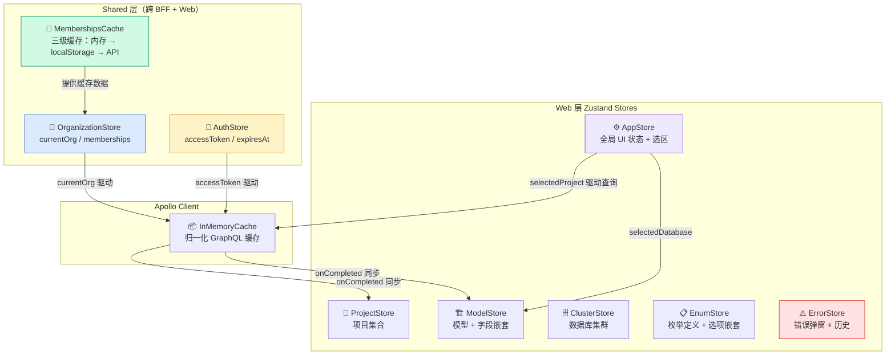
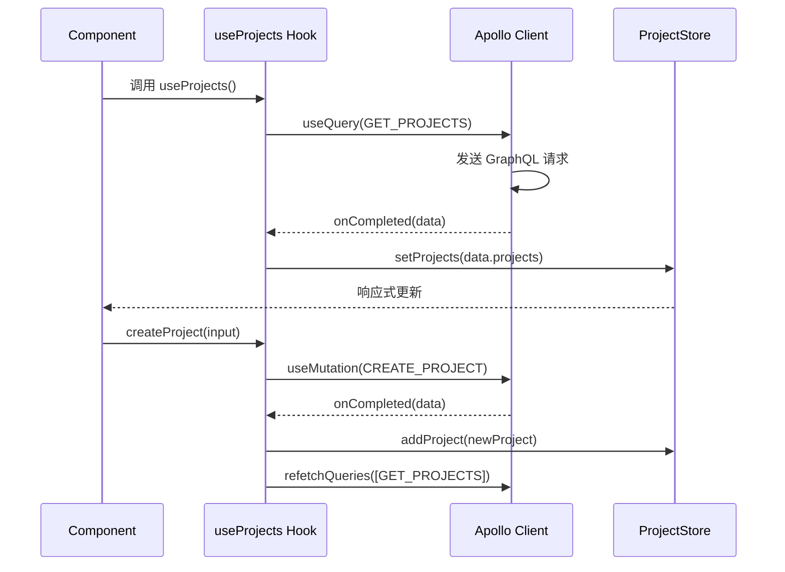
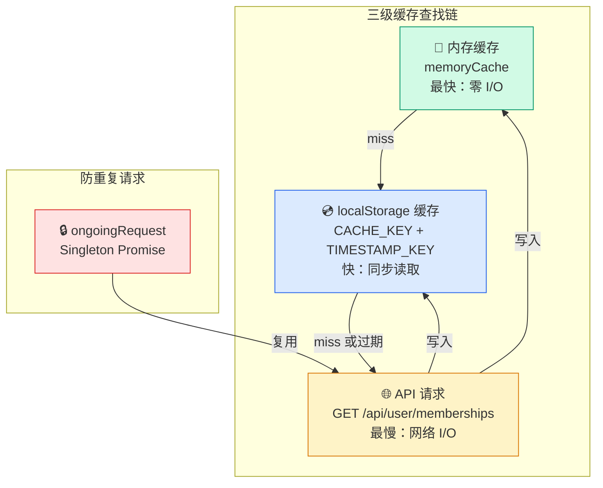
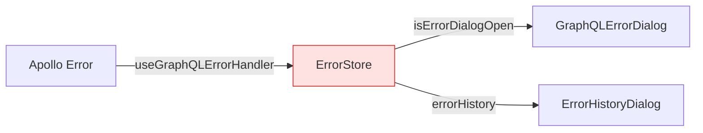

ModelCraft 前端采用 **Zustand 轻量状态管理 + Apollo Client 缓存** 的双轨体系。Zustand 负责管理 UI 状态、选区上下文和错误展示等"客户端主权"数据；Apollo Client 的 `InMemoryCache` 则通过归一化缓存管理从 GraphQL API 获取的服务端数据。二者通过 Hooks 层实现桥接——Apollo 的 `onCompleted` 回调将服务端数据同步到 Zustand，而 Zustand 的选区状态又反过来驱动 Apollo 的查询变量和端点路由。这种分层设计让远程数据缓存与本地交互状态各司其职，避免了单一状态容器的职责膨胀。

Sources: [index.ts](modelcraft-front/src/web/stores/index.ts#L1-L15), [apollo-wrapper.tsx](modelcraft-front/src/web/providers/apollo-wrapper.tsx#L1-L183)

## 架构全景

整个状态管理体系分布在两个层面：**Web 层**处理页面级业务状态，**Shared 层**承载跨层（BFF + Web）共享的认证与租户状态。下面这张图展示了各 Store 的职责划分与数据流向。



Sources: [stores/index.ts](modelcraft-front/src/web/stores/index.ts#L1-L15), [shared/stores/organization.ts](modelcraft-front/src/shared/stores/organization.ts#L1-L182), [shared/cache/memberships-cache.ts](modelcraft-front/src/shared/cache/memberships-cache.ts#L1-L266)

## Store 清单与对比

项目共定义 **7 个 Zustand Store** 和 **1 个独立缓存模块**，按职责和所处层级可分为三类：

| Store | 文件位置 | 核心职责 | 中间件 | 持久化范围 |
|-------|---------|---------|--------|-----------|
| **AuthStore** | `shared/stores/auth-store.ts` | Token 存储与过期判断 | 无 | 无（内存态） |
| **OrganizationStore** | `shared/stores/organization.ts` | 当前组织、成员列表、组织切换 | `persist` | `currentOrg` + `organizations` |
| **AppStore** | `web/stores/app.ts` | 全局加载态、选区（项目/集群/数据库）、侧边栏折叠 | `devtools` + `persist` | 全部状态 |
| **ProjectStore** | `web/stores/project.ts` | 项目集合 CRUD、选中项目 | `devtools` + `persist` | 仅 `selectedProject` |
| **ModelStore** | `web/stores/model.ts` | 模型集合 CRUD、选中模型、嵌套字段操作 | `devtools` | 无 |
| **ClusterStore** | `web/stores/cluster.ts` | 集群集合 CRUD、选中集群 | `devtools` | 无 |
| **EnumStore** | `web/stores/enum.ts` | 枚举集合 CRUD、嵌套选项操作与排序 | `devtools` | 无 |
| **ErrorStore** | `web/stores/error.ts` | 错误弹窗控制、错误历史记录（上限 50 条） | `devtools` | 无 |
| **MembershipsCache** | `shared/cache/memberships-cache.ts` | 多级成员数据缓存 | N/A（非 Zustand） | 内存 + localStorage（TTL 5min） |

**设计决策要点**：AuthStore 不使用 `persist`，因为 Token 由 BFF 层 Cookie 管理，Zustand 仅作运行时缓存。ModelStore、ClusterStore、EnumStore 不持久化，因为其数据来源于 Apollo 缓存的同步，页面刷新后由 GraphQL 查询自动重建。

Sources: [app.ts](modelcraft-front/src/web/stores/app.ts#L1-L80), [project.ts](modelcraft-front/src/web/stores/project.ts#L1-L98), [model.ts](modelcraft-front/src/web/stores/model.ts#L1-L128), [cluster.ts](modelcraft-front/src/web/stores/cluster.ts#L1-L77), [enum.ts](modelcraft-front/src/web/stores/enum.ts#L1-L142), [error.ts](modelcraft-front/src/web/stores/error.ts#L1-L80), [auth-store.ts](modelcraft-front/src/shared/stores/auth-store.ts#L1-L31), [organization.ts](modelcraft-front/src/shared/stores/organization.ts#L1-L182)

## 中间件栈：devtools + persist 的分层应用

Zustand 的中间件通过函数组合实现洋葱模型——外层 `devtools` 包裹内层 `persist`，所有状态变更同时受两层中间件处理。项目中有三种组合策略：

**策略一：devtools + persist（AppStore、ProjectStore）**
用于既需要 Redux DevTools 调试能力、又需要跨页面持久化的核心状态。`partialize` 选择器精确控制哪些字段写入 localStorage，避免将临时 UI 状态（如 `loading`、`error`）持久化导致刷新后的状态不一致。

```typescript
// AppStore 的 persist 配置 —— 持久化选区与 UI 偏好，排除 loading
persist(
  (set) => ({ /* ... */ }),
  {
    name: 'modelcraft-app-storage',
    partialize: (state) => ({
      selectedProject: state.selectedProject,
      selectedCluster: state.selectedCluster,
      selectedDatabase: state.selectedDatabase,
      sidebarCollapsed: state.sidebarCollapsed,
    }),
  }
)
```

**策略二：devtools only（ModelStore、ClusterStore、EnumStore、ErrorStore）**
用于纯运行时状态，不需要持久化。这些 Store 的数据完整来源于 Apollo 查询结果，刷新后自动从服务端重新加载，持久化反而会造成脏数据。

**策略三：persist only（OrganizationStore）**
Shared 层的 OrganizationStore 仅使用 `persist`，不引入 `devtools`。这保持了跨层共享 Store 的轻量性，避免在 BFF 层引入不必要的调试依赖。

Sources: [app.ts](modelcraft-front/src/web/stores/app.ts#L23-L79), [project.ts](modelcraft-front/src/web/stores/project.ts#L26-L98), [model.ts](modelcraft-front/src/web/stores/model.ts#L28-L128), [organization.ts](modelcraft-front/src/shared/stores/organization.ts#L35-L132)

## 选区级联清除机制

AppStore 实现了一种**层级化选区清除**模式：当用户切换项目时，自动清除下游的集群和数据库选择；切换集群时，自动清除数据库选择。这保证了选区的一致性——不会出现"项目 A + 集群 B（属于项目 C）"的非法组合。


在实现上，每个 setter 内部通过条件判断执行级联清除：

```typescript
setSelectedProject: (project) => {
  set({ selectedProject: project })
  if (project === null) {
    set({ selectedCluster: null, selectedDatabase: null })
  }
},
setSelectedCluster: (cluster) => {
  set({ selectedCluster: cluster })
  if (cluster === null) {
    set({ selectedDatabase: null })
  }
},
```

`clearSelection` 方法则一次性清除全部三级选区，通常在用户退出项目上下文或切换组织时调用。

Sources: [app.ts](modelcraft-front/src/web/stores/app.ts#L37-L63)

## Apollo ↔ Zustand 的双向数据桥接

Zustand 与 Apollo Client 并非各自为政，而是通过 Hooks 层形成清晰的数据流闭环。

**服务端 → 客户端（Apollo → Zustand）**：GraphQL 查询的 `onCompleted` 回调将结果写入 Zustand Store。以 `useProjects` Hook 为例，`GET_PROJECTS` 查询完成后调用 `setProjects`；创建/更新/删除 mutation 完成后分别调用 `addProject`、`updateProject`、`removeProject`。

**客户端 → 服务端（Zustand → Apollo）**：Zustand 的选区状态驱动 Apollo 的查询参数。`useModels` Hook 从 `useAppStore` 读取 `selectedProject`，将其 `databaseName` 作为 `GET_MODELS` 查询的变量；当 `selectedProject` 为空时通过 `skip: !selectedProject?.slug` 跳过查询。



这种桥接模式的关键优势是 **Zustand 充当了 Apollo 缓存的本地投影**——组件只需订阅 Zustand Store 即可获取数据，而 Apollo 的 `InMemoryCache` 负责处理去重、归一化和缓存失效等复杂逻辑。

Sources: [use-projects.ts](modelcraft-front/src/web/hooks/project/use-projects.ts#L40-L132), [use-models.ts](modelcraft-front/src/web/hooks/model/use-models.ts#L63-L179)

## 嵌套实体操作模式

ModelStore 和 EnumStore 需要管理**嵌套实体**（Model 包含 Fields、Enum 包含 Options）。项目采用了一种一致的双路径更新模式——每次嵌套操作同时更新集合列表和选中实体，确保二者保持同步。

以 ModelStore 的 `addFieldToModel` 为例：

```typescript
addFieldToModel: (modelId, field) => set((state) => ({
  models: state.models.map(model => 
    model.id === modelId 
      ? { ...model, fields: [...model.fields, field] }
      : model
  ),
  selectedModel: state.selectedModel?.id === modelId
    ? { ...state.selectedModel, fields: [...state.selectedModel.fields, field] }
    : state.selectedModel
})),
```

**集合路径**（`models`）确保列表视图中正确显示变更；**选中路径**（`selectedModel`）确保编辑面板中显示最新数据。如果只更新其中一条路径，用户会看到列表和详情面板数据不一致的问题。

EnumStore 额外提供了 `reorderOptionsInEnum` 操作，用于支持枚举选项的拖拽排序，直接替换整个 `options` 数组。

Sources: [model.ts](modelcraft-front/src/web/stores/model.ts#L70-L111), [enum.ts](modelcraft-front/src/web/stores/enum.ts#L73-L125)

## MembershipsCache：三级缓存体系

组织成员数据是多租户架构中最频繁访问的数据之一——几乎每个页面都需要知道当前用户属于哪些组织。为此，项目设计了一个独立于 Zustand 的**三级缓存模块** `MembershipsCache`，采用函数式 API（非 Store 模式）提供服务。



**缓存配置**：TTL 为 5 分钟（`CACHE_TTL = 5 * 60 * 1000`），localStorage 的 key 为 `org_memberships_cache` 和 `org_memberships_timestamp`。

**防重复请求（Singleton Pattern）**：当多个组件同时调用 `getMemberships` 时，第一个请求创建 Promise 并存入 `ongoingRequest`，后续调用直接复用该 Promise，避免并发请求风暴。请求完成后在 `finally` 中清除引用。

**预加载机制**：`preloadMemberships(token)` 在登录完成后立即触发后台加载，不阻塞页面渲染。后续组件调用 `getMemberships` 时直接命中内存缓存。

**失效触发时机**：用户登出、创建/加入/离开组织时调用 `invalidateMembershipsCache()`，同时清除内存和 localStorage 缓存。OrganizationStore 的 `clearOrganization` 方法内部自动调用失效逻辑。

Sources: [memberships-cache.ts](modelcraft-front/src/shared/cache/memberships-cache.ts#L1-L266), [organization.ts](modelcraft-front/src/shared/stores/organization.ts#L88-L96)

## OrganizationStore：异步缓存集成

OrganizationStore 是唯一包含**异步操作**的 Zustand Store——`loadMemberships` 和 `refreshMemberships` 方法直接调用 `MembershipsCache` 的函数式 API，将缓存层与状态管理层衔接起来。

```typescript
loadMemberships: async (token: string, forceRefresh = false) => {
  set({ isLoadingMemberships: true })
  try {
    const memberships = await getMemberships(token, forceRefresh)
    get().setMemberships(memberships)  // 同步 Store 状态
    return memberships
  } finally {
    set({ isLoadingMemberships: false })
  }
},
```

**自动推断逻辑**：`setMemberships` 和 `setOrganizations` 方法内部包含自动选区推断——如果 `currentOrg` 为空且列表非空，自动设置第一个组织为当前组织。这简化了初始化流程，用户登录后无需手动选择组织。

**持久化策略**：`partialize` 仅持久化 `currentOrg` 和 `organizations`（字符串数组），不持久化完整的 `memberships` 对象。成员详情数据通过 MembershipsCache 的独立缓存机制管理，避免在 Zustand persist 和 MembershipsCache 之间产生数据冗余和不一致。

Sources: [organization.ts](modelcraft-front/src/shared/stores/organization.ts#L35-L131)

## AuthStore：内存态 Token 管理

AuthStore 的设计刻意保持极简——仅存储 `accessToken` 和 `expiresAt`，不使用任何中间件。Token 实际的持久化由 BFF 层的 Cookie 机制处理，Zustand 仅在运行时缓存 Token 以供 Apollo Link 读取。

```typescript
setAccessToken: (token: string, expiresIn: number) => {
  set({
    accessToken: token,
    expiresAt: Date.now() + expiresIn * 1000,
  })
},
```

**提前过期策略**：`isTokenExpired()` 在实际过期时间前 **5 分钟** 即返回 `true`，触发 `AuthProvider` 组件的静默刷新。这为 Token 刷新预留了安全窗口，避免请求在刷新过程中因 Token 过期而失败。

`AuthProvider` 组件每 60 秒轮询一次 Token 有效性，通过 `useAuthStore.getState()` 直接读取 Store（不触发 React 重渲染），在后台完成 Token 刷新。

Sources: [auth-store.ts](modelcraft-front/src/shared/stores/auth-store.ts#L1-L31), [auth-provider.tsx](modelcraft-front/src/web/components/features/auth/auth-provider.tsx#L14-L38)

## ErrorStore：全局错误状态与历史追踪

ErrorStore 管理应用级的 GraphQL 错误弹窗状态，并维护一个最近 50 条错误的环形历史记录。



**双入口触发**：
- **Hook 入口**：`useGraphQLErrorHandler` 在组件内使用，将 `ApolloError` 转换为 `GraphQLErrorInfo[]` 后调用 `showErrorDialog`
- **全局入口**：`createGlobalErrorHandler()` 返回纯函数，通过 `useErrorStore.getState()` 直接操作 Store（不依赖 React 上下文），被 Apollo 的 `errorLink` 在错误链中调用

**历史记录机制**：`showErrorDialog` 内部自动调用 `addToHistory`，新记录通过 `[newEntry, ...errorHistory].slice(0, 50)` 保持在 50 条上限。开发环境下可通过 `ErrorHistoryDialog` 组件查看历史错误，辅助调试。

`ErrorProvider` 作为全局 Provider 包裹应用根组件，订阅 `isErrorDialogOpen` 状态并渲染 `GraphQLErrorDialog`。

Sources: [error.ts](modelcraft-front/src/web/stores/error.ts#L1-L80), [use-graphql-error-handler.ts](modelcraft-front/src/web/hooks/error/use-graphql-error-handler.ts#L1-L120), [ErrorProvider.tsx](modelcraft-front/src/web/components/features/providers/ErrorProvider.tsx#L1-L25)

## URL 驱动的状态同步

项目的路由设计遵循 **URL 为单一真相源** 原则——`/org/[orgName]/projects/[projectSlug]/*` 路由结构中，`orgName` 和 `projectSlug` 直接决定了 Store 的选区状态。`useProjectFromUrl` Hook 负责将 URL 参数同步到 AppStore：

```typescript
useEffect(() => {
  if (!urlProjectSlug) return
  if (selectedProject?.slug === urlProjectSlug) return  // 避免无效更新

  setSelectedProject({
    id: urlProjectSlug,
    slug: urlProjectSlug,
    title: urlProjectSlug === 'default' ? 'Default Project' : urlProjectSlug,
    // ...
  })
}, [urlProjectSlug, urlOrgName, selectedProject?.slug, setSelectedProject])
```

这种设计确保：刷新页面时状态从 URL 恢复；分享链接时接收方直接进入正确的上下文；浏览器前进/后退自动触发状态同步。

Sources: [use-project-from-url.ts](modelcraft-front/src/web/hooks/project/use-project-from-url.ts#L28-L71)

## Apollo Client 中的 Store 集成

Apollo Wrapper 中的 HTTP Link 和 Auth Link 直接从 Zustand Store 读取状态，实现请求层的动态配置：

- **HTTP Link**：从 `useOrganizationStore.getState().currentOrg` 读取当前组织，动态构建 `/graphql/org/${currentOrg}/` 端点路径
- **Auth Link**：从 `useAuthStore.getState().accessToken` 读取 Token，注入 `Authorization` 请求头

这种模式使用 `getState()` 而非 React Hook 订阅，因为 Apollo Link 操作在 React 渲染周期之外，每次请求时读取最新值即可，无需触发重渲染。

`resetApolloCache()` 函数在切换组织时被调用，确保 Apollo 的归一化缓存不会残留旧组织的数据。

Sources: [apollo-wrapper.tsx](modelcraft-front/src/web/providers/apollo-wrapper.tsx#L15-L42), [clients.ts](modelcraft-front/src/bff/apollo/clients.ts#L44-L84)

## 实践模式总结

| 模式 | 适用场景 | 项目示例 |
|------|---------|---------|
| **partialize 选择性持久化** | 只持久化选区状态，排除临时态 | AppStore、ProjectStore |
| **级联清除** | 层级化选区，防止非法组合 | AppStore 的项目→集群→数据库 |
| **嵌套双路径更新** | 集合+选中实体同步更新 | ModelStore 的字段操作、EnumStore 的选项操作 |
| **Singleton Promise 防重复** | 高频并发请求同一资源 | MembershipsCache |
| **内存→localStorage→API 三级缓存** | 读多写少的全局数据 | MembershipsCache |
| **URL 驱动 Store 同步** | 路由参数作为状态真相源 | useProjectFromUrl |
| **getState() 在 React 外读取** | Apollo Link 等非 React 上下文 | HTTP Link、Auth Link |
| **提前过期 + 后台刷新** | Token 生命周期管理 | AuthStore + AuthProvider |

Sources: [app.ts](modelcraft-front/src/web/stores/app.ts#L1-L80), [memberships-cache.ts](modelcraft-front/src/shared/cache/memberships-cache.ts#L1-L266), [use-project-from-url.ts](modelcraft-front/src/web/hooks/project/use-project-from-url.ts#L1-L148)

## 延伸阅读

- 了解 Zustand Store 如何被三种 Apollo Client 实例消费，请参阅 [三种 Apollo Client 实例策略与 GraphQL 操作层约定](13-san-chong-apollo-client-shi-li-ce-lue-yu-graphql-cao-zuo-ceng-yue-ding)
- 理解 Token 在 BFF 层的 Cookie 管理与 Zustand 的关系，请参阅 [认证流程：Casdoor OAuth2/OIDC 集成与 Token 生命周期管理](15-ren-zheng-liu-cheng-casdoor-oauth2-oidc-ji-cheng-yu-token-sheng-ming-zhou-qi-guan-li)
- 查看 Zustand Store 在前端分层中的位置，请参阅 [前端分层架构：App → Web → BFF → Shared](12-qian-duan-fen-ceng-jia-gou-app-web-bff-shared)