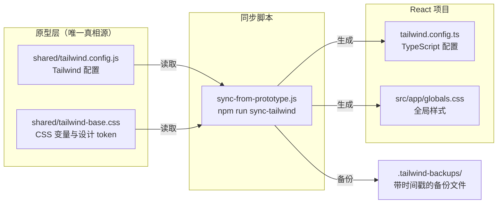
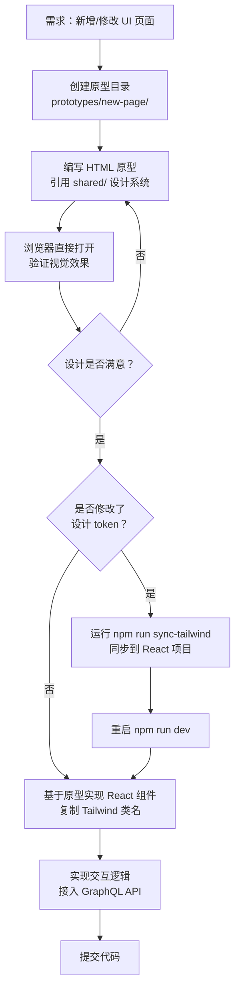

ModelCraft 前端团队采用 **HTML-First 原型工作流**——在编写任何 React 代码之前，先用纯 HTML + Tailwind CSS 构建可预览的静态原型。原型目录 `prototypes/` 是整个 UI 设计的"**唯一真相源**"，所有样式变更都必须先在原型中验证，再同步到 React 组件。这一工作流降低了设计与开发的沟通成本，让开发者在浏览器中即可完成视觉方案的快速迭代。

Sources: [README.md](modelcraft-front/prototypes/README.md#L1-L209), [README.md](modelcraft-front/scripts/README.md#L1-L180)

## 核心原则：先原型，再 React

工作流的核心只有一句话：**永远先修改原型，再写 React 代码**。任何 UI 变更必须遵循三步闭环：

1. **创建或修改** `prototypes/` 目录下的 HTML 原型文件
2. **在浏览器中预览**，确认视觉效果符合预期
3. **基于原型实现** React 组件，复用相同的 Tailwind 类名

Sources: [README.md](modelcraft-front/prototypes/README.md#L27-L31)

## 目录结构与设计系统架构

原型目录按页面/功能独立组织，每个子目录包含一个或多个可直接用浏览器打开的 HTML 文件：

```
prototypes/
├── README.md                          # 原型开发指南
├── shared/                            # 共享资源层
│   ├── tailwind.config.js             # Tailwind 配置（与正式项目同步）
│   ├── tailwind-base.css              # CSS 变量与设计 token（与 globals.css 同步）
│   ├── layout-styles.css              # 公共布局样式（Topbar + Sidebar + Content）
│   └── components/                    # 可复用组件片段
│       ├── sidebar-project.html       # Sidebar - 项目模式
│       ├── sidebar-workspace.html     # Sidebar - 工作空间模式
│       └── topbar.html                # 顶部导航栏
├── layout/                            # 布局总览页（嵌 iframe 展示各页面）
│   └── index.html
├── login/                             # 登录页原型（含 Casdoor 定制版）
├── workspace/                         # 工作空间页原型
├── model-editor/                      # 模型编辑器原型
├── org-selector/                      # 组织选择器原型
├── org-settings/                      # 组织设置原型
├── settings/                          # 设置页原型（单栏版）
├── settings-v2/                       # 设置页原型（双栏版，参考 Supabase）
└── team/                              # 团队管理原型
```

其中 `shared/` 是整个设计系统的共享层，包含 Tailwind 配置、CSS 变量和可复用布局组件片段。每个页面原型通过相对路径引用这些共享资源，确保设计 token 的一致性。

Sources: [README.md](modelcraft-front/prototypes/README.md#L6-L26), [README-LAYOUT.md](modelcraft-front/prototypes/README-LAYOUT.md#L1-L219)

## 双轨设计系统：Tailwind 体系与 CSS 变量体系

原型目录中存在两种互补的设计系统载体，分别服务不同场景：

| 体系 | 核心文件 | 机制 | 适用页面 |
|------|---------|------|---------|
| **Tailwind CDN 体系** | `shared/tailwind.config.js` + `tailwind-base.css` | Tailwind Play CDN + CSS 变量 token | `layout/`, `model-editor/`, `settings-v2/` 等 |
| **CSS 变量体系** | `shared/layout-styles.css` | 原生 CSS 变量 + 手写 class | `team/`, `workspace/`, `org-selector/` 等 |

两种体系共享相同的设计 token（颜色、间距、圆角），区别在于前者通过 Tailwind 工具类直接消费 token，后者通过 `var(--primary)` 等 CSS 变量消费。最终在 React 项目中，两者统一收口到 `tailwind.config.ts` + `globals.css`。

Sources: [tailwind.config.js](modelcraft-front/prototypes/shared/tailwind.config.js#L1-L160), [tailwind-base.css](modelcraft-front/prototypes/shared/tailwind-base.css#L1-L117), [layout-styles.css](modelcraft-front/prototypes/shared/layout-styles.css#L1-L546)

### 设计 Token 色彩规范

原型中定义的色彩变量与 React 项目完全一致，以下为核心 token 对照：

| 用途 | CSS 变量 | Light 值 | Tailwind 类名 |
|------|---------|---------|--------------|
| 主色调 | `--primary` | `221 83% 53%` (#2563eb) | `bg-primary`, `text-primary` |
| 成功色 | `--success` | `160 84% 39%` | `text-emerald-600` |
| 警告色 | `--warning` | `38 92% 50%` | `text-amber-600` |
| 选中状态 | `--selected` | `215 20% 88%` (#dadee5) | `bg-selected` |
| 页面背景 | `--background` | `0 0% 100%` | `bg-background` |
| 侧边栏背景 | `--sidebar-background` | `0 0% 100%` | `bg-sidebar` |

Sources: [tailwind-base.css](modelcraft-front/prototypes/shared/tailwind-base.css#L18-L64)

## 原型 HTML 模板

每个新原型页面使用统一的 HTML 模板。以下是最常用的 **Tailwind CDN 体系**模板：

```html
<!DOCTYPE html>
<html lang="zh-CN">
<head>
  <meta charset="UTF-8">
  <meta name="viewport" content="width=device-width, initial-scale=1.0">
  <title>Page Name - ModelCraft Prototype</title>

  <!-- Fonts -->
  <link rel="preconnect" href="https://fonts.googleapis.com">
  <link rel="preconnect" href="https://fonts.gstatic.com" crossorigin>
  <link href="https://fonts.googleapis.com/css2?family=Inter:wght@400;500;600;700&family=Space+Grotesk:wght@500;600;700&family=Fira+Code:wght@400;500&display=swap" rel="stylesheet">

  <!-- Tailwind CSS -->
  <script src="https://cdn.tailwindcss.com"></script>
  <script src="../shared/tailwind.config.js"></script>
  <link href="../shared/tailwind-base.css" rel="stylesheet">

  <!-- Lucide Icons -->
  <script src="https://unpkg.com/lucide@latest"></script>
</head>
<body>
  <!-- UI 内容 -->

  <script>
    lucide.createIcons();
  </script>
</body>
</html>
```

模板的关键要素包括：Google Fonts（Inter / Space Grotesk / Fira Code）、Tailwind Play CDN + 项目配置、CSS 变量基座文件、Lucide 图标库。所有外部资源通过 CDN 加载，零构建依赖，双击 HTML 文件即可预览。

Sources: [README.md](modelcraft-front/prototypes/README.md#L45-L74)

## 原型 → React 同步机制

当设计 token 发生变更时，通过同步脚本将原型的设计系统配置单向推送到 React 项目。这一同步是**单向的**——从原型到 React，原型始终是唯一真相源。



Sources: [sync-from-prototype.js](modelcraft-front/scripts/sync-from-prototype.js#L1-L222), [README.md](modelcraft-front/scripts/README.md#L19-L44)

### 同步脚本工作流

同步脚本 `scripts/sync-from-prototype.js` 执行以下操作：

| 步骤 | 操作 | 说明 |
|------|------|------|
| 1. 验证 | 检查源文件存在性 | 确保原型配置文件就绪 |
| 2. 备份 | 创建带时间戳的备份 | 存入 `.tailwind-backups/` 目录 |
| 3. 转换 | `tailwind.config.js` → `tailwind.config.ts` | 自动添加 TypeScript 类型注解 |
| 4. 合并 | `tailwind-base.css` → `globals.css` | 前置 `@tailwind` 指令，附加 CSS 变量 |

运行命令为 `npm run sync-tailwind`。同步完成后需重启 Next.js 开发服务器（`npm run dev`）以使新配置生效。

Sources: [sync-from-prototype.js](modelcraft-front/scripts/sync-from-prototype.js#L70-L155), [package.json](modelcraft-front/package.json#L11-L11)

### 触发同步的时机

并非每次原型修改都需要运行同步。以下场景区分了何时需要同步：

| 变更场景 | 是否需要同步 | 说明 |
|---------|------------|------|
| 修改原型 HTML 结构 | ❌ | 仅影响原型预览，直接在 React 组件中手动对齐 |
| 修改原型页面的 Tailwind 工具类 | ❌ | 复制类名到 React 组件即可 |
| 修改 `shared/tailwind.config.js` 中的颜色/字体/动画 | ✅ | 配置变更需要同步 |
| 修改 `shared/tailwind-base.css` 中的 CSS 变量 | ✅ | token 变更需要同步 |

Sources: [README.md](modelcraft-front/scripts/README.md#L50-L68)

## 共享组件复用模式

`shared/components/` 目录存放了三个可复用的布局组件片段，供所有页面原型引用：

| 组件 | 文件 | 功能 |
|------|------|------|
| **Sidebar (Workspace)** | `sidebar-workspace.html` | 组织级导航——项目、团队、组织设置 |
| **Sidebar (Project)** | `sidebar-project.html` | 项目级导航——概览、模型编辑器、设置、API |
| **TopBar** | `topbar.html` | 全局顶栏——组织选择器 + 面包屑 + 操作按钮 |

原型中有两种复用方式：**直接复制**（将 HTML 结构粘贴到新页面）和 **iframe 嵌入**（通过 `<iframe src="../shared/components/topbar.html">` 引入）。后者在 `layout/index.html` 中被用于集中展示各页面的预览缩略图。

Sources: [sidebar-workspace.html](modelcraft-front/prototypes/shared/components/sidebar-workspace.html#L1-L16), [topbar.html](modelcraft-front/prototypes/shared/components/topbar.html#L1-L26)

## 完整工作流程图

从新页面设计到 React 组件上线的完整流程如下：



Sources: [README.md](modelcraft-front/prototypes/README.md#L123-L143), [README.md](modelcraft-front/scripts/README.md#L69-L96)

## 页面与原型对应关系

原型目录的命名与 React 路由结构保持对应，方便快速定位：

| 页面路由 | 原型文件 | 页面功能 |
|----------|----------|---------|
| `/login` | `prototypes/login/` | 登录页（含 Casdoor 定制版） |
| `/org/[orgName]/workspace` | `prototypes/workspace/` | 工作空间——项目列表 |
| `/org/[orgName]/team` | `prototypes/team/` | 团队管理——成员、角色 |
| `/org/[orgName]/settings` | `prototypes/org-settings/` | 组织设置 |
| `/org/[orgName]/projects/[slug]/*` | `prototypes/layout/` | 项目内布局框架 |
| `/org/[orgName]/projects/[slug]/models` | `prototypes/model-editor/` | 模型编辑器 |
| `/org/[orgName]/projects/[slug]/settings` | `prototypes/settings-v2/` | 项目设置（双栏版） |

Sources: [README.md](modelcraft-front/prototypes/README.md#L145-L151)

## 常见问题

**Q: 原型不加载样式？**
检查相对路径是否正确。页面原型通过 `../shared/` 引用共享资源，如果目录层级发生变化，路径需要相应调整。

**Q: 同步后 React 样式没更新？**
清理 Next.js 缓存后重启：`rm -rf .next && npm run dev`。

**Q: 暗色模式如何预览？**
在原型的 `<html>` 标签上添加 `class="dark"` 即可切换到暗色主题。所有 CSS 变量都定义了 `.dark` 选择器下的对应值。

**Q: 应该使用 Tailwind CDN 体系还是 CSS 变量体系？**
新页面建议优先使用 **Tailwind CDN 体系**（引入 `tailwind.config.js` + `tailwind-base.css`），这样可以获得完整的 Tailwind 工具类支持。CSS 变量体系（`layout-styles.css`）主要用于一些已有的、更依赖原生 CSS 的页面。

Sources: [README.md](modelcraft-front/prototypes/README.md#L153-L209)

## 延伸阅读

- [UI 组件体系：shadcn/ui + Radix UI + Tailwind CSS 设计系统](14-ui-zu-jian-ti-xi-shadcn-ui-radix-ui-tailwind-css-she-ji-xi-tong) — 了解 React 层面的设计系统实现
- [前端分层架构：App → Web → BFF → Shared](12-qian-duan-fen-ceng-jia-gou-app-web-bff-shared) — 原型组件如何映射到 React 分层结构
- [状态管理：Zustand Stores 与缓存策略](16-zhuang-tai-guan-li-zustand-stores-yu-huan-cun-ce-lue) — 原型中的静态 UI 如何接入动态数据