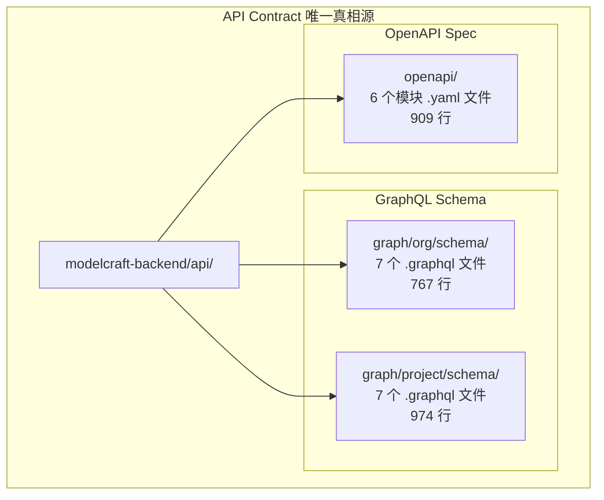
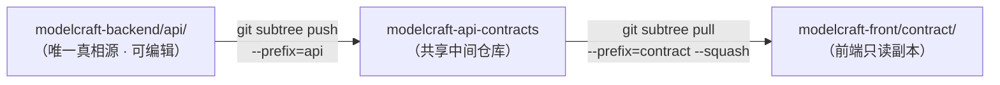
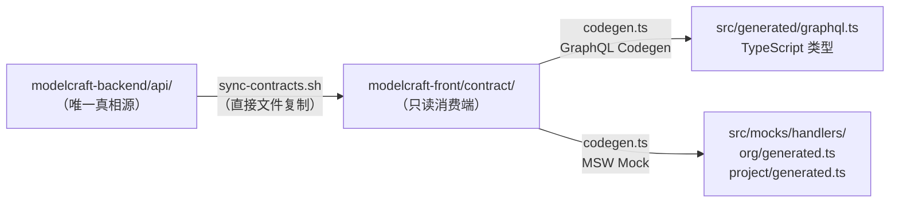
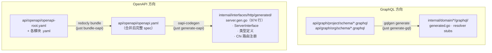
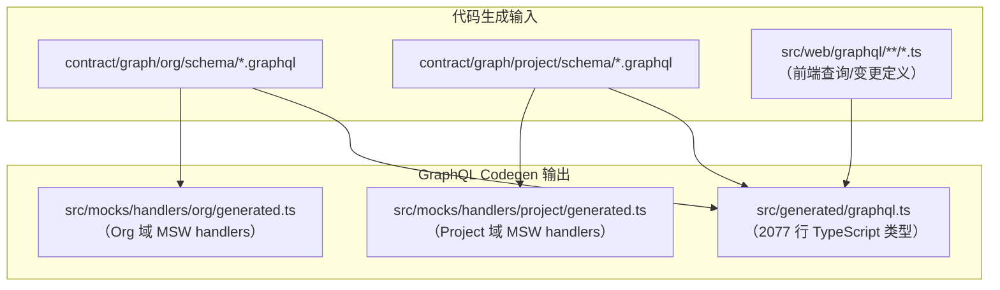
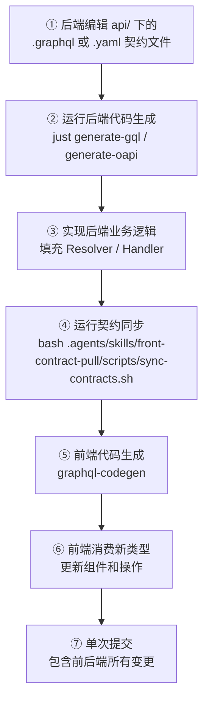

ModelCraft 的前后端协作建立在一个核心原则之上：**后端 `modelcraft-backend/api/` 目录是所有 API 契约的唯一真相源**。无论是 GraphQL Schema 还是 OpenAPI 规范，所有接口定义都首先在此目录中定义，然后通过同步机制传播到前端消费端。本文将深入解析契约的目录结构、同步机制的设计演进、当前实践的完整工作流，以及契约在整个代码生成流水线中的角色。

Sources: [modelcraft-backend/api/README.md](modelcraft-backend/api/README.md#L1-L9)

## 契约的两种形态：GraphQL 与 OpenAPI

ModelCraft 的 API 通道分为两大类，对应两种契约定义格式，共存于 `modelcraft-backend/api/` 目录下。**GraphQL 契约**服务于设计态的业务域操作（模型、字段、枚举、集群等），按领域划分为 `org/` 和 `project/` 两个子目录；**OpenAPI 契约**服务于认证与租户管理的 REST 端点（注册、登录、组织初始化、Webhook 回调等），采用模块化的 YAML 文件组织。



Sources: [modelcraft-backend/api/README.md](modelcraft-backend/api/README.md#L6-L9), [modelcraft-backend/api/openapi/openapi-root.yaml](modelcraft-backend/api/openapi/openapi-root.yaml#L1-L10)

### GraphQL Schema：双域分离架构

GraphQL 契约按**组织域（org）**和**项目域（project）**两个业务边界进行分离，每个域拥有独立的 `schema.graphql` 入口和一组按实体划分的 `.graphql` 文件：

| 域 | 目录 | 文件构成 | 核心实体 |
|---|---|---|---|
| **Org 域** | `graph/org/schema/` | `base.graphql`, `schema.graphql`, `project.graphql`, `profile.graphql`, `permission.graphql`, `user_management.graphql`, `api_key.graphql` | 项目管理、用户档案、权限控制、成员管理、API 密钥 |
| **Project 域** | `graph/project/schema/` | `base.graphql`, `schema.graphql`, `model.graphql`, `field.graphql`, `enum.graphql`, `cluster.graphql`, `logical_foreign_key.graphql` | 模型 CRUD、字段定义、枚举管理、集群状态、逻辑外键 |

每个 `base.graphql` 定义了域的公共基础设施——标量类型（`Int64`、`Date`、`Time`）、`Node` 接口（Relay 规范）、分页类型（`PageInfo`）以及权限指令（`@hasPermission`）。其他文件通过 `extend type Query` 和 `extend type Mutation` 扩展基础操作，实现**声明式权限控制**：每个 Query 和 Mutation 都标注了 `@hasPermission(action: "...")`，后端通过 Casbin RBAC 拦截器在运行时自动校验。

Sources: [modelcraft-backend/api/graph/project/schema/base.graphql](modelcraft-backend/api/graph/project/schema/base.graphql#L1-L32), [modelcraft-backend/api/graph/org/schema/base.graphql](modelcraft-backend/api/graph/org/schema/base.graphql#L1-L37), [modelcraft-backend/api/graph/project/schema/model.graphql](modelcraft-backend/api/graph/project/schema/model.graphql#L291-L314)

### OpenAPI Spec：模块化拼装模型

OpenAPI 契约采用**模块化拆分 + 根文件聚合**的模式。`openapi-root.yaml` 作为入口，通过 `$ref` 引用各领域模块；`common.yaml` 定义了跨模块共享的基础类型（`BaseResponse`、`SystemError`、`AuthenticationFailedError`、`UnauthorizedError`）和安全方案（`BearerAuth`）。

| 模块文件 | 覆盖范围 | 行数 |
|---------|---------|------|
| `openapi-root.yaml` | 主入口，聚合所有模块的 paths 和 schemas | 111 |
| `common.yaml` | 基础响应信封、分页、安全方案、通用错误类型 | 123 |
| `auth.yaml` | 认证端点：注册、登录、登出、刷新令牌 | 361 |
| `org.yaml` | 组织管理：初始化组织 | 120 |
| `user.yaml` | 用户端点：成员身份查询 | 82 |
| `webhook.yaml` | Webhook 回调：Casdoor 事件通知 | 114 |

模块间的引用遵循两条规则：**跨模块引用**使用 `$ref: "common.yaml#/schemas/..."` 访问共享类型；**同模块内部引用**使用 `$ref: "auth.yaml#/schemas/..."` 访问领域类型。路径引用使用 URL 编码转换斜杠（如 `/api/auth/register` → `~1api~1auth~1register`）。

Sources: [modelcraft-backend/api/openapi/README.md](modelcraft-backend/api/openapi/README.md#L1-L28), [modelcraft-backend/api/openapi/openapi-root.yaml](modelcraft-backend/api/openapi/openapi-root.yaml#L1-L54), [modelcraft-backend/api/openapi/common.yaml](modelcraft-backend/api/openapi/common.yaml#L1-L42)

## 同步机制设计：从 Git Subtree 到 Monorepo 脚本

项目的契约同步机制经历了一次重要的架构演进，这与仓库结构的变迁（详见 [Git 仓库结构：Submodule 与 Subtree 协作模型](3-git-cang-ku-jie-gou-submodule-yu-subtree-xie-zuo-mo-xing)）密切相关。

### 原始设计：Git Subtree 三方桥接

在前后端作为独立 Git 仓库的阶段，契约共享设计为基于 Git Subtree 的三方同步模型。后端仓库将 `api/` 子目录推送到共享中间仓库 `modelcraft-api-contracts`，前端仓库从同一中间仓库拉取到 `contract/` 子目录。这个设计的核心优势在于：两个独立仓库不直接依赖对方，通过共享仓库桥接，且双方的 Squash 策略可以不同——后端保留完整历史（`git subtree push --prefix=api contracts main`），前端使用 `--squash` 保持历史整洁。



| 角色 | Remote 名称 | Subtree 前缀 | Squash 策略 |
|------|-----------|-------------|-----------|
| 后端（生产者） | `contracts` | `api/` | 不使用（保留完整历史） |
| 前端（消费者） | `contracts` | `contract/` | 使用（保持前端历史整洁） |

Sources: [AGENTS.md](AGENTS.md#L49-L70)

### 当前实践：front-contract-pull 脚本

当项目转为 Monorepo 后，后端和前端代码已在同一仓库中，Git Subtree 的网络推送/拉取变得多余。项目引入了一个更轻量的替代方案——**`front-contract-pull` Skill**，它通过 Shell 脚本直接在文件系统层面完成契约同步：



同步脚本 [`sync-contracts.sh`](.agents/skills/front-contract-pull/scripts/sync-contracts.sh) 的执行逻辑非常清晰：

1. **自动检测仓库根目录**：从脚本所在目录向上遍历，找到同时包含 `modelcraft-front/` 和 `modelcraft-backend/` 的目录
2. **清除前端旧契约**：`rm -rf` 删除整个 `contract/` 目录，确保无残留
3. **全量复制后端契约**：复制 `api/graph/` 和 `api/openapi/` 到 `contract/`
4. **过滤后端专属文件**：移除前端不需要的生成产物和配置文件

Sources: [.agents/skills/front-contract-pull/SKILL.md](.agents/skills/front-contract-pull/SKILL.md#L14-L29), [.agents/skills/front-contract-pull/scripts/sync-contracts.sh](.agents/skills/front-contract-pull/scripts/sync-contracts.sh#L1-L61)

### 过滤策略：后端专属文件的排除

同步过程中，以下四类文件被明确排除，它们是后端代码生成流水线的专属产物或配置：

| 被过滤文件 | 过滤原因 | 后端用途 |
|-----------|---------|---------|
| `openapi/openapi.yaml` | 生成产物 | `redocly bundle` 合并后的完整 spec，后端 `oapi-codegen` 的输入 |
| `openapi/oapi-codegen.yaml` | Go 代码生成配置 | 指定 Go 包名、输出路径（`internal/interfaces/http/generated/server.gen.go`）、生成选项 |
| `openapi/examples/` | 示例数据 | 请求/响应示例 JSON，仅供后端文档参考 |
| `openapi/README.md` | 后端维护文档 | OpenAPI 规范的维护指南和端点添加流程 |

过滤后的前端契约目录保持纯净，只包含前端代码生成所需的 GraphQL Schema 和 OpenAPI 模块文件。这种**全量清除 + 选择性过滤**的策略，比增量同步更可靠——它避免了因残留文件导致的隐蔽性 Bug。

Sources: [.agents/skills/front-contract-pull/scripts/sync-contracts.sh](.agents/skills/front-contract-pull/scripts/sync-contracts.sh#L49-L54), [.agents/skills/front-contract-pull/SKILL.md](.agents/skills/front-contract-pull/SKILL.md#L26-L29)

### 两种方案的本质对比

| 维度 | Git Subtree 方案 | front-contract-pull 脚本 |
|------|----------------|------------------------|
| **适用仓库结构** | 多仓库（独立 Git 仓库） | Monorepo（统一仓库） |
| **同步机制** | 通过共享中间仓库桥接 | 直接文件系统复制 |
| **网络依赖** | 需要访问共享 Git 远程仓库 | 无需网络，纯本地操作 |
| **一致性保证** | Git 提交哈希严格保证 | 脚本执行后需 `git diff` 人工验证 |
| **历史追溯** | 契约变更保留独立 Git 历史 | 契约变更随主仓库提交记录 |
| **执行速度** | 慢（涉及网络传输和 Git 合并） | 快（本地文件操作，秒级完成） |

两种方案并非互斥关系。如果项目未来恢复多仓库模式（例如前后端团队独立部署），可以无缝切换回 Subtree 方案，脚本方案作为 Monorepo 下的轻量替代。

Sources: [AGENTS.md](AGENTS.md#L49-L70), [.agents/skills/front-contract-pull/SKILL.md](.agents/skills/front-contract-pull/SKILL.md#L1-L52)

## 契约到代码：双向代码生成流水线

契约同步完成后，它们分别驱动后端和前端各自的代码生成工具，形成一条完整的"**契约 → 实现**"流水线。详细机制将在 [GraphQL Codegen 与 oapi-codegen 代码生成流水线](19-graphql-codegen-yu-oapi-codegen-dai-ma-sheng-cheng-liu-shui-xian) 中深入讲解，此处概述其在契约同步上下文中的角色。

### 后端流水线：gqlgen + oapi-codegen

后端从契约文件生成服务端骨架代码，开发者在此基础上填充业务逻辑：



**GraphQL 方向**：`just generate-gql` 调用 `gqlgen`，根据 `.graphql` 文件生成 Resolver 接口和类型绑定的 Go 代码。开发者只需在 Resolver 中实现业务逻辑，不需要手动定义请求/响应结构体。

**OpenAPI 方向**：两步生成。首先 `just bundle-oapi` 使用 `redocly` 将模块化 YAML 合并为单个 `openapi.yaml`；然后 `just generate-oapi` 调用 `oapi-codegen`（配置在 `oapi-codegen.yaml` 中），生成 Chi 路由器接口（`ServerInterface`）、请求/响应类型和嵌入式 spec，输出到 [`server.gen.go`](modelcraft-backend/internal/interfaces/http/generated/server.gen.go)。

Sources: [modelcraft-backend/justfile](modelcraft-backend/justfile#L293-L315), [modelcraft-backend/api/openapi/oapi-codegen.yaml](modelcraft-backend/api/openapi/oapi-codegen.yaml#L1-L9), [modelcraft-backend/api/openapi/README.md](modelcraft-backend/api/openapi/README.md#L143-L158)

### 前端流水线：GraphQL Codegen + MSW

前端从同步到 `contract/` 的契约文件生成 TypeScript 类型和 MSW（Mock Service Worker）模拟处理器：



[`codegen.ts`](modelcraft-front/codegen.ts) 是前端代码生成的配置中心，定义了三个生成目标：

| 生成目标 | 输入 | 插件组合 | 产出 |
|---------|------|---------|------|
| TypeScript 类型 | 双域 schema + `src/web/graphql/**/*.ts` | `typescript` + `typescript-operations` | `src/generated/graphql.ts` |
| Org 域 MSW Mock | `contract/graph/org/schema/*.graphql` + 操作文件 | `typescript` + `typescript-operations` + `typescript-msw` | `src/mocks/handlers/org/generated.ts` |
| Project 域 MSW Mock | `contract/graph/project/schema/*.graphql` + 操作文件 | `typescript` + `typescript-operations` + `typescript-msw` | `src/mocks/handlers/project/generated.ts` |

关键配置细节：`enumsAsTypes: true` 将 GraphQL 枚举映射为 TypeScript 字符串字面量联合类型；`scalars` 映射将 `DateTime` 和 `ID` 统一为 `string`；`skipValidationAgainstSchema: true` 跳过编译期校验，避免开发阶段因未同步的 schema 报错。

Sources: [modelcraft-front/codegen.ts](modelcraft-front/codegen.ts#L1-L55)

## 完整工作流：一次 API 变更的旅程

将上述所有机制串联起来，一次典型的 API 变更遵循"**先改契约、再改实现**"的完整流程：



具体命令序列：

```bash
# ① 编辑后端契约（唯一的修改入口）
vim modelcraft-backend/api/graph/project/schema/model.graphql

# ② 生成后端代码骨架
cd modelcraft-backend && just generate-gql

# ③ 实现 Resolver 业务逻辑（略）

# ④ 同步契约到前端
bash .agents/skills/front-contract-pull/scripts/sync-contracts.sh

# ⑤ 前端代码生成
cd modelcraft-front && npx graphql-codegen

# ⑥ 更新前端组件和操作文件（略）

# ⑦ 统一提交
cd .. && git add modelcraft-backend/ modelcraft-front/
git commit -m "feat: add new model fields (contract → backend → frontend)"
```

Sources: [modelcraft-backend/api/README.md](modelcraft-backend/api/README.md#L12-L24), [.agents/skills/front-contract-pull/SKILL.md](.agents/skills/front-contract-pull/SKILL.md#L33-L36)

### 约束与红线

这套机制依赖于三条不可违反的规则，它们被写入 [AGENTS.md](AGENTS.md) 和 [API README](modelcraft-backend/api/README.md)：

| 规则 | 含义 | 违反后果 |
|------|------|---------|
| **后端 `api/` 是唯一真相源** | 所有 API 契约变更只能从后端发起 | 前端契约与后端实现出现不一致 |
| **前端禁止直接修改 `contract/`** | 前端契约目录是只读的，必须通过同步机制获取 | 下次同步覆盖手动修改，丢失变更 |
| **先 push 再 pull**（Subtree 阶段）/ **先改后端再同步**（Monorepo 阶段） | 后端必须先完成契约变更，前端才能同步 | 前端基于过时契约生成代码，编译或运行时报错 |

Sources: [AGENTS.md](AGENTS.md#L82-L86), [modelcraft-backend/api/README.md](modelcraft-backend/api/README.md#L20-L25)

## 契约文件的领域覆盖全景

截至当前版本，`modelcraft-backend/api/` 中的契约文件共计 **2650 行**（1741 行 GraphQL + 909 行 OpenAPI），覆盖了 ModelCraft 平台的全部业务域。以下是完整的文件清单与统计：

### GraphQL Schema 文件清单

| 域 | 文件 | 行数 | 核心定义 |
|---|---|---|---|
| Org | `base.graphql` | 36 | 基础标量、Node 接口、分页类型、Error 接口 |
| Org | `schema.graphql` | 4 | Query/Mutation 入口 |
| Org | `project.graphql` | 265 | 项目 CRUD、项目成员管理 |
| Org | `profile.graphql` | 82 | 用户档案读写 |
| Org | `permission.graphql` | 145 | RBAC 角色与权限管理 |
| Org | `user_management.graphql` | 168 | 组织成员邀请、移除、角色变更 |
| Org | `api_key.graphql` | 67 | API 密钥创建与吊销 |
| Project | `base.graphql` | 31 | 基础标量、Node 接口、分页、@hasPermission 指令 |
| Project | `schema.graphql` | 4 | Query/Mutation 入口 |
| Project | `model.graphql` | 314 | 模型 CRUD、分组、修复、JSON Schema 导出、模型导入 |
| Project | `field.graphql` | 214 | 字段 CRUD、验证配置、排序 |
| Project | `enum.graphql` | 124 | 枚举 CRUD、选项管理 |
| Project | `cluster.graphql` | 208 | 数据库集群管理、连接测试 |
| Project | `logical_foreign_key.graphql` | 79 | 逻辑外键/关联关系定义 |

### OpenAPI 模块文件清单

| 文件 | 行数 | 覆盖端点 |
|------|------|---------|
| `common.yaml` | 123 | 共享 schema：BaseResponse、分页、错误类型、BearerAuth 安全方案 |
| `auth.yaml` | 361 | POST `/api/auth/register`、`/api/auth/login`、`/api/auth/logout`、`/api/auth/refresh` |
| `org.yaml` | 120 | POST `/api/org/init` |
| `user.yaml` | 82 | GET `/api/user/memberships` |
| `webhook.yaml` | 114 | POST `/api/webhook/casdoor` |
| `openapi-root.yaml` | 111 | 聚合入口，引用所有模块的 paths 和 schemas |

Sources: [modelcraft-backend/api/graph/project/schema/model.graphql](modelcraft-backend/api/graph/project/schema/model.graphql#L1-L315), [modelcraft-backend/api/openapi/openapi-root.yaml](modelcraft-backend/api/openapi/openapi-root.yaml#L1-L111)

---

**延伸阅读**：
- 了解代码生成工具的详细配置和自定义选项：[GraphQL Codegen 与 oapi-codegen 代码生成流水线](19-graphql-codegen-yu-oapi-codegen-dai-ma-sheng-cheng-liu-shui-xian)
- 了解仓库结构的演进历史和 Git Submodule/Subtree 概念：[Git 仓库结构：Submodule 与 Subtree 协作模型](3-git-cang-ku-jie-gou-submodule-yu-subtree-xie-zuo-mo-xing)
- 了解前端如何使用三种 Apollo Client 实例消费这些契约：[三种 Apollo Client 实例策略与 GraphQL 操作层约定](13-san-chong-apollo-client-shi-li-ce-lue-yu-graphql-cao-zuo-ceng-yue-ding)
- 了解三大 API 通道的整体设计：[三大 API 通道：设计态 GraphQL、REST、运行时动态 GraphQL](7-san-da-api-tong-dao-she-ji-tai-graphql-rest-yun-xing-shi-dong-tai-graphql)