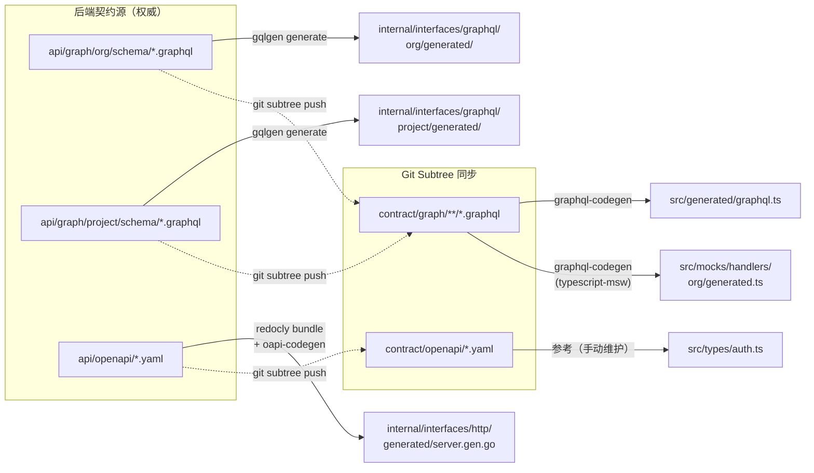
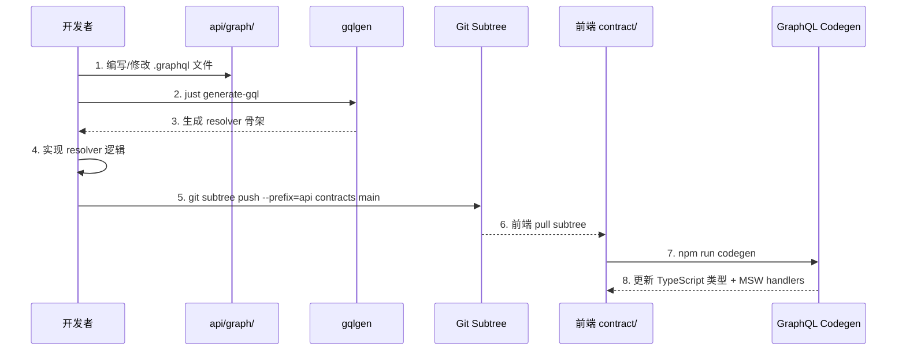

ModelCraft 采用 **Contract-First** 开发模式，将 API 定义（GraphQL Schema / OpenAPI YAML）作为团队协作的单一真相源。后端与前端的代码生成工具链分别从这份契约自动产出类型安全的骨架代码——后端使用 **gqlgen** 生成 GraphQL resolver 接口与模型，使用 **oapi-codegen** 生成 REST 路由与请求/响应结构体；前端使用 **GraphQL Codegen** 生成 TypeScript 类型、操作层和 MSW mock handler。整个流水线的核心目标是：**一次契约变更，两端自动同步**，消除手动维护类型映射带来的漂移风险。

Sources: [api/README.md](modelcraft-backend/api/README.md#L1-L31), [codegen.ts](modelcraft-front/codegen.ts#L1-L55), [oapi-codegen.yaml](modelcraft-backend/api/openapi/oapi-codegen.yaml#L1-L9)

## 整体架构：从契约到代码的闭环

整个代码生成体系围绕 `api/` 目录下的契约文件展开。后端仓库持有权威契约，前端通过 Git Subtree 同步到 `contract/` 目录。两端的代码生成工具各自读取契约，输出到约定位置。



后端开发者修改 `api/` 下的契约文件后，执行 `just generate-gql` 和 `just generate-oapi` 触发后端代码生成；前端开发者通过 `front-contract-pull` 技能同步最新契约到 `contract/`，然后执行 `npm run codegen` 生成前端类型。

Sources: [api/README.md](modelcraft-backend/api/README.md#L17-L29), [justfile](modelcraft-backend/justfile#L296-L314), [package.json](modelcraft-front/package.json#L10-L11)

## 后端代码生成：gqlgen 与 oapi-codegen

### gqlgen：GraphQL Schema → Go Resolver 骨架

后端维护两套独立的 GraphQL 域，各自拥有独立的 gqlgen 配置文件和生成目录：

| 配置项 | Org 域 | Project 域 |
|--------|--------|------------|
| 配置文件 | `gqlgen.org.yml` | `gqlgen.project.yml` |
| Schema 来源 | `api/graph/org/schema/*.graphql` | `api/graph/project/schema/*.graphql` |
| Exec 生成 | `internal/interfaces/graphql/org/generated/generated.go` | `internal/interfaces/graphql/project/generated/generated.go` |
| Model 生成 | `internal/interfaces/graphql/org/generated/model_gen.go` | `internal/interfaces/graphql/project/generated/model_gen.go` |
| Resolver 包 | `orggraphql` | `projectgraphql` |
| Resolver 目录 | `internal/interfaces/graphql/org/` | `internal/interfaces/graphql/project/` |

执行命令：`just generate-gql`，内部调用 `go run github.com/99designs/gqlgen generate`。gqlgen 会为每个域生成两个核心文件：**`generated.go`**（执行引擎，包含 `NewExecutableSchema`、类型解析、字段收集器等，约 1.9 万～2.4 万行）和 **`model_gen.go`**（Go 类型定义与接口，包含所有 GraphQL 类型对应的 Go struct，约 1 千～1.5 千行）。开发者需要实现 `ResolverRoot` 接口中定义的 resolver 方法，gqlgen 会在 resolver 目录下生成存根文件（如 `model.resolvers.go`、`cluster.resolvers.go`）。

Sources: [gqlgen.org.yml](modelcraft-backend/gqlgen.org.yml#L1-L35), [gqlgen.project.yml](modelcraft-backend/gqlgen.project.yml#L1-L37), [generated.go](modelcraft-backend/internal/interfaces/graphql/org/generated/generated.go#L1-L30), [model_gen.go](modelcraft-backend/internal/interfaces/graphql/org/generated/model_gen.go#L1-L50), [resolver.go](modelcraft-backend/internal/interfaces/graphql/org/resolver.go#L1-L34), [justfile](modelcraft-backend/justfile#L296-L300)

### oapi-codegen：OpenAPI YAML → Chi 路由 + Go 结构体

REST API（认证、组织初始化、Webhook 等）使用 OpenAPI 3.0 规范，通过 **oapi-codegen** 生成 Go 代码。整个流程分两步：

**第一步：模块合并。** OpenAPI 规范采用模块化拆分——`openapi-root.yaml` 为主入口，通过 `$ref` 引用 `auth.yaml`、`org.yaml`、`user.yaml`、`webhook.yaml`、`common.yaml` 等子模块。`redocly bundle` 命令将所有子模块合并为单个 `openapi.yaml` 文件。路径引用使用 URL 编码格式（如 `/api/auth/login` → `~1api~1auth~1login`）。

**第二步：代码生成。** `oapi-codegen` 读取合并后的 `openapi.yaml`，根据 `oapi-codegen.yaml` 配置输出到 `internal/interfaces/http/generated/server.gen.go`（约 974 行）。该文件包含：
- **`ServerInterface`**：所有 REST handler 的接口定义（Login、Register、RefreshToken、InitOrganization 等）
- **Models**：所有请求/响应结构体（如 `LoginRequest`、`LoginResponse`、`RegisterRequest`）
- **`HandlerWithOptions`**：基于 Chi 路由的 HTTP handler 注册函数
- **`Unimplemented`**：返回 501 的默认实现，方便渐进式开发

Sources: [oapi-codegen.yaml](modelcraft-backend/api/openapi/oapi-codegen.yaml#L1-L9), [openapi-root.yaml](modelcraft-backend/api/openapi/openapi-root.yaml#L1-L111), [server.gen.go](modelcraft-backend/internal/interfaces/http/generated/server.gen.go#L1-L60), [server.gen.go](modelcraft-backend/internal/interfaces/http/generated/server.gen.go#L521-L555), [openapi/README.md](modelcraft-backend/api/openapi/README.md#L65-L82), [justfile](modelcraft-backend/justfile#L303-L314)

## 前端代码生成：GraphQL Codegen

### 配置文件解析

前端通过 [`codegen.ts`](modelcraft-front/codegen.ts) 配置 GraphQL Codegen，生成三个输出目标：

| 输出文件 | 用途 | Schema 来源 | 插件组合 |
|----------|------|-------------|----------|
| `src/generated/graphql.ts` | **TypeScript 类型全集**（约 2078 行） | org + project 全量 schema | `typescript` + `typescript-operations` |
| `src/mocks/handlers/org/generated.ts` | **Org 域 MSW mock handler**（约 3122 行） | 仅 org schema | `typescript` + `typescript-operations` + `typescript-msw` |
| `src/mocks/handlers/project/generated.ts` | **Project 域 MSW mock handler**（约 3122 行） | 仅 project schema | `typescript` + `typescript-operations` + `typescript-msw` |

关键配置细节：
- **`documents`** 指向 `src/web/graphql/**/*.ts`，即前端编写的 GraphQL 操作文件（queries 和 mutations）
- **`enumsAsTypes: true`** 将 GraphQL enum 直接映射为 TypeScript 联合类型而非枚举对象
- **标量映射**：`DateTime` → `string`、`ID` → `string`
- **`skipValidationAgainstSchema: true`** 跳过文档验证，支持在 schema 未完全同步时仍能生成

Sources: [codegen.ts](modelcraft-front/codegen.ts#L1-L55), [graphql.ts](modelcraft-front/src/generated/graphql.ts#L1-L80)

### 操作文件组织

前端 GraphQL 操作按领域和操作类型组织在 `src/web/graphql/` 目录下：

```
src/web/graphql/
├── queries/           # 查询操作
│   ├── model.ts       # 模型查询（GetModels, GetModel, GetModelByName 等）
│   ├── cluster.ts     # 集群查询
│   ├── enum.ts        # 枚举查询
│   ├── project.ts     # 项目查询
│   ├── profile.ts     # 用户档案查询
│   ├── user.ts        # 用户管理查询
│   └── index.ts       # 统一导出
├── mutations/         # 变更操作
│   ├── model.ts       # 模型变更（CreateModel, UpdateModelMeta, DeleteModel 等）
│   ├── cluster.ts     # 集群变更
│   ├── enum.ts        # 枚举变更
│   ├── project.ts     # 项目变更
│   ├── profile.ts     # 用户档案变更
│   ├── user.ts        # 用户管理变更
│   └── index.ts       # 统一导出
├── noop.ts            # 占位操作（NoopQuery, NoopMutation）
└── index.ts           # 顶层统一导出
```

每个操作文件使用 `gql` 模板标签编写 GraphQL 文档字符串，包含完整的字段选择集和错误联合类型内联片段。Codegen 读取这些文档后，为每个操作生成精确的 TypeScript 输入/输出类型（如 `GetModelsQuery`、`CreateModelMutation`）。

Sources: [queries/model.ts](modelcraft-front/src/web/graphql/queries/model.ts#L1-L200), [mutations/model.ts](modelcraft-front/src/web/graphql/mutations/model.ts#L1-L200), [noop.ts](modelcraft-front/src/web/graphql/noop.ts#L1-L14), [index.ts](modelcraft-front/src/web/graphql/index.ts#L1-L5)

### MSW Mock Handler 自动生成

`typescript-msw` 插件为每个 GraphQL 操作生成对应的 MSW (Mock Service Worker) handler 类型定义。`src/mocks/handlers/org/generated.ts` 和 `project/generated.ts` 分别包含 org 域和 project 域的 mock handler 工厂函数。这些文件头部标注"禁止手动编辑，由 codegen 生成"。

当前 `src/mocks/handlers/index.ts` 中的 profile handler 仍为手动编写，包含场景路由逻辑（通过 `x-mock-profile-scenario` 请求头切换成功/失败场景）。注释中标记了 TODO：待 contract 同步完成后接入自动生成的 handlers。

Sources: [org/generated.ts](modelcraft-front/src/mocks/handlers/org/generated.ts#L1-L50), [handlers/index.ts](modelcraft-front/src/mocks/handlers/index.ts#L1-L91)

## 契约同步与变更流程

### 新增 GraphQL 端点的完整流程



### 新增 REST 端点的完整流程

1. 在对应模块文件（如 `org.yaml`）中定义路径和 Schema
2. 在 `openapi-root.yaml` 中添加路径引用（注意 URL 编码：`/` → `~1`）
3. 执行 `just generate-oapi`（先 bundle 再 oapi-codegen）
4. 实现 `ServerInterface` 中新增的 handler 方法

Sources: [openapi/README.md](modelcraft-backend/api/openapi/README.md#L35-L100), [justfile](modelcraft-backend/justfile#L303-L314)

## 工具链依赖与版本管理

后端通过 `tools/tools.go` 的 `//go:build tools` 构建标签管理代码生成工具依赖，确保 `go mod tidy` 不会误删这些仅在开发时使用的依赖：

Sources: [tools.go](modelcraft-backend/tools/tools.go#L1-L13)

前端通过 `devDependencies` 管理代码生成相关包：

| 包名 | 版本 | 用途 |
|------|------|------|
| `@graphql-codegen/cli` | ^6.2.1 | Codegen CLI 核心 |
| `@graphql-codegen/typescript` | ^5.0.9 | TypeScript 类型生成插件 |
| `@graphql-codegen/typescript-operations` | ^5.0.9 | 操作层类型生成插件 |
| `@graphql-codegen/typescript-msw` | ^4.0.0 | MSW handler 生成插件 |
| `msw` | ^2.13.1 | Mock Service Worker 运行时 |
| `graphql` | ^16.8.0 | GraphQL 核心库 |

Sources: [package.json](modelcraft-front/package.json#L79-L93), [package.json](modelcraft-front/package.json#L36-L38)

## 生成产物总览

| 端 | 工具 | 契约输入 | 生成产物 | 行数 |
|----|------|----------|----------|------|
| 后端 GraphQL (Org) | gqlgen | `api/graph/org/schema/*.graphql` (6 文件) | `org/generated/generated.go` + `model_gen.go` | ~20,560 |
| 后端 GraphQL (Project) | gqlgen | `api/graph/project/schema/*.graphql` (7 文件) | `project/generated/generated.go` + `model_gen.go` | ~25,525 |
| 后端 REST | oapi-codegen | `api/openapi/openapi.yaml` (5 模块合并) | `generated/server.gen.go` | ~974 |
| 前端类型 | GraphQL Codegen | `contract/graph/**/*.graphql` + `src/web/graphql/**/*.ts` | `src/generated/graphql.ts` | ~2,078 |
| 前端 MSW (Org) | GraphQL Codegen | `contract/graph/org/schema/*.graphql` | `src/mocks/handlers/org/generated.ts` | ~3,122 |
| 前端 MSW (Project) | GraphQL Codegen | `contract/graph/project/schema/*.graphql` | `src/mocks/handlers/project/generated.ts` | ~3,122 |

Sources: [api/README.md](modelcraft-backend/api/README.md#L1-L31)

## 关键设计决策

**为什么前端不使用 oapi-codegen 生成 REST 类型？** 当前前端的 REST API 类型（如认证相关的 `GoLoginResponse`、`LoginRequest`）在 `src/types/auth.ts` 中手动维护。这是因为 REST 端点数量有限（仅认证/组织/用户管理），且 BFF 层对原始 OpenAPI Schema 做了大量字段重映射和转换，自动生成的类型无法直接使用。相比之下，GraphQL 操作数量大且变更频繁，自动生成的收益远高于维护成本。

**为什么 MSW handler 分域生成？** Org 域和 Project 域的 GraphQL endpoint 不同（`/org/{orgName}/design/graphql` vs `/graphql`），MSW 需要按 endpoint 粒度注册 handler。分域生成避免了类型交叉污染，同时允许各域独立控制 mock 数据。

**为什么所有生成产物都提交到 Git？** 虽然这些文件可以随时重新生成，但提交到版本库有两大好处：一是 CI/CD 不需要额外安装代码生成工具；二是 Code Review 时可以直观看到契约变更对生成代码的影响范围，确保实现与契约一致。

Sources: [types/auth.ts](modelcraft-front/src/types/auth.ts#L1-L40), [handlers/index.ts](modelcraft-front/src/mocks/handlers/index.ts#L1-L91), [openapi/README.md](modelcraft-backend/api/openapi/README.md#L270-L272)

---

**延伸阅读**：
- 了解契约同步机制：[API Contract 单一真相源：Git Subtree 同步机制](18-api-contract-dan-zhen-xiang-yuan-git-subtree-tong-bu-ji-zhi)
- 了解后端代码生成如何使用：[三大 API 通道：设计态 GraphQL、REST、运行时动态 GraphQL](7-san-da-api-tong-dao-she-ji-tai-graphql-rest-yun-xing-shi-dong-tai-graphql)
- 了解前端如何消费生成类型：[三种 Apollo Client 实例策略与 GraphQL 操作层约定](13-san-chong-apollo-client-shi-li-ce-lue-yu-graphql-cao-zuo-ceng-yue-ding)