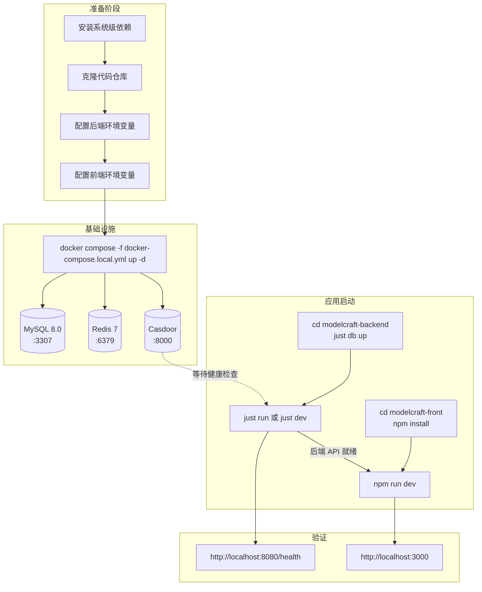

本文档是 ModelCraft 平台的**环境搭建与本地运行指南**，涵盖从零开始准备开发环境、启动基础设施服务、运行前后端应用、到验证服务健康状态的全流程。无论你是新加入团队的成员，还是需要在全新机器上搭建环境的开发者，按照本页步骤操作即可在本地跑通完整的 ModelCraft 开发环境。

Sources: [README.md](modelcraft-backend/README.md#L1-L27), [README.md](modelcraft-front/README.md#L1-L70)

## 技术栈总览

ModelCraft 采用**前后端分离 + 容器化基础设施**的架构。后端基于 Go 语言构建，提供 GraphQL + REST 双通道 API；前端基于 Next.js 14 构建，通过 BFF 层代理后端服务；基础设施（MySQL、Redis、Casdoor 认证）通过 Docker Compose 一键拉起。

| 层级 | 技术选型 | 版本要求 | 端口 |
|------|---------|---------|------|
| **后端运行时** | Go | 1.25.1 | 8080 |
| **前端运行时** | Node.js | ≥ 18（推荐 20） | 3000 |
| **数据库** | MySQL | 8.0 | 3307（本地）/ 3306（Docker 内部） |
| **缓存** | Redis | 7 Alpine | 6379 |
| **认证服务** | Casdoor | latest | 8000 |
| **测试工具** | Python | 3.9+ | — |
| **任务运行器** | Just | latest | — |

Sources: [.go-version](modelcraft-backend/.go-version#L1-L1), [.nvmrc](modelcraft-backend/.nvmrc#L1-L1), [.python-version](modelcraft-backend/.python-version#L1-L1), [docker-compose.local.yml](modelcraft-backend/docker-compose.local.yml#L1-L30)

### 整体启动流程

下面这张流程图展示了从环境准备到全栈运行的完整步骤和依赖关系：



Sources: [docker-compose.local.yml](modelcraft-backend/docker-compose.local.yml#L1-L107), [justfile](modelcraft-backend/justfile#L577-L644), [package.json](modelcraft-front/package.json#L1-L13)

## 前置依赖安装

在启动项目之前，你的开发机器上需要安装以下工具。macOS 开发者推荐使用 Homebrew 安装。

### 系统级依赖清单

| 工具 | 用途 | 安装方式（macOS） | 验证命令 |
|------|------|------------------|---------|
| **Go** | 后端编译运行 | `brew install go` 或 [官方下载](https://go.dev/dl/) | `go version` |
| **Node.js** | 前端运行 & 工具链 | `nvm install 20 && nvm use 20` | `node -v` |
| **Docker Desktop** | 容器化基础设施 | [官方下载](https://www.docker.com/products/docker-desktop/) | `docker --version` |
| **Just** | 任务运行器（替代 Make） | `brew install just` | `just --version` |
| **Atlas** | 数据库 Schema 迁移工具 | `curl -sSf https://atlasgo.sh \| sh` | `atlas version` |
| **MySQL Client** | 数据库连接（可选） | `brew install mysql-client` | `mysql --version` |

> **提示**：Just 是一个比 Make 更简洁的任务运行器，ModelCraft 后端的所有构建、运行、测试命令都通过 Just 管理。安装后可通过 `just --list` 查看所有可用命令。
> 
> **关于 Air**：如果你希望后端支持热重载开发（修改代码自动重启），需要额外安装 Air：`go install github.com/air-verse/air@latest`。

Sources: [justfile](modelcraft-backend/justfile#L1-L11), [.air.toml](modelcraft-backend/.air.toml#L1-L18), [.go-version](modelcraft-backend/.go-version#L1-L1)

## 后端环境配置

### 步骤 1：克隆仓库并进入后端目录

```bash
git clone <repository-url> modelcraft
cd modelcraft/modelcraft-backend
```

### 步骤 2：创建环境变量文件

后端配置采用**三层优先级**机制：系统环境变量 > `.env` 文件 > `config.yaml` 默认值。开发环境推荐使用 `.env` 文件方式。

```bash
# 方式 A：复制开发环境模板
cp .env.dev.example .env

# 方式 B：使用 Just 命令管理（推荐）
just env-switch dev create=true
```

项目提供了几个关键的环境变量模板：

| 模板文件 | 用途 |
|---------|------|
| `.env.dev.example` | 本地开发环境模板（端口 3307、Casdoor 配置） |
| `.env.docker.example` | Docker 容器化部署模板 |
| `.env.autotest.example` | 自动化测试模板 |

Sources: [.env.dev.example](modelcraft-backend/.env.dev.example#L1-L25), [.env.docker.example](modelcraft-backend/.env.docker.example#L1-L107), [justfile](modelcraft-backend/justfile#L989-L1008), [configs/config.yaml](modelcraft-backend/configs/config.yaml#L1-L110)

### 步骤 3：理解核心环境变量

以下是 `.env` 文件中**必须配置**的核心变量：

```bash
# AES-256 加密密钥（必须恰好 32 字节）
CRYPTO_AES_KEY=12345678901234567890123456789012

# 数据库连接（本地开发用 3307 端口，避免与系统 MySQL 冲突）
DB_USER=root
DB_PASSWORD=modelcraft123
DB_HOST=127.0.0.1
DB_PORT=3307
DB_NAME=modelcraft

# Casdoor OAuth 客户端凭据
CASDOOR_CLIENT_ID=<your-client-id>
CASDOOR_CLIENT_SECRET=<your-client-secret>

# 认证开关（开发环境可关闭）
AUTH_DESIGN_ENABLED=true
AUTH_SKIP_JWT_VALIDATION=false
```

Sources: [.env.dev](modelcraft-backend/.env.dev#L1-L25), [configs/config.yaml](modelcraft-backend/configs/config.yaml#L6-L22)

### 步骤 4：配置文件结构

后端配置通过 `configs/config.yaml` 提供默认值，敏感信息通过环境变量覆盖。关键配置项包括：

| 配置区块 | 覆盖方式 | 说明 |
|---------|---------|------|
| `server` | 环境变量 `PORT`、`GIN_MODE` | 服务端口和运行模式 |
| `database` | 环境变量 `DB_HOST`、`DB_PORT` 等 | MySQL 连接信息 |
| `redis` | 环境变量 `REDIS_HOST` 等 | Redis 连接信息 |
| `jwt` | 环境变量 `JWT_SECRET` | JWT 签名密钥 |
| `auth` | 环境变量 `AUTH_DESIGN_ENABLED` 等 | 认证开关和 Casdoor 配置 |
| `crypto` | 环境变量 `CRYPTO_AES_KEY` | AES 加密密钥（32 字节） |

Sources: [configs/config.yaml](modelcraft-backend/configs/config.yaml#L1-L110)

## 前端环境配置

### 步骤 1：进入前端目录

```bash
cd modelcraft/modelcraft-front
```

### 步骤 2：安装依赖

```bash
npm install
```

### 步骤 3：配置前端环境变量

前端 `.env` 文件控制后端 API 代理地址和 Casdoor OAuth 参数：

```bash
# 后端 API 地址（被 next.config.mjs 中的 rewrites 使用）
BACKEND_URL=http://localhost:8080

# BFF Auth（新架构，用于服务端 API 调用）
GO_BACKEND_INTERNAL_URL=http://localhost:8080
JWT_SECRET=modelcraft_dev_secret_please_change_in_production

# Casdoor OAuth 配置
NEXT_PUBLIC_CASDOOR_URL=http://localhost:8000
NEXT_PUBLIC_CASDOOR_CLIENT_ID=<your-client-id>
NEXT_PUBLIC_CASDOOR_ORGANIZATION=built-in
NEXT_PUBLIC_CASDOOR_APP_NAME=modelcraft
CASDOOR_CLIENT_SECRET=<your-client-secret>
NEXT_PUBLIC_CASDOOR_REDIRECT_URI=http://localhost:3000/auth/callback

# Mock 开关：启用 MSW mock；留空或删除 = 使用真实后端
# NEXT_PUBLIC_API_MOCKING=enabled
```

> **关键点**：`BACKEND_URL` 决定了前端 Next.js 的 API 代理目标。前端的 `next.config.mjs` 中配置了 rewrites 规则，将 `/api/auth/*`、`/org/:orgName/design/*`、`/graphql/org/:orgName/*` 等路径的请求代理到后端 8080 端口。如果前后端在同一台机器上开发，保持默认值即可。

Sources: [.env](modelcraft-front/.env#L1-L19), [.env.development](modelcraft-front/.env.development#L1-L11), [next.config.mjs](modelcraft-front/next.config.mjs#L84-L132)

## 启动基础设施服务

ModelCraft 使用 Docker Compose 管理本地开发所需的三方服务（MySQL、Redis、Casdoor）。**应用本身以原生方式运行**，不放入容器。

### 启动命令

```bash
cd modelcraft/modelcraft-backend

# 启动所有基础设施服务
docker compose -f docker-compose.local.yml up -d

# 或者使用 Just 命令（等价）
just deploy-infra start
```

### 基础设施服务清单

| 服务 | 容器名 | 镜像 | 端口映射 | 说明 |
|------|--------|------|---------|------|
| **MySQL** | `modelcraft-mysql-local` | `mysql:8.0` | `3307:3306` | 端口 3307 避免与系统 MySQL 冲突 |
| **Redis** | `modelcraft-redis-local` | `redis:7-alpine` | `6379:6379` | 带 AOF 持久化 |
| **Casdoor** | `casdoor-local` | `casbin/casdoor:latest` | `8000:8000` | 依赖 MySQL 健康检查通过后启动 |
| **phpMyAdmin** | `modelcraft-phpmyadmin-local` | `phpmyadmin/phpmyadmin` | `8081:80` | 可选工具，需 `--profile tools` 激活 |

### 验证服务健康

```bash
# 查看所有服务状态
docker compose -f docker-compose.local.yml ps

# 预期输出（所有服务 healthy）：
# modelcraft-mysql-local   running (healthy)
# modelcraft-redis-local   running (healthy)
# casdoor-local            running (healthy)
```

> **注意事项**：
> - MySQL 首次启动时会自动执行 `db/schema/mysql/` 目录下的 SQL 初始化脚本
> - Casdoor 配置文件位于 `casdoor/conf/app.conf`，连接的 MySQL 地址为 Docker 网络内的 `modelcraft-mysql-local:3306`
> - 如需启动 phpMyAdmin：`docker compose -f docker-compose.local.yml --profile tools up -d`

Sources: [docker-compose.local.yml](modelcraft-backend/docker-compose.local.yml#L1-L107), [casdoor/conf/app.conf](modelcraft-backend/casdoor/conf/app.conf#L1-L29), [justfile](modelcraft-backend/justfile#L577-L644)

### 数据库 Schema 初始化

基础设施启动后，需要应用数据库 Schema。ModelCraft 使用 Atlas 进行声明式 Schema 管理：

```bash
cd modelcraft/modelcraft-backend

# 应用 Schema（创建所有表）
just db up

# 查看数据库状态
just db status

# 直接登录 MySQL
just db login
```

Schema 文件按编号顺序组织在 `db/schema/mysql/` 目录下：

| 文件 | 内容 |
|------|------|
| `01_project.sql` | 项目表 |
| `02_database_cluster.sql` | 数据库集群表 |
| `03_model_domain.sql` | 模型域表 |
| `04_auth.sql` | 认证相关表 |
| `05_organizations.sql` | 组织表 |
| `06_users.sql` | 用户表 |
| `07_roles_permissions.sql` | 角色权限表 |
| `08_refresh_tokens.sql` | 刷新令牌表 |
| `09_api_keys.sql` | API 密钥表 |
| `10_security_audit_logs.sql` | 安全审计日志表 |

Sources: [justfile](modelcraft-backend/justfile#L826-L968), [db/schema/mysql](modelcraft-backend/db/schema/mysql)

## 启动后端应用

### 方式 A：直接运行（推荐）

```bash
cd modelcraft/modelcraft-backend

# 后台运行
just run

# 带强制重启的后台运行（杀掉已有进程）
just run --force
```

### 方式 B：热重载开发模式

```bash
# 需要预装 Air：go install github.com/air-verse/air@latest
just dev
```

Air 会监控 `.go` 文件变更，自动编译和重启服务，适合高频迭代开发。

### 方式 C：手动运行

```bash
go run ./cmd/server
```

### 验证后端健康

```bash
curl http://localhost:8080/health

# 或使用 Just 命令
just status
```

> 后端服务启动后默认监听 **8080** 端口，日志输出到 `logs/server.log`。使用 `just logs` 可实时查看日志。

Sources: [justfile](modelcraft-backend/justfile#L36-L101), [justfile](modelcraft-backend/justfile#L114-L182), [.air.toml](modelcraft-backend/.air.toml#L1-L18)

## 启动前端应用

```bash
cd modelcraft/modelcraft-front

# 首次运行需要安装依赖
npm install

# 启动开发服务器
npm run dev
```

前端将在 **http://localhost:3000** 启动。Next.js 通过 `next.config.mjs` 中配置的 rewrites 规则，将 API 请求自动代理到后端 8080 端口，无需额外配置跨域。

### 前端常用命令

| 命令 | 用途 |
|------|------|
| `npm run dev` | 启动开发服务器（端口 3000） |
| `npm run build` | 构建生产版本 |
| `npm run start` | 运行生产构建 |
| `npm run lint` | ESLint 代码检查 |
| `npm run codegen` | GraphQL Codegen 代码生成 |
| `npm run sync-tailwind` | 同步 Tailwind 配置 |
| `npm run test` | 运行 Vitest 单元测试 |

Sources: [package.json](modelcraft-front/package.json#L1-L13), [README.md](modelcraft-front/README.md#L50-L98), [next.config.mjs](modelcraft-front/next.config.mjs#L84-L132)

## BDD 验收测试

ModelCraft 在 `tests-bdd/` 目录下维护了基于 Cucumber.js 的 BDD 验收测试。运行前需要先启动后端服务：

```bash
cd tests-bdd

# 安装依赖
npm install

# 运行全部 BDD 测试
npm test

# 按模块运行
npm run test:model    # 模型相关
npm run test:field    # 字段相关
npm run test:enum     # 枚举相关
npm run test:auth     # 认证相关
npm run test:org      # 组织相关
npm run test:smoke    # 冒烟测试
```

测试配置通过 `.env.test` 文件管理，Cucumber 配置定义在 `cucumber.js` 中。

Sources: [package.json](tests-bdd/package.json#L1-L26), [cucumber.js](tests-bdd/cucumber.js#L1-L18)

## 常用 Just 命令速查

后端项目提供了丰富的 Just 命令，以下是最常用的命令分类：

### 构建 & 运行

| 命令 | 说明 |
|------|------|
| `just build` | 编译后端二进制文件到 `bin/` |
| `just run` | 后台运行应用 |
| `just run --force` | 强制杀掉旧进程后运行 |
| `just dev` | 热重载开发模式（需安装 Air） |
| `just stop` | 停止后台服务 |
| `just restart` | 重启服务 |
| `just status` | 查看服务运行状态（含健康检查） |
| `just logs` | 实时查看日志 |

### 基础设施 & 数据库

| 命令 | 说明 |
|------|------|
| `just deploy-infra start` | 启动 Docker 基础设施 |
| `just deploy-infra status` | 查看基础设施状态 |
| `just deploy-infra stop` | 停止基础设施 |
| `just db up` | 应用数据库 Schema |
| `just db status` | 查看数据库状态 |
| `just db reset` | 重置数据库（清空并重建） |
| `just db login` | 登录 MySQL 命令行 |

### 代码生成

| 命令 | 说明 |
|------|------|
| `just generate-gql` | 生成 GraphQL 代码 |
| `just generate-sqlc` | 生成 sqlc 数据库查询代码 |
| `just generate-oapi` | 生成 OpenAPI 服务端代码 |
| `just generate-safe-querier` | 生成 Safe Querier 包装层 |

### 测试

| 命令 | 说明 |
|------|------|
| `just test` | 运行单元测试 |
| `just test-unit-coverage` | 运行测试并生成覆盖率报告 |
| `just test-coverage` | Domain 层覆盖率检查（要求 95%） |
| `just lint` | 运行 golangci-lint |

### 环境管理

| 命令 | 说明 |
|------|------|
| `just env-list` | 列出所有环境配置文件 |
| `just env-switch <name>` | 切换环境 |
| `just env-current` | 查看当前环境 |
| `just env-diff <name>` | 对比环境差异 |
| `just env-backup` | 备份当前环境 |

Sources: [justfile](modelcraft-backend/justfile#L1-L1270)

## 环境变量快速参考

### 后端核心变量

| 变量名 | 默认值 | 说明 |
|--------|-------|------|
| `DB_HOST` | `localhost` | MySQL 主机地址 |
| `DB_PORT` | `3306`（config.yaml）/ `3307`（.env.dev） | MySQL 端口 |
| `DB_USER` | `root` | MySQL 用户名 |
| `DB_PASSWORD` | 空 | MySQL 密码 |
| `DB_NAME` | `modelcraft` | 数据库名 |
| `CRYPTO_AES_KEY` | 空 | AES 加密密钥（32 字节） |
| `JWT_SECRET` | `modelcraft_dev_secret_...` | JWT 签名密钥 |
| `AUTH_DESIGN_ENABLED` | `false`（config.yaml）/ `true`（.env.dev） | 设计时 API 认证开关 |
| `CASDOOR_CLIENT_ID` | 空 | Casdoor OAuth 客户端 ID |
| `CASDOOR_CLIENT_SECRET` | 空 | Casdoor OAuth 客户端密钥 |
| `REDIS_HOST` | `localhost` | Redis 主机地址 |
| `REDIS_PASSWORD` | 空 | Redis 密码 |

### 前端核心变量

| 变量名 | 说明 |
|--------|------|
| `BACKEND_URL` | 后端 API 地址（Next.js rewrites 代理目标） |
| `GO_BACKEND_INTERNAL_URL` | BFF 层服务端内部调用后端地址 |
| `JWT_SECRET` | BFF 层 JWT 签名密钥（需与后端一致） |
| `NEXT_PUBLIC_CASDOOR_URL` | Casdoor 服务地址（浏览器端可见） |
| `NEXT_PUBLIC_CASDOOR_CLIENT_ID` | Casdoor 客户端 ID |
| `NEXT_PUBLIC_API_MOCKING` | 设为 `enabled` 启用 MSW Mock |

Sources: [.env.dev.example](modelcraft-backend/.env.dev.example#L1-L25), [configs/config.yaml](modelcraft-backend/configs/config.yaml#L1-L110), [.env](modelcraft-front/.env#L1-L19)

## 常见问题排查

| 问题现象 | 可能原因 | 解决方案 |
|---------|---------|---------|
| MySQL 连接失败 | Docker 容器未启动或未就绪 | `docker compose -f docker-compose.local.yml ps` 确认 healthy 状态 |
| 端口 8080 被占用 | 前次进程未正确退出 | `just stop` 或 `just port-kill 8080` |
| 端口 3000 被占用 | 前次 Next.js 进程未停止 | `lsof -i:3000` 找到进程并 kill |
| 前端 API 请求 502 | 后端未启动或 `BACKEND_URL` 配置错误 | 确认后端 health 通过，检查 `.env` 中 `BACKEND_URL` |
| 数据库表不存在 | Schema 未应用 | 执行 `just db up` |
| Casdoor 登录失败 | Casdoor 容器未启动或客户端凭据不匹配 | 检查容器状态，确认 Client ID/Secret |
| Go 编译错误 | Go 版本不匹配 | 确认 `go version` ≥ 1.25.1 |

Sources: [justfile](modelcraft-backend/justfile#L974-L988), [docker-compose.local.yml](modelcraft-backend/docker-compose.local.yml#L25-L30)

---

### 推荐阅读顺序

环境搭建完成后，建议按以下顺序深入了解项目架构：

1. [Git 仓库结构：Submodule 与 Subtree 协作模型](3-git-cang-ku-jie-gou-submodule-yu-subtree-xie-zuo-mo-xing) — 理解前后端代码仓库的组织方式
2. [设计态与运行态双阶段架构](5-she-ji-tai-yu-yun-xing-tai-shuang-jie-duan-jia-gou) — 理解平台核心设计理念
3. [前端分层架构：App → Web → BFF → Shared](12-qian-duan-fen-ceng-jia-gou-app-web-bff-shared) — 理解前端代码组织
4. [Justfile 命令参考：构建、运行、数据库迁移](22-justfile-ming-ling-can-kao-gou-jian-yun-xing-shu-ju-ku-qian-yi) — 深入了解所有 Just 命令