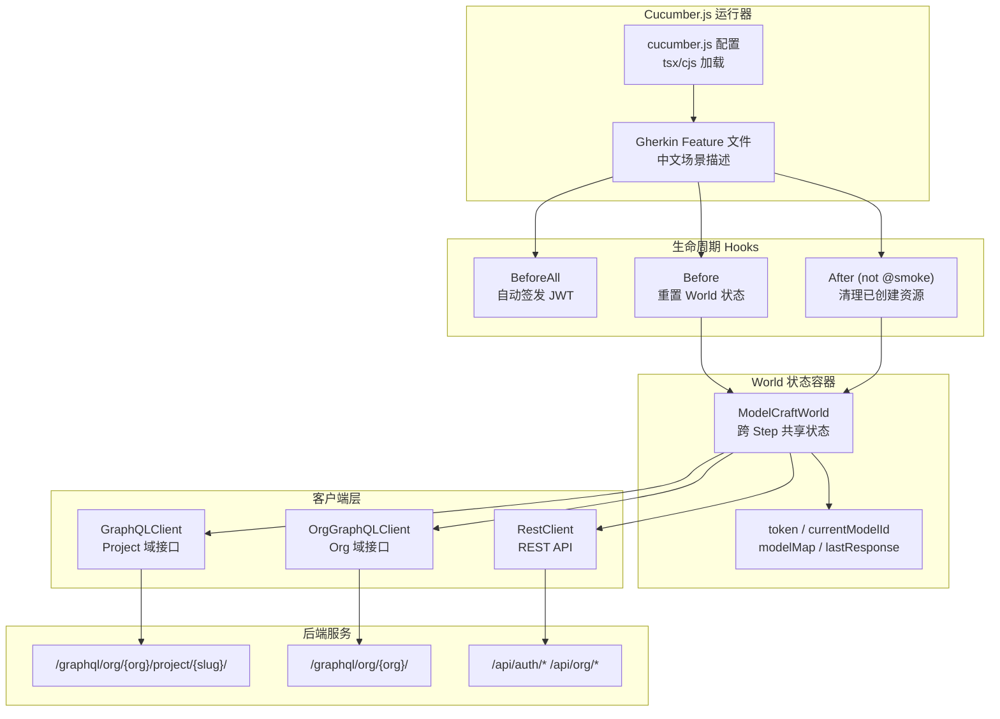

ModelCraft 的验收测试套件位于 `tests-bdd/` 目录，基于 **Cucumber.js** 实现行为驱动开发（BDD）。测试场景使用 Gherkin 语法以中文编写，覆盖模型管理、字段管理、枚举管理、逻辑外键、认证、组织和用户档案七大功能域。每一条 Feature 文件描述的是一个业务能力边界，而 Step Definitions 将自然语言翻译为对后端 GraphQL 和 REST API 的真实调用与断言。

Sources: [README.md](tests-bdd/README.md#L1-L148), [cucumber.js](tests-bdd/cucumber.js#L1-L18)

## 整体架构

BDD 测试套件的运行时架构围绕四个核心层次展开：**Cucumber 运行器** 负责解析 Gherkin 场景并协调执行流程；**World 对象** 在单个 Scenario 的所有 Step 间共享状态；**客户端层** 封装了 GraphQL 和 REST 两种通信通道；**Hooks 生命周期** 确保每个场景的数据隔离和资源清理。



Sources: [cucumber.js](tests-bdd/cucumber.js#L1-L18), [support/world.ts](tests-bdd/support/world.ts#L1-L75), [support/hooks.ts](tests-bdd/support/hooks.ts#L1-L94)

## 目录结构一览

BDD 测试套件按职责严格分目录组织。Feature 文件按功能域分文件夹，Step Definitions 按领域拆分，Support 层封装通用基础设施。

```
tests-bdd/
├── features/                    # Gherkin 场景（中文）
│   ├── model/                   # 模型 CRUD + jsonSchema
│   ├── field/                   # 字段管理 + 枚举关联
│   ├── enum/                    # 枚举 CRUD
│   ├── logical-foreign-key/     # 逻辑外键
│   ├── auth/                    # 注册、登录、Token 刷新/登出
│   ├── org/                     # 组织初始化
│   └── profile/                 # 用户档案（profile 分表）
├── step-definitions/            # TypeScript Step 实现
│   ├── common.steps.ts          # 通用断言（操作成功/错误类型）
│   ├── model.steps.ts           # 模型相关步骤
│   ├── field.steps.ts           # 字段、枚举关联步骤
│   ├── enum.steps.ts            # 枚举相关步骤
│   ├── lfk.steps.ts             # 逻辑外键步骤
│   ├── auth.steps.ts            # 认证（注册/登录/刷新）
│   ├── org.steps.ts             # 组织初始化步骤
│   └── profile.steps.ts         # Profile 查询/更新步骤
├── support/                     # 基础设施
│   ├── world.ts                 # Cucumber World（跨 Step 状态）
│   ├── graphql-client.ts        # GraphQL 请求封装
│   ├── rest-client.ts           # REST API 请求封装
│   ├── jwt.ts                   # JWT 签发工具
│   └── hooks.ts                 # BeforeAll/Before/After 生命周期
├── fixtures/
│   └── factory.ts               # uniqueName() 名称生成器
├── cucumber.js                  # Cucumber 配置
├── .env.test                    # 环境变量（Git 忽略）
└── tsconfig.json
```

Sources: [README.md](tests-bdd/README.md#L48-L98)

## Cucumber 配置与运行

Cucumber 的运行配置定义在 `cucumber.js` 中，核心要点如下：

- **模块加载**：使用 `tsx/cjs` 作为 `requireModule`，支持直接运行 TypeScript 文件，无需预编译
- **自动发现**：`require` 路径覆盖 `support/**/*.ts` 和 `step-definitions/**/*.ts`，所有 Step 和 Hook 自动注册
- **Feature 发现**：`paths` 指向 `features/**/*.feature`，所有 Gherkin 文件自动收集
- **双格式输出**：`progress-bar`（终端进度）+ `html:reports/test-report.html`（HTML 报告）

`package.json` 提供了按功能域过滤运行的便捷脚本，以及 `@smoke` 标签过滤和 HTML 报告生成：

| 命令 | 用途 |
|------|------|
| `npm test` | 运行全部测试 |
| `npm run test:model` | 仅模型管理场景 |
| `npm run test:field` | 仅字段管理场景 |
| `npm run test:enum` | 仅枚举管理场景 |
| `npm run test:lfk` | 仅逻辑外键场景 |
| `npm run test:auth` | 仅认证场景 |
| `npm run test:smoke` | 仅 `@smoke` 标签场景 |
| `npm run test:report` | 生成 HTML 报告 |

Sources: [cucumber.js](tests-bdd/cucumber.js#L1-L18), [package.json](tests-bdd/package.json#L1-L26)

## World 状态容器：ModelCraftWorld

`ModelCraftWorld` 是 Cucumber **World** 的子类，是整个 BDD 架构中最重要的状态管理中心。它在每个 Scenario 实例化一次，将三种 API 客户端、认证信息、操作结果和资源追踪全部收拢到一个对象中，彻底避免了模块级变量导致的跨 Scenario 数据污染。

```typescript
export class ModelCraftWorld extends World {
  // 三种 API 客户端
  readonly restClient: RestClient
  readonly projectClient: GraphQLClient       // Project 域 GraphQL
  readonly orgClient: OrgGraphQLClient        // Org 域 GraphQL

  // 认证状态
  token: string | null = null

  // 环境 fixture
  readonly orgName: string
  readonly projectSlug: string

  // 资源追踪（After 钩子清理用）
  createdModelIds: string[] = []
  createdEnumNames: string[] = []

  // 跨 Step 传递的操作上下文
  currentModelId: string | null = null
  modelMap: Record<string, string> = {}       // baseName → ID 映射
  lastModelName: string | null = null
  lastEnumName: string | null = null

  // GraphQL 操作结果（When → Then 传递）
  lastResponse: Record<string, unknown> | null = null
  lastError: Error | null = null

  // REST 操作结果（Auth/Org 场景）
  lastRestResult: RestResult<unknown> | null = null
  // ... 其他认证和 Org 状态
}
```

这种设计使得每个 Step 只需通过 `this`（即 World 实例）读写状态，Given 步骤创建资源、When 步骤执行操作、Then 步骤断言结果，形成清晰的单向数据流。

Sources: [support/world.ts](tests-bdd/support/world.ts#L1-L75)

## 双通道客户端体系

BDD 测试需要与后端的两类 API 交互：**设计态 GraphQL**（模型/字段/枚举/逻辑外键/Profile）和 **REST API**（认证/组织初始化）。客户端层对此做了清晰的抽象。

### GraphQL 客户端

`BaseGraphQLClient` 封装了 `graphql-request` 库，提供统一的 `query` 和 `mutate` 方法。两个子类分别对应不同的 URL 路由规则：

| 客户端类 | URL 模式 | 用途 |
|----------|----------|------|
| `GraphQLClient` | `/graphql/org/{org}/project/{slug}/` | Project 域操作（模型、字段、枚举、LFK） |
| `OrgGraphQLClient` | `/graphql/org/{org}/` | Org 域操作（Profile、me 查询） |

`OrgGraphQLClient` 支持 `setOrgName()` 动态切换组织，因为认证流程中注册完成后才能获得真实的 `orgName`。

### REST 客户端

`RestClient` 使用原生 `fetch` 封装了完整的 REST API 交互，统一返回 `RestResult<T>` 类型（包含 HTTP 状态码、成功数据或错误信息）。覆盖的接口包括：

| 方法 | 端点 | 用途 |
|------|------|------|
| `register()` | `POST /api/auth/register` | 用户注册 |
| `login()` | `POST /api/auth/login` | 用户登录 |
| `refresh()` | `POST /api/auth/refresh` | Token 刷新 |
| `logout()` | `POST /api/auth/logout` | 登出 |
| `initOrganization()` | `POST /api/org/init` | 组织初始化 |
| `getUserMemberships()` | `GET /api/user/memberships` | 查询成员关系 |
| `handleCasdoorWebhook()` | `POST /api/webhook/casdoor` | 模拟 Casdoor Webhook |

REST 客户端还内置了**旧协议兼容回退**机制：当新版 API 参数格式不被接受时，自动回退到旧格式重试（例如登录从 `{ identifier, identifierType, password }` 回退到 `{ phone, password }`）。

Sources: [support/graphql-client.ts](tests-bdd/support/graphql-client.ts#L1-L57), [support/rest-client.ts](tests-bdd/support/rest-client.ts#L1-L243)

## 生命周期 Hooks：隔离与清理

Hooks 层是保证测试数据隔离的关键，分为三个阶段：

### BeforeAll — 全局认证准备

在所有场景执行前运行。如果环境变量 `TEST_ACCESS_TOKEN` 已提供，则跳过；否则使用测试账号通过 REST API 登录，然后用 `signJWT()` 签发一个有效期 1 小时的 JWT，写入 `process.env.TEST_ACCESS_TOKEN`。这确保即使没有预先获取 Token，测试也能自动完成认证。

Sources: [support/hooks.ts](tests-bdd/support/hooks.ts#L8-L26)

### Before — 场景状态重置

每个 Scenario 执行前，重置 World 对象中的所有可变状态：资源追踪列表（`createdModelIds`、`createdEnumNames`）、操作上下文（`currentModelId`、`modelMap`、`lastResponse`）以及认证和 Org 相关状态。同时确保 World 中的 Token 与全局 Token 同步。

Sources: [support/hooks.ts](tests-bdd/support/hooks.ts#L38-L71)

### After — 资源自动清理

每个 Scenario 执行后（排除 `@smoke` 标签的场景），逆序删除所有通过 API 创建的模型和枚举。使用 try-catch 静默处理删除失败，避免清理异常影响测试结果判定。`@smoke` 场景跳过清理，方便调试时在数据库中查看残留数据。

```typescript
After({ tags: 'not @smoke' }, async function (this: ModelCraftWorld) {
  for (const id of [...this.createdModelIds].reverse()) {
    try { await this.projectClient.mutate(DELETE_MODEL, { id }) } catch { /* 静默处理 */ }
  }
  for (const name of this.createdEnumNames) {
    try { await this.projectClient.mutate(DELETE_ENUM, { name }) } catch { /* 静默处理 */ }
  }
})
```

Sources: [support/hooks.ts](tests-bdd/support/hooks.ts#L73-L94)

## 测试数据隔离策略

BDD 测试面临三个核心隔离挑战：**并发冲突**（多次运行使用相同名称）、**跨 Scenario 污染**（模块级变量泄漏）、**REST 手机号冲突**（注册接口唯一性约束）。每个挑战都有对应的解决方案。

### uniqueName 机制

`fixtures/factory.ts` 提供 `uniqueName()` 函数，为每个测试名称追加 8 位随机十六进制后缀。由于模型和枚举名称不允许包含连字符，UUID 中的连字符被移除：

```typescript
// uniqueName('User') → 'Usera3f2b1c0'
export const uniqueName = (prefix: string): string =>
  `${prefix}${randomUUID().replace(/-/g, '').slice(0, 8)}`
```

所有 `Given` 步骤（如"已创建名为 `User` 的模型"）自动调用 `uniqueName()` 生成实际名称，Feature 文件中只需写业务语义名称。

### 手机号随机映射

认证场景中，Feature 文件使用固定的手机号（如 `13800138001`），但 Step 内部通过 `getOrCreatePhone()` 将其映射为随机手机号。同一个 Scenario 内，相同原始手机号始终映射到同一个随机号码，确保 Background 中的注册和后续步骤引用同一用户。每个 Scenario 的映射表独立，`Before` Hook 中重置。

Sources: [fixtures/factory.ts](tests-bdd/fixtures/factory.ts#L1-L10), [step-definitions/auth.steps.ts](tests-bdd/step-definitions/auth.steps.ts#L15-L58)

## 功能域覆盖全景

BDD 测试套件当前覆盖七大功能域，每个域对应独立的 Feature 文件和 Step Definitions：

| 功能域 | Feature 文件 | 核心场景数 | 关键验证点 |
|--------|-------------|-----------|-----------|
| 模型管理 | `features/model/manage-model.feature` | 6 | CRUD、重名冲突、非法名称、jsonSchema 生成、向后兼容 |
| 字段管理 | `features/field/manage-field.feature` | 6 | 添加/删除字段、非法名称、批量添加部分成功、枚举关联冲突、引用阻断 |
| 枚举管理 | `features/enum/manage-enum.feature` | 3 | 创建、重名冲突、非法名称 |
| 逻辑外键 | `features/logical-foreign-key/manage-lfk.feature` | 2 | 创建外键关系、字段不存在错误 |
| 认证 | `features/auth/*.feature` (3 个文件) | 14 | 注册、登录（手机号/用户名）、Token 刷新、登出后失效、参数校验 |
| 组织 | `features/org/init-org.feature` | 0（占位） | 注册流程已覆盖 |
| Profile | `features/profile/manage-profile.feature` | 4 | 注册自动创建 Profile、PATCH 语义更新、Profile 缺失处理、me 兼容查询 |

Sources: [features/model/manage-model.feature](tests-bdd/features/model/manage-model.feature#L1-L48), [features/field/manage-field.feature](tests-bdd/features/field/manage-field.feature#L1-L53), [features/enum/manage-enum.feature](tests-bdd/features/enum/manage-enum.feature#L1-L27), [features/logical-foreign-key/manage-lfk.feature](tests-bdd/features/logical-foreign-key/manage-lfk.feature#L1-L18), [features/auth/login.feature](tests-bdd/features/auth/login.feature#L1-L51), [features/auth/register.feature](tests-bdd/features/auth/register.feature#L1-L64), [features/auth/token.feature](tests-bdd/features/auth/token.feature#L1-L28), [features/profile/manage-profile.feature](tests-bdd/features/profile/manage-profile.feature#L1-L43)

## Gherkin 场景编写模式

Feature 文件中的场景遵循固定的 **Given-When-Then** 三段式结构，并用 `Background` 块提取公共前置条件。以下是几种典型的编写模式：

### CRUD 正向 + 反向场景

模型和枚举的 Feature 都采用"成功创建 → 成功删除 → 重名报错 → 非法名称报错"的渐进模式。非法名称使用 `Scenario Outline` + `Examples` 表参数化：

```gherkin
Scenario Outline: 创建非法名称模型时报错
  When 我创建名为 "<name>" 的模型
  Then 应该返回错误类型 "InvalidInput"

  Examples:
    | name             |
    | 123startsWithNum |
    | has space        |
    | has-hyphen       |
    | _startsUnderscore |
```

### 跨模型资源引用

逻辑外键场景需要在多个模型之间建立关联。通过 `modelMap`（baseName → ID 映射），Feature 文件可以用语义化的名称引用模型：

```gherkin
Background:
  Given 我以管理员身份登录
  And 已创建名为 "OrderModel" 的模型
  And 已创建名为 "UserModel" 的模型
  And "OrderModel" 已有名为 "userId" 格式为 "STRING" 的字段

When 我创建从 "OrderModel.userId" 到 "UserModel.id" 的逻辑外键
```

### 批量操作与部分成功

字段管理的 `AddFields` 场景使用 Gherkin `DataTable` 传递批量输入，并验证逐字段的 results 数组：

```gherkin
When 我批量添加字段
  | name       | title      | format     | relateEnumName |
  | level      | 客户等级   | ENUM       | @lastEnum      |
  | levelLabel | 客户等级标签 | ENUM_LABEL  |                |
Then addFields 结果中字段 "level" 应该成功
And addFields 结果中字段 "levelLabel" 应该失败并返回 "InvalidInput"
```

DataTable 中支持 `@lastEnum` 这样的特殊占位符，在 Step 内部被替换为 `World.lastEnumName`。

### GraphQL 错误类型断言

所有 GraphQL 操作的错误通过 `__typename` 字段进行类型化断言，与后端 [错误处理规范：bizerrors 与 RepositoryError 双轨体系](10-cuo-wu-chu-li-gui-fan-bizerrors-yu-repositoryerror-shuang-gui-ti-xi) 中的 GraphQL Error Union 模式一致：

```typescript
Then('应该返回错误类型 {string}', function (this: ModelCraftWorld, expectedTypename: string) {
  const payload = Object.values(this.lastResponse!)[0] as Record<string, unknown>
  const error = payload?.error as Record<string, unknown> | null
  expect(error?.__typename).toBe(expectedTypename)
})
```

Sources: [features/model/manage-model.feature](tests-bdd/features/model/manage-model.feature#L1-L48), [features/logical-foreign-key/manage-lfk.feature](tests-bdd/features/logical-foreign-key/manage-lfk.feature#L1-L18), [features/field/manage-field.feature](tests-bdd/features/field/manage-field.feature#L29-L41), [step-definitions/common.steps.ts](tests-bdd/step-definitions/common.steps.ts#L1-L34)

## JWT 自签发机制

BDD 测试支持两种认证方式：**预置 Token**（通过环境变量 `TEST_ACCESS_TOKEN` 提供）和**自动签发**（通过 `BeforeAll` Hook）。自动签发流程通过 `support/jwt.ts` 实现，使用 HMAC-SHA256 签发包含 `user_id`、`iss: "modelcraft"`、`iat`、`exp` 声明的 JWT，与后端中间件的校验逻辑兼容。

Profile 场景中还有更精细的用法：通过 Casdoor Webhook 创建仅有 User 记录而无 Profile 的测试账号，然后用 `signJWT()` 为该账号签发 Token，用于测试 `ProfileNotFound` 边界情况。

```typescript
export function signJWT(userId: string, expiresInSeconds = 3600): string {
  const header = base64url(JSON.stringify({ alg: 'HS256', typ: 'JWT' }))
  const payload = base64url(JSON.stringify({
    user_id: userId, iss: 'modelcraft',
    iat: now, exp: now + expiresInSeconds,
  }))
  const signature = base64url(createHmac('sha256', JWT_SECRET).update(data).digest())
  return `${data}.${signature}`
}
```

Sources: [support/jwt.ts](tests-bdd/support/jwt.ts#L1-L35), [support/hooks.ts](tests-bdd/support/hooks.ts#L8-L26), [step-definitions/profile.steps.ts](tests-bdd/step-definitions/profile.steps.ts#L221-L260)

## Step Definitions 组织原则

Step Definitions 按功能域拆分为独立文件，每个文件负责一个 Feature 文件集合的 Given/When/Then 实现。这种组织方式确保了步骤定义的内聚性——相关的 GraphQL mutation/query、业务逻辑和断言集中在一起。

| 文件 | 覆盖场景 | 通信通道 |
|------|---------|---------|
| `common.steps.ts` | 通用断言（操作成功、错误类型） | — |
| `model.steps.ts` | 模型 CRUD、jsonSchema 查询 | GraphQL Project |
| `field.steps.ts` | 字段添加/删除、枚举关联 | GraphQL Project |
| `enum.steps.ts` | 枚举创建、重名检测 | GraphQL Project |
| `lfk.steps.ts` | 逻辑外键创建 | GraphQL Project |
| `auth.steps.ts` | 注册、登录、Token 刷新/登出 | REST |
| `org.steps.ts` | 组织初始化 | REST |
| `profile.steps.ts` | Profile 查询/更新、me 查询 | REST + GraphQL Org |

Step 内部的模式高度一致：**Given 步骤** 执行操作并将结果存入 World（同时注册到清理列表），**When 步骤** 执行操作并将响应存入 `lastResponse` 或 `lastRestResult`，**Then 步骤** 从 World 中读取结果并断言。这种"写入-读取"分离确保了 Step 之间的松耦合。

Sources: [step-definitions/model.steps.ts](tests-bdd/step-definitions/model.steps.ts#L1-L197), [step-definitions/auth.steps.ts](tests-bdd/step-definitions/auth.steps.ts#L1-L343), [step-definitions/field.steps.ts](tests-bdd/step-definitions/field.steps.ts#L1-L244), [step-definitions/profile.steps.ts](tests-bdd/step-definitions/profile.steps.ts#L1-L441)

## 环境配置与前置条件

运行 BDD 测试需要以下前置条件：

1. **Node.js 18+** 已安装
2. **后端服务运行中**（默认 `http://localhost:8080`）
3. **测试用组织和项目** 已在后端创建

环境变量通过 `tests-bdd/.env.test` 文件配置（已被 `.gitignore` 忽略）：

```bash
API_BASE_URL=http://localhost:8080
TEST_ACCESS_TOKEN=<通过 just test-user-setup 获取>
TEST_ORG_NAME=test-org
TEST_PROJECT_SLUG=test-project
```

如果不提供 `TEST_ACCESS_TOKEN`，`BeforeAll` Hook 会尝试用测试账号（默认手机号 `19900000001`，密码 `bddtest12345`）自动登录并签发 JWT。这种方式需要在 `.env.test` 中额外配置 `TEST_LOGIN_PHONE`、`TEST_LOGIN_PASSWORD` 和 `JWT_SECRET`。

Sources: [support/hooks.ts](tests-bdd/support/hooks.ts#L8-L12), [.gitignore](tests-bdd/.gitignore#L1-L5)

## 延伸阅读

- BDD 测试覆盖的是 [三大 API 通道：设计态 GraphQL、REST、运行时动态 GraphQL](7-san-da-api-tong-dao-she-ji-tai-graphql-rest-yun-xing-shi-dong-tai-graphql) 中的前两个通道（设计态 GraphQL 和 REST API），运行时动态 GraphQL 不在 BDD 覆盖范围内。
- GraphQL 错误断言与 [错误处理规范：bizerrors 与 RepositoryError 双轨体系](10-cuo-wu-chu-li-gui-fan-bizerrors-yu-repositoryerror-shuang-gui-ti-xi) 中的 `__typename` 错误分类体系一一对应。
- BDD 测试与 [后端单元测试与覆盖率要求](21-hou-duan-dan-yuan-ce-shi-yu-fu-gai-lu-yao-qiu) 形成互补：单元测试覆盖内部逻辑，BDD 覆盖端到端的 API 验收。
- Token 的签发逻辑与 [Casdoor 委托认证与 Casbin RBAC 权限控制](11-casdoor-wei-tuo-ren-zheng-yu-casbin-rbac-quan-xian-kong-zhi) 中描述的认证架构一致。