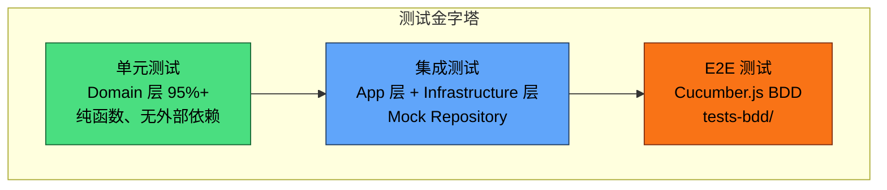
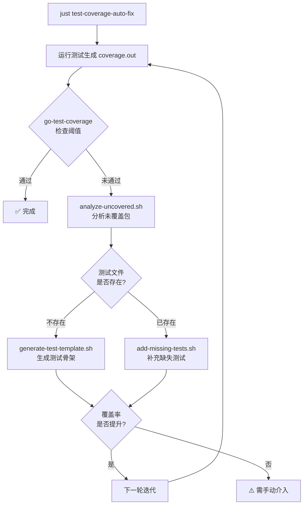

ModelCraft 后端采用 **DDD 分层架构**（详见 [DDD 分层架构：Domain → Application → Infrastructure → Interfaces](6-ddd-fen-ceng-jia-gou-domain-application-infrastructure-interfaces)），单元测试的核心目标是保障 **Domain 层业务逻辑的正确性**。项目通过 `go-test-coverage` 工具强制执行覆盖率门禁，Domain 层要求 **95% 以上**的代码覆盖率，并以表驱动测试（Table-Driven Tests）作为标准编写范式。本文将系统阐述覆盖率阈值配置、测试分层策略、编写规范、自动化工具链及 CI 集成方式。

Sources: [.testcoverage.yml](modelcraft-backend/.testcoverage.yml#L1-L96), [ai-metadata/backend/testing/README.md](ai-metadata/backend/testing/README.md#L1-L111)

## 覆盖率阈值体系

项目使用 [go-test-coverage](https://github.com/vladopajic/go-test-coverage) 作为覆盖率检查引擎，配置文件为 `.testcoverage.yml`。该配置定义了三级阈值结构和按包覆盖的精细化策略。

### 三级阈值架构

| 阈值级别 | 配置项 | 当前值 | 说明 |
|---------|--------|--------|------|
| **文件级** | `threshold.file` | 0% | 单文件最低覆盖率，不做强制 |
| **包级** | `threshold.package` | 1% | 基础包阈值，具体包通过 override 覆盖 |
| **项目级** | `threshold.total` | 38% | 全项目总体最低覆盖率 |

包级阈值设为 1% 并非宽松要求，而是技术前提——`override` 规则仅在基础阈值为非零值时生效。真正的包级约束通过 `override` 路径匹配实现。

Sources: [.testcoverage.yml](modelcraft-backend/.testcoverage.yml#L16-L28)

### Domain 层各包覆盖率现状

Domain 层是业务逻辑的核心，统一要求 95% 覆盖率。下表按当前覆盖率降序排列，展示各子域的达标状态：

| 包路径 | 当前覆盖率 | 目标 | 状态 |
|--------|-----------|------|------|
| `internal/domain/permission` | 100.0% | 95% | ✅ 达标 |
| `internal/domain/user` | 100.0% | 95% | ✅ 达标 |
| `internal/domain/query` | 100.0% | 95% | ✅ 达标 |
| `internal/domain/role` | 98.3% | 95% | ✅ 达标 |
| `internal/domain/project` | 97.8% | 95% | ✅ 达标 |
| `internal/domain/organization` | 97.7% | 95% | ✅ 达标 |
| `internal/domain/membership` | 93.6% | 95% | ⚠️ 差 1.4% |
| `internal/domain/cluster` | 54.2% | 95% | ⚠️ 差 40.8% |
| `internal/domain/modeldesign` | 47.3% | 95% | ⚠️ 差 47.7% |
| `internal/domain/modelruntime` | 15.5% | 95% | ⚠️ 差 79.5% |
| `internal/domain/auth` | 0.0% | 95% | ⚠️ 需从零开始 |
| `internal/domain/interceptor` | 0.0% | 95% | ⚠️ 需从零开始 |
| `internal/domain/shared` | 0.0% | 95% | ⚠️ 需从零开始 |

`override` 使用正则表达式匹配路径，兼容 `modelcraft/internal/domain/xxx` 和 `internal/domain/xxx` 两种格式：

```yaml
override:
  - path: ^(modelcraft/)?internal/domain/project
    threshold: 95
```

Sources: [.testcoverage.yml](modelcraft-backend/.testcoverage.yml#L33-L76)

### 排除规则

配置中明确定义了不参与覆盖率统计的文件类型：

- **生成代码**：`.pb.go`、`_gen.go`、`_mock.go`、`/mocks/`
- **第三方代码**：`/vendor/`
- **测试辅助代码**：`/testutil/`、`/testing/`

Sources: [.testcoverage.yml](modelcraft-backend/.testcoverage.yml#L78-L95)

## 测试分层策略

项目遵循测试金字塔原则，单元测试构成金字塔的基座，数量最多、执行最快。



### 各层测试定位

**Domain 层单元测试**（37 个测试文件，约 14,336 行）聚焦于实体构造、值对象验证、业务规则校验等纯逻辑，完全不依赖外部服务，使用标准库 `testing` + `testify/assert` 即可。测试文件与源码同包放置，利用 Go 的内部访问权限直接测试私有方法。

**Application 层单元测试**（20 个测试文件，约 7,537 行）验证用例编排逻辑。该层通过手写 Mock 或 `testify/mock` 模拟 Repository 接口，测试 Service 方法在给定 Repository 返回值下的行为正确性。例如 `model_app_test.go` 中定义了 `MockModelRepository` 和 `MockDeployRepo` 来隔离依赖。

**Infrastructure 层单元测试**（16 个测试文件）覆盖数据库转换函数（如 `ProjectToDomain`、`ProjectToCreateParams`）、DML 查询构建器、DDL 转换器等，确保领域对象与持久化对象之间的映射无误。

Sources: [ai-metadata/backend/testing/README.md](ai-metadata/backend/testing/README.md#L20-L34), [internal/app/modeldesign/model_app_test.go](modelcraft-backend/internal/app/modeldesign/model_app_test.go#L1-L100)

## 单元测试编写规范

### 表驱动测试范式

项目统一采用**表驱动测试**（Table-Driven Tests）作为核心编写范式。每个测试用例定义为匿名结构体切片，通过 `t.Run` 组织子测试，实现高密度的场景覆盖。

以 `project_test.go` 中的 `TestNewProject` 为例，10 个测试用例覆盖了合法输入、空值边界、格式校验、大小写约束等场景：

```go
func TestNewProject(t *testing.T) {
    tests := []struct {
        name        string
        projectSlug string
        title       string
        description string
        wantErr     bool
        errContains string
    }{
        {
            name: "valid project",
            projectSlug: "ecommerce",
            // ...
            wantErr: false,
        },
        {
            name: "invalid project with hyphens",
            projectSlug: "my-project-123",
            // ...
            wantErr: true,
            errContains: "lowercase letters/digits/underscores only",
        },
        // ... 8 more cases
    }

    for _, tt := range tests {
        t.Run(tt.name, func(t *testing.T) {
            project, err := NewProject("built-in", tt.projectSlug, tt.title, tt.description)
            if tt.wantErr {
                assert.Error(t, err)
                assert.Contains(t, err.Error(), tt.errContains)
                assert.Nil(t, project)
            } else {
                assert.NoError(t, err)
                assert.NotNil(t, project)
            }
        })
    }
}
```

Sources: [internal/domain/project/project_test.go](modelcraft-backend/internal/domain/project/project_test.go#L10-L121)

### 命名规范

测试函数命名遵循 `Test{Entity}_{Method}_{Scenario}` 或 `Test{Entity}_{Scenario}` 模式，清晰表达被测对象和场景。实际代码中常见的命名风格有：

- `TestNewProject` — 构造函数测试
- `TestProject_Validate` — 实例方法测试
- `TestProject_UpdateMetadata` — 状态变更方法测试
- `TestLogicalForeignKey_Validate_EmptyID` — 验证特定错误路径
- `TestFieldService_ValidateDuplicates_DuplicateNames` — Service 层逻辑测试

Sources: [internal/domain/modeldesign/logical_foreign_key_test.go](modelcraft-backend/internal/domain/modeldesign/logical_foreign_key_test.go#L9-L71), [internal/domain/modeldesign/field_service_test.go](modelcraft-backend/internal/domain/modeldesign/field_service_test.go#L1-L80)

### Domain 层测试特征

Domain 层测试的核心特征是**零外部依赖**。不涉及数据库连接、网络请求或文件 I/O。所有测试均可通过 `go test` 直接执行，执行速度快（单个包通常在秒级完成）。

典型的测试断言模式：

```go
// 构造验证：成功路径
m, err := NewMembership("m-001", "user-001", "org-001")
assert.NoError(t, err)
assert.NotNil(t, m)
assert.Equal(t, MembershipStatusActive, m.Status)

// 构造验证：失败路径
m, err = NewMembership("", "user-001", "org-001")
assert.Error(t, err)
assert.Nil(t, m)
assert.Contains(t, err.Error(), "membership ID is required")
```

Sources: [internal/domain/membership/membership_test.go](modelcraft-backend/internal/domain/membership/membership_test.go#L9-L43)

### Application 层 Mock 策略

Application 层测试需要模拟 Repository 接口。项目采用两种 Mock 方式：

**方式一：手写 Mock 结构体**（多数 App 层测试采用）。在测试文件中定义满足接口的 Mock 结构体，使用内存 map 模拟存储：

```go
type mockRefreshTokenRepo struct {
    tokens map[string]*domainauth.RefreshToken
}

func (m *mockRefreshTokenRepo) Save(_ context.Context, token *domainauth.RefreshToken) error {
    m.tokens[token.TokenHash] = token
    return nil
}
```

**方式二：`testify/mock` 动态 Mock**（用于复杂编排场景）。通过 `mock.Mock` 实现调用验证：

```go
type MockModelRepository struct {
    mock.Mock
}

func (m *MockModelRepository) Save(ctx context.Context, orgName string, model *modeldesign.DataModel) error {
    args := m.Called(ctx, orgName, model)
    return args.Error(0)
}
```

Sources: [internal/app/auth/token_service_test.go](modelcraft-backend/internal/app/auth/token_service_test.go#L21-L62), [internal/app/modeldesign/model_app_test.go](modelcraft-backend/internal/app/modeldesign/model_app_test.go#L24-L170)

## 工具链与 Justfile 命令

项目通过 Justfile 封装了完整的测试命令体系，所有命令均以 `rtk`（Runtime Kit）前缀运行 Go 测试，确保环境一致性。

### 核心测试命令

| 命令 | 用途 | 关键参数 |
|------|------|---------|
| `just test-unit` | 运行全量单元测试 | `-race -timeout=5m -coverprofile=coverage.out` |
| `just test-unit-coverage` | 运行测试 + HTML 报告 | 额外生成 `coverage.html` |
| `just test-unit-pkg ./internal/domain/project` | 测试指定包 | 支持任意包路径 |
| `just test-coverage` | Domain 层覆盖率门禁 | 95% 阈值检查 |
| `just test-coverage-all` | 全项目覆盖率门禁 | 基于 `.testcoverage.yml` |
| `just test-coverage-html` | 生成 HTML 覆盖率报告 | 同时执行门禁检查 |
| `just test-coverage-badge` | 生成覆盖率徽章 SVG | 用于 README 展示 |
| `just test-coverage-auto-fix` | 自动补充测试 | 循环分析 + 生成最多 N 轮 |
| `just test-unit-clean` | 清理缓存和覆盖率文件 | 清除 `-testcache` |

Sources: [justfile](modelcraft-backend/justfile#L380-L478)

### Domain 层覆盖率门禁流程

`just test-coverage` 命令执行以下流程：

1. 使用 `rtk` 运行 `go test ./internal/domain/...`，生成 `coverage.out`
2. 调用 `go-test-coverage --config=.testcoverage.yml` 检查阈值
3. 按包逐一验证 override 规则，低于 95% 的包将导致失败

该命令默认跳过 `TestUpdateManyInputWithNilWhere` 和 `TestDeleteManyInputWithNilWhere` 两个已知问题的测试用例，通过 `-skip` 参数控制。

Sources: [justfile](modelcraft-backend/justfile#L423-L430)

## 自动化覆盖率修复流水线

项目配备了一套**迭代式自动修复工具链**，当覆盖率未达标时可自动分析并生成测试代码。



### 各脚本职责

**`auto-fix-coverage.sh`**：主控脚本，管理迭代循环。参数 `--max-iterations` 控制最大轮次（默认 10），`--package` 可指定单个包。每轮迭代运行测试、检查覆盖率、调用分析脚本，并监控覆盖率是否持续提升。若连续两轮无提升，则提示需要手动介入。

**`analyze-uncovered.sh`**：分析 `coverage.out`，提取覆盖率低于 95% 的 Domain 包，按优先级排序（覆盖率从高到低，优先处理"即将达标"的包），对每个包调用测试生成或补充脚本。

**`generate-test-template.sh`**：为尚未创建测试文件的包生成初始模板。自动扫描包内所有公开函数和方法，生成 `Test{FunctionName}` 骨架，每个测试标记为 `t.Skip("TODO")`。

**`add-missing-tests.sh`**：对已有测试文件但覆盖率不足的包，分析未覆盖函数并补充测试用例。

Sources: [scripts/auto-fix-coverage.sh](modelcraft-backend/scripts/auto-fix-coverage.sh#L1-L114), [scripts/analyze-uncovered.sh](modelcraft-backend/scripts/analyze-uncovered.sh#L1-L71), [scripts/generate-test-template.sh](modelcraft-backend/scripts/generate-test-template.sh#L1-L75)

### 使用示例

```bash
# 自动修复所有 Domain 包（最多 10 轮）
just test-coverage-auto-fix

# 指定最大迭代次数
just test-coverage-auto-fix max_iterations=5

# 针对特定包修复
just test-coverage-auto-fix package="internal/domain/modeldesign"
```

Sources: [justfile](modelcraft-backend/justfile#L466-L474)

## 测试相关 Lint 规则

`.golangci.yml` 对测试文件实施了差异化的 lint 策略。以下规则在 `*_test.go` 文件中被排除，以避免测试代码的过度约束：

| 排除的 Linter | 排除原因 |
|--------------|---------|
| `funlen` | 测试函数通常包含大量用例定义，长度天然较长 |
| `gocognit` | 表驱动测试的认知复杂度偏高但结构清晰 |
| `cyclop` | 测试函数圈复杂度不宜过低 |
| `errcheck` | 测试中的错误通过 assert 显式检查 |
| `staticcheck` | 测试代码允许部分简化写法 |
| `goconst` | 测试中的硬编码字符串是预期行为 |
| `nilnil` | Mock 返回 `(nil, nil)` 是常见模式 |
| `gosec G101` | 测试中允许硬编码凭证字符串 |

此外，`depguard` 规则允许测试文件使用标准 `log` 包（生产代码必须使用 `pkg/logfacade`）。

Sources: [.golangci.yml](modelcraft-backend/.golangci.yml#L148-L169)

## 测试检查清单

在提交代码前，后端开发者应确认以下事项：

- [ ] Domain 层新增/修改的实体、值对象、业务方法有对应的表驱动测试
- [ ] 测试覆盖正向路径和所有已知的错误路径
- [ ] `just test-coverage` 通过，所有 Domain 包 ≥ 95%
- [ ] `just lint` 通过，无新增 lint 告警
- [ ] 测试数据无外部依赖，可独立、重复执行
- [ ] Application 层新增的 Service 方法有 Mock 隔离的单元测试
- [ ] Infrastructure 层的类型转换函数有正向/反向测试覆盖

Sources: [ai-metadata/backend/testing/README.md](ai-metadata/backend/testing/README.md#L78-L85)

## 延伸阅读

- [BDD 验收测试：Cucumber.js 与 Gherkin 场景驱动](20-bdd-yan-shou-ce-shi-cucumber-js-yu-gherkin-chang-jing-qu-dong) — 单元测试之上的端到端验收测试体系
- [Justfile 命令参考：构建、运行、数据库迁移](22-justfile-ming-ling-can-kao-gou-jian-yun-xing-shu-ju-ku-qian-yi) — 全部 Justfile 命令的完整参考
- [DDD 分层架构：Domain → Application → Infrastructure → Interfaces](6-ddd-fen-ceng-jia-gou-domain-application-infrastructure-interfaces) — 理解测试分层的架构基础
- [错误处理规范：bizerrors 与 RepositoryError 双轨体系](10-cuo-wu-chu-li-gui-fan-bizerrors-yu-repositoryerror-shuang-gui-ti-xi) — 测试中断言的错误类型体系