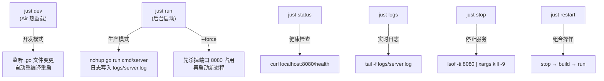
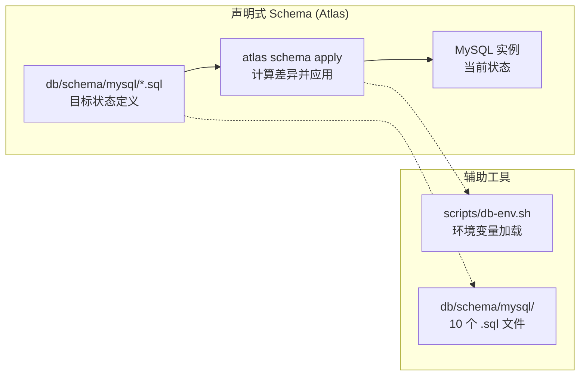
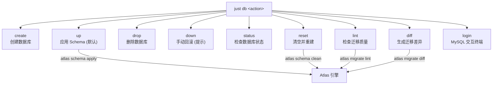
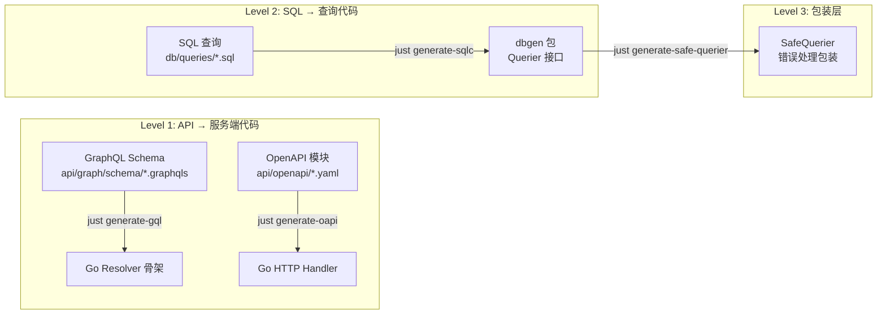
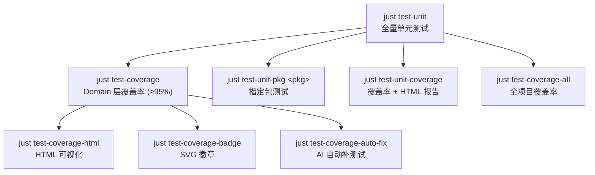
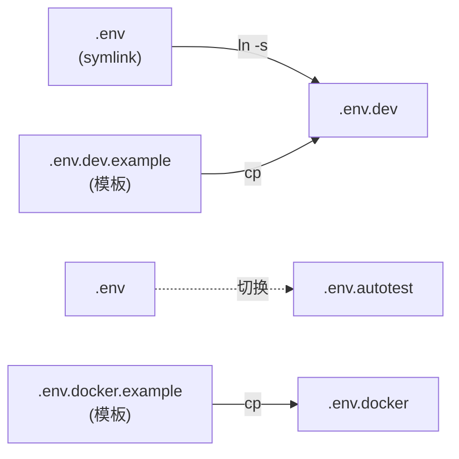
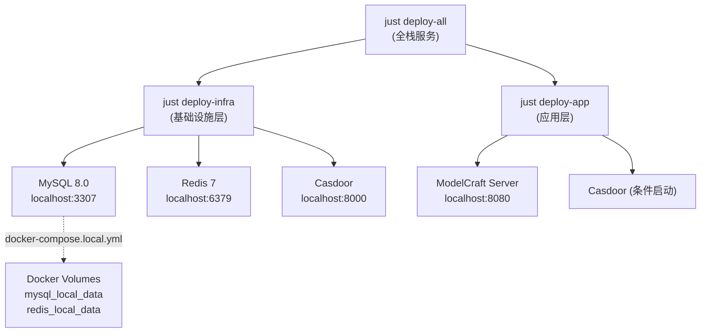

后端 Justfile 是 ModelCraft 项目的**命令中枢**——它将构建、运行、测试、数据库迁移、代码生成、环境管理等十余类操作统一收口为 `just <recipe>` 一行命令，消除了开发者记忆复杂 shell 脚本和长参数列表的认知负担。该文件位于 `modelcraft-backend/justfile`，以 `set dotenv-load` 自动加载 `.env` 文件，所有 recipe 均在 bash 环境中执行（`set shell := ["bash", "-cu"]`），遇错即停。

Sources: [justfile](modelcraft-backend/justfile#L1-L11)

## 命令全景图

Justfile 的 50+ 条 recipe 按职责域划分为 **11 个模块**。下表按使用频率排序，给出每个模块的核心 recipe 和典型使用场景：

| 模块 | 图标 | 核心 recipe | 典型场景 |
|------|------|------------|---------|
| 应用构建与运行 | 🏗️ | `build`, `run`, `dev`, `stop`, `status` | 日常开发启动/停止 |
| 数据库管理 | 🗄️ | `db up`, `db create`, `db reset`, `db login` | Schema 变更与环境初始化 |
| 测试 | 🧪 | `test-unit`, `test-coverage`, `test-unit-pkg` | 提交前验证 |
| 代码生成 | 📊 | `generate-gql`, `generate-oapi`, `generate-sqlc` | Schema 变更后的代码同步 |
| 代码质量 | 🎨 | `lint`, `lint-fix`, `check-all` | 提交前门禁 |
| 环境管理 | 🔐 | `env-switch`, `env-list`, `env-current` | 多环境切换 |
| Docker | 🐳 | `docker-up`, `docker-compose-up` | 容器化部署 |
| 部署管理 | 🚀 | `deploy-infra`, `deploy-app`, `deploy-all` | 全栈服务编排 |
| 依赖与工具 | 🔧 | `deps`, `install-tools` | 项目初始化 |
| 端口管理 | 🔌 | `port-kill`, `port-check` | 端口冲突排查 |
| 测试用户 | 👤 | `test-user-setup`, `test-user-cleanup` | 集成测试准备 |

Sources: [justfile](modelcraft-backend/justfile#L12-L31)

## 应用构建与运行

### 变量定义

Justfile 顶部定义了核心构建变量，其中数据库配置通过 `env_var_or_default` 从 `.env` 文件读取，实现了**配置与命令的解耦**：

```
BINARY_NAME := "modelcraft"
SERVER_PATH := "./cmd/server"
GQLGEN_VERSION := "v0.17.83"
DB_USER := env_var_or_default("DB_USER", "root")
DB_PASSWORD := env_var_or_default("DB_PASSWORD", "password")
DB_HOST := env_var_or_default("DB_HOST", "127.0.0.1")
DB_PORT := env_var_or_default("DB_PORT", "3306")
DB_NAME := env_var_or_default("DB_NAME", "modelcraft")
```

Sources: [justfile](modelcraft-backend/justfile#L16-L30)

### 构建 recipe 矩阵

| 命令 | 用途 | 输出位置 | 关键参数 |
|------|------|---------|---------|
| `just build` | 本地开发构建 | `bin/modelcraft` | 标准 `go build` |
| `just build-prod` | Linux 生产构建 | `bin/modelcraft` | `CGO_ENABLED=0 GOOS=linux`，静态链接 |
| `just build-all` | 跨平台构建 | `bin/modelcraft-{os}-{arch}` | Linux/macOS/Windows 四平台 |

Sources: [justfile](modelcraft-backend/justfile#L37-L53)

### 运行与生命周期管理

应用的运行态管理围绕 **后台进程 + 日志文件** 模式展开，核心流程如下：



**`just run`** 支持 `--force` 和 `force=true` 两种语法，执行三层进程清理（端口查找 → `go run` 进程匹配 → 二进制进程匹配），确保干净重启。应用启动后默认监听 **8080 端口**，日志输出到 `logs/server.log`。

**`just dev`** 使用 [Air](https://github.com/cosmtrek/air) 实现热重载开发模式，配置文件为 `.air.toml`，监听 `.go`/`.tpl`/`.tmpl`/`.html` 文件变更，排除 `_test.go` 和 `testdata` 目录。

Sources: [justfile](modelcraft-backend/justfile#L56-L101), [justfile](modelcraft-backend/justfile#L114-L122), [.air.toml](modelcraft-backend/.air.toml#L1-L30)

### 日志按请求追踪

`just log-cat <reqId>` 支持按 request ID 精确过滤日志，从 `logs/server.log` 中提取 JSON 格式日志并用 `jq` 格式化输出，用于排查特定请求的完整处理链路。

Sources: [justfile](modelcraft-backend/justfile#L185-L197)

## 数据库管理

数据库管理是 Justfile 中最复杂的模块，采用 **Atlas 声明式 Schema 管理** 模式，而非传统的版本化迁移（migration）模式。

### 架构选型：声明式 Schema vs 版本化 Migration



Schema 文件位于 `db/schema/mysql/` 目录，按编号排序定义了 10 张核心表：

| 文件 | 表名 | 领域 |
|------|------|------|
| `01_project.sql` | `projects` | 多租户项目（复合主键：org_name + slug） |
| `02_database_cluster.sql` | 数据库集群 | 集群管理 |
| `03_model_domain.sql` | 模型领域 | 数据模型定义 |
| `04_auth.sql` | 认证 | 认证配置 |
| `05_organizations.sql` | `organizations` | 组织管理 |
| `06_users.sql` | `users` | 用户管理 |
| `07_roles_permissions.sql` | RBAC | 角色与权限 |
| `08_refresh_tokens.sql` | Token | 刷新令牌 |
| `09_api_keys.sql` | API 密钥 | 运行态认证 |
| `10_security_audit_logs.sql` | 审计 | 安全审计日志 |

Sources: [justfile](modelcraft-backend/justfile#L826-L968), [db-env.sh](modelcraft-backend/scripts/db-env.sh#L1-L28)

### `just db` 统一入口

`just db` 是数据库管理的统一入口，支持 9 个子操作：



| 命令 | 用途 | 关键行为 |
|------|------|---------|
| `just db` / `just db up` | 应用 Schema | 先 `CREATE DATABASE IF NOT EXISTS`，再 `atlas schema apply` |
| `just db create` | 创建数据库 | 同时创建 `{DB_NAME}` 和 `{DB_NAME}_dev`（Atlas 开发数据库） |
| `just db drop` | 删除数据库 | ⚠️ 不可逆操作 |
| `just db status` | 查看状态 | 列出所有表及行数，显示 Schema 文件列表 |
| `just db reset` | 清空重建 | `atlas schema clean` → `just db up` |
| `just db login` | MySQL 终端 | 交互式 MySQL 客户端连接 |
| `just db lint` | 检查迁移质量 | Atlas 迁移 Lint |
| `just db diff` | 生成差异 | 基于当前 Schema 生成迁移文件 |

Sources: [justfile](modelcraft-backend/justfile#L831-L968)

### 环境变量加载机制

`just db` 通过 `source scripts/db-env.sh` 加载数据库连接参数，该脚本会：

1. 接收 `.env` 文件路径作为参数（默认 `.env`）
2. `set -a` 将变量导出为环境变量
3. 构造 `DB_URL` 和 `DB_DEV_URL` 两个连接字符串

```
DB_URL  = mysql://{user}:{password}@{host}:{port}/{database}
DB_DEV_URL = mysql://{user}:{password}@{host}:{port}/{database}_dev
```

`DB_DEV_URL` 是 Atlas 的**开发数据库**，用于在应用变更前计算 Schema 差异，不影响业务数据库。

Sources: [db-env.sh](modelcraft-backend/scripts/db-env.sh#L1-L28), [justfile](modelcraft-backend/justfile#L23-L30)

### 典型工作流：Schema 变更

当需要修改表结构时，遵循以下步骤：

1. 修改 `db/schema/mysql/` 下对应的 `.sql` 文件（如新增字段）
2. 执行 `just db up` — Atlas 会自动计算当前数据库与目标 Schema 的差异并生成 DDL
3. 执行 `just generate-sqlc` — 从更新后的 Schema 重新生成 Go 查询代码
4. 执行 `just generate-safe-querier` — 重新生成 Safe Querier 包装层

Sources: [justfile](modelcraft-backend/justfile#L320-L337)

## 代码生成流水线

ModelCraft 的代码生成形成了从 **API 定义 → Go 代码 → 安全包装** 的三级流水线：



| 命令 | 输入 | 输出 | 工具 |
|------|------|------|------|
| `just generate-gql` | `api/graph/schema/*.graphqls` | GraphQL Resolver 骨架代码 | gqlgen v0.17.83 |
| `just bundle-oapi` | `api/openapi/openapi-root.yaml` | 合并后的 `openapi.yaml` | redocly |
| `just generate-oapi` | OpenAPI 模块化 spec | Go HTTP Handler 代码 | oapi-codegen |
| `just generate-sqlc` | `db/queries/*.sql` + `db/schema/mysql/` | `internal/infrastructure/dbgen/` | sqlc |
| `just generate-safe-querier` | `dbgen.Querier` 接口 | `dbgenwrap/safe_querier_gen.go` | gowrap 脚本 |

sqlc 的配置文件 `sqlc.yaml` 定义了查询目录（`db/queries/`）、Schema 目录（`db/schema/mysql/`）和输出包（`internal/infrastructure/dbgen`），并启用了 `emit_interface: true` 以生成 `Querier` 接口，这是 Safe Querier 包装层的基石。

Sources: [justfile](modelcraft-backend/justfile#L290-L350), [sqlc.yaml](modelcraft-backend/sqlc.yaml#L1-L27)

## 测试体系

### 测试 recipe 层次



| 命令 | 用途 | 关键参数 |
|------|------|---------|
| `just test` / `just test-unit` | 全量单元测试 | `-race -timeout=5m`，通过 `rtk` 工具执行 |
| `just test-unit-pkg ./internal/domain/project` | 指定包测试 | 精确控制测试范围 |
| `just test-coverage` | Domain 层覆盖率检查 | 阈值 **95%**，跳过部分 flaky 测试 |
| `just test-coverage-all` | 全项目覆盖率 | 总阈值 **38%**（持续提升中） |
| `just test-coverage-html` | HTML 覆盖率报告 | 生成 `coverage.html` |
| `just test-coverage-auto-fix` | AI 自动补测试 | 最多迭代 10 轮 |

覆盖率配置文件 `.testcoverage.yml` 对 Domain 层各子包设置了 **95% 的强制阈值**（如 `project` 97.8%、`role` 98.3%、`permission` 100%），并通过 `override` 正则匹配实现按路径差异化阈值控制。

Sources: [justfile](modelcraft-backend/justfile#L380-L478), [.testcoverage.yml](modelcraft-backend/.testcoverage.yml#L1-L96)

## 代码质量门禁

| 命令 | 用途 | 底层工具 |
|------|------|---------|
| `just lint` | 静态检查 | golangci-lint（20+ linters） |
| `just lint-fix` | 自动修复 | golangci-lint `--fix` |
| `just check-pkg-dep` | 依赖规范检查 | depguard（禁止标准 `log` 包） |
| `just check-all` | 完整检查 | lint + test-unit |

golangci-lint 配置（`.golangci.yml`）启用了 **goimports**、**gofumpt**、**funlen**、**cyclop**、**gocognit**、**gosec**、**depguard** 等 20+ linters，并排除了 `_test.go` 中的复杂度和长度检查、`_gen.go` 生成文件以及 `G101` 硬编码凭证警告（测试文件）。

Sources: [justfile](modelcraft-backend/justfile#L352-L377), [.golangci.yml](modelcraft-backend/.golangci.yml#L1-L194)

## 环境管理

环境管理采用 **符号链接切换** 模式，`.env` 文件是指向具体环境文件的 symlink：



| 命令 | 用途 |
|------|------|
| `just env-list` | 列出所有 `.env.*` 环境文件 |
| `just env-current` | 显示当前激活的环境（检测 symlink 指向） |
| `just env-switch <name>` | 切换环境（创建 symlink `.env → .env.<name>`） |
| `just env-switch <name> create=true` | 切换并自动从模板创建 |
| `just env-create <name>` | 从 `.env.dev.example` 创建新环境文件 |
| `just env-diff <name>` | 对比当前 `.env` 与指定环境的差异 |
| `just env-backup` | 备份当前 `.env`（带时间戳） |
| `just env-restore <file>` | 从备份恢复 |

默认开发环境的配置定义在 `.env.dev.example` 中，核心参数包括数据库连接（端口 **3307**，本地 Docker 暴露端口）、Casdoor 认证配置、AES 加密密钥等。

Sources: [justfile](modelcraft-backend/justfile#L989-L1270), [.env.dev.example](modelcraft-backend/.env.dev.example#L1-L25)

## 部署与服务编排

部署命令实现了**三层服务编排**，每层支持 `start`/`status`/`stop`/`restart` 四个动作：



| 命令 | 管理范围 | 编排方式 |
|------|---------|---------|
| `just deploy-infra start` | MySQL + Redis + Casdoor | `docker-compose -f docker-compose.local.yml up -d` |
| `just deploy-app start` | ModelCraft Server | `go build` + `nohup go run cmd/server` |
| `just deploy-all start` | 全栈 | 先 infra 后 app，级联启动 |

**关键区别**：`docker-compose.local.yml` 仅包含第三方服务（MySQL 映射端口 **3307** 避免冲突、Redis 端口 **6379**、Casdoor 端口 **8000**），应用本身通过 `just deploy-app` 原生运行。可选的 phpMyAdmin 通过 `--profile tools` 启动，映射端口 **8081**。

Sources: [justfile](modelcraft-backend/justfile#L577-L824), [docker-compose.local.yml](modelcraft-backend/docker-compose.local.yml#L1-L107)

## Docker 容器化

Docker 命令分为两个上下文：

| 命令 | 上下文 | 用途 |
|------|--------|------|
| `just docker-build` | 单容器 | 构建 `modelcraft:latest` 镜像 |
| `just docker-run` | 单容器 | 运行容器（端口 8080） |
| `just docker-up` | Compose | 构建并启动全部服务 |
| `just docker-compose-up` | Compose | 启动所有服务 |
| `just docker-compose-down` | Compose | 停止所有服务 |
| `just docker-clean` | Compose | 停止并清理卷 + prune |
| `just docker-shell` | Compose | 进入应用容器 shell |
| `just docker-app-logs` | Compose | 查看应用日志 |
| `just docker-db-logs` | Compose | 查看数据库日志 |

`docker-up` 是一键启动命令，输出应用地址（`http://localhost:8080`）、健康检查地址和 phpMyAdmin 地址。

Sources: [justfile](modelcraft-backend/justfile#L500-L567), [Dockerfile](modelcraft-backend/Dockerfile#L1-L50)

## 端口管理

| 命令 | 用途 |
|------|------|
| `just port-kill [port]` | 强制释放指定端口（默认 8080） |
| `just port-check [port]` | 查看端口占用情况 |

这两个命令常用于应用异常退出后端口残留的清理场景。

Sources: [justfile](modelcraft-backend/justfile#L970-L987)

## 开发者快速参考：日常命令速查

**每天开始开发：**
```bash
just deploy-infra          # 启动 MySQL、Redis
just db up                 # 应用最新 Schema
just dev                   # Air 热重载开发
```

**提交代码前：**
```bash
just lint-fix              # 自动修复代码问题
just lint                  # 确认无遗留问题
just test-unit             # 运行全部单元测试
```

**Schema 变更后：**
```bash
just db up                 # 1. 应用 Schema 到数据库
just generate-sqlc         # 2. 重新生成查询代码
just generate-safe-querier # 3. 重新生成安全包装
```

**环境切换：**
```bash
just env-switch dev        # 切换到开发环境
just env-switch autotest   # 切换到测试环境
just db up .env.autotest   # 对测试数据库应用 Schema
```

Sources: [justfile](modelcraft-backend/justfile#L1-L31), [SKILL.md](.agents/skills/justfile/SKILL.md#L1-L97)

## 延伸阅读

- 了解 Schema 变更如何影响 Go 代码：参阅 [数据层：sqlc 代码生成与 Safe Querier 模式](9-shu-ju-ceng-sqlc-dai-ma-sheng-cheng-yu-safe-querier-mo-shi)
- 理解 golangci-lint 的详细规则配置：参阅 [Pre-commit Hooks 与代码质量门禁](24-pre-commit-hooks-yu-dai-ma-zhi-liang-men-jin)
- 容器化部署的完整参数说明：参阅 [Docker 容器化部署与外部 MySQL 配置](23-docker-rong-qi-hua-bu-shu-yu-wai-bu-mysql-pei-zhi)
- 测试覆盖率策略的分层设计：参阅 [后端单元测试与覆盖率要求](21-hou-duan-dan-yuan-ce-shi-yu-fu-gai-lu-yao-qiu)