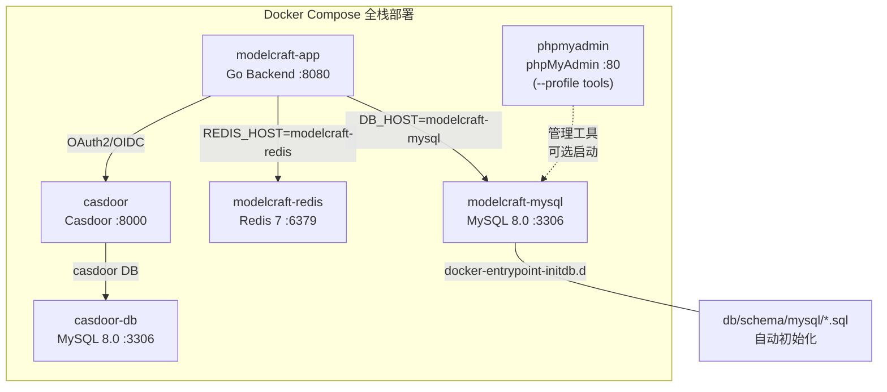
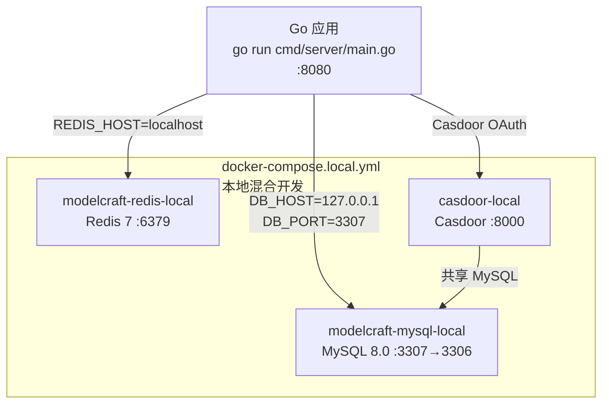
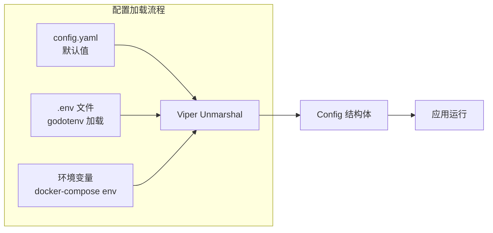

ModelCraft 后端采用 **多阶段构建 Dockerfile** 与 **双模式 docker-compose 编排**，提供从本地开发到生产部署的完整容器化方案。系统支持两种运行模式：**全栈容器化部署**（应用 + 中间件全部容器化）和**混合开发模式**（仅中间件容器化，应用本地运行）。配置体系通过 Viper 环境变量绑定机制，实现了敏感信息与连接参数的灵活覆盖，无缝切换内部 MySQL 服务与外部 MySQL 实例。

Sources: [Dockerfile](modelcraft-backend/Dockerfile#L1-L71), [docker-compose.yml](modelcraft-backend/docker-compose.yml#L1-L186), [docker-compose.local.yml](modelcraft-backend/docker-compose.local.yml#L1-L107)

## 容器化架构总览

ModelCraft 的容器化部署架构围绕五个核心服务构建。全栈模式下，所有服务运行在独立的 `modelcraft-network` 桥接网络中，通过 Docker 服务名进行内部 DNS 解析。应用服务依赖 MySQL 和 Redis 健康检查通过后才启动，确保数据层就绪。



**本地混合开发模式** 仅启动中间件服务（MySQL 端口映射到 3307 避免与宿主机冲突，Redis 映射到标准 6379），Casdoor 与 ModelCraft 共享同一个 MySQL 实例，应用通过 `go run cmd/server/main.go` 本地运行。



Sources: [docker-compose.yml](modelcraft-backend/docker-compose.yml#L1-L186), [docker-compose.local.yml](modelcraft-backend/docker-compose.local.yml#L1-L107)

## Dockerfile 多阶段构建解析

Dockerfile 采用 **两阶段构建模式**，将编译环境与运行环境严格隔离，最终镜像仅包含二进制文件和必要运行时依赖。

**构建阶段**（`golang:1.25-alpine`）完成依赖下载与静态编译。关键设计：启用 `CGO_ENABLED=1` 以支持 sqlc 生成的代码可能涉及的 C 依赖，通过 `go mod verify` 校验依赖完整性，使用 `-ldflags="-w -s"` 剥离调试信息压缩二进制体积。

**运行阶段**（`alpine:latest`）遵循最小权限原则：创建 `appuser:appgroup`（UID/GID 1001）非 root 用户，仅安装 `ca-certificates`（TLS 证书）和 `tzdata`（时区数据），通过 `HEALTHCHECK` 指令配置 `/health` 端点探测。

Sources: [Dockerfile](modelcraft-backend/Dockerfile#L1-L71)

| 阶段 | 基础镜像 | 关键操作 | 产出 |
|------|---------|---------|------|
| 构建阶段 | `golang:1.25-alpine` | 依赖下载 → 源码编译 → 静态链接 | `/app/main` 二进制 |
| 运行阶段 | `alpine:latest` | 非 root 用户 → 证书安装 → 健康检查 | 生产运行镜像 |

注意：Dockerfile 第 49 行引用了 `configs/config.docker.yaml`，该文件为 Docker 专用配置模板。若该文件尚未创建，构建时会跳过（COPY 指令在文件不存在时会失败），需确保该文件存在或移除该 COPY 行。

Sources: [Dockerfile](modelcraft-backend/Dockerfile#L48-L50)

## 双模式 Docker Compose 编排

### 模式一：全栈容器化部署（docker-compose.yml）

全栈模式将应用、数据库、缓存、认证服务统一编排，适用于生产部署或完整环境验证。该编排包含 **六个服务定义** 和 **四个命名卷**。

| 服务名 | 镜像 | 端口映射 | 依赖 | 用途 |
|-------|------|---------|------|------|
| `modelcraft` | 自建 Dockerfile | 8080:8080 | mysql, redis | 应用主服务 |
| `modelcraft-mysql` | mysql:8.0 | 6033:3306 | 无 | 应用数据库 |
| `modelcraft-redis` | redis:7-alpine | 6379:6379 | 无 | 缓存服务 |
| `casdoor` | casbin/casdoor:latest | 8000:8000 | casdoor-db | 认证服务 |
| `casdoor-db` | mysql:8.0 | 无外部端口 | 无 | Casdoor 独立数据库 |
| `modelcraft-phpmyadmin` | phpmyadmin | 8081:80 | mysql | 数据库管理（需 `--profile tools`） |

数据库 Schema 初始化通过 **Docker entrypoint 机制** 自动完成：`./db/schema/mysql/` 目录下的 SQL 文件按文件名排序挂载到 MySQL 容器的 `/docker-entrypoint-initdb.d/`，首次启动时自动执行建表脚本（包括 `01_project.sql` 到 `10_security_audit_logs.sql` 共 10 个 Schema 文件）。

Sources: [docker-compose.yml](modelcraft-backend/docker-compose.yml#L62-L86), [db/schema/mysql/](modelcraft-backend/db/schema/mysql)

### 模式二：本地混合开发（docker-compose.local.yml）

本地开发模式仅编排第三方中间件，应用通过 `go run` 在宿主机运行。**Casdoor 共享 ModelCraft 的 MySQL 实例**（而非独立数据库），通过 `casdoor-local` 连接到 `modelcraft-mysql-local:3306` 上的 `casdoor` 数据库。

| 服务名 | 端口映射 | 特殊配置 |
|-------|---------|---------|
| `modelcraft-mysql-local` | **3307**:3306 | 避免与宿主机 3306 冲突 |
| `modelcraft-redis-local` | 6379:6379 | 标准端口 |
| `casdoor-local` | 8000:8000 | 共享 MySQL 实例 |

Casdoor 配置文件中数据源指向本地开发 MySQL：`dataSourceName = root:modelcraft123@tcp(modelcraft-mysql-local:3306)/`，数据库名为 `casdoor`。

Sources: [docker-compose.local.yml](modelcraft-backend/docker-compose.local.yml#L1-L107), [casdoor/conf/app.conf](modelcraft-backend/casdoor/conf/app.conf#L6-L7)

## 配置体系：Viper 环境变量绑定

### 三层配置优先级

应用配置通过 **Viper** 框架加载，优先级从高到低为：**环境变量 → .env 文件 → config.yaml 默认值**。`setupEnvBindings` 函数将所有关键配置项显式绑定到环境变量，确保 Docker 环境下可通过 `docker-compose.yml` 的 `environment` 段无缝覆盖。



Sources: [pkg/config/config.go](modelcraft-backend/pkg/config/config.go#L130-L158)

### 数据库配置环境变量映射

以下环境变量控制数据库连接行为。Docker 全栈模式下 `DB_HOST` 默认为 Docker 服务名 `modelcraft-mysql`，本地开发模式下为 `127.0.0.1`。

| 环境变量 | config.yaml 路径 | 默认值 | 说明 |
|---------|-----------------|--------|------|
| `DB_HOST` | `database.host` | `localhost` | MySQL 主机地址 |
| `DB_PORT` | `database.port` | `3306` | MySQL 端口 |
| `DB_USERNAME` | `database.username` | `root` | 数据库用户名 |
| `DB_PASSWORD` | `database.password` | 空 | 数据库密码（**必填**） |
| `DB_DATABASE` | `database.database` | `modelcraft` | 数据库名称 |
| `DB_CHARSET` | `database.charset` | `utf8mb4` | 字符集 |
| `DB_MAX_OPEN_CONNS` | `database.max_open_conns` | `100` | 最大打开连接数 |
| `DB_MAX_IDLE_CONNS` | `database.max_idle_conns` | `10` | 最大空闲连接数 |
| `DB_CONN_MAX_LIFETIME` | `database.conn_max_lifetime` | `3600` | 连接最大生命周期（秒） |
| `DB_LOG_LEVEL` | `database.log_level` | `info` | SQL 日志级别 |
| `DB_MIGRATE_ON_STARTUP` | `database.migrate_on_startup` | `true` | 启动时自动迁移 |

Sources: [pkg/config/config.go](modelcraft-backend/pkg/config/config.go#L160-L215), [configs/config.yaml](modelcraft-backend/configs/config.yaml#L7-L22)

## 外部 MySQL 配置指南

### 场景一：Docker Compose 连接外部 MySQL

当需要使用云托管 MySQL 或独立部署的 MySQL 实例时，可通过 `--scale` 参数禁用内置 MySQL 服务，仅启动应用容器。`docker-compose.yml` 中已内置注释提示此用法。

**核心变更**：将 `DB_HOST` 从 Docker 服务名改为外部 MySQL 地址，同时确保 `modelcraft` 服务的 `depends_on` 不再依赖 `modelcraft-mysql`。

步骤如下：

1. **创建 .env 文件**，配置外部数据库连接参数：

```bash
# .env 文件
DB_HOST=your-mysql-host.example.com
DB_PORT=3306
DB_USERNAME=modelcraft_user
DB_PASSWORD=your_secure_password
DB_DATABASE=modelcraft
```

2. **启动应用**，使用 `--scale` 禁用内置 MySQL：

```bash
docker compose up --scale modelcraft-mysql=0 -d modelcraft
```

3. **确保外部 MySQL 已完成 Schema 初始化**：外部实例不会自动加载 `docker-entrypoint-initdb.d` 中的 SQL 脚本，需手动执行 `db/schema/mysql/` 目录下的 Schema 文件。

Sources: [docker-compose.yml](modelcraft-backend/docker-compose.yml#L86-L86), [.env.docker.example](modelcraft-backend/.env.docker.example#L27-L32)

### 场景二：本地开发连接外部 MySQL

在本地混合开发模式下，`.env.dev` 文件控制数据库连接。修改 `DB_HOST` 和 `DB_PORT` 即可指向外部实例。

```bash
# .env.dev 配置示例
DB_HOST=192.168.1.100
DB_PORT=3306
DB_PASSWORD=external_db_password
DB_NAME=modelcraft
```

启动本地中间件时排除 MySQL 容器（仅启动 Redis 和 Casdoor）：

```bash
docker compose -f docker-compose.local.yml up -d modelcraft-redis-local casdoor-local
```

Sources: [.env.dev](modelcraft-backend/.env.dev#L1-L9), [.env.dev.example](modelcraft-backend/.env.dev.example#L1-L9)

### 安全密钥配置

无论使用哪种 MySQL 部署方式，以下安全参数**必须通过环境变量设置**，不得使用默认值：

| 环境变量 | 用途 | 生成方法 |
|---------|------|---------|
| `JWT_SECRET` | JWT 签名密钥 | `openssl rand -base64 64` |
| `CRYPTO_AES_KEY` | AES-256 加密密钥（**必须恰好 32 字节**） | `openssl rand -base64 32 \| tr -d '\n' \| cut -c1-32` |
| `DB_PASSWORD` | 数据库密码 | 强密码生成器 |

Sources: [.env.docker.example](modelcraft-backend/.env.docker.example#L43-L50)

## 健康检查与服务依赖

Docker Compose 通过 **分层健康检查** 实现服务启动顺序控制。应用服务 `depends_on` MySQL 和 Redis，并配置 `condition: service_healthy`（隐含在 `restart: unless-stopped` 策略中），确保数据层就绪后再启动应用。

| 服务 | 检查方式 | 间隔 | 超时 | 启动等待 | 重试 |
|------|---------|------|------|---------|------|
| `modelcraft` | `wget http://localhost:8080/health` | 30s | 10s | 40s | 3 |
| `modelcraft-mysql` | `mysqladmin ping` | 10s | 5s | 30s | 5 |
| `modelcraft-redis` | `redis-cli ping` | 10s | 5s | - | 3 |
| `casdoor` | `wget http://localhost:8000/api/get-account` | 30s | 10s | 40s | 3 |

**启动时序链**：MySQL/Redis 先各自完成健康检查 → Casdoor DB 就绪后 Casdoor 启动 → 应用等待 MySQL 和 Redis 均健康后启动 → 应用内部 `DB_MIGRATE_ON_STARTUP=true` 触发自动迁移。

Sources: [docker-compose.yml](modelcraft-backend/docker-compose.yml#L54-L86), [Dockerfile](modelcraft-backend/Dockerfile#L63-L64)

## Justfile Docker 命令速查

项目通过 **Justfile** 封装了常用 Docker 操作，提供两种粒度的命令集：

### 全栈部署命令

| 命令 | 用途 |
|------|------|
| `just docker-build` | 构建应用 Docker 镜像 |
| `just docker-run` | 运行应用容器（仅应用，无中间件） |
| `just docker-up` | 构建并启动全栈服务（含 phpMyAdmin 提示） |
| `just docker-compose-down` | 停止全栈服务 |
| `just docker-compose-logs` | 查看全栈日志 |
| `just docker-shell` | 进入应用容器 Shell |
| `just docker-app-logs` | 查看应用日志 |
| `just docker-clean` | 清理 Docker 环境（含卷删除） |

### 本地基础设施管理命令

| 命令 | 用途 |
|------|------|
| `just deploy-infra start` | 启动本地 MySQL/Redis/Casdoor |
| `just deploy-infra status` | 查看本地中间件状态 |
| `just deploy-infra stop` | 停止本地中间件 |
| `just deploy-infra restart` | 重启本地中间件 |

Sources: [justfile](modelcraft-backend/justfile#L500-L640)

## 常见问题与故障排查

### 连接外部 MySQL 失败

**症状**：应用日志提示 `dial tcp <host>:3306: i/o timeout` 或 `access denied`。

**排查步骤**：

1. **网络连通性**：从 Docker 容器内测试 `docker compose exec modelcraft wget -qO- http://<mysql-host>:3306`，确认容器可达外部 MySQL
2. **用户权限**：确认 MySQL 用户已授权远程访问 `GRANT ALL ON modelcraft.* TO 'user'@'%' IDENTIFIED BY 'password'`
3. **防火墙/安全组**：确认 3306 端口对 Docker 网络出口 IP 开放
4. **环境变量覆盖**：运行 `docker compose config` 检查实际注入的环境变量值，确认未被 config.yaml 默认值覆盖

### 数据库初始化未执行

**症状**：应用启动报 `Table 'modelcraft.projects' doesn't exist`。

**原因与解决**：外部 MySQL 不会自动加载 `docker-entrypoint-initdb.d` 中的 Schema。需手动执行初始化：

```bash
mysql -h <host> -u <user> -p<password> <database> < db/schema/mysql/01_project.sql
# 或按序执行所有 Schema
for f in db/schema/mysql/*.sql; do
  mysql -h <host> -u <user> -p<password> <database> < "$f"
done
```

也可以设置 `DB_MIGRATE_ON_STARTUP=true`，让应用启动时自动完成迁移。

Sources: [docker-compose.yml](modelcraft-backend/docker-compose.yml#L74-L76), [configs/config.yaml](modelcraft-backend/configs/config.yaml#L22-L22)

### config.docker.yaml 缺失

Dockerfile 构建阶段第 49 行 `COPY --from=builder /app/configs/config.docker.yaml ./configs/config.yaml` 需要该文件存在。若构建报错 `file not found`，有两种解决方案：

- **方案 A**：创建 `configs/config.docker.yaml`，内容参考 `config.yaml` 并将默认值设为 Docker 环境参数
- **方案 B**：移除 Dockerfile 第 49 行，完全依赖环境变量覆盖 config.yaml 默认值（当前架构已支持此方式）

Sources: [Dockerfile](modelcraft-backend/Dockerfile#L48-L50)

## 部署模式对比

| 维度 | 全栈容器化 | 本地混合开发 | 外部 MySQL |
|------|-----------|-------------|-----------|
| 编排文件 | `docker-compose.yml` | `docker-compose.local.yml` | `docker-compose.yml --scale mysql=0` |
| 应用运行方式 | 容器内 | 宿主机 `go run` | 容器内 |
| MySQL 来源 | Docker 内置 | Docker 本地映射 | 外部独立实例 |
| DB_HOST 值 | `modelcraft-mysql` | `127.0.0.1` | 外部地址 |
| DB_PORT 值 | `3306`（内部） | `3307`（映射） | 外部端口 |
| Schema 初始化 | 自动（entrypoint） | 自动（entrypoint） | 手动或 `DB_MIGRATE_ON_STARTUP` |
| 适用场景 | 生产/CI/完整测试 | 日常开发 | 云托管/企业环境 |

---

**相关文档**：

- 了解构建命令细节：[Justfile 命令参考：构建、运行、数据库迁移](22-justfile-ming-ling-can-kao-gou-jian-yun-xing-shu-ju-ku-qian-yi)
- 了解数据库层设计：[数据层：sqlc 代码生成与 Safe Querier 模式](9-shu-ju-ceng-sqlc-dai-ma-sheng-cheng-yu-safe-querier-mo-shi)
- 了解认证服务集成：[Casdoor 委托认证与 Casbin RBAC 权限控制](11-casdoor-wei-tuo-ren-zheng-yu-casbin-rbac-quan-xian-kong-zhi)