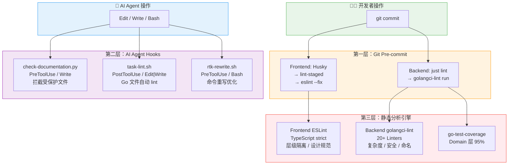
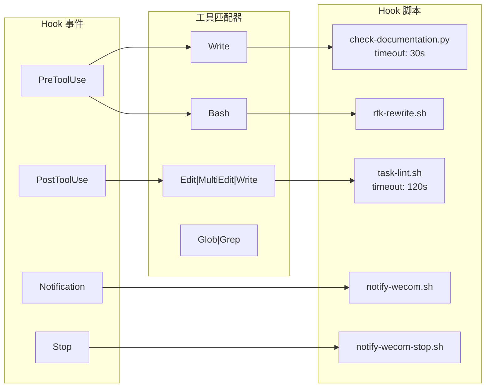

ModelCraft 在多个维度上构建了**多层次、自动化的代码质量防线**——从 Git 提交时的 Pre-commit Hook，到 AI Agent 操作时的实时拦截，再到后端 Linter 的 20+ 规则矩阵和前端 ESLint 的架构层级强制。这些机制协同工作，确保无论开发者还是 AI Agent，都无法绕过质量门禁提交不合格代码。项目的核心原则记录在 `AGENTS.md` 中：**"Never use `git commit --no-verify`. Pre-commit hooks must always run."**

Sources: [AGENTS.md](AGENTS.md#L82-L90), [.claude/settings.json](.claude/settings.json#L1-L151)

## 质量门禁全景图

以下 Mermaid 图展示了 ModelCraft 中三层质量防线的关系和触发时机：



**三层防线的职责分工**：

| 层级 | 触发时机 | 目标受众 | 核心职责 |
|------|---------|---------|---------|
| **Git Pre-commit** | `git commit` | 开发者 | 在代码进入版本库前拦截格式和规范问题 |
| **AI Agent Hooks** | Agent 工具调用 | AI Agent | 在 Agent 编辑/写入文件时实时拦截和反馈 |
| **静态分析引擎** | lint / build / CI | 全员 | 深度代码质量、安全性、架构合规性检查 |

Sources: [AGENTS.md](AGENTS.md#L82-L91), [.agents/hooks/check-documentation.py](.agents/hooks/check-documentation.py#L1-L57), [.agents/hooks/task-lint.sh](.agents/hooks/task-lint.sh#L1-L25)

## 第一层：Git Pre-commit Hooks

### 前端：Husky + lint-staged

前端子项目 `modelcraft-front` 使用 **Husky** 管理 Git hooks，在每次 `git commit` 时自动触发 **lint-staged**，仅对暂存区（staged）中的文件运行 ESLint 自动修复：

```
git commit
  → .husky/pre-commit
    → npx lint-staged
      → eslint --fix (仅 *.ts, *.tsx, *.js, *.jsx)
```

**lint-staged 配置**定义在 `package.json` 中，只处理 JavaScript/TypeScript 文件，执行 `eslint --fix` 进行自动格式化和规则修复。如果存在无法自动修复的错误（如 TypeScript `any` 类型违规、架构层级越界），提交将被阻止。

Sources: [modelcraft-front/.husky/pre-commit](modelcraft-front/.husky/pre-commit#L1-L2), [modelcraft-front/package.json](modelcraft-front/package.json#L106-L110)

### 后端：just lint

后端子项目 `modelcraft-backend` 的提交门禁通过 `just lint` 执行 **golangci-lint**。根据 `AGENTS.md` 的规范，如果 lint 失败，开发者应先运行 `just lint-fix` 自动修复，再通过 `just lint` 验证。这条规则同时适用于人类开发者和 AI Agent。

```
git commit (in modelcraft-backend/)
  → just lint
    → golangci-lint run
```

Sources: [AGENTS.md](AGENTS.md#L87-L90), [modelcraft-backend/justfile](modelcraft-backend/justfile#L357-L366)

## 第二层：AI Agent 实时拦截 Hooks

ModelCraft 的 `.agents/hooks/` 目录定义了一套**与 AI Agent 生命周期绑定的拦截器**。通过符号链接机制，同一套 Hook 被复用于 Claude Code（`.claude/hooks`）和 CodeBuddy（`.codebuddy/hooks`），确保跨 Agent 平台的一致性。

```
.agents/hooks/          ← 单一真相源（在此编辑）
    ├── check-documentation.py
    ├── task-lint.sh
    ├── rtk-rewrite.sh
    ├── notify-wecom.sh
    └── notify-wecom-stop.sh

.claude/hooks/          → symlink → .agents/hooks/
.codebuddy/hooks/       → symlink → .agents/hooks/
```

Sources: [AGENTS.md](AGENTS.md#L104-L127), [.claude/settings.json](.claude/settings.json#L5-L67)

### check-documentation.py — 写入前安全拦截

这是一个 **PreToolUse Hook**，在 AI Agent 执行 `Write` 操作之前触发，执行两项关键检查：

**受保护文件拦截**：阻止写入 `.env`、`package-lock.json`、`node_modules/`、`.golangci.yml` 等敏感或生成文件。当检测到文件路径包含这些模式时，Hook 以退出码 2 阻止操作。

**Markdown 新建限制**：仅允许在 `plans/`、`.agents/`、`ai-metadata/`、`docs/`、`openspec/` 等指定目录下新建 `.md` 文件。已有文件允许编辑，但新建操作被严格限制到知识管理目录。

| 拦截类型 | 受保护模式 | 行为 |
|---------|-----------|------|
| 敏感文件 | `.env`, `package-lock.json`, `node_modules/`, `.golangci.yml` | 阻止写入 |
| 新建 .md | 非 `plans/`, `.agents/`, `ai-metadata/`, `docs/`, `openspec/` 目录 | 阻止创建 |

Sources: [.agents/hooks/check-documentation.py](.agents/hooks/check-documentation.py#L15-L53)

### task-lint.sh — 编辑后自动 Lint

这是一个 **PostToolUse Hook**，在 AI Agent 执行 `Edit`、`MultiEdit` 或 `Write` 操作之后触发。其核心逻辑简洁而高效：

1. 从 stdin 读取 JSON 输入，提取被编辑的文件路径
2. 检查文件扩展名是否为 `.go`
3. 如果是 Go 文件，运行 `just lint`
4. 将 lint 结果通过 `additionalContext` 反馈给 Agent

这意味着 **AI Agent 每次编辑 Go 文件后都会立即看到 lint 反馈**，无需等到提交阶段才发现问题。Hook 以退出码 0 始终通过（不阻断操作），但将结果作为上下文信息注入 Agent 的后续决策中。

Sources: [.agents/hooks/task-lint.sh](.agents/hooks/task-lint.sh#L1-L25), [.claude/settings.json](.claude/settings.json#L36-L47)

### rtk-rewrite.sh — 命令重写优化

这是一个 **PreToolUse Hook**（匹配 `Bash` 工具调用），在 AI Agent 执行 shell 命令之前触发。它将 Agent 生成的命令重写为使用 `rtk`（一个 token 节省工具），例如将 `go test` 重写为 `rtk go test`。所有重写逻辑委托给 `rtk rewrite` Rust 二进制文件，确保 Hook 本身保持轻量。

Sources: [.agents/hooks/rtk-rewrite.sh](.agents/hooks/rtk-rewrite.sh#L1-L77)

### 通知 Hooks

| Hook | 事件 | 功能 |
|------|-----|------|
| `notify-wecom.sh` | `Notification`（权限请求） | Agent 需要人工授权时，通过企业微信推送通知 |
| `notify-wecom-stop.sh` | `Stop`（任务完成） | Agent 完成任务后推送企业微信通知 |

这两个 Hook 属于运维辅助而非代码质量门禁，但体现了项目"**人机协同**"的理念——AI Agent 在需要人工决策时主动通知，避免长时间等待。

Sources: [.agents/hooks/notify-wecom.sh](.agents/hooks/notify-wecom.sh#L1-L55), [.agents/hooks/notify-wecom-stop.sh](.agents/hooks/notify-wecom-stop.sh#L1-L33)

## 第三层：后端静态分析引擎（golangci-lint）

后端使用 **golangci-lint** 作为核心静态分析工具，配置了 20+ Linter，覆盖从基础格式到安全审计的全方位检查。以下是其核心配置矩阵：

### Linter 分类与阈值

| 类别 | Linter | 配置阈值 | 说明 |
|------|--------|---------|------|
| **格式化** | `goimports` | — | 导入排序和分组 |
| | `gofumpt` | `extra-rules: true` | 比 gofmt 更严格的格式化 |
| **复杂度** | `lll` | 120 字符 | 行长度限制 |
| | `funlen` | 120 行 / 60 语句 | 函数体长度 |
| | `cyclop` | max-complexity: 30 | 圈复杂度 |
| | `gocognit` | min-complexity: 30 | 认知复杂度 |
| | `nestif` | min-complexity: 4 | 嵌套 if 深度 |
| **代码质量** | `revive` | argument-limit: disabled | 代码风格（参数数量不限制） |
| | `staticcheck` | checks: ["all"] | 全面静态分析 |
| | `errcheck` | check-type-assertions: true | 错误处理遗漏检查 |
| | `unused` | — | 未使用代码 |
| | `ineffassign` | — | 无效赋值 |
| | `misspell` | — | 拼写错误 |
| **安全** | `gosec` | — | 安全漏洞扫描（G101 凭证检测等） |
| **命名** | `varnamelen` | min: 1, 忽略 `err/id/ctx/tx` 等 | 变量名长度 |
| | `goconst` | min-len: 3, min-occurrences: 3 | 重复字符串提取为常量 |
| | `gocritic` | nilValReturn | 代码批评 |
| **性能** | `prealloc` | — | 切片预分配 |
| | `bodyclose` | — | HTTP 响应体关闭 |
| **架构** | `depguard` | 禁止 `log` 包 | 强制使用 `logfacade` |
| **并发** | `govet` | — | Go 官方 vet 检查 |
| **nil 安全** | `nilnil` | — | 检测 `(nil, nil)` 返回值 |

### 关键架构约束

**depguard 依赖管控**：项目禁止直接使用标准库 `log` 包（除 `main.go` 和测试文件外），必须使用项目自定义的 `modelcraft/pkg/logfacade`。这条规则确保日志输出的一致性和可测试性。

**nilnil 语义保护**：在 GraphQL resolver 中返回 `(nil, nil)` 是合法语义（表示字段无值但无错误），因此在 `model_resolver.go` 中排除了此规则。但其他位置仍被严格禁止。

**测试文件豁免**：测试文件（`*_test.go`）对 `funlen`、`gocognit`、`cyclop`、`errcheck`、`staticcheck`、`goconst`、`nilnil` 豁免，因为测试代码更关注可读性和覆盖面而非复杂度控制。

Sources: [modelcraft-backend/.golangci.yml](modelcraft-backend/.golangci.yml#L1-L194)

## 第三层：后端测试覆盖率门禁

后端使用 **go-test-coverage** 工具执行覆盖率阈值检查，配置在 `.testcoverage.yml` 中。覆盖率要求按包的架构层级差异化设置：

| 层级 | 覆盖率要求 | 理由 |
|------|-----------|------|
| **Domain 层**（核心业务逻辑） | **95%** | 业务规则的正确性是系统基石 |
| **项目总体** | **38%** | 基础阈值，逐步提升 |
| **单个包** | **1%** | 最低门槛（具体包通过 override 覆盖） |

Domain 层各子包的覆盖率通过 `override` 正则路径逐一配置，确保 `project`、`role`、`organization`、`permission`、`user`、`query` 等核心领域包维持 95% 以上。排除项包括生成的代码（`*.pb.go`、`*_gen.go`、`*_mock.go`）、第三方代码和测试辅助代码。

运行覆盖率检查的 Justfile 命令：

| 命令 | 功能 |
|------|------|
| `just test-coverage` | Domain 层覆盖率检查（95%） |
| `just test-coverage-all` | 全项目覆盖率检查 |
| `just test-coverage-html` | 生成 HTML 报告并检查阈值 |
| `just test-coverage-badge` | 生成覆盖率徽章 |
| `just test-coverage-auto-fix` | 自动补充测试直到达标 |

Sources: [modelcraft-backend/.testcoverage.yml](modelcraft-backend/.testcoverage.yml#L1-L96), [modelcraft-backend/justfile](modelcraft-backend/justfile#L422-L478)

## 第三层：前端 ESLint 规则矩阵

前端 ESLint 配置实现了**四个维度的质量强制**：

### 1. TypeScript 类型安全（零 any 容忍）

在 `tsconfig.json` 开启 `strict: true` 的基础上，ESLint 进一步对 TypeScript `any` 类型实施**全面禁止**。以下六条规则全部设为 `error` 级别：

| 规则 | 作用 |
|------|------|
| `@typescript-eslint/no-explicit-any` | 禁止显式 `any` |
| `@typescript-eslint/no-unsafe-argument` | 禁止将 `any` 作为参数传递 |
| `@typescript-eslint/no-unsafe-assignment` | 禁止将 `any` 赋值给变量 |
| `@typescript-eslint/no-unsafe-call` | 禁止调用 `any` 类型值 |
| `@typescript-eslint/no-unsafe-member-access` | 禁止访问 `any` 类型成员 |
| `@typescript-eslint/no-unsafe-return` | 禁止函数返回 `any` |

生成的代码（`src/generated/**`）和 MSW handlers 被排除在这些规则之外。

Sources: [modelcraft-front/.eslintrc.cjs](modelcraft-front/.eslintrc.cjs#L51-L69), [modelcraft-front/tsconfig.json](modelcraft-front/tsconfig.json#L1-L31)

### 2. 架构层级隔离

ESLint 通过 `no-restricted-imports` 在 Web 层和 BFF 层之间建立**单向依赖边界**：

```
src/web/    → 只能通过 @bff/*/public 访问 BFF 层
src/bff/    → 完全禁止依赖 Web 层
```

这确保了[前端分层架构：App → Web → BFF → Shared](12-qian-duan-fen-ceng-jia-gou-app-web-bff-shared)中的依赖方向不被违反。Web 层访问 BFF 层必须通过 **public facade**（如 `@bff/auth/public`），不能直接 import BFF 的内部实现。

Sources: [modelcraft-front/.eslintrc.cjs](modelcraft-front/.eslintrc.cjs#L70-L100)

### 3. 设计系统强制

ESLint 通过 `no-restricted-syntax` 规则实施**字体权重和颜色语义化**的强制约束：

**字体权重限制**：禁止使用 `font-bold`、`font-extrabold`、`font-black`，只允许 `font-semibold`（600）和 `font-medium`（500）。

**颜色语义化**：禁止使用 `text-gray-*` 和 `text-slate-*` 的具体数值（如 `text-gray-500`），必须使用语义化变量 `text-foreground`（主文本）和 `text-muted-foreground`（次要文本）。

这些规则同时匹配 JSX 的 `Literal` 和 `TemplateLiteral`，确保无论是静态 className 还是模板字符串都受到约束。

Sources: [modelcraft-front/.eslintrc.cjs](modelcraft-front/.eslintrc.cjs#L19-L48)

### 4. Tailwind CSS 规范

| 规则 | 级别 | 作用 |
|------|------|------|
| `tailwindcss/classnames-order` | warn | class 排序规范 |
| `tailwindcss/enforces-negative-arbitrary-values` | warn | 负值写法规范 |
| `tailwindcss/enforces-shorthand` | warn | 简写优先 |
| `tailwindcss/no-contradicting-classname` | **error** | 矛盾 class 检测 |
| `tailwindcss/no-unnecessary-arbitrary-value` | warn | 不必要的任意值 |

Sources: [modelcraft-front/.eslintrc.cjs](modelcraft-front/.eslintrc.cjs#L7-L14)

## Hook 配置注册机制

Hooks 通过各 Agent 平台的 `settings.json` 注册。以 Claude Code 为例，其配置结构如下：



**关键配置要点**：

- `check-documentation.py` 设有 30 秒超时，防止阻塞
- `task-lint.sh` 设有 120 秒超时，因为 `golangci-lint` 需要较长执行时间
- CodeBuddy 的配置额外增加了前端 ESLint 自动修复 Hook（对 `.ts/.tsx/.js/.jsx` 文件运行 `eslint --fix`）
- 所有 Hook 的变量引用使用各平台的 `PROJECT_DIR`（如 `$CLAUDE_PROJECT_DIR`、`$CODEBUDDY_PROJECT_DIR`）

Sources: [.claude/settings.json](.claude/settings.json#L5-L67), [.codebuddy/settings.json](.codebuddy/settings.json#L5-L39)

## 常见问题排查

| 场景 | 症状 | 解决方案 |
|------|------|---------|
| 前端提交被拦截 | `eslint --fix` 报错 | 手动修复报告的错误后重新提交 |
| 后端 lint 失败 | `golangci-lint run` 报错 | 运行 `just lint-fix` 自动修复，再 `just lint` 验证 |
| AI Agent 写入 .env 被阻止 | "写入受保护文件被阻止" | 这是预期行为，.env 文件应通过其他方式管理 |
| AI Agent 新建 .md 被阻止 | "新建 .md 文件被阻止" | 将文件放到 `docs/`、`ai-metadata/` 等允许的目录 |
| Go 文件编辑后 lint 反馈 | Agent 收到 lint 结果上下文 | 检查反馈内容，修复报告的问题 |
| 覆盖率不达标 | `go-test-coverage` 退出非零 | 运行 `just test-coverage-auto-fix` 自动补充测试 |

Sources: [AGENTS.md](AGENTS.md#L82-L91), [modelcraft-backend/justfile](modelcraft-backend/justfile#L357-L377)

## 延伸阅读

- [Justfile 命令参考：构建、运行、数据库迁移](22-justfile-ming-ling-can-kao-gou-jian-yun-xing-shu-ju-ku-qian-yi) — 详尽的 `just lint`、`just test-coverage` 等命令参考
- [后端单元测试与覆盖率要求](21-hou-duan-dan-yuan-ce-shi-yu-fu-gai-lu-yao-qiu) — 测试覆盖率的完整策略和最佳实践
- [BDD 验收测试：Cucumber.js 与 Gherkin 场景驱动](20-bdd-yan-shou-ce-shi-cucumber-js-yu-gherkin-chang-jing-qu-dong) — 集成测试层面的质量保障
- [前端分层架构：App → Web → BFF → Shared](12-qian-duan-fen-ceng-jia-gou-app-web-bff-shared) — 理解 ESLint 层级隔离的架构背景
- [AI Agent 配置体系：.agents 统一管理](4-ai-agent-pei-zhi-ti-xi-agents-tong-guan-li) — Hook 的符号链接分发机制