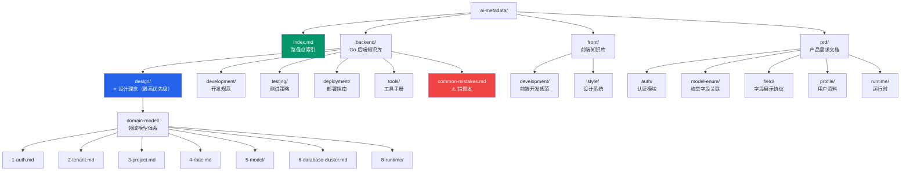

`ai-metadata/` 是 ModelCraft 项目的**结构化知识库**，承载了后端设计理念、前后端开发规范、测试策略、部署指南、工具手册、前端设计系统以及产品需求文档（PRD）。该目录以 [index.md](ai-metadata/index.md) 为统一入口，按**优先级分级**组织文档——当文档间出现冲突时，以「设计理念 > 开发规范 > 测试策略 > 部署指南 > 工具手册」为准。整个知识库由 AI Agent `metadata-index-keeper` 负责维护索引完整性和路径有效性，确保每次文件增删后索引自动同步。

Sources: [index.md](ai-metadata/index.md#L1-L10), [metadata-index-keeper.md](.agents/agents/metadata-index-keeper.md#L1-L30)

## 知识库整体架构

`ai-metadata/` 采用**三级目录**结构，顶层按知识领域（backend / front / prd）划分，二级按知识类型（design / development / testing / deployment / tools / style）分类，三级为具体文档文件。这种分层设计让开发者可以根据当前任务快速定位所需文档，而不必在海量文件中迷失。

Sources: [index.md](ai-metadata/index.md#L12-L60)

## 文档优先级规则

知识库中的文档存在明确的**优先级层次**。当不同文档对同一问题给出不同指导时，以高优先级文档为准。这一规则在 [index.md](ai-metadata/index.md) 头部声明，是整个知识体系的仲裁原则。

| 优先级 | 层级 | 对应目录 | 核心定位 |
|--------|------|----------|----------|
| **最高** | 设计理念 | `backend/design/` | 项目核心价值观、重大技术抉择、领域模型，不可动摇 |
| **高** | 开发规范 | `backend/development/`、`front/development/` | 将设计理念落地的编码指导 |
| **中高** | 错题本 | `backend/common-mistakes.md` | 真实 Bug 案例记录，代码审查前必读 Checklist |
| **中** | 测试策略 | `backend/testing/` | 验证实现是否符合设计的测试方法 |
| **中低** | 部署指南 | `backend/deployment/` | 环境配置与应用部署 |
| **辅助** | 工具手册 | `backend/tools/` | 开发工具安装与使用说明 |
| **参考** | 设计系统 | `front/style/` | 前端 UI 视觉规范 |
| **需求** | PRD | `prd/` | 产品需求定义，包含功能边界与验收标准 |

Sources: [index.md](ai-metadata/index.md#L4-L5), [design/README.md](ai-metadata/backend/design/README.md#L1-L6)

## Backend 知识库详解

后端知识库是 `ai-metadata/` 中最庞大的子体系，包含 6 个分类、共约 40 篇文档，覆盖从设计哲学到工具使用的完整知识链。

### 设计理念（design/）

设计理念目录定义了项目的**不可动摇的核心原则**，包含三大文档和一个领域模型子目录。[core-principles.md](ai-metadata/backend/design/core-principles.md) 记录了五项重大技术抉择：运行态仅提供 GraphQL、双 GraphQL 入口（设计态静态 Schema + 运行态动态 Schema）、认证委托 Casdoor、仅支持 SQL 系数据库、设计态与运行态完全解耦。[roadmap.md](ai-metadata/backend/design/roadmap.md) 则以「如实标注完成状态」为原则，记录了 v1.0 各模块的实现状态（基础可用 / 部分完成 / 规划中）。

领域模型子目录 `domain-model/` 按业务域拆分为 8 个子模块（认证、租户、项目、RBAC、模型、数据库集群、SQL 编辑器、运行时），每个子模块独立成文，定义了该域的实体、值对象、聚合根和业务规则。其中 `8-runtime/jsonschema-contract.md` 定义了 Runtime JSON Schema 的 `x-mc` 命名空间和 `widget` 规范，是运行态 API 的核心契约。

| 文档路径 | 说明 |
|----------|------|
| `design/README.md` | 设计理念总览，DDD / 清洁架构 / 关注点分离三大原则摘要 |
| `design/core-principles.md` | 项目定位（低代码数据模型管理平台）与五项重大技术抉择 |
| `design/roadmap.md` | v1.0 里程碑状态（多租户、项目管理、RBAC、模型设计、运行态 GraphQL 等） |
| `design/domain-model/1-auth.md` | 认证域：User 通过 ExternalID 关联 Casdoor |
| `design/domain-model/2-tenant.md` | 租户域：Organization 以 Name 为租户键 |
| `design/domain-model/3-project.md` | 项目域：(OrgName, Slug) 复合主键 |
| `design/domain-model/4-rbac.md` | 权限域：Role / Permission / UserRole / Casbin enforcer |
| `design/domain-model/5-model/` | 模型域：DataModel、FieldDefinition、EnumDefinition、LogicalForeignKey |
| `design/domain-model/6-database-cluster.md` | 数据库集群域：MySQL 连接管理 |
| `design/domain-model/8-runtime/jsonschema-contract.md` | Runtime JSON Schema 契约规范 |

Sources: [core-principles.md](ai-metadata/backend/design/core-principles.md#L1-L103), [design/README.md](ai-metadata/backend/design/README.md#L1-L54), [roadmap.md](ai-metadata/backend/design/roadmap.md#L1-L110)

### 开发规范（development/）

开发规范目录包含 10 篇文档，定义了如何将设计理念转化为可维护的 Go 代码。其中最关键的两篇是 [domain-development.md](ai-metadata/backend/development/domain-development.md)（Domain 层 Repository 接口设计规范）和 [repo-develop.md](ai-metadata/backend/development/repo-develop.md)（Repository 层 Go Wrapper 架构规范）。这两篇文档定义了 ModelCraft 后端开发的核心编码模式，包括 RecordNotFound 的两种处理模式、`ExecWithErrorHandling` / `QueryWithSQLErrorHandling` 包装约定、以及 Repository 层必须返回 `shared.RepositoryError` 而非 `*bizerrors.BusinessError` 的硬性规则。

| 文档路径 | 适用场景 |
|----------|----------|
| `development/architecture.md` | 理解 DDD 四层架构（Interfaces → Application → Domain → Infrastructure） |
| `development/domain-development.md` ⭐ | `internal/domain/**/*.go`，定义 Repository 接口时 |
| `development/repo-develop.md` ⭐ | `internal/infrastructure/**/*.go`，实现 Repository 时 |
| `development/error-handling.md` | 跨层错误处理，bizerrors 与 RepositoryError 双轨体系 |
| `development/contract-sync.md` | 修改 `api/` 目录时，GraphQL Schema 同步工作流 |
| `development/sqlc-custom-types.md` | sqlc 自定义类型实现 |
| `development/type-conversion.md` | 跨层类型转换规范 |
| `development/context-handling.md` | Go Context 传递规范 |
| `development/logging.md` | logfacade 使用与 Stack() 约束 |
| `development/comments.md` | 代码注释风格规范 |

Sources: [development/README.md](ai-metadata/backend/development/README.md#L1-L97)

### 错题本（common-mistakes.md）

[common-mistakes.md](ai-metadata/backend/common-mistakes.md) 是后端知识库中**独特且高价值**的文档，记录了真实发生过的后端 Bug 案例，供代码审查时作为 Checklist 使用。每条错误遵循 `BM-YYYYMMDD-XXXX` 编号规则，包含严重程度、分类、问题描述、错误代码对比、根因分析、症状描述、修复范围和 Checklist 规则。例如 `BM-20260415-0001` 记录了一条 **CRITICAL** 级别的数据隔离 Bug：`GetEnumsByNames` SQL 查询缺少 `org_name` 过滤条件，导致跨租户数据污染，由此提炼出的 Checklist 规则是「凡是查询带 `project_slug` 的 SQL，必须同时带 `org_name`」。

Sources: [common-mistakes.md](ai-metadata/backend/common-mistakes.md#L1-L64)

### 测试 / 部署 / 工具

测试策略目录以 [debugging-workflow.md](ai-metadata/backend/testing/debugging-workflow.md) 为核心（标注为「日常开发必读」），同时提供 BDD 测试指南和集成测试规范。测试金字塔强调 Domain 层 95%+ 覆盖率的单元测试为基础，集成测试为重点，E2E 测试覆盖关键流程。

部署指南强制要求所有基础服务（MySQL、Redis 等）通过 Docker 运行，禁止本地安装，确保环境一致性。

工具手册涵盖 goenv、just、Docker Compose、Atlas、sqlc、golangci-lint 等开发工具的安装与使用，以及 `just` 命令体系的完整参考。

Sources: [testing/README.md](ai-metadata/backend/testing/README.md#L1-L111), [deployment/README.md](ai-metadata/backend/deployment/README.md#L1-L50), [tools/README.md](ai-metadata/backend/tools/README.md#L1-L80)

## Frontend 知识库详解

前端知识库分为**开发规范**（`front/development/`）和**设计系统**（`front/style/`）两大板块，共约 13 篇文档。

### 开发规范（front/development/）

前端开发规范覆盖了架构分层（app / web / bff / shared 四层目录结构）、BFF 层设计、代码风格约定、ESLint 规则、React 最佳实践和 TypeScript 严格模式指南。特别值得注意的是 [architecture.md](ai-metadata/front/development/architecture.md) 中定义的组件分类规则：`features/` 放业务组件、`common/` 放通用组件、页面私有组件放在 `_components/` + `_hooks/` 目录下，以及 GraphQL Codegen 的代码生成流程。

| 文档路径 | 核心内容 |
|----------|----------|
| `development/architecture.md` | 目录分层、组件约定、Hooks 组织、GraphQL Codegen 流程 |
| `development/bff-design.md` | BFF 层设计规范 |
| `development/code-conventions.md` | 命名约定、导入顺序（React → 第三方 → 内部 → 相对） |
| `development/eslint-rules.md` | Tailwind CSS 规则、设计系统强制规则（字体、颜色） |
| `development/typescript-guide.md` | 严格模式配置、React 组件类型、Hooks 类型 |
| `development/react-best-practices.md` | 组件设计、State 管理、性能优化（memo / useMemo / useCallback） |
| `development/known-issues.md` | 已知问题与临时解决方案 |

Sources: [front/development/README.md](ai-metadata/front/development/README.md#L1-L100)

### 设计系统（front/style/）

设计系统目录定义了 ModelCraft 的视觉规范，核心原则是「**克制的 B2B 风格**」——专业、清晰、功能性优先。[STYLE.md](ai-metadata/front/style/STYLE.md) 是该板块的主文档（923 行），详细规定了颜色系统（主色 `#2563eb`、语义色、中性色）、字体体系（系统字体栈、8 级字号层次）、4px 基础间距单元、组件样式（按钮、卡片、表格、表单）和设计原则（禁止渐变、禁止透明效果、禁止装饰性光效）。此外 [tailwind-usage-policy.md](ai-metadata/front/style/tailwind-usage-policy.md) 定义了 Tailwind CSS 的使用策略，[design-system-demo-v2.html](ai-metadata/front/style/design-system-demo-v2.html) 提供了可视化 Demo。

| 文档路径 | 说明 |
|----------|------|
| `style/STYLE.md` | 设计系统主规范（颜色、字体、间距、圆角、阴影、组件） |
| `style/color-system.md` | 语义化颜色变量详解 |
| `style/quick-start.md` | 设计系统快速上手指南 |
| `style/tailwind-usage-policy.md` | Tailwind CSS 使用策略与约束 |
| `style/design-system-demo-v2.html` | 可视化设计系统 Demo 页面 |

Sources: [STYLE.md](ai-metadata/front/style/STYLE.md#L1-L60)

## PRD 产品需求文档

`prd/` 目录按功能模块组织产品需求文档，每个模块以 `00-xxx.md` 作为总览文件，向下拆分为详细设计子页。PRD 文档统一遵循「是什么问题 → 目标用户 → 用户故事 → 核心功能 → 不做什么 → 子页索引」的结构，明确划定了每个需求的**功能边界**。

| 模块 | 总览文件 | 核心内容 |
|------|----------|----------|
| **认证** | `prd/auth/00-auth.md` | 手机号+密码注册/登录，替换 Casdoor 为自研轻量方案 |
| **枚举字段关联** | `prd/model-enum/00-model-enum.md` | ENUM 字段绑定枚举定义、ENUM_LABEL 字段通过 relation 定位源枚举 |
| **字段展示协议** | `prd/field/00-field-label-field.md` | 关系字段统一展示协议（`__label` + 模型级 `displayField`） |
| **用户资料** | `prd/profile/profile.md` | User / Profile 分表设计，注册联动创建，联合查询 |
| **运行时** | `prd/runtime/field-relation-selector.md` | 多对一外键字段升级为下拉选择器 |

以认证模块为例，[00-auth.md](ai-metadata/prd/auth/00-auth.md) 明确了「不做什么」的边界：不做短信验证码、不做第三方登录、不做忘记密码、不做邮箱注册、无存量用户数据迁移。这种明确的 Out-of-Scope 声明，配合 [01-auth-login.md](ai-metadata/prd/auth/01-auth-login.md) 和 [02-auth-register.md](ai-metadata/prd/auth/02-auth-register.md) 的详细子页设计，确保了开发团队对需求的理解无歧义。

Sources: [auth/00-auth.md](ai-metadata/prd/auth/00-auth.md#L1-L61), [profile/profile.md](ai-metadata/prd/profile/profile.md#L1-L37), [model-enum/00-model-enum.md](ai-metadata/prd/model-enum/00-model-enum.md#L1-L40)

## 索引维护机制

`ai-metadata/` 的索引维护由专用 AI Agent `metadata-index-keeper` 负责，其职责定义在 [.agents/agents/metadata-index-keeper.md](.agents/agents/metadata-index-keeper.md)。该 Agent 在以下场景触发：知识文件新增/修改/删除时同步更新 `index.md`、用户写完知识内容后自动摘要并录入索引、定期校验 `.agents/` 配置文件中对 `ai-metadata/` 的交叉引用是否有效。

维护流程遵循**先读后写**原则：Agent 必须通读文件内容后才能生成摘要，不得凭文件名臆测。索引格式采用统一的 Markdown 表格（路径 + 说明），路径使用相对于 `ai-metadata/` 的相对路径。当发现 `.agents/agents/`、`.agents/commands/`、`.agents/skills/` 中存在指向 `ai-metadata/` 的断链引用时，Agent 会精确报告（配置文件路径 + 行号 + 无效路径），并给出修正建议。

Sources: [metadata-index-keeper.md](.agents/agents/metadata-index-keeper.md#L40-L121)

## 文档阅读路线建议

根据你的角色和当前任务，推荐以下阅读路线：

**后端开发者（首次接触项目）**：
1. [项目总览：ModelCraft 低代码数据模型管理平台](1-xiang-mu-zong-lan-modelcraft-di-dai-ma-shu-ju-mo-xing-guan-li-ping-tai) → 建立全局认知
2. `ai-metadata/backend/design/core-principles.md` → 理解五项重大技术抉择
3. `ai-metadata/backend/development/architecture.md` → 掌握 DDD 四层架构
4. `ai-metadata/backend/common-mistakes.md` → 避免已知的坑
5. `ai-metadata/backend/testing/debugging-workflow.md` → 日常开发调试必读

**前端开发者（首次接触项目）**：
1. [项目总览：ModelCraft 低代码数据模型管理平台](1-xiang-mu-zong-lan-modelcraft-di-dai-ma-shu-ju-mo-xing-guan-li-ping-tai) → 建立全局认知
2. `ai-metadata/front/development/README.md` → 前端开发规范总览
3. `ai-metadata/front/development/architecture.md` → 理解 app/web/bff/shared 分层
4. `ai-metadata/front/style/quick-start.md` → 设计系统快速上手

**全栈功能开发（接到 PRD 任务）**：
1. 阅读 `ai-metadata/prd/<模块>/00-xxx.md` 总览 → 理解需求边界
2. 阅读子页详细设计 → 明确交互与接口
3. 参考 `ai-metadata/backend/design/domain-model/` 对应域 → 理解领域模型
4. 参考 `ai-metadata/backend/development/domain-development.md` → 编码落地

Sources: [index.md](ai-metadata/index.md#L1-L217)

## 知识库统计总览

| 分类 | 文档数量 | 覆盖范围 |
|------|----------|----------|
| Backend - 设计理念 | 12+ | 核心原则、路线图、8 个领域模型子域 |
| Backend - 开发规范 | 10 | DDD 分层、Repository 模式、错误处理、sqlc、日志 |
| Backend - 测试策略 | 2+ | BDD 指南、调试工作流 |
| Backend - 部署指南 | 1+ | Docker 环境强制规则、部署流程 |
| Backend - 工具手册 | 2+ | justfile 参考、工具安装 |
| Backend - 错题本 | 1 | 真实 Bug Checklist（持续积累） |
| Frontend - 开发规范 | 7 | 架构、BFF、代码风格、ESLint、React、TypeScript |
| Frontend - 设计系统 | 5 | 颜色、字体、间距、组件、Tailwind 策略 |
| PRD | 15+ | 认证、枚举、字段协议、用户资料、运行时 |
| **合计** | **~69 篇** | 覆盖项目全栈知识 |