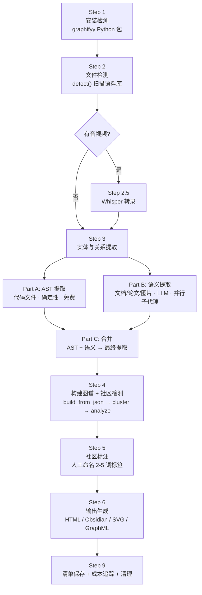

Graphify 是 ModelCraft 项目中集成的**代码知识图谱生成引擎**，由 `.agents/skills/graphify/SKILL.md` 技能定义驱动。它将任意目录下的文件（代码、文档、论文、图片、音视频）转化为一张**可导航、可查询、可审计**的知识图谱，通过社区检测自动发现跨文件的结构关联，输出交互式 HTML 可视化、GraphRAG 就绪的 JSON、以及纯文本审计报告。核心理念源自 Andrej Karpathy 的 `/raw` 文件夹工作流——将所有素材投入一个目录，让图谱揭示你未曾意识到的连接。

Sources: [SKILL.md](.agents/skills/graphify/SKILL.md#L1-L9)

## 定位与核心价值

Graphify 解决的是**大型代码库的认知负载问题**。对于 ModelCraft 这样包含 631 个源文件、约 153 万词的项目，人工阅读所有代码几乎不可能。Graphify 提供了三个超越直接 LLM 对话的能力：

| 能力 | 说明 |
|------|------|
| **持久化图谱** | 关系存储在 `graphify-out/graph.json`，跨会话存活，无需重复阅读全部源码 |
| **诚实审计轨迹** | 每条边标记为 EXTRACTED / INFERRED / AMBIGUOUS，明确区分源码实证与推理推断 |
| **跨文档惊喜发现** | 社区检测算法自动发现不同文件间隐藏的概念连接 |

Sources: [SKILL.md](.agents/skills/graphify/SKILL.md#L41-L54)

## 架构总览：七步流水线

Graphify 的执行流程是一个严格的七步流水线，每一步的输出作为下一步的输入。以下是完整的处理架构：



Sources: [SKILL.md](.agents/skills/graphify/SKILL.md#L56-L436)

## 双通道提取：AST + 语义

Graphify 的实体关系提取分为两条**并行执行的通道**，这是性能与精度的关键设计。

**Part A — AST 结构化提取**针对代码文件（Go、TypeScript、Python 等），通过抽象语法树解析器确定性地提取 `import`、`calls`、`contains`、`method` 等关系。这一步**零 token 消耗**，速度极快。在 ModelCraft 的实际运行中，AST 贡献了绝大多数的 9,714 条边。

**Part B — 语义提取**针对文档、论文和图片，通过并行子代理（Agent tool）以 20-25 文件为一个 chunk 进行批量处理。每个子代理独立输出 JSON 格式的节点和边，支持 `EXTRACTED`（源码明确）、`INFERRED`（合理推断）、`AMBIGUOUS`（不确定标记）三种置信度标签。图片通过视觉能力理解其内容语义（UI 截图、图表、手写白板等），而非简单 OCR。

**Part C — 合并**阶段将 AST 节点优先保留，语义节点按 ID 去重后追加，边则直接合并，形成最终的统一提取结果。

Sources: [SKILL.md](.agents/skills/graphify/SKILL.md#L161-L389)

## 边关系类型与置信度体系

图谱中的每条边都携带 `confidence` 标签和 `confidence_score` 数值，构成 Graphify 的**诚实审计**基石：

| 关系类型 | 数量 | 含义 | 置信度 |
|----------|------|------|--------|
| `calls` | 3,521 | 函数/方法调用关系 | EXTRACTED = 1.0 |
| `method` | 3,417 | 类-方法隶属关系 | EXTRACTED = 1.0 |
| `contains` | 2,663 | 文件-实体包含关系 | EXTRACTED = 1.0 |
| `references` | 87 | 概念引用关系 | EXTRACTED / INFERRED |
| `conceptually_related_to` | 17 | 语义相似（非结构连接） | INFERRED 0.6-0.95 |
| `rationale_for` | 9 | 设计决策说明 | EXTRACTED / INFERRED |

从 ModelCraft 的实际数据看，**99.8% 的边为 EXTRACTED**（9,696 条），仅 18 条为 INFERRED，这体现了以 AST 为主、语义为辅的保守策略，确保图谱的可信度。

Sources: [graph.json](graphify-out/graph.json#L1-L80), [SKILL.md](.agents/skills/graphify/SKILL.md#L256-L301)

## 社区检测与超边

构建完图谱后，Graphify 使用社区检测算法（基于 NetworkX 的 `cluster()` 实现）将节点划分为社区。在 ModelCraft 的实际产出中：

- **6,957 个节点**被划分为 **884 个社区**
- 最大的 Community 0 包含 1,292 个节点（主要是 GraphQL schema 生成代码），内聚性较低（0.0），提示可能需要模块拆分
- 中等规模社区如 Community 2（145 节点，Safe Querier 层）和 Community 3（142 节点，枚举查询层）具有更明确的领域边界

**超边（Hyperedges）** 是 Graphify 独有的高阶关系表达，用于捕获 3 个以上节点共同参与的架构模式。ModelCraft 图谱中检测到的 5 条超边直接映射了项目的核心架构概念：

| 超边 | 参与节点数 | 置信度 | 来源 |
|------|-----------|--------|------|
| Backend DDD Layer System | 5 | EXTRACTED (1.0) | ai-metadata/backend |
| Backend Error Handling System | 5 | INFERRED (0.9) | ai-metadata/backend |
| Repository Layer Go Wrapper Architecture | 4 | EXTRACTED (1.0) | ai-metadata/backend |
| Frontend Tech Architecture Stack | 6 | INFERRED (0.85) | ai-metadata/front |
| Frontend Styling System | 5 | INFERRED (0.9) | ai-metadata/front |

Sources: [graph.json](graphify-out/graph.json#L1-L80)

## ModelCraft 实际图谱数据解读

以下是对 ModelCraft 项目执行 `/graphify .` 后的 `graphify-out/` 产出数据的量化解读：

**语料规模**：631 文件，约 1,536,119 词，100% EXTRACTED 提取率，0 token 消耗（纯 AST 提取，无 LLM 语义调用）。

**节点分布**：

| 文件类型 | 节点数 | 占比 |
|----------|--------|------|
| code | 6,621 | 95.2% |
| rationale | 174 | 2.5% |
| document | 162 | 2.3% |

**边的来源分布**（按顶级目录）：

| 目录 | 边数 | 说明 |
|------|------|------|
| modelcraft-backend | 8,955 | 后端 Go 代码主导 |
| modelcraft-front | 605 | 前端 TypeScript |
| ai-metadata | 113 | AI 知识文档 |
| tests-bdd | 41 | BDD 测试代码 |

Sources: [GRAPH_REPORT.md](graphify-out/GRAPH_REPORT.md#L1-L11), [cost.json](graphify-out/cost.json#L1-L19)

## 关键社区的语义映射

通过分析各社区的代表节点标签，可以将 884 个社区映射到 ModelCraft 的实际架构模块：

| 社区 | 规模 | 语义识别 | 代表节点 |
|------|------|----------|----------|
| Community 0 | 1,292 | GraphQL Schema 生成层 | `.Complexity()`, `.field_Mutation_*_args()` |
| Community 1 | 388 | 后端领域模型与错误类型 | `model_gen.go`, `AddFieldsError`, `CreateEnumError` |
| Community 2 | 145 | Safe Querier 数据访问层 | `safe_querier_gen.go`, `NewSafeQuerier()` |
| Community 3 | 142 | 枚举/字段查询服务 | `Queries`, `.CreateEnumDefinition()` |
| Community 4 | 107 | GraphQL 可执行 Schema | `generated.go`, `NewExecutableSchema()` |
| Community 5 | 98 | GraphQL 枚举类型系统 | `ActualConstraintType`, `ClusterStatus` |
| Community 6 | 91 | OpenAPI REST 代码生成 | `server.gen.go`, `AuthInvalidInputErrorErrorCode` |
| Community 7 | 87 | Model CRUD Mutation 参数 | `.field_Mutation_addFields_args()` |

Sources: [graph.json](graphify-out/graph.json#L1-L30)

## 增量更新与缓存机制

Graphify 的 `--update` 模式实现了**增量式图谱维护**，避免每次变更后全量重建：

1. `detect_incremental()` 对比 `manifest.json` 中的文件时间戳，仅识别新增或修改的文件
2. 若变更全部为代码文件（`code_only=True`），跳过语义提取，仅运行 AST——零 token 成本
3. 若包含文档/论文变更，则对未缓存文件执行语义子代理提取
4. 合并阶段自动修剪已删除文件的"幽灵节点"，通过 `graph_diff()` 生成变更摘要

提取缓存存储在 `graphify-out/cache/` 目录下（文件内容的 SHA-256 哈希为键），每个 JSON 文件记录对应文件的节点和边提取结果，避免重复处理。

Sources: [SKILL.md](.agents/skills/graphify/SKILL.md#L209-L231), [SKILL.md](.agents/skills/graphify/SKILL.md#L758-L862)

## 多格式输出与集成

Graphify 支持丰富的输出格式和集成路径：

| 输出 | 触发方式 | 用途 |
|------|----------|------|
| `graph.html` | 默认 | 浏览器交互式力导向图，支持社区着色和节点搜索 |
| `GRAPH_REPORT.md` | 默认 | 审计报告，含 God Nodes、惊喜连接、建议问题 |
| `graph.json` | 默认 | NetworkX node-link 格式，可被任何图工具加载 |
| `obsidian/` | `--obsidian` | Obsidian 知识库，每节点一笔记 + `graph.canvas` |
| `graph.svg` | `--svg` | 静态矢量图，可嵌入 Notion/GitHub |
| `graph.graphml` | `--graphml` | Gephi/yEd 分析格式 |
| `cypher.txt` | `--neo4j` | Neo4j Cypher 导入脚本 |
| MCP Server | `--mcp` | stdio 协议服务，暴露 `query_graph`、`shortest_path` 等工具 |

MCP Server 模式尤其值得关注——它将图谱变成一个**可供其他 AI Agent 实时查询的知识服务**，配置到 Claude Desktop 后，任何 Agent 都可以遍历图谱、查找最短路径、获取社区统计。

Sources: [SKILL.md](.agents/skills/graphify/SKILL.md#L483-L646)

## 查询与遍历

构建完成的图谱支持两种遍历策略：

| 模式 | 参数 | 适用场景 |
|------|------|----------|
| BFS（默认） | 无 | "X 连接了什么？"——广度优先，近邻优先 |
| DFS | `--dfs` | "X 如何到达 Y？"——深度优先，追踪依赖链 |

此外还支持 `path "A" "B"` 计算两个概念间的最短路径，以及 `explain "概念"` 获取节点的自然语言解释。所有查询均基于已持久化的 `graph.json`，无需重新提取。

Sources: [SKILL.md](.agents/skills/graphify/SKILL.md#L913-L940)

## 产出目录结构

执行 `/graphify .` 后，`graphify-out/` 的典型结构如下：

```
graphify-out/
├── .graphify_python          # Python 解释器路径（跨调用持久化）
├── GRAPH_REPORT.md           # 审计报告（God Nodes + 惊喜连接 + 建议问题）
├── graph.json                # 完整图谱数据（nodes + links + hyperedges）
├── manifest.json             # 文件时间戳清单（供 --update 增量检测）
├── cost.json                 # 累计 token 消耗追踪
└── cache/                    # 提取缓存（SHA-256 哈希 → 节点/边 JSON）
    ├── 0004fbc5....json
    ├── 01422a26....json
    └── ...                   # 每个已处理文件一个缓存条目
```

Sources: [cost.json](graphify-out/cost.json#L1-L19), [manifest.json](graphify-out/manifest.json#L1-L10)

## 成本追踪记录

`cost.json` 记录了每次运行的 token 消耗，为团队提供成本透明度。ModelCraft 项目的两次运行记录：

| 运行日期 | 文件数 | Input Tokens | Output Tokens | 备注 |
|----------|--------|-------------|--------------|------|
| 2026-04-13 13:47 | 1,002 | 0 | 0 | 首次全量运行，纯 AST |
| 2026-04-13 14:23 | 26 | 0 | 0 | `--update` 增量更新 |

两次运行均为零 token 消耗，因为 ModelCraft 的图谱当前仅依赖 AST 结构化提取（代码文件占比 95%+），尚未触发 LLM 语义提取通道。

Sources: [cost.json](graphify-out/cost.json#L1-L19)

## 延伸阅读

- 了解 Graphify 背后的 AST 提取如何与 sqlc 代码生成协作：[数据层：sqlc 代码生成与 Safe Querier 模式](9-shu-ju-ceng-sqlc-dai-ma-sheng-cheng-yu-safe-querier-mo-shi)
- 理解被图谱捕获的 DDD 分层架构：[DDD 分层架构：Domain → Application → Infrastructure → Interfaces](6-ddd-fen-ceng-jia-gou-domain-application-infrastructure-interfaces)
- 查看图谱中 ai-metadata 节点的知识文档来源：[ai-metadata 知识文档体系与索引](25-ai-metadata-zhi-shi-wen-dang-ti-xi-yu-suo-yin)