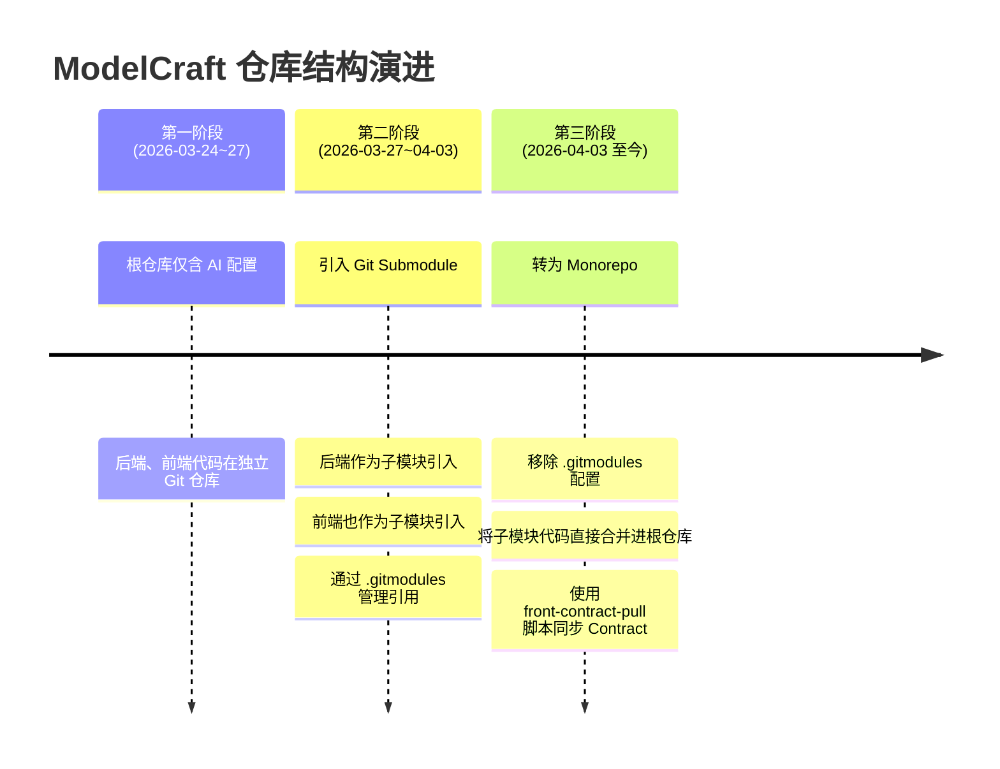
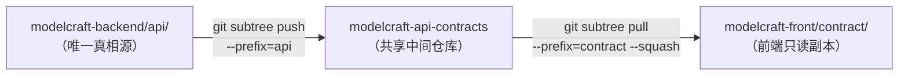
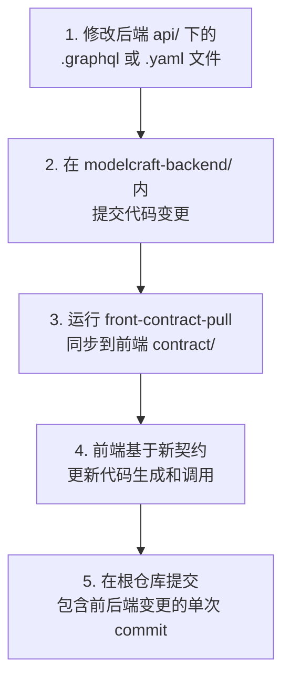

ModelCraft 项目在版本控制层面经历了一次清晰的架构演进——从 **Git Submodule 管理独立子仓库**，到 **Git Subtree 共享 API Contract**，最终收敛为**一体化 Monorepo**。理解这条演进路径，是理解整个项目协作模型的关键前提。本文将从当前仓库结构出发，拆解 Submodule 与 Subtree 两种机制的实战用法，帮助你建立对项目代码组织方式的直觉认知。

Sources: [AGENTS.md](AGENTS.md)

## 当前仓库全景

ModelCraft 采用 **Monorepo（单一仓库）** 结构，所有代码存放在同一个 Git 仓库中。仓库根目录下有三个核心子目录，分别承载后端、前端和 BDD 验收测试三个独立工程：

```
modelcraft/                          ← Monorepo 根仓库
├── modelcraft-backend/              ← Go 后端（Gin + GraphQL + sqlc）
├── modelcraft-front/                ← Next.js 前端（React + Apollo Client）
├── tests-bdd/                       ← Cucumber.js BDD 验收测试
├── .agents/                         ← AI Agent 配置（统一真相源）
├── ai-metadata/                     ← 知识文档体系
├── graphify-out/                    ← 代码知识图谱
├── docs/                            ← 工程文档
└── plans/                           ← 开发计划
```

三个工程各有独立的技术栈和构建工具（`go mod`、`npm`、独立的 `tsconfig.json`），但共享同一个 Git 历史。这种结构让跨前后端的 API Contract 变更可以在一次提交中完成，无需在多个仓库之间手动协调。

Sources: [AGENTS.md](AGENTS.md#L5-L12)

## 演进历史：从 Submodule 到 Monorepo

项目并非一开始就是 Monorepo。通过 Git 历史可以清晰地追溯三个阶段：



### 第二阶段：Submodule 架构（已废弃）

在 Submodule 阶段，仓库的 `.gitmodules` 文件定义了两个子模块引用：

| 子模块 | 本地路径 | 远程仓库 | 追踪分支 |
|--------|---------|---------|---------|
| Backend (Go) | `./modelcraft-backend` | `git.woa.com/lukemxjia/modelcraft-go.git` | `main` |
| Frontend (Next.js) | `./modelcraft-front` | `git.woa.com/lukemxjia/modelcraft-front.git` | 默认 |

在此模式下，`modelcraft-backend/` 和 `modelcraft-front/` 在 Git 中以 **commit 引用**（`160000` 模式）存储——根仓库只记录子模块指向的某个特定提交哈希，不存储子模块的实际文件内容。这意味着克隆仓库时必须使用 `--recurse-submodules` 才能获取完整代码。

**为什么放弃 Submodule？** Submodule 的核心痛点在于：子模块的更新需要先在子仓库内提交、推送，再回到根仓库更新引用指针——这个"两步提交"流程导致跨前后端的协调性变更（例如同时修改 GraphQL Schema 和前端调用代码）需要至少三次提交才能完成。对于快速迭代的早期项目，这种开销是不可接受的。

Sources: [git show 1239aab:.gitmodules](AGENTS.md#L27-L44)

### 第三阶段：Monorepo 转换

2026 年 4 月 3 日，项目通过两个连续提交完成了 Monorepo 转换：

1. **`ac3c31d`** — 将后端和前端子模块的所有文件（1037 个文件）直接合并进根仓库
2. **`ddbeeff`** — 删除 `.gitmodules` 文件，移除 Submodule 配置

转换后，Git 中 `modelcraft-backend/` 从 `160000 commit`（子模块引用）变为 `040000 tree`（普通目录），所有文件都直接纳入根仓库版本管理。

Sources: [git show ac3c31d --stat](modelcraft-backend/AGENTS.md)

## API Contract 共享机制

即使在 Monorepo 中，前后端仍然保持着"**Contract First（契约优先）**"的开发理念。后端 `modelcraft-backend/api/` 目录是 API 契约的**唯一真相源**，前端通过同步机制获取最新契约文件。

### 契约目录结构对照

```
modelcraft-backend/api/              ← 唯一真相源（可编辑）
├── graph/
│   ├── org/schema/                  ← Org 域 GraphQL Schema
│   │   ├── api_key.graphql
│   │   ├── base.graphql
│   │   ├── permission.graphql
│   │   ├── profile.graphql
│   │   ├── project.graphql
│   │   ├── schema.graphql
│   │   └── user_management.graphql
│   └── project/schema/              ← Project 域 GraphQL Schema
│       ├── base.graphql
│       ├── cluster.graphql
│       ├── enum.graphql
│       ├── field.graphql
│       ├── logical_foreign_key.graphql
│       ├── model.graphql
│       ├── schema.graphql
│       └── runtime-json-schema-contract.md
└── openapi/                          ← REST API OpenAPI 规范
    ├── auth.yaml
    ├── common.yaml
    ├── openapi-root.yaml
    ├── org.yaml
    ├── user.yaml
    └── webhook.yaml

modelcraft-front/contract/           ← 前端消费端（只读，禁止手动修改）
├── graph/                            ← 同步自后端 api/graph/
└── openapi/                          ← 同步自后端 api/openapi/
```

注意后端 `api/openapi/` 中有些文件是后端专属的（如 `oapi-codegen.yaml`、`openapi.yaml`、`examples/`），这些在同步到前端时会被自动过滤。

Sources: [modelcraft-backend/api/README.md](modelcraft-backend/api/README.md#L1-L30), [.agents/skills/front-contract-pull/SKILL.md](.agents/skills/front-contract-pull/SKILL.md#L18-L29)

### 原始设计：Git Subtree 方案

项目的 API 契约共享最初设计为基于 Git Subtree 的三方同步模型：



| 角色 | Remote 名称 | Subtree 前缀 | Squash 策略 |
|------|-----------|-------------|-----------|
| 后端（生产者） | `contracts` | `api/` | 不使用（保留完整历史） |
| 前端（消费者） | `contracts` | `contract/` | 使用（保持前端历史整洁） |

Subtree 方案的核心优势是：后端和前端可以是完全独立的 Git 仓库，通过一个共享中间仓库 `modelcraft-api-contracts` 进行桥接，**不依赖根仓库**。Squash 策略的不同体现了"生产者保留历史、消费者保持简洁"的原则。

Sources: [AGENTS.md](AGENTS.md#L46-L67)

### 当前实践：front-contract-pull 脚本

Monorepo 转换后，由于后端和前端代码已在同一仓库中，项目引入了一个更简洁的同步方式——**`front-contract-pull` Skill**，它通过一个 Shell 脚本直接将后端 `api/` 目录的内容复制到前端 `contract/` 目录：

```bash
# 同步契约（在仓库根目录或任意子目录执行均可）
bash .agents/skills/front-contract-pull/scripts/sync-contracts.sh
```

脚本的同步逻辑非常直接：清除前端 `contract/` 目录 → 复制后端 `api/graph/` 和 `api/openapi/` → 过滤掉后端专属文件。它自动检测仓库根目录（向上查找同时包含 `modelcraft-front/` 和 `modelcraft-backend/` 的目录），因此可以在任意子目录中执行。

**被过滤的后端专属文件：**

| 文件 | 过滤原因 |
|------|---------|
| `openapi/openapi.yaml` | 合并后的完整 spec，属于生成产物 |
| `openapi/oapi-codegen.yaml` | Go 代码生成器配置，前端无用 |
| `openapi/examples/` | 请求/响应示例数据 |
| `openapi/README.md` | 后端维护说明 |

Sources: [.agents/skills/front-contract-pull/scripts/sync-contracts.sh](.agents/skills/front-contract-pull/scripts/sync-contracts.sh#L1-L61), [.agents/skills/front-contract-pull/SKILL.md](.agents/skills/front-contract-pull/SKILL.md#L1-L52)

### Subtree 方案 vs 脚本方案对比

| 维度 | Git Subtree 方案 | front-contract-pull 脚本 |
|------|----------------|------------------------|
| **适用场景** | 子模块阶段，前后端在独立仓库 | Monorepo 阶段，前后端在同一仓库 |
| **同步机制** | 通过共享中间仓库桥接 | 直接文件系统复制 |
| **网络依赖** | 需要访问共享 Git 仓库 | 无需网络，纯本地操作 |
| **历史追溯** | 保留契约变更的完整 Git 历史 | 契约变更随主仓库提交记录 |
| **一致性保证** | Git 哈希保证 | 脚本执行后需 `git diff` 验证 |

两种方案并非互斥——如果未来项目恢复多仓库模式，可以重新启用 Subtree 方案，脚本方案作为 Monorepo 下的轻量替代。

Sources: [AGENTS.md](AGENTS.md#L46-L67), [.agents/skills/front-contract-pull/SKILL.md](.agents/skills/front-contract-pull/SKILL.md#L1-L52)

## 日常开发工作流

### 修改 API 契约的完整流程

当你需要新增或修改 API 接口时，遵循"**先改契约、再改实现**"的原则：



具体命令：

```bash
# 步骤 1: 编辑后端契约文件
vim modelcraft-backend/api/graph/project/schema/model.graphql

# 步骤 2: 提交后端变更
cd modelcraft-backend
git add api/
git commit -m "feat(api): add new fields to model schema"

# 步骤 3: 同步契约到前端
cd ..
bash .agents/skills/front-contract-pull/scripts/sync-contracts.sh

# 步骤 4: 前端更新（codegen 等）
cd modelcraft-front
# 运行 codegen...

# 步骤 5: 在根仓库统一提交
cd ..
git add modelcraft-backend/ modelcraft-front/
git commit -m "feat: add new model fields (backend + frontend)"
```

**核心规则：**
- **后端 `api/` 是唯一真相源** — 所有 API 契约变更只能从后端发起
- **前端禁止直接修改 `contract/`** — 必须通过同步机制获取
- **先 push 再 pull** — 后端必须先完成变更，前端才能同步

Sources: [modelcraft-backend/api/README.md](modelcraft-backend/api/README.md#L12-L24), [AGENTS.md](AGENTS.md#L69-L76)

## Submodule 与 Subtree 核心概念速查

对于初次接触这两种 Git 机制的读者，这里提供一个快速对照：

### Git Submodule（子模块）

**本质**：在一个 Git 仓库中嵌入对另一个 Git 仓库的**指针引用**。根仓库只存储子模块的 commit SHA，不存储子模块的文件内容。

| 操作 | 命令 |
|------|------|
| 克隆含子模块的项目 | `git clone --recurse-submodules <url>` |
| 初始化已有仓库的子模块 | `git submodule update --init --recursive` |
| 更新子模块到远程最新 | `git submodule update --remote` |
| 将子模块更新提交到根仓库 | `git add <submodule-path>` → `git commit` |

**适用场景**：子项目有独立的版本发布节奏、需要被多个项目复用、或者有严格的访问权限隔离需求。

### Git Subtree（子树）

**本质**：将另一个仓库的某个子目录**合并**到当前仓库的指定路径下。与 Submodule 不同，Subtree 会把外部仓库的文件内容直接复制进当前仓库的历史中。

| 操作 | 命令 |
|------|------|
| 添加外部仓库的子目录 | `git subtree add --prefix=<path> <remote> <branch> --squash` |
| 推送本地修改到外部仓库 | `git subtree push --prefix=<path> <remote> <branch>` |
| 拉取外部仓库的最新更新 | `git subtree pull --prefix=<path> <remote> <branch> --squash` |

**适用场景**：需要在两个仓库之间共享某个特定目录的内容、保持目录级别的独立版本管理。

### 选择决策树

| 条件 | 推荐方案 |
|------|---------|
| 子项目需要独立版本管理 | Submodule |
| 只需共享部分目录 | Subtree |
| 所有代码由同一团队维护 | Monorepo（当前方案） |
| 需要跨仓库共享特定目录 + 保持历史 | Subtree |
| 子项目被多个上层项目引用 | Submodule |

Sources: [AGENTS.md](AGENTS.md#L27-L44), [AGENTS.md](AGENTS.md#L46-L67)

## 总结

ModelCraft 的仓库结构体现了务实的工程选择：项目在早期探索阶段使用 Submodule 保持前后端的独立性，在协作摩擦增大后果断转为 Monorepo 以提升开发效率。API 契约共享机制从 Subtree 三方桥接简化为脚本直接复制，但"**后端 `api/` 为唯一真相源**"这一核心原则始终未变。理解这个演进过程，能帮助你理解为什么项目文档中仍然会提到 Submodule 和 Subtree 这些概念——它们是架构决策的历史印记，也是团队在"独立性与协作效率"之间反复权衡的真实记录。

Sources: [AGENTS.md](AGENTS.md#L1-L76)

---

**下一步阅读建议**：
- 了解 AI Agent 如何统一管理跨仓库配置：[AI Agent 配置体系：.agents 统一管理](4-ai-agent-pei-zhi-ti-xi-agents-tong-guan-li)
- 深入 API Contract 同步的代码生成细节：[API Contract 单一真相源：Git Subtree 同步机制](18-api-contract-dan-zhen-xiang-yuan-git-subtree-tong-bu-ji-zhi)
- 了解前端如何消费契约进行代码生成：[GraphQL Codegen 与 oapi-codegen 代码生成流水线](19-graphql-codegen-yu-oapi-codegen-dai-ma-sheng-cheng-liu-shui-xian)