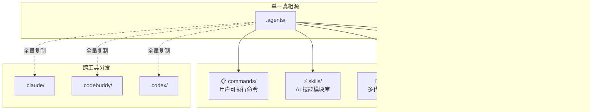

ModelCraft 项目采用 **`.agents/` 目录作为 AI Agent 配置的单一真相源**，统一管理智能体的角色定义、技能模块、工作流命令、生命周期钩子与代码规范规则。这套体系同时被 Claude Code、CodeBuddy 和 Codex 三种 AI 工具共享——通过全量复制（agents/commands/hooks/rules）和内容一致复制（skills）的方式实现跨工具配置同步。理解这套配置体系，是高效与 AI 协作开发 ModelCraft 的第一步。

Sources: [DIRECTORY_STRUCTURE.md](.agents/DIRECTORY_STRUCTURE.md#L1-L12), [EXPLORATION_SUMMARY.md](.agents/EXPLORATION_SUMMARY.md#L24-L32)

## 整体架构：五层配置目录

`.agents/` 目录由五个功能明确的子目录组成，每个目录承担不同的职责。在深入每个目录之前，先通过下面的架构图建立全局认知：



五种配置类型的定位差异如下表所示：

| 特性 | Command | Skill | Agent | Hook | Rule |
|------|---------|-------|-------|------|------|
| **目录** | `commands/` | `skills/` | `agents/` | `hooks/` | `rules/` |
| **文件名** | `*.md` | `SKILL.md` | `*.md` | `*.py` / `*.sh` | `*.md` |
| **触发方式** | 用户显式调用 `/name` | AI 自动识别触发 | 多代理场景中分派 | 工具执行前后自动拦截 | 编辑匹配路径文件时自动触发 |
| **YAML Frontmatter** | ✓（name, description, argument-hint） | ✓（name, description） | ✓（name, description, Examples, tool） | ✗ | ✓（paths） |
| **核心作用** | 引导复杂多步骤工作流 | 封装可复用的任务执行流程 | 定义角色人格与职责边界 | 安全拦截 / 通知 / 自动 lint | 注入代码规范约束 |

Sources: [FORMAT_CHEATSHEET.md](.agents/FORMAT_CHEATSHEET.md#L1-L16), [QUICK_REFERENCE.md](.agents/QUICK_REFERENCE.md#L291-L306)

## 跨工具同步机制：单一真相源 + 全量复制

一个关键的设计决策是：**`.agents/` 是唯一编辑入口**，其他工具目录（`.claude/`、`.codebuddy/`、`.codex/`）是它的完整镜像。经 `diff -r` 验证，agents、commands、hooks、rules 四个目录在三个工具目录中内容完全一致；skills 则同样保持内容同步。

```
.agents/                          ← 唯一真相源（在此编辑）
├── agents/    → 复制到 → .claude/agents/    .codebuddy/agents/    .codex/agents/
├── commands/  → 复制到 → .claude/commands/  .codebuddy/commands/  .codex/commands/
├── hooks/     → 复制到 → .claude/hooks/     .codebuddy/hooks/     .codex/hooks/
├── rules/     → 复制到 → .claude/rules/     .codebuddy/rules/     .codex/rules/
└── skills/    → 复制到 → .claude/skills/    .codebuddy/skills/    .codex/skills/
```

各工具的 `settings.json` 配置中通过 `$CLAUDE_PROJECT_DIR/.agents/hooks/` 或 `$CODEBUDDY_PROJECT_DIR/.agents/hooks/` 等路径引用钩子脚本，确保所有工具读取的是同一份配置。这意味着：**修改配置时，只需编辑 `.agents/` 中的文件，然后同步到其他工具目录**。

Sources: [.claude/settings.json](.claude/settings.json#L6-L67), [.codebuddy/settings.json](.codebuddy/settings.json#L1-L42), [skill-manager/SKILL.md](.agents/skills/skill-manager/SKILL.md#L17-L28)

## Agents：多代理角色定义

`agents/` 目录定义了 10 个专业化的 AI 角色，每个角色以独立 Markdown 文件描述。当使用 `/multi-agent` 命令执行复杂任务时，系统会根据任务性质将工作分派给对应的 Agent。

### 现有 Agent 全景

| Agent 文件 | 角色 | 核心职责 |
|------------|------|----------|
| `pm.md` | 产品经理 | 澄清需求、输出 PRD 到 `ai-metadata/prd/` |
| `backend-worker.md` | 后端实现者 | 将技术方案转化为 Go 代码，严格遵循 DDD 分层 |
| `backend-api.md` | 后端 API 设计者 | 设计 GraphQL/REST API 接口 |
| `backend-reviewer.md` | 后端审查者 | 代码审查 + BDD 测试验证，不修改源码 |
| `front-architect.md` | 前端架构师 | 规划目录结构、组件拆分方案 |
| `front-worker.md` | 前端实现者 | 将架构方案转化为 React/Next.js 代码 |
| `front-reviewer.md` | 前端审查者 | 前端代码审查与质量把关 |
| `metadata-index-keeper.md` | 知识库管理员 | 维护 `ai-metadata/index.md` 索引完整性 |
| `agents-md-purifier.md` | 文档净化器 | 保持 AGENTS.md 只含通用规则，迁移领域知识 |
| `prd-page-splitter.md` | PRD 拆分器 | 将总览 PRD 拆分为子页文档 |

### Agent 文件格式

每个 Agent 文件遵循 **YAML Frontmatter + Markdown 正文** 的二段式结构：

```yaml
---
name: backend-worker                           # 角色标识（用于多代理分派）
description: 后端实现 worker，负责...             # 一行角色概述

Examples:                                       # 2-5 个使用示例（必需）
- Example 1:
  user: "按照这份技术方案，实现 Repository 层"
  assistant: "我来用 backend-worker agent 实现。"
  <commentary>
  解释为什么这个场景需要此 Agent
  </commentary>

tool: *                                         # 工具权限（* = 全部）
---

# Markdown 正文：角色定义、职责边界、工作流程、强制规则...
```

**关键设计模式**：每个 Agent 都有明确的「做什么 / 不做什么」职责边界。例如 `backend-worker` 不做架构决策、不修改 API Schema；`backend-reviewer` 对生产代码只读。这种严格的边界约束避免了多代理协作时的角色冲突。

Sources: [pm.md](.agents/agents/pm.md#L1-L31), [backend-worker.md](.agents/agents/backend-worker.md#L1-L43), [backend-reviewer.md](.agents/agents/backend-reviewer.md#L1-L17), [front-worker.md](.agents/agents/front-worker.md#L1-L29), [metadata-index-keeper.md](.agents/agents/metadata-index-keeper.md#L1-L17), [agents-md-purifier.md](.agents/agents/agents-md-purifier.md#L1-L35), [prd-page-splitter.md](.agents/agents/prd-page-splitter.md#L1-L26)

## Skills：可复用的 AI 技能模块

Skills 是 AI 可以**自动识别并触发**的任务执行模块。与 Agent 的角色分派不同，Skill 更像是"能力包"——当用户描述的问题匹配到 Skill 的触发词汇时，AI 会自动加载并遵循该 Skill 定义的工作流程。

### Skill 目录结构

```
skills/
├── backend-debug/SKILL.md            # 后端问题排查（简单流程型）
├── backend-develop/SKILL.md          # 后端开发指南
├── backend-checklist/SKILL.md        # 后端检查清单
├── bdd-test/SKILL.md                 # BDD 测试执行
├── db-develop/SKILL.md               # 数据库开发
├── deploy-info/SKILL.md              # 部署信息
├── domain-modeler/SKILL.md           # 领域建模
│   └── references/                   # 参考文档
├── justfile/SKILL.md                 # Justfile 命令执行
├── mcp-tools/SKILL.md                # MCP 工具使用
├── modelruntime-dev/SKILL.md         # 运行时开发
├── schema-sync-cascade/SKILL.md      # Schema 同步级联
├── graphify/SKILL.md                 # 知识图谱导航
├── front/                            # 前端技能（嵌套结构）
│   ├── artifact-preview/
│   ├── frontend-design/
│   ├── graphql-client/
│   ├── theme-factory/
│   ├── ui-ux-pro-max/
│   └── web-artifacts-builder/
├── front-contract-pull/              # 前端 Contract 同步
│   ├── SKILL.md
│   └── scripts/
├── integration-test/                 # 集成测试
│   ├── SKILL.md
│   ├── references/
│   └── scripts/
├── skill-creator/                    # 元技能：创建新 Skill
├── skill-manager/                    # 技能管理（跨工具同步）
└── skill-path-validator/             # 路径校验
```

### Skill 文件格式与触发机制

Skill 的 `description` 字段不仅描述功能，还**内嵌触发词汇**——这是 Skill 被 AI 自动调用的关键：

```yaml
---
name: backend-debug
description: >
  排查和修复 ModelCraft 后端错误。
  当用户提到 "后端报错了"、"接口返回错误"、"定位问题" 时，使用此 skill。
  遇到上述情形时，主动使用此 skill，即便用户没有明确说"debug"。
---

# 后端问题排查与修复

## 第一步：提取关键信息（requestId、message、path）
## 第二步：用 requestId 查日志链
## 第三步：定位源码
## 第四步：选择验证手段
## 第五步：修复并确认
```

一个 Skill 可以是最简单的单文件（如 `backend-debug/`），也可以包含复杂的辅助资源：

| 结构类型 | 目录组成 | 适用场景 |
|----------|----------|----------|
| **简单流程型** | `SKILL.md` | 线性步骤流程（如排查、开发指南） |
| **带脚本型** | `SKILL.md` + `scripts/` | 需要执行辅助脚本 |
| **带参考型** | `SKILL.md` + `references/` | 需要引用外部文档 |
| **带测试型** | `SKILL.md` + `evals/` | 有客观验收标准的任务 |

Sources: [backend-debug/SKILL.md](.agents/skills/backend-debug/SKILL.md#L1-L12), [justfile/SKILL.md](.agents/skills/justfile/SKILL.md#L1-L16), [skill-manager/SKILL.md](.agents/skills/skill-manager/SKILL.md#L17-L84), [DIRECTORY_STRUCTURE.md](.agents/DIRECTORY_STRUCTURE.md#L47-L95)

## Commands：用户显式调用的复杂工作流

Commands 是通过 `/command-name` 语法由用户显式调用的多步骤工作流。与 Skill 的自动触发不同，Command 要求用户主动发起，通常用于复杂的编排任务。

目前项目定义了两个 Command：

| Command | 用途 |
|---------|------|
| `multi-agent` | 分析任务依赖关系，将工作分派给多个 Agent 并行执行 |
| `workflow` | 通用工作流编排 |

以 `multi-agent` 为例，它定义了完整的**任务分析 → 执行计划展示 → 团队创建 → Agent 分派 → 监控协调 → 收尾**六步流程。用户调用 `/multi-agent 实现用户管理模块` 后，系统会自动拆分子任务、分析依赖关系、分派给合适的 Agent 类型（general-purpose / Explore / Bash / Plan），并以并行 Wave 的方式执行。

Sources: [multi-agent.md](.agents/commands/multi-agent.md#L1-L55)

## Hooks：生命周期钩子脚本

Hooks 是在 AI 工具执行操作前后自动拦截运行的脚本，实现安全防护、自动 lint 和通知等功能。项目定义了 5 个钩子：

| Hook | 类型 | 触发时机 | 功能 |
|------|------|----------|------|
| `check-documentation.py` | PreToolUse | 文件写入前 | 阻止写入 `.env` 等敏感文件；限制新建 `.md` 文件的目录范围 |
| `rtk-rewrite.sh` | PreToolUse | Bash 命令执行前 | RTK 代码转换辅助 |
| `task-lint.sh` | PostToolUse | Go 文件编辑后 | 自动运行 `just lint` 并将结果反馈给 Agent |
| `notify-wecom.sh` | Notification | 需要用户确认时 | 通过企业微信推送通知 |
| `notify-wecom-stop.sh` | Stop | Agent 停止时 | 通过企业微信推送停止通知 |

**典型钩子工作原理**——以 `check-documentation.py` 为例：

```python
# 受保护文件模式（不允许写入）
PROTECTED_PATTERNS = [".env", "package-lock.json", "node_modules/", ".golangci.yml"]

# 允许新建 .md 文件的目录前缀
ALLOWED_MD_DIRS = ["plans/", ".agents/", "ai-metadata/", "docs/"]
```

当 AI 尝试写入受保护文件或在非允许目录新建 `.md` 文件时，钩子返回退出码 `2` 阻止操作。这种机制在不修改 AI 工具核心逻辑的前提下，为项目提供了定制化的安全边界。

Sources: [check-documentation.py](.agents/hooks/check-documentation.py#L1-L57), [task-lint.sh](.agents/hooks/task-lint.sh#L1-L26), [notify-wecom.sh](.agents/hooks/notify-wecom.sh#L1-L55), [.claude/settings.json](.claude/settings.json#L6-L67)

## Rules：路径感知的代码规范规则

Rules 是**基于文件路径自动触发**的代码规范约束。每条 Rule 通过 YAML `paths` 字段声明适用的 glob 模式，当 AI 编辑匹配路径的文件时，对应的规范会被自动注入到上下文中。

```
rules/
├── backend/                    # 8 条后端规范
│   ├── architecture.md         # DDD 分层依赖规则
│   ├── comments.md             # 注释规范
│   ├── context-handling.md     # Context 传递
│   ├── error-handling.md       # 错误处理
│   ├── logging.md              # 日志规范
│   ├── repo-develop.md         # Repository 开发
│   ├── sqlc-custom-types.md    # sqlc 自定义类型
│   └── type-conversion.md      # 类型转换
└── front/                      # 3 条前端规范
    ├── apollo-client-stability.md  # Apollo Client 引用稳定性
    ├── frontend-layout/            # 前端布局
    └── styling/                    # 样式规范
```

Rule 文件格式非常简洁——YAML 头声明路径，Markdown 正文描述规范，并引用 `ai-metadata/` 中的详细文档：

```yaml
---
paths:
  - "internal/**/*.go"
---

# 架构分层规范

开发任何 `internal/` 目录下的代码时，必须遵守 DDD 分层依赖规则。

Refer to @ai-metadata/backend/development/architecture.md for details.
```

**前端示例**：`apollo-client-stability.md` 规则强制要求在 React Hook 中使用 `useMemo` 缓存 Apollo Client 实例，防止无限重渲染：

```yaml
---
paths:
  - "src/bff/apollo/**/*.ts"
  - "src/web/hooks/**/*.ts"
  - "src/app/**/*.tsx"
---
```

Sources: [architecture.md](.agents/rules/backend/architecture.md#L1-L17), [apollo-client-stability.md](.agents/rules/front/apollo-client-stability.md#L1-L55)

## 五种配置类型的选择指南

当你需要为 AI 添加新的能力或约束时，按以下决策树选择合适的配置类型：

```
用户想要执行特定的任务工作流？
├─ YES → 用户会多次重复执行 → 创建 SKILL
├─ YES → 需要详细的步骤引导 → 创建 COMMAND
└─ YES → 定义一个专门角色 → 创建 AGENT

需要在工具执行时自动拦截？
└─ YES → 创建 HOOK

需要针对特定文件路径注入规范？
└─ YES → 创建 RULE
```

**创建新文件的检查清单**：

- [ ] YAML frontmatter 格式正确（`---` 包围）
- [ ] `name` 字段使用 kebab-case（小写 + 连字符）
- [ ] Skill 的 `description` 包含明确的触发词汇
- [ ] Markdown 正文包含足够详细的步骤说明
- [ ] Agent 有明确的「做什么 / 不做什么」职责边界
- [ ] Rule 有明确的 `paths` glob 模式
- [ ] 文件保存在 `.agents/` 中正确的子目录下
- [ ] 同步到 `.claude/`、`.codebuddy/`、`.codex/` 对应目录

Sources: [QUICK_REFERENCE.md](.agents/QUICK_REFERENCE.md#L246-L350), [FORMAT_CHEATSHEET.md](.agents/FORMAT_CHEATSHEET.md#L155-L172)

## 延伸阅读

理解了 AI Agent 配置体系后，建议按以下顺序继续深入：

1. [项目总览：ModelCraft 低代码数据模型管理平台](1-xiang-mu-zong-lan-modelcraft-di-dai-ma-shu-ju-mo-xing-guan-li-ping-tai) — 了解项目整体定位
2. [DDD 分层架构：Domain → Application → Infrastructure → Interfaces](6-ddd-fen-ceng-jia-gou-domain-application-infrastructure-interfaces) — 理解 backend-worker 遵循的架构规则
3. [前端分层架构：App → Web → BFF → Shared](12-qian-duan-fen-ceng-jia-gou-app-web-bff-shared) — 理解 front-worker 的代码组织
4. [ai-metadata 知识文档体系与索引](25-ai-metadata-zhi-shi-wen-dang-ti-xi-yu-suo-yin) — 了解 Agent 和 Rule 引用的知识库
5. [Justfile 命令参考：构建、运行、数据库迁移](22-justfile-ming-ling-can-kao-gou-jian-yun-xing-shu-ju-ku-qian-yi) — 掌握 Skill 中引用的构建命令