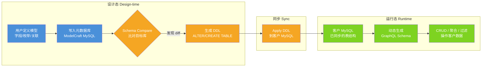
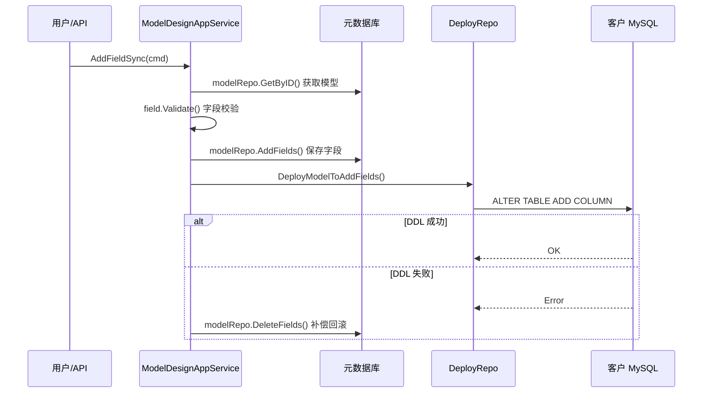
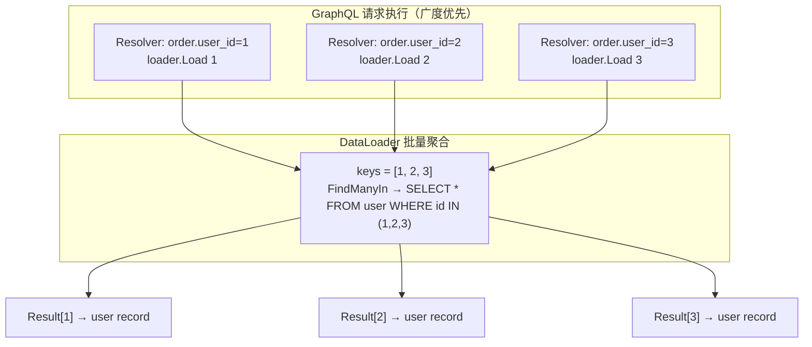
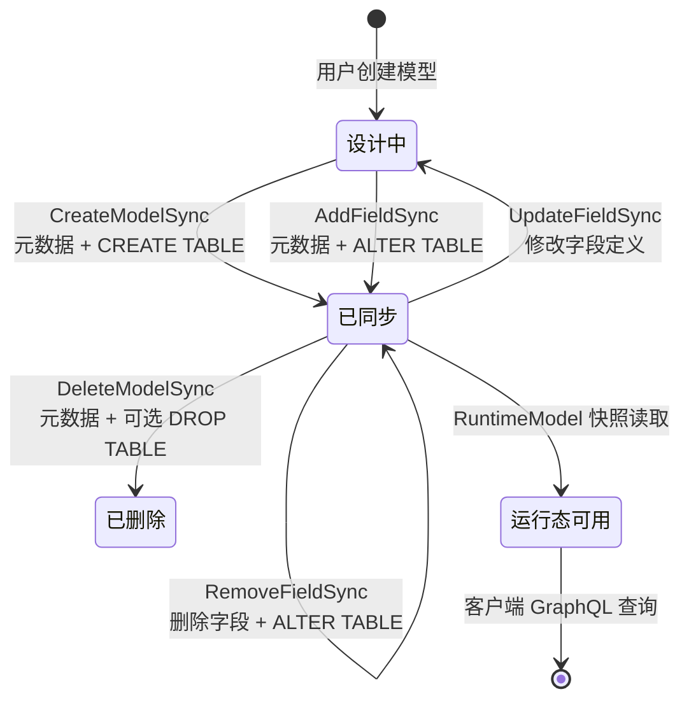

ModelCraft 的核心架构建立在一条清晰的价值链之上：**可视化设计模型 → 自动同步数据库 Schema → 自动生成 GraphQL API**。这条链路被明确地拆分为两个完全解耦的阶段——**设计态（Design-time）**和**运行态（Runtime）**。设计态负责"模型长什么样"，运行态负责"根据已同步的结构操作数据"。两态之间不存在实时依赖，而是通过显式的同步操作（Schema Compare + DDL Apply）衔接。这一架构决策确保了设计态变更不会影响运行态的可用性，运行态也可以独立部署和扩展。

Sources: [core-principles.md](ai-metadata/backend/design/core-principles.md#L10-L103), [domain-model/README.md](ai-metadata/backend/design/domain-model/README.md#L1-L32)

## 两阶段整体架构

理解双阶段架构的关键在于认清两态各自操作的数据源完全不同：设计态操作的是 ModelCraft 自身的**元数据库**，记录模型、字段、枚举等定义；运行态操作的是**客户的 MySQL 数据库**，读写的是真实业务数据。两态在代码层面通过独立的 Domain 层（`modeldesign` 与 `modelruntime`）实现物理隔离，仅在"同步"这个单一操作上产生交集。



Sources: [core-principles.md](ai-metadata/backend/design/core-principles.md#L20-L36), [5-model/README.md](ai-metadata/backend/design/domain-model/5-model/README.md#L1-L34)

## 两态对比：职责与边界

设计态与运行态在数据源、API 入口、Schema 策略、目标用户等维度上存在系统性差异。下表从多个角度对两态进行横向对比，帮助开发者快速建立认知框架。

| 维度 | 设计态（Design-time） | 运行态（Runtime） |
|------|----------------------|------------------|
| **核心职责** | 定义模型结构：字段、枚举、关联关系 | 根据已同步结构提供数据 CRUD API |
| **操作数据源** | ModelCraft 元数据库 | 客户的 MySQL 数据库 |
| **API 入口** | `/graphql/org/{orgName}/project/{projectSlug}` | `/graphql/org/{orgName}/project/{projectSlug}/db/{db}/model/{model}` |
| **Schema 策略** | 静态 `.graphql` 文件（gqlgen 代码生成） | 动态生成（基于 `RuntimeModel` 实时构建） |
| **GraphQL 库** | gqlgen（代码优先） | graphql-go（Schema-first 动态构建） |
| **目标用户** | 平台管理员、模型设计师 | 客户端应用（消费数据的外部系统） |
| **Domain 目录** | `internal/domain/modeldesign/` | `internal/domain/modelruntime/` |
| **App 层目录** | `internal/app/modeldesign/` | `internal/app/modelruntime/` |

Sources: [core-principles.md](ai-metadata/backend/design/core-principles.md#L40-L65), [routes.go](modelcraft-backend/internal/interfaces/http/routes.go#L426-L454), [handler.go](modelcraft-backend/internal/interfaces/runtime/handler.go#L1-L128)

## 设计态：模型定义与 Schema 同步

设计态是整个平台的数据建模核心。用户在 ModelCraft 中通过可视化界面定义模型的字段、类型、枚举和关联关系，这些定义以 `DataModel` 实体的形式持久化到 ModelCraft 自身的元数据库中。设计态的所有操作通过**静态 GraphQL Schema** 暴露，Schema 由 `.graphql` 文件定义，经 gqlgen 工具生成 Go resolver 代码。

### 核心实体：DataModel 与 FieldDefinition

`DataModel` 是设计态的核心聚合根，由 `ModelMeta`（元数据）和 `Fields`（字段集合）两部分组成。每个模型通过 `ModelLocator` 值对象唯一定位，该定位器嵌入了 `ProjectScope`（OrgName + ProjectSlug），确保模型始终处于明确的项目上下文中。

```go
// ModelLocator 的四维定位：OrgName.ProjectSlug.DatabaseName.ModelName
type ModelLocator struct {
    project.ProjectScope        // 嵌入: OrgName + ProjectSlug
    DatabaseName         string
    ModelName            string
}

// DataModel 聚合根
type DataModel struct {
    ModelMeta                        // ID, Title, Version, DeploymentStatus...
    Fields []*FieldDefinition        // 字段集合
}
```

`FieldDefinition` 是 `DataModel` 的子资源，**没有独立 ID**，通过 `(modelID, fieldName)` 二元组标识。这一设计决策直接影响 GraphQL Mutation 的返回规则——所有对字段的写操作均返回父级 `Model`，而非 `Field`，因为只有 `Model` 拥有 `id` 字段，才能被 Apollo Client 的 normalized cache 正确更新。

Sources: [model.go](modelcraft-backend/internal/domain/modeldesign/model.go#L12-L100), [field_definition.go](modelcraft-backend/internal/domain/modeldesign/field_definition.go#L22-L47), [design.md](ai-metadata/backend/design/domain-model/5-model/design.md#L14-L82)

### Schema 同步机制：从设计到物理数据库

设计态的变更并不会立即影响运行态。两态之间通过 **Schema Compare + DDL Apply** 的显式同步操作衔接。`SchemaComparisonService` 负责将设计态的 `DataModel` 定义与目标 MySQL 数据库的实际表结构进行比对，发现新增字段、类型变更、字段删除等差异。比对结果生成对应的 DDL 语句（通过 `ddlfactory` 包），然后 Apply 到目标数据库。

同步操作的典型流程如下：`CreateModelSync` 创建模型时，先在元数据库中保存模型定义，再通过 `DeployRepo.DeployModelToCreate` 在客户数据库中执行 `CREATE TABLE`；`AddFieldSync` 添加字段时，先保存字段定义到元数据库，再通过 `DeployRepo.DeployModelToAddFields` 执行 `ALTER TABLE ADD COLUMN`，如果 DDL 执行失败则回滚已保存的字段（补偿机制）。



Sources: [model_app.go](modelcraft-backend/internal/app/modeldesign/model_app.go#L86-L169), [model_app.go](modelcraft-backend/internal/app/modeldesign/model_app.go#L348-L470), [comparison_service.go](modelcraft-backend/internal/domain/modeldesign/comparison_service.go#L53-L120), [deployment_repo.go](modelcraft-backend/internal/domain/modeldesign/deployment_repo.go#L1-L21), [design.md](ai-metadata/backend/design/domain-model/5-model/design.md#L200-L231)

### 关联关系：LogicalForeignKey

模型间的关联关系通过 `LogicalForeignKey` 实体表达。每个 FK 关系由**两条记录**组成，共享同一个 `PairID`：direction=normal 的记录存储在拥有 FK 列的模型端，direction=reverse 的记录镜像存储在被引用的模型端。这种成对设计使得双向关联查询成为可能，例如"订单→用户"的正向查询和"用户→订单列表"的反向查询。

Sources: [logical_foreign_key.go](modelcraft-backend/internal/domain/modeldesign/logical_foreign_key.go#L1-L60)

## 运行态：动态 GraphQL 与数据操作

运行态的输入是已同步到目标数据库的模型结构（以 `RuntimeModel` 快照形式存在），输出是根据该结构动态生成的 GraphQL Schema 和对应的 SQL 执行能力。运行态**不感知**设计态的实时状态，它只使用已同步的快照，从架构层面保证了两态的解耦。

### RuntimeModel：设计态的快照投影

`RuntimeModel` 是运行态对设计态模型的只读投影。值得注意的是，`RuntimeField` 被定义为 `modeldesign.FieldDefinition` 的类型别名（`type RuntimeField = modeldesign.FieldDefinition`），这意味着运行态直接复用了设计态的字段定义结构，但通过 `RuntimeModel` 这一独立包装层实现了语义上的隔离。

```go
type RuntimeModel struct {
    OrgName      string
    ProjectSlug  string
    Name         string
    Title        string
    Description  string
    DatabaseName string
    DisplayField *string                  // 用于 _displayName 解析
    Fields       map[string]*RuntimeField // 字段快照
}
type RuntimeField = modeldesign.FieldDefinition  // 类型别名，复用设计态结构
```

Sources: [runtimemodel.go](modelcraft-backend/internal/domain/modelruntime/runtimemodel.go#L1-L62)

### 动态 GraphQL Schema 生成

每个 `RuntimeModel` 对应一套完整的 GraphQL 操作集。`GraphqlSchemaManager` 负责根据模型定义动态构建包含 Query 和 Mutation 的 GraphQL Schema。生成的操作涵盖了数据 CRUD 的全生命周期：

| 类别 | 操作 | 说明 |
|------|------|------|
| **查询** | `findUnique` | 根据主键或唯一字段查询单条记录 |
| | `findFirst` | 条件查询第一条匹配记录 |
| | `findMany` | 条件查询多条记录（含分页、排序） |
| | `count` | 统计匹配记录数量 |
| | `aggregate` | 聚合查询（sum/avg/min/max/_count） |
| **变更** | `createOne` / `createMany` | 创建单条/批量创建 |
| | `updateOne` / `updateMany` | 更新单条/批量更新 |
| | `deleteOne` / `deleteMany` | 删除单条/批量删除 |

过滤条件采用 **Prisma 风格**的 `WhereInput` 设计，支持 `equals`、`not`、`in`、`notIn`、`lt`/`lte`/`gt`/`gte`（数值比较）、`contains`/`startsWith`/`endsWith`（字符串匹配）以及 `AND`/`OR`/`NOT`（逻辑组合）等丰富的操作符。

Sources: [artifact.md](ai-metadata/backend/design/domain-model/5-model/artifact.md#L1-L83), [graphql_constants.go](modelcraft-backend/internal/domain/modelruntime/graphql_constants.go#L93-L142), [graphqlschema_manager.go](modelcraft-backend/internal/domain/modelruntime/graphqlschema_manager.go#L1-L51)

### 请求级隔离：Schema 缓存与 Context 注入

运行态架构中一个精妙的设计是 **Schema 结构与请求级状态的彻底分离**。`graphql.Schema`（类型定义）是纯结构数据，不持有任何数据库连接或请求上下文，因此可以被安全缓存和跨请求复用。而每次 GraphQL 查询执行所需的请求级状态——客户端 DB 连接（`ClientRepo`）和 DataLoader 实例——则通过 `graphqlRequestContext` 注入到 `context.Context` 中。

```go
// 请求级上下文：生命周期 = 一次 graphql.Do 调用
type graphqlRequestContext struct {
    ClientRepo      ClientDatabaseRepository
    relationLoaders map[string]*dataloader.Loader[string, map[string]any]
}
```

`GraphqlSchemaManager.GetByName` 首先尝试从缓存获取已构建的 Schema；若缓存未命中，则查询 `RuntimeModel` 并通过 `NewSchemaFrom` 动态构建。`GraphqlAppService.Execute` 在执行查询前，会为当前请求创建独立的 DB 连接，并通过 `WithGraphqlRequestContext` 注入到 context 中，确保所有 resolver 闭包都能通过 `p.Context` 读取请求级状态，而 Schema 类型结构本身保持无状态。

Sources: [graphql_request_context.go](modelcraft-backend/internal/domain/modelruntime/graphql_request_context.go#L1-L62), [graphql_app.go](modelcraft-backend/internal/app/modelruntime/graphql_app.go#L38-L117), [relation_loader.go](modelcraft-backend/internal/domain/modelruntime/relation_loader.go#L1-L78)

### N+1 问题：DataLoader 批量加载

运行态通过 **dataloader** 模式解决关联查询的 N+1 问题。`relationLoader` 为每个 `(tableName, referenceKey)` 组合创建独立的 DataLoader 实例。在 graphql-go 的广度优先执行策略下，同一层级所有关系字段的 `Load()` 调用会被 dataloader 聚合，最终合并为一条 `WHERE referenceKey IN (...)` 的 SQL 查询，将 N+1 次数据库访问降为单次批量查询。



Sources: [relation_loader.go](modelcraft-backend/internal/domain/modelruntime/relation_loader.go#L18-L62), [graphql_request_context.go](modelcraft-backend/internal/domain/modelruntime/graphql_request_context.go#L55-L62)

## 两态桥梁：同步操作的生命周期

同步操作是两态之间唯一的衔接点。下面展示一个模型从创建到可被运行态消费的完整生命周期：



每次运行态请求到达时，`GraphqlAppService.GetSchema` 会根据 URL 参数构造 `ModelLocator`，查询 `RuntimeModel` 快照，动态构建 GraphQL Schema。运行态读取的是**已同步到客户数据库的实际结构**，而非设计态的实时编辑状态。这意味着即使设计态正在进行模型变更，运行态仍然稳定服务于已有数据的查询请求。

Sources: [graphql_app.go](modelcraft-backend/internal/app/modelruntime/graphql_app.go#L38-L82), [model_app.go](modelcraft-backend/internal/app/modeldesign/model_app.go#L86-L141), [core-principles.md](ai-metadata/backend/design/core-principles.md#L96-L103)

## URL 路由与 API 入口

两态在 HTTP 路由层面有清晰的不同入口。设计态的 GraphQL 通过 gqlgen 提供服务，路由注册在 `/graphql/org/{orgName}/project/{projectSlug}` 路径下；运行态的动态 GraphQL 则注册在独立的四段式路径上：

| API 通道 | URL 模式 | HTTP 方法 | 说明 |
|----------|----------|-----------|------|
| 设计态 GraphQL | `/graphql/org/{orgName}/project/{projectSlug}` | POST | gqlgen 静态 Schema，管理模型/字段/枚举 |
| 运行态 GraphQL | `/graphql/org/{orgName}/project/{projectSlug}/db/{db}/model/{model}` | POST | 动态 Schema，操作客户业务数据 |
| 运行态 Playground | 同上 | GET | GraphQL Playground 调试界面 |

运行态路由支持通过配置开关 `cfg.Auth.Runtime.Enabled` 控制 JWT 认证是否启用，并内置了缓存控制中间件（`useCache` 查询参数），为生产环境的灵活部署提供了空间。

Sources: [routes.go](modelcraft-backend/internal/interfaces/http/routes.go#L426-L454), [handler.go](modelcraft-backend/internal/interfaces/runtime/handler.go#L52-L128)

## 架构设计原则总结

双阶段架构的背后是几条贯穿始终的设计原则，这些原则在代码中有着明确的体现：

1. **两态完全解耦**：设计态修改模型后需要显式同步到目标数据库，运行态读取已同步快照而非实时状态。部署上两者可以独立伸缩、互不影响可用性。

2. **运行态仅 GraphQL**：运行态不暴露 REST endpoint，所有 CRUD、过滤、聚合能力均通过 GraphQL 表达。Schema 根据模型定义动态生成，无需手写接口。

3. **Schema 结构与请求状态分离**：动态 GraphQL Schema 是纯类型结构，可安全缓存；请求级状态（DB 连接、DataLoader）通过 context 注入，确保 Schema 可跨请求复用。

4. **类型系统以 SQL 为基础**：`TypeMapper` 将 `FieldDefinition` 的 Format 映射为 MySQL 类型（如 `FormatUUID` → `CHAR(36)`，`FormatDateTime` → `DATETIME`），架构上不需要抽象 NoSQL 适配层。

Sources: [core-principles.md](ai-metadata/backend/design/core-principles.md#L40-L103), [type_mapper.go](modelcraft-backend/internal/domain/modeldesign/type_mapper.go#L1-L50)

---

**下一步阅读**：理解了双阶段架构的全貌后，建议继续深入各层内部实现——[DDD 分层架构：Domain → Application → Infrastructure → Interfaces](6-ddd-fen-ceng-jia-gou-domain-application-infrastructure-interfaces) 详细拆解了 DDD 各层的职责划分与代码组织；[三大 API 通道：设计态 GraphQL、REST、运行时动态 GraphQL](7-san-da-api-tong-dao-she-ji-tai-graphql-rest-yun-xing-shi-dong-tai-graphql) 从 API 视角对比了三种通道的路由、认证与使用场景。