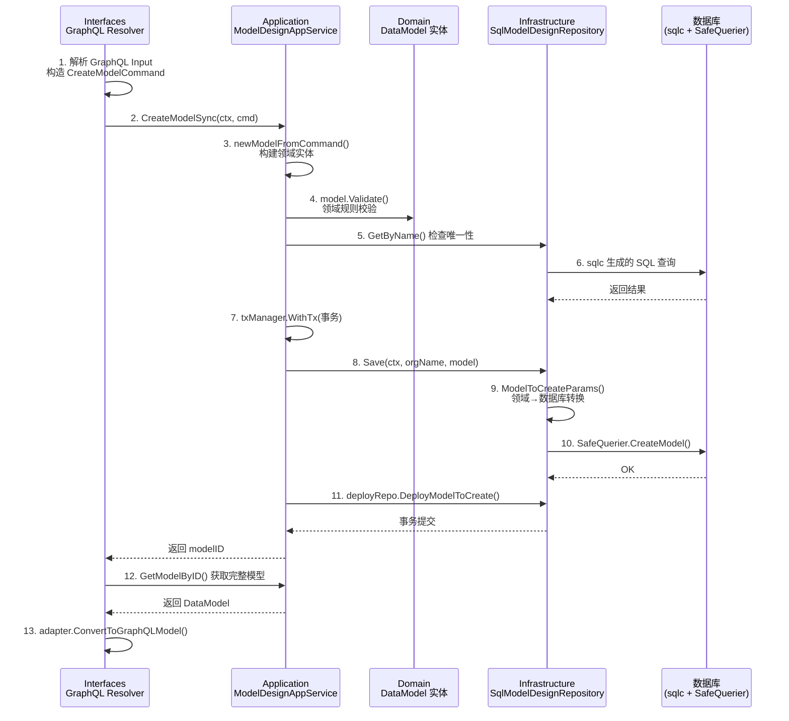

ModelCraft 后端采用经典的 **DDD 四层架构**（Domain → Application → Infrastructure → Interfaces），以 Go 标准库风格的接口定义和依赖注入，实现了**领域逻辑与技术实现的彻底解耦**。本文将深入剖析每一层的职责边界、协作契约和实现模式，帮助开发者理解请求从 HTTP/GraphQL 入口到达数据库再返回的完整旅程。

Sources: [model.go](modelcraft-backend/internal/domain/modeldesign/model.go#L1-L200), [model_app.go](modelcraft-backend/internal/app/modeldesign/model_app.go#L1-L52), [sql_modeldesign_repository.go](modelcraft-backend/internal/infrastructure/repository/sql_modeldesign_repository.go#L1-L100), [model.resolvers.go](modelcraft-backend/internal/interfaces/graphql/project/model.resolvers.go#L1-L93)

## 架构全貌

四层结构在 `internal/` 目录下有明确的物理边界，每一层对应一个顶层包：

```
internal/
├── domain/           ← 领域层：实体、值对象、仓储接口
├── app/              ← 应用层：应用服务、命令对象、用例编排
├── infrastructure/   ← 基础设施层：仓储实现、外部服务适配器
├── interfaces/       ← 接口层：GraphQL/HTTP/运行时 Handler
├── middleware/       ← 横切关注点：认证、权限、日志、租户
└── models/           ← 共享 DTO（跨层传输对象）
```

下面的流程图展示了以 **"创建模型"** 为例的完整调用链路，这是理解四层协作的最佳切入点：



Sources: [routes.go](modelcraft-backend/internal/interfaces/http/routes.go#L82-L106), [resolver.go](modelcraft-backend/internal/interfaces/graphql/project/resolver.go#L1-L31), [commands.go](modelcraft-backend/internal/app/modeldesign/commands.go#L1-L54)

## Domain 层：纯粹的业务内核

**Domain 层是整个系统的灵魂**——它定义了业务实体、业务规则和仓储接口，但不包含任何技术实现细节。这一层没有数据库连接，没有 HTTP 上下文，没有外部依赖。它只关心"业务是什么"，而非"业务怎么做"。

### 实体与值对象

以 **DataModel（数据模型）** 为例，它是一个典型的 DDD 聚合根，封装了模型元数据和字段定义集合，并自带验证逻辑：

| 类型 | 文件 | 职责 |
|------|------|------|
| `DataModel` | `domain/modeldesign/model.go` | 聚合根：模型元数据 + 字段集合 |
| `ModelLocator` | `domain/modeldesign/model.go` | 值对象：四级定位器（Org.Project.DB.Model） |
| `FieldDefinition` | `domain/modeldesign/field_definition.go` | 实体：字段定义，含类型、校验、FK 引用 |
| `Organization` | `domain/organization/organization.go` | 聚合根：多租户组织，含状态机方法 |
| `ProjectScope` | `domain/project/project_scope.go` | 值对象：项目作用域（OrgName + ProjectSlug） |

实体的关键特征是**自带业务方法**。例如 `DataModel.Update()` 封装了更新逻辑和 updatedAt 时间戳刷新，`ValidateDisplayField()` 确保显示字段必须是已存在且可字符串化的字段——这些规则不属于 Application 层，而是领域固有的不变量：

```go
// DataModel 实体上的业务方法（非 setter/getter）
func (m *DataModel) Update(title, description *string) error {
    if title != nil { m.Title = *title }
    if description != nil { m.Description = *description }
    m.UpdatedAt = time.Now()
    return nil
}

func (m *DataModel) ValidateDisplayField() error {
    if m.DisplayField == nil || *m.DisplayField == "" { return nil }
    field := m.GetField(*m.DisplayField)
    if field == nil {
        return bizerrors.Errorf("displayField '%s' not found in model fields", *m.DisplayField)
    }
    if !field.IsStringifiable() {
        return bizerrors.Errorf("displayField '%s' is not stringifiable", *m.DisplayField)
    }
    return nil
}
```

Sources: [model.go](modelcraft-backend/internal/domain/modeldesign/model.go#L86-L200), [organization.go](modelcraft-backend/internal/domain/organization/organization.go#L1-L109), [field_definition.go](modelcraft-backend/internal/domain/modeldesign/field_definition.go#L1-L100)

### 仓储接口（Repository Interface）

Domain 层定义仓储接口，但不实现它们——这是 DDD **依赖倒置原则**的核心体现。接口方法签名使用**领域类型**（如 `*DataModel`、`ModelQueryOptions`），完全屏蔽底层数据库细节：

```go
// domain/modeldesign/model_repository.go — 领域层定义的接口
type ModelRepository interface {
    Save(ctx context.Context, orgName string, model *DataModel) error
    GetByID(ctx context.Context, id string, opts ...*ModelQueryOptions) (*DataModel, error)
    GetByName(ctx context.Context, orgName, databaseName, name, projectId string,
        opts ...*ModelQueryOptions) (*DataModel, error)
    Query(ctx context.Context, queryObj ModelQuery) ([]DataModel, int, error)
    AddFields(ctx context.Context, orgName string, field []*FieldDefinition) error
    // ...更多方法
}
```

注意 `ModelQueryOptions` 的 Builder 模式设计——调用方通过 `NewModelQueryOptions().WithFields()` 控制是否加载关联字段，实现了**延迟加载**策略，避免不必要的数据库查询。

类似地，`DeployRepo` 定义了模型部署到客户数据库的抽象接口，DDL 实现则由 Infrastructure 层的 `DeploymentImpl` 完成：

```go
// domain/modeldesign/deployment_repo.go
type DeployRepo interface {
    DeployModelToCreate(ctx context.Context, dataModel *DataModel) error
    DeployModelToDrop(ctx context.Context, dataModel *DataModel) error
    DeployModelToAddFields(ctx context.Context, dataModel *DataModel, addFields []*FieldDefinition) error
    CheckTableExists(ctx context.Context, dataModel *DataModel) (bool, error)
}
```

Sources: [model_repository.go](modelcraft-backend/internal/domain/modeldesign/model_repository.go#L1-L75), [deployment_repo.go](modelcraft-backend/internal/domain/modeldesign/deployment_repo.go#L1-L21), [repository.go](modelcraft-backend/internal/domain/organization/repository.go#L1-L24)

### 领域子域划分

Domain 层按业务子域组织为独立包，每个包内聚了该子域的实体、值对象和仓储接口：

| 子域包 | 核心实体 | 说明 |
|--------|----------|------|
| `domain/modeldesign` | DataModel, FieldDefinition, EnumDefinition | 设计态模型定义 |
| `domain/modelruntime` | RuntimeModel, GraphQLSchemaManager | 运行态动态 GraphQL |
| `domain/organization` | Organization | 多租户组织 |
| `domain/project` | Project, ProjectScope | 项目隔离单元 |
| `domain/cluster` | DatabaseCluster | 数据库集群配置 |
| `domain/auth` | APIKey, RefreshToken, AuthProvider | 认证与令牌 |
| `domain/permission` | Permission, Role, UserRole | RBAC 权限 |
| `domain/profile` | Profile | 用户资料 |
| `domain/user` | User, PhoneNumber | 用户实体 |
| `domain/shared` | RepositoryError, ErrRecordNotFound | 跨子域共享错误类型 |

Sources: [directory structure](modelcraft-backend/internal/domain/), [shared/repository_error.go](modelcraft-backend/internal/domain/shared/repository_error.go#L1-L132)

## Application 层：用例编排与命令对象

**Application 层是业务流程的指挥家**——它不包含业务规则（那些在 Domain 层），而是协调领域实体和仓储完成完整的业务用例。它的核心模式是 **Command（命令）对象** 和 **AppService（应用服务）**。

### Command 对象

每个用户操作被建模为一个 Command 结构体，定义在 `commands.go` 中。Command 是 Application 层的输入契约，它将分散的参数打包成一个类型安全的对象，避免方法签名膨胀：

| Command | 用途 | 关键字段 |
|---------|------|----------|
| `CreateModelCommand` | 创建模型 | Name, Title, DatabaseName, DisplayField |
| `UpdateModelMetaCommand` | 更新模型元数据 | Title(*string), Description(*string), DisplayField(*string) |
| `AddFieldCommand` | 添加字段 | ModelID, Fields([]*FieldDefinition) |
| `CreateEnumCommand` | 创建枚举 | Name, DisplayName, Options([]EnumOption) |
| `CreateGroupCommand` | 创建模型分组 | OrgName, ProjectSlug, Name |

Command 中大量使用 `*string` 指针类型来区分"未传值"与"传了空值"——这是 Go 语言实现 Partial Update 的惯用模式。

Sources: [commands.go](modelcraft-backend/internal/app/modeldesign/commands.go#L1-L200)

### AppService：事务编排器

`ModelDesignAppService` 是典型的应用服务——它通过构造函数注入所有依赖（仓储接口），在方法中编排业务流程，并管理事务边界：

```go
type ModelDesignAppService struct {
    deployRepo       modeldesign.DeployRepo           // 部署仓储（接口）
    modelRepo        modeldesign.ModelRepository       // 模型仓储（接口）
    clusterRepo      cluster.DatabaseClusterRepository // 集群仓储（接口）
    txManager        repository.TxManager              // 事务管理器
    enumAssocRepo    modeldesign.FieldEnumAssociationRepository
    enumRepo         modeldesign.EnumRepository
    fkRepo           modeldesign.LogicalForeignKeyRepository
    modelRepoFactory func(q dbgen.Querier) modeldesign.ModelRepository  // 事务内仓储工厂
}
```

以 `CreateModelSync` 方法为例，它编排了以下流程：

1. 从 Context 提取 orgName → 调用 `clusterRepo` 验证集群存在
2. 通过 `newModelFromCommand` 构建领域实体 → 调用 `model.Validate()` 校验
3. 调用 `modelRepo.GetByName` 检查唯一性
4. 调用 `deployRepo.CheckTableExists` 检查客户数据库表
5. 在事务 `txManager.WithTx` 中执行：保存模型 → 部署 DDL
6. 返回 modelID

注意 **事务内的仓储工厂模式**——在 `WithTx` 回调中，通过 `repository.NewSqlModelDesignRepository(q)` 创建绑定到当前事务的仓储实例，确保 Save 和 DeployModelToCreate 在同一事务中。这是 ModelCraft 独创的事务管理模式，解决了 Go 中无 Spring 式声明式事务的问题。

Sources: [model_app.go](modelcraft-backend/internal/app/modeldesign/model_app.go#L1-L169)

## Infrastructure 层：技术实现的宝库

**Infrastructure 层是实现细节的归宿**——所有与数据库、外部 API、第三方库打交道的代码都集中在这里。它实现了 Domain 层定义的接口，并通过**转换函数**（Convert）将数据库行映射为领域实体。

### 四级基础设施体系

| 层级 | 包 | 职责 |
|------|-----|------|
| **代码生成** | `infrastructure/dbgen` | sqlc 自动生成的类型安全查询代码 |
| **安全包装** | `infrastructure/dbgenwrap` | SafeQuerier 装饰器，自动包装 SQL 错误 |
| **仓储实现** | `infrastructure/repository` | Domain 接口的 sqlc 实现 + 转换函数 |
| **外部适配** | `infrastructure/auth`, `casdoor`, `database/ddl` | Casdoor、Casbin、DDL 执行等外部系统集成 |

Sources: [repository structure](modelcraft-backend/internal/infrastructure/)

### SafeQuerier：透明的错误拦截层

`SafeQuerier` 是 Infrastructure 层最精巧的设计——它是一个装饰器模式的实现，自动将底层 sqlc 查询返回的 `*mysql.MySQLError` 包装为领域层的 `RepositoryError`：

```go
// 每个 sqlc 方法调用后，自动执行错误包装
func (s *SafeQuerier) CreateModel(ctx context.Context, arg ...) (err error) {
    err = s.delegate.CreateModel(ctx, arg)   // 调用原始 sqlc 方法
    WrapSQLErrorInPlace(&err)                 // 如果是 SQL 错误 → RepositoryError
    return
}
```

这意味着 Application 层拿到的永远是语义化的 `RepositoryError`（如 `ErrDuplicateKey`、`ErrTypeNotFound`），而非原始的 MySQL 错误码。仓储实现创建时自动包装：

```go
func NewSqlModelDesignRepository(q dbgen.Querier) modeldesign.ModelRepository {
    return &SqlModelDesignRepository{q: dbgenwrap.NewSafeQuerier(q)}
}
```

Sources: [safe_querier_gen.go](modelcraft-backend/internal/infrastructure/dbgenwrap/safe_querier_gen.go#L1-L60), [error_wrap.go](modelcraft-backend/internal/infrastructure/dbgenwrap/error_wrap.go#L1-L9)

### 转换函数：领域与数据库的双向桥梁

Infrastructure 层的核心工作量在**转换函数**——它们负责 `dbgen.Model` ↔ `modeldesign.DataModel` 的双向映射。以 `ModelToDomain` 和 `ModelToCreateParams` 为例：

| 转换方向 | 函数 | 输入 → 输出 |
|----------|------|-------------|
| DB → Domain | `ModelToDomain(row dbgen.Model)` | 数据库行 → 领域实体 |
| Domain → DB | `ModelToCreateParams(m *DataModel)` | 领域实体 → 创建参数 |
| Domain → DB | `ModelToUpdateParams(m *DataModel)` | 领域实体 → 更新参数 |
| DB → Domain | `FieldDefinitionToDomain(row)` | 字段行 → 领域字段实体 |
| Domain → DB | `FieldDefinitionToCreateParams(fd)` | 领域字段 → 创建参数 |

转换函数处理了大量 Go 数据库编程的繁琐细节：`sql.NullString` ↔ `*string`、`json.RawMessage` ↔ `map[string]any`、时间戳转换等。这些函数都有独立的单元测试覆盖，确保映射的准确性。

Sources: [sql_modeldesign_repository.go](modelcraft-backend/internal/infrastructure/repository/sql_modeldesign_repository.go#L19-L271)

### 事务管理器

`TxManager` 提供了显式的事务边界管理，采用"回调式事务"模式——调用方传入一个 `func(ctx, Querier) error`，事务管理器负责 Begin/Commit/Rollback：

```go
type TxManager interface {
    WithTx(ctx context.Context, fn func(ctx context.Context, q dbgen.Querier) error) error
}
```

在回调内部，`dbgen.Querier` 绑定到当前事务，所有通过它创建的仓储共享同一连接。Application 层在事务内通过 `repository.NewSqlModelDesignRepository(q)` 创建临时仓储，实现跨操作的事务一致性。

Sources: [tx_manager.go](modelcraft-backend/internal/infrastructure/repository/tx_manager.go#L1-L56)

### 外部服务适配器

Infrastructure 层还包含与外部系统的集成适配器，全部通过 Domain 层接口实现依赖倒置：

| 适配器 | 实现的接口 | 说明 |
|--------|------------|------|
| `CasdoorProvider` | `auth.AuthProvider` | Casdoor JWT 公钥解析与签名验证 |
| `CasbinEnforcer` | （直接使用） | Casbin RBAC 权限引擎 |
| `DeploymentImpl` | `modeldesign.DeployRepo` | DDL 生成与客户数据库部署 |
| `BcryptPasswordHasher` | （接口） | bcrypt 密码哈希 |

Sources: [casdoor_provider.go](modelcraft-backend/internal/infrastructure/auth/casdoor_provider.go#L1-L104), [deployment_repo_impl.go](modelcraft-backend/internal/infrastructure/database/ddl/deployment_repo_impl.go#L1-L80)

## Interfaces 层：API 入口与协议转换

**Interfaces 层是外部世界与系统的唯一接触点**——它负责 HTTP/GraphQL 协议解析、请求验证、领域模型到 API 模型的转换，以及错误适配。它不包含任何业务逻辑。

### 三种 API 通道

| 通道 | 包 | 协议 | 用途 |
|------|-----|------|------|
| 设计态 GraphQL | `interfaces/graphql/project`, `graphql/org` | gqlgen | 模型 CRUD、权限管理等核心业务 |
| REST API | `interfaces/http` | Chi + oapi-codegen | 认证（注册/登录/刷新 Token） |
| 运行时 GraphQL | `interfaces/runtime` | 动态 Schema | 基于模型定义自动生成的 CRUD API |

Sources: [runtime/handler.go](modelcraft-backend/internal/interfaces/runtime/handler.go#L1-L38), [http/handlers/auth/handler.go](modelcraft-backend/internal/interfaces/http/handlers/auth/handler.go#L1-L62)

### Resolver：薄适配层

GraphQL Resolver 的职责极为纯粹——解析 Input → 构造 Command → 调用 AppService → 转换输出。以 `CreateModel` Resolver 为例：

```go
func (r *mutationResolver) CreateModel(ctx context.Context, input generated.CreateModelInput) (*generated.CreateModelPayload, error) {
    // 1. 从 Context 提取认证信息
    projectSlug, _ := ctxutils.GetProjectSlugFromContext(ctx)
    orgName, _     := ctxutils.GetOrgNameFromContext(ctx)

    // 2. GraphQL Input → Application Command
    cmd := appmodeldesign.CreateModelCommand{
        OrgName: orgName, Name: input.Name, Title: input.Title, ...
    }

    // 3. 调用 Application Service
    modelID, err := r.ModelDesignService.CreateModelSync(ctx, cmd)

    // 4. 错误适配：BusinessError → GraphQL Typed Error
    if bizErr, ok := err.(*bizerrors.BusinessError); ok {
        return &generated.CreateModelPayload{
            Error: errorAdapter.ConvertToCreateError(bizErr),
        }, nil
    }

    // 5. Domain Model → GraphQL Model（通过 Adapter）
    graphqlModel, _ = adapter.ModelMapper.ConvertToGraphQLModel(modelEntity)
    return &generated.CreateModelPayload{Model: graphqlModel}, nil
}
```

关键设计：Resolver 持有 AppService 的引用（通过 `Resolver` 结构体注入），而非直接访问 Repository。这确保了**请求必须经过 Application 层的事务编排**。

Sources: [model.resolvers.go](modelcraft-backend/internal/interfaces/graphql/project/model.resolvers.go#L1-L93), [resolver.go](modelcraft-backend/internal/interfaces/graphql/project/resolver.go#L1-L31)

### Adapter：领域→API 模型映射

`adapter` 包负责将领域实体转换为 GraphQL 生成的类型。这是一种**防腐蚀层（Anti-Corruption Layer）**——当 GraphQL Schema 变更时，只需修改 Adapter，Domain 层完全不受影响：

```go
// adapter/model_mapper.go — 领域模型 → GraphQL 模型
func (m *modelMapper) ConvertToGraphQLModel(modelEntity *modeldesign.DataModel) (*generated.Model, error) {
    graphqlFields := make([]*generated.Field, 0, len(modelEntity.Fields))
    for _, domainField := range modelEntity.Fields {
        graphqlField, _ := m.convertFieldWithActualSchema(*domainField, actualResult)
        graphqlFields = append(graphqlFields, graphqlField)
    }
    return &generated.Model{
        ID: modelEntity.ID, Name: modelEntity.ModelName, Fields: graphqlFields, ...
    }, nil
}
```

Sources: [adapter/model_mapper.go](modelcraft-backend/internal/interfaces/graphql/project/adapter/model_mapper.go#L1-L139)

## 依赖注入：纯手工组装

ModelCraft 没有使用 DI 框架（如 Wire），而是在 `interfaces/http/routes.go` 的 `CreateDesignHandlers` 函数中**手工组装**整个依赖图。这是 Go 社区的常见选择——依赖关系显式、可追踪、无魔法：

```go
// 组装顺序：从底层到顶层
// 1. 基础设施：数据库连接 → sqlc Querier
loggingDB := repository.NewSqlcLogger(repoFactory.SqlDB, ...)

// 2. 仓储实现：Querier → Domain Repository
modelRepository := repository.NewSqlModelDesignRepository(dbgen.New(loggingDB))

// 3. 应用服务：Repository + TxManager → AppService
txManager := repository.NewSqlTxManager(repoFactory.SqlDB)
appService := modeldesign.NewModelDesignAppService(
    ddl.NewDeploymentService(clusterManager),
    modelRepository, clusterRepository, txManager,
).WithEnumAssocRepo(...).WithFKRepo(...)

// 4. 接口层：AppService → GraphQL Resolver
resolver := &projectgraphql.Resolver{ModelDesignService: appService, ...}
```

这种组装模式的好处是：**依赖关系在编译时即可验证**——如果缺少某个依赖，编译器会直接报错。

Sources: [routes.go](modelcraft-backend/internal/interfaces/http/routes.go#L82-L200)

## 错误处理：双轨错误体系

DDD 分层架构要求每一层使用不同语义的错误类型，错误在层间传播时经历**翻译**而非**透传**：

| 层 | 错误类型 | 语义 |
|----|----------|------|
| **Infrastructure** | `RepositoryError` | 技术错误：NOT_FOUND, DUPLICATED_KEY, CONNECTION... |
| **Application** | `BusinessError` | 业务错误：ModelNotFound, ModelAlreadyExists... |
| **Interfaces** | GraphQL Typed Error / REST JSON | 协议错误：InvalidInput, ModelNotFound... |

错误传播路径：`sqlerr.WrapSQLErrorInPlace` (Infra) → `bizerrors.Wrapf` (App) → `errorAdapter.ConvertToCreateError` (Interfaces)。每一层都只处理自己关心的错误类型，下层错误通过 `errors.Is/As` 机制向上传播。

Sources: [repository_error.go](modelcraft-backend/internal/domain/shared/repository_error.go#L1-L132)

## 四层职责速查表

| 层 | 包路径 | 核心职责 | 关键模式 | 禁止事项 |
|----|--------|----------|----------|----------|
| **Domain** | `domain/*` | 实体、值对象、仓储接口 | 依赖倒置、自验证实体 | 禁止 import infrastructure/app |
| **Application** | `app/*` | 用例编排、事务管理、Command | 命令模式、事务编排 | 禁止直接访问数据库 |
| **Infrastructure** | `infrastructure/*` | 仓储实现、外部适配器 | 装饰器、转换函数 | 禁止包含业务规则 |
| **Interfaces** | `interfaces/*` | API 入口、协议转换 | Adapter 映射、错误适配 | 禁止直接操作 Repository |

## 延伸阅读

- 了解四层架构如何服务于设计态与运行态的双阶段模型，参阅 [设计态与运行态双阶段架构](5-she-ji-tai-yu-yun-xing-tai-shuang-jie-duan-jia-gou)
- 深入理解 Infrastructure 层的 sqlc 代码生成与 SafeQuerier 模式，参阅 [数据层：sqlc 代码生成与 Safe Querier 模式](9-shu-ju-ceng-sqlc-dai-ma-sheng-cheng-yu-safe-querier-mo-shi)
- 了解四层错误体系的完整规范，参阅 [错误处理规范：bizerrors 与 RepositoryError 双轨体系](10-cuo-wu-chu-li-gui-fan-bizerrors-yu-repositoryerror-shuang-gui-ti-xi)
- 了解接口层的三种 API 通道设计，参阅 [三大 API 通道：设计态 GraphQL、REST、运行时动态 GraphQL](7-san-da-api-tong-dao-she-ji-tai-graphql-rest-yun-xing-shi-dong-tai-graphql)