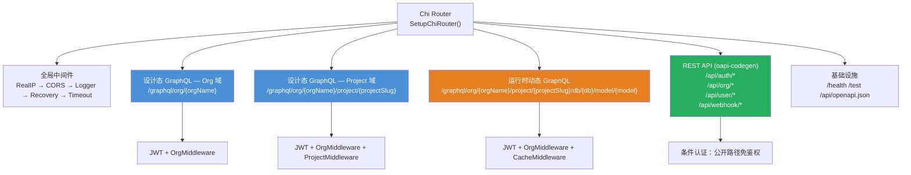
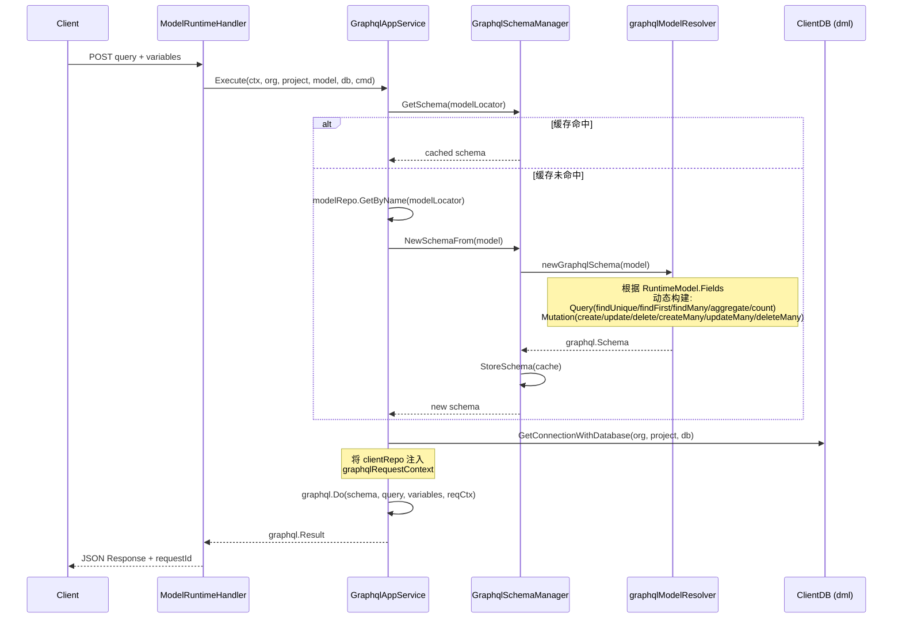

ModelCraft 后端通过三条职责明确的 API 通道对外暴露能力：**设计态 GraphQL**（gqlgen 静态 Schema，面向 Org 和 Project 两个域）、**REST**（OpenAPI 规范，专注身份与租户管理）、**运行时动态 GraphQL**（graphql-go 运行时按模型定义动态生成 Schema，面向最终业务数据）。三条通道共存于同一个 Chi Router，统一经过 JWT 认证、RequestID 注入和 CORS 中间件，但在 Schema 来源、路由结构、执行引擎和权限模型上各有独立设计。

## 全局路由架构

所有 API 注册入口位于 `SetupChiRouter`，该函数按以下优先级将三条通道挂载到 Chi Router：



Sources: [chi_setup.go](modelcraft-backend/internal/interfaces/http/chi_setup.go#L59-L141)

## 通道一：设计态 GraphQL（gqlgen 静态 Schema）

设计态 GraphQL 是面向**平台管理员和开发者**的主要 API 通道，承载了 ModelCraft 几乎全部业务域的 CRUD 操作。它基于 **gqlgen** 框架，采用 Schema-First 开发模式——先在 `api/graph/` 编写 `.graphql` 文件，再由代码生成器产出 `generated/` 包中的类型定义和 Resolver 接口。

### 双域隔离：Org 与 Project

设计态 GraphQL 按业务边界拆分为两个独立的 GraphQL 端点，各自拥有独立的 Resolver、生成的代码和 Schema 文件：

| 维度 | Org 域 | Project 域 |
|------|--------|------------|
| 路由 | `POST /graphql/org/{orgName}/` | `POST /graphql/org/{orgName}/project/{projectSlug}/` |
| Schema 目录 | `api/graph/org/schema/` | `api/graph/project/schema/` |
| Resolver | `interfaces/graphql/org/resolver.go` | `interfaces/graphql/project/resolver.go` |
| Handler 构造 | `OrgGraphQLHandler()` | `ProjectGraphQLHandler()` |
| 核心业务 | 项目管理、集群管理、组织、用户档案、权限 | 模型设计、字段管理、枚举、逻辑外键、逆向工程、模型修复 |
| 中间件链 | JWT + OrgContext | JWT + OrgContext + ProjectContext |

**Org 域**覆盖跨项目的组织级资源：`Project`（项目）、`DatabaseCluster`（数据库集群）、`Profile`（用户档案）、`Permission`（Casbin 角色与权限）、`APIKey`（API 密钥管理）和 `UserManagement`（用户管理）。所有操作均在组织上下文中执行，URL 中的 `{orgName}` 通过 `ChiGraphQLOrgMiddleware()` 注入到请求上下文。

**Project 域**则聚焦于单个项目内的模型设计操作：`Model`（模型）、`Field`（字段）、`Enum`（枚举）、`LogicalForeignKey`（逻辑外键）、`ModelGroup`（模型分组）、`RepairModel`（模型修复）和 `ActualSchemaQuery`（实际表结构查询）。它额外挂载了 `ChiGraphQLProjectMiddleware()`，将 `{projectSlug}` 参数注入上下文，使 Resolver 可以精确定位到目标项目。

Sources: [routes.go](modelcraft-backend/internal/interfaces/http/routes.go#L229-L311), [org/handler.go](modelcraft-backend/internal/interfaces/graphql/org/handler.go#L32-L41), [project/handler.go](modelcraft-backend/internal/interfaces/graphql/project/handler.go#L31-L40), [schema files](modelcraft-backend/api/graph/org/schema/schema.graphql#L1-L5)

### Handler 构建与 @hasPermission 指令

两个域的 Handler 构建遵循相同的模式：

```
Resolver 实例 → gqlgen.Config → 注册 @hasPermission 指令 → handler.NewDefaultServer → 注入 RequestID 中间件
```

`@hasPermission` 是自定义的 GraphQL 指令，实现了操作级别的 RBAC 权限检查。它的权限验证采用**双层策略**：优先从 JWT Claims 中读取权限列表（零数据库查询的快速路径），若 JWT 中未携带权限信息则回退到数据库查询 Casbin 策略。权限检查失败时返回 `PERMISSION_DENIED` 错误码，并附带 `requiredAction`、`userId`、`organizationId` 等诊断信息。

```go
// 指令注册（以 Project 域为例）
config.Directives.HasPermission = hasPermissionDirective.HasPermission
```

Sources: [project/directives.go](modelcraft-backend/internal/interfaces/graphql/project/directives.go#L30-L61), [org/handler.go](modelcraft-backend/internal/interfaces/graphql/org/handler.go#L32-L37)

### Playground 端点

两个域都提供 `GET` 方式的 GraphQL Playground，用于开发调试。Playground 标题动态拼接组织名和项目 Slug，便于多租户场景下区分：

- Org Playground：`GraphQL Playground - Org API ({orgName})`
- Project Playground：`GraphQL Playground - Project API ({orgName}/{projectSlug})`

Sources: [org/handler.go](modelcraft-backend/internal/interfaces/graphql/org/handler.go#L44-L59), [project/handler.go](modelcraft-backend/internal/interfaces/graphql/project/handler.go#L43-L62)

## 通道二：REST API（OpenAPI 规范）

REST API 的职责边界被**严格限定**在身份认证与租户管理领域。正如 OpenAPI 规范文件开篇所述：

> *"Business domain APIs (Projects, Models, Clusters, Enums) are served exclusively via GraphQL."*

所有业务域 API 通过 GraphQL 提供，REST 仅负责 Auth、Organization、User 和 Webhook 四类端点。

### 端点清单

| 端点 | 方法 | 认证 | 功能 |
|------|------|------|------|
| `/api/auth/register` | POST | 公开 | 用户注册（原子创建用户 + 初始化档案） |
| `/api/auth/login` | POST | 公开 | 登录（手机号/用户名 + 密码） |
| `/api/auth/refresh` | POST | 公开 | 刷新 Token（Refresh Token 轮换） |
| `/api/auth/logout` | POST | 公开 | 登出（撤销 Refresh Token） |
| `/api/org/init` | POST | JWT | 初始化组织（幂等操作） |
| `/api/user/memberships` | GET | JWT | 获取当前用户的组织成员关系 |
| `/api/webhook/casdoor` | POST | 公开 | Casdoor Webhook 回调 |

### 代码生成与条件认证

REST API 采用 **oapi-codegen** 从 OpenAPI YAML 生成 Chi Server 接口。`Server` 结构体实现 `generated.ServerInterface`，仅包含 Auth、Org、User、Webhook 四个 Handler 字段。认证通过 `conditionalAuthMiddleware` 实现——它维护一个公开路径白名单（`register`、`login`、`logout`、`refresh`、`webhook/casdoor`），白名单内的路径跳过 JWT 验证，其余路径强制 JWT 认证。

```go
// 条件认证中间件核心逻辑
if publicPaths[r.URL.Path] {
    next.ServeHTTP(w, r)  // 公开路径：跳过认证
    return
}
jwtOnly.ServeHTTP(w, r)  // 其余路径：JWT 认证
```

Sources: [openapi.yaml](modelcraft-backend/api/openapi/openapi.yaml#L1-L10), [server.go](modelcraft-backend/internal/interfaces/http/server.go#L16-L43), [chi_setup.go](modelcraft-backend/internal/interfaces/http/chi_setup.go#L143-L172)

## 通道三：运行时动态 GraphQL

运行时动态 GraphQL 是 ModelCraft 最具架构创新的 API 通道——它不依赖任何预定义的 Schema 文件，而是根据用户在设计态创建的**模型定义**，在运行时动态生成完整的 GraphQL Schema 并执行查询。这使得 ModelCraft 的使用者（即业务开发者）获得了类似 Prisma 的数据访问能力。

### 路由与生命周期

```
GET/POST /graphql/org/{orgName}/project/{projectSlug}/db/{db}/model/{model}
```

路由参数 `{orgName}`、`{projectSlug}`、`{db}`、`{model}` 四元组唯一确定一个运行时模型。中间件链为 JWT + OrgContext + CacheMiddleware，其中 CacheMiddleware 支持通过 `?useCache=false` 查询参数显式禁用 Schema 缓存。

Sources: [routes.go](modelcraft-backend/internal/interfaces/http/routes.go#L426-L455)

### Schema 动态生成流水线



**Schema 构建**由 `graphqlModelResolver` 完成。它读取 `RuntimeModel` 的字段定义（`RuntimeField`，类型别名 `modeldesign.FieldDefinition`），将每个字段的 `FormatType`（String、UUID、Number、Integer、Boolean、DateTime、Date、Time、Enum 等）映射到对应的 GraphQL Scalar 类型，然后构建包含以下操作的完整 Schema：

| 操作类别 | 操作名称 | 说明 |
|----------|----------|------|
| Query | `findUnique` | 按唯一约束查询单条记录 |
| Query | `findFirst` | 查询第一条匹配记录 |
| Query | `findMany` | 分页查询多条记录 |
| Query | `aggregate` | 聚合查询（`_count`、`_avg`、`_sum`、`_min`、`_max`） |
| Query | `count` | 计数查询 |
| Mutation | `create` | 创建单条记录 |
| Mutation | `update` | 更新单条记录 |
| Mutation | `delete` | 删除单条记录 |
| Mutation | `createMany` | 批量创建（最大 1000 条） |
| Mutation | `updateMany` | 批量更新 |
| Mutation | `deleteMany` | 批量删除 |

**Schema 与请求级状态解耦**是核心设计：`graphql.Schema` 只包含类型结构定义，不持有数据库连接或 Dataloader。请求级状态（`clientRepo` 和 `dataloader map`）通过 `graphqlRequestContext` 在每次 `graphql.Do` 调用时注入到 Context 中，所有 Resolver 闭包通过 `p.Context` 读取。这意味着同一个 Schema 实例可以安全地在并发请求间复用。

Sources: [graphql_app.go](modelcraft-backend/internal/app/modelruntime/graphql_app.go#L58-L104), [graphqlschema_manager.go](modelcraft-backend/internal/domain/modelruntime/graphqlschema_manager.go#L39-L50), [runtimemodel.go](modelcraft-backend/internal/domain/modelruntime/runtimemodel.go#L10-L21), [model_resolver.go](modelcraft-backend/internal/domain/modelruntime/model_resolver.go#L48-L78), [graphql_constants.go](modelcraft-backend/internal/domain/modelruntime/graphql_constants.go#L96-L119)

### 数据库连接策略

运行时 GraphQL 的数据访问路径与设计态完全不同。设计态 GraphQL 连接的是 **ModelCraft 自身的管理数据库**（存储模型定义、项目配置等元数据），而运行时 GraphQL 连接的是用户通过集群配置指向的**业务数据库**——即模型实际部署的数据库。连接通过 `ClusterConnectionManager.GetConnectionWithDatabase(ctx, orgName, projectSlug, databaseName)` 动态获取，每次请求创建独立的 `clientRepo` 实例。

Sources: [graphql_app.go](modelcraft-backend/internal/app/modelruntime/graphql_app.go#L76-L84), [handler.go](modelcraft-backend/internal/interfaces/runtime/handler.go#L70-L127)

## 三通道对比

| 维度 | 设计态 GraphQL | REST API | 运行时动态 GraphQL |
|------|---------------|----------|-------------------|
| **Schema 来源** | `.graphql` 文件（gqlgen 静态编译） | OpenAPI YAML（oapi-codegen 静态编译） | `RuntimeModel` 字段定义运行时生成 |
| **执行引擎** | gqlgen (`99designs/gqlgen`) | net/http + Chi | graphql-go (`graphql-go/graphql`) |
| **核心职责** | 模型设计、项目管理、权限配置 | 认证、注册、组织初始化 | 业务数据 CRUD、聚合查询 |
| **认证方式** | JWT（ChiJWTAuthMiddleware） | JWT（条件认证，部分端点公开） | JWT（可通过配置禁用） |
| **目标用户** | 平台管理员 / 前端设计态 UI | 前端认证流程 / Casdoor Webhook | 业务应用 / 前端运行时 UI |
| **数据库** | ModelCraft 管理库（sqlc） | ModelCraft 管理库（sqlc） | 用户业务库（动态连接） |
| **错误模式** | Union-based typed errors | HTTP 状态码 + structured error body | graphql-go 标准错误 |
| **前端 Contract** | `contract/graph/` | `contract/openapi/` | 无静态 Contract（Schema 动态） |
| **Playground** | `GET /graphql/org/{orgName}/` | `/api/openapi.json` | `GET /graphql/org/{orgName}/project/{projectSlug}/db/{db}/model/{model}` |

Sources: [chi_setup.go](modelcraft-backend/internal/interfaces/http/chi_setup.go#L59-L141), [api/README.md](modelcraft-backend/api/README.md#L1-L31)

## 统一的请求追踪

三条通道共享一致的请求追踪机制。所有响应都通过 `requestId` 字段关联到具体的请求实例。设计态 GraphQL 和运行时 GraphQL 通过 `injectRequestIDMiddleware` / `ctxutils.GetRequestID()` 将 RequestID 注入到 GraphQL Response 的 `extensions` 字段中。REST API 则通过 `requestIDInjectorMiddleware` 将 RequestID 注入到 Chi 中间件链，最终出现在每个 JSON 响应的 `requestId` 字段中。运行时 GraphQL 的响应还额外携带 `timeCost`（毫秒级执行耗时）和 `reqId`（UUID v7）两个元数据字段。

Sources: [org/handler.go](modelcraft-backend/internal/interfaces/graphql/org/handler.go#L17-L29), [handler.go](modelcraft-backend/internal/interfaces/runtime/handler.go#L116-L126)

## 继续阅读

- 了解三条 API 通道背后的领域模型设计：[领域模型体系：认证、租户、项目、模型、集群、权限](8-ling-yu-mo-xing-ti-xi-ren-zheng-zu-hu-xiang-mu-mo-xing-ji-qun-quan-xian)
- 了解 API Contract 如何在前端与后端之间同步：[API Contract 单一真相源：Git Subtree 同步机制](18-api-contract-dan-zhen-xiang-yuan-git-subtree-tong-bu-ji-zhi)
- 了解前端如何消费 GraphQL API：[三种 Apollo Client 实例策略与 GraphQL 操作层约定](13-san-chong-apollo-client-shi-li-ce-lue-yu-graphql-cao-zuo-ceng-yue-ding)
- 了解认证与权限如何在三条通道中生效：[Casdoor 委托认证与 Casbin RBAC 权限控制](11-casdoor-wei-tuo-ren-zheng-yu-casbin-rbac-quan-xian-kong-zhi)