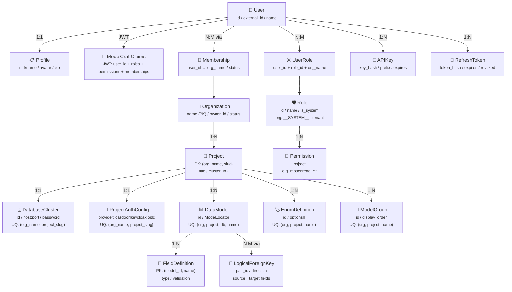
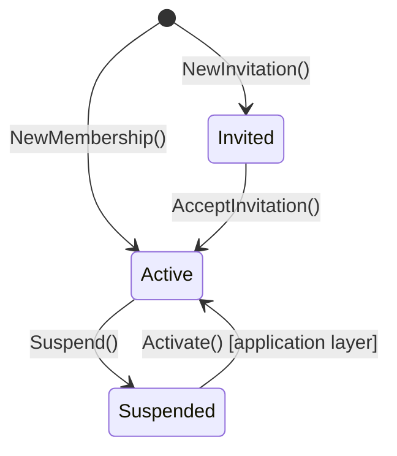

本文档深入剖析 ModelCraft 后端的核心领域模型体系，涵盖认证（Authentication）、租户（Organization）、项目（Project）、模型设计（ModelDesign）、数据库集群（DatabaseCluster）和权限（Permission）六大子域。这些领域对象构成了平台的业务骨架——从用户身份验证到多租户资源隔离，从数据建模到部署运行，每一层职责清晰、边界明确。理解这些领域模型及其关联关系，是掌握 ModelCraft 整体架构的前提。

## 全局领域关系总览

在深入每个子域之前，先从宏观视角理解各领域实体之间的层次关系。下图展示了从用户到运行时的完整实体依赖链路——用户通过认证进入组织，在组织下创建项目，项目挂载集群、配置认证，项目内定义模型和枚举，模型通过集群部署到运行时。



Sources: [organization.go](modelcraft-backend/internal/domain/organization/organization.go#L20-L27), [project.go](modelcraft-backend/internal/domain/project/project.go#L19-L28), [model.go](modelcraft-backend/internal/domain/modeldesign/model.go#L69-L84), [database_cluster.go](modelcraft-backend/internal/domain/cluster/database_cluster.go#L44-L59), [modelcraft_claims.go](modelcraft-backend/internal/domain/auth/modelcraft_claims.go#L30-L52), [permission.go](modelcraft-backend/internal/domain/permission/permission.go#L12-L15), [role.go](modelcraft-backend/internal/domain/permission/role.go#L11-L19), [membership.go](modelcraft-backend/internal/domain/membership/membership.go#L19-L29), [user.go](modelcraft-backend/internal/domain/user/user.go#L12-L20)

## 多租户层次：Organization → Project → 资源

ModelCraft 采用**三级资源隔离模型**：Organization（组织）→ Project（项目）→ Domain Resources（模型、枚举、集群等）。每一级都是其下级资源的逻辑容器，且通过命名约定和数据库索引实现严格的租户隔离。

### Organization：租户容器

**Organization** 是多租户体系的最外层边界。其 `name` 字段既是主键也是唯一标识符，通常来源于 Casdoor 的组织名称。组织采用**软删除**策略——状态流转为 `active → suspended → deleted`，永不物理删除，确保数据引用完整性。

| 属性 | 类型 | 约束 | 说明 |
|------|------|------|------|
| `Name` | `string` | PK, 2-64字符, `^[a-z][a-z0-9_-]*$` | 唯一标识符，来自 Casdoor |
| `DisplayName` | `string` | 可选 | UI 展示名称 |
| `OwnerID` | `string` | 必填 | 组织创建者/所有者用户 ID |
| `Status` | `OrgStatus` | active/suspended/deleted | 组织状态，默认 active |

领域行为封装在实体方法中：`NewOrganization()` 工厂方法确保创建时即通过 `Validate()` 校验不变量；`Suspend()` / `Activate()` / `MarkDeleted()` 控制状态流转，每次变更自动更新 `UpdatedAt` 时间戳。

Sources: [organization.go](modelcraft-backend/internal/domain/organization/organization.go#L18-L109), [05_organizations.sql](modelcraft-backend/db/schema/mysql/05_organizations.sql#L11-L22)

### Project：工作空间

**Project** 使用 `(OrgName, Slug)` **复合主键**设计，这意味着项目天然从属于组织，且项目标识符在组织内唯一。Project 是集群、模型、枚举等资源的直接容器。

| 属性 | 类型 | 约束 | 说明 |
|------|------|------|------|
| `OrgName` | `string` | PK 组成部分 | 所属组织名称 |
| `Slug` | `string` | PK 组成部分, 3-64字符, `^[a-z][a-z0-9_]*$` | 项目标识符（注意：不允许连字符） |
| `Title` | `string` | 必填 | 显示标题 |
| `Description` | `string` | 可选 | 描述信息 |
| `ClusterID` | `*string` | nullable, 可选 | 关联集群 ID（一对一） |
| `Status` | `ProjectStatus` | active/archived | 项目状态，永不物理删除 |

**关键设计决策**：Project 与 Cluster 之间是**可选的一对一关系**。`ClusterID` 为 `*string`（指针类型可区分"未设置"和"空值"），通过 `SetCluster()` / `UnsetCluster()` 方法管理关联。Project 同样采用归档而非删除的策略。

Sources: [project.go](modelcraft-backend/internal/domain/project/project.go#L18-L164), [01_project.sql](modelcraft-backend/db/schema/mysql/01_project.sql#L4-L32)

### ProjectScope：跨域定位值对象

`ProjectScope` 是一个重要的**值对象**，被多个领域实体嵌入复用。它封装了 `(OrgName, ProjectSlug)` 二元组，提供统一的验证逻辑和路径生成方法：

```
ProjectScope.GetFullPath() → "org_name.project_slug"
```

嵌入 `ProjectScope` 的实体包括：`ModelLocator`、`ClusterLocator`、`EnumDefinition`、`ModelGroup`。这种组合复用确保了所有项目级资源都携带完整的租户上下文，避免在业务逻辑中遗漏组织隔离维度。

Sources: [project_scope.go](modelcraft-backend/internal/domain/project/project_scope.go#L10-L43)

## 模型设计子域：DataModel → Field → Enum → LFK

模型设计（ModelDesign）是 ModelCraft 的核心子域，涵盖数据模型的完整生命周期——从字段定义、枚举约束、逻辑外键关系到模型分组。此子域的实体全部嵌入 `ProjectScope`，确保在项目上下文中操作。

### ModelLocator：四维全路径定位

**ModelLocator** 是模型子域最基础的定位结构，通过嵌入 `ProjectScope` 加上 `DatabaseName` 和 `ModelName` 构成**四维唯一标识**：

```
OrgName.ProjectSlug.DatabaseName.ModelName
```

其 `GetFullPath()` 方法生成点分隔的完整路径，`GetDatabasePath()` 则截取到数据库级别。这种分层路径设计使得在任何上下文中都能精确定位一个模型。

| 唯一性约束 | 数据库索引 |
|-----------|-----------|
| `UNIQUE (org_name, project_slug, database_name, name)` | `idx_models_name` |

Sources: [model.go](modelcraft-backend/internal/domain/modeldesign/model.go#L12-L66), [03_model_domain.sql](modelcraft-backend/db/schema/mysql/03_model_domain.sql#L44)

### DataModel：聚合根

**DataModel** 是模型设计子域的聚合根，由 **ModelMeta**（元数据）和 **Fields**（字段集合）两部分组成：

| 元数据属性 | 说明 |
|-----------|------|
| `ID` | 模型 UUID |
| `ModelLocator` | 四维定位器（嵌入） |
| `Title` / `Description` | 展示信息 |
| `StorageType` | 存储类型 |
| `DisplayField` | 运行时 `_label` 解析字段（可选，须为可字符串化类型） |
| `Version` | 数据版本号 |
| `Status` | draft/published/archived |
| `GroupID` | 所属分组（可选，NULL 表示未分组） |
| `DeploymentStatus` | synced/pending/failed |

`DataModel` 暴露了丰富的领域行为：`Update()` 支持 nil-语义的部分更新；`UpdateDisplayField()` 设置运行时显示字段；`ValidateDisplayField()` 确保指定字段存在且类型可字符串化；`GetField()` / `GetFieldsByNames()` 提供高效的字段查找（内部使用 map 加速）。

Sources: [model.go](modelcraft-backend/internal/domain/modeldesign/model.go#L68-L200)

### FieldDefinition：字段级建模

**FieldDefinition** 使用 `(ModelID, Name)` 复合主键，承载字段的完整元信息。核心设计亮点包括：

| 维度 | 字段 | 说明 |
|------|------|------|
| **类型系统** | `Type *FieldType` | 使用值对象指针，JSON 序列化为 format 字符串 |
| **约束体系** | `NonNull` / `Required` / `IsUnique` / `IsPrimary` | 四重布尔约束独立控制 |
| **枚举关联** | `EnumName` / `Enum *EnumDefinition` | format=ENUM 时关联枚举定义 |
| **外键关联** | `BelongsToFKID` / `RelateFKID` | 分别对应 FK 列字段和 RELATION 虚拟字段 |
| **验证规则** | `Validation *ValidationConfig` | 类型特异：字符串(长度/正则)、数字(范围/精度)、日期(区间)、数组(元素数) |
| **排序** | `DisplayOrder` | 字典序分数索引（lexicographic fractional index），支持拖拽排序 |
| **生命周期** | `Status` | init → deploy_success / to_delete |

Sources: [field_definition.go](modelcraft-backend/internal/domain/modeldesign/field_definition.go#L22-L47)

### EnumDefinition：可复用枚举

**EnumDefinition** 是项目级共享的枚举定义聚合根，嵌入 `ProjectScope` 确保项目隔离。每个枚举包含一组 `EnumOption`（code + label + order），支持单选和多选模式（`IsMultiSelect`）。枚举通过 `ValidateCodes()` 方法为字段值提供运行时校验。

```
唯一约束: UNIQUE (org_name, project_slug, name)
```

Sources: [enum_definition.go](modelcraft-backend/internal/domain/modeldesign/enum_definition.go#L40-L51), [03_model_domain.sql](modelcraft-backend/db/schema/mysql/03_model_domain.sql#L165)

### LogicalForeignKey：双向关系建模

**LogicalForeignKey** 实现了模型间关系的**成对存储**设计：每个 FK 关系由两条记录组成，共享同一个 `PairID`：

| 方向 | 含义 | source_fields | target_fields |
|------|------|---------------|---------------|
| `normal` | 拥有 FK 列的一侧 | FK 列字段 | 被引用的主键字段 |
| `reverse` | 被引用的一侧（镜像） | 被引用的主键字段 | FK 列字段 |

这种双向存储使得查询任意一端的关联关系时都无需反向计算，直接通过 `direction` 过滤即可。`SourceFields` 和 `TargetFields` 数组长度必须一致，支持复合外键场景。

Sources: [logical_foreign_key.go](modelcraft-backend/internal/domain/modeldesign/logical_foreign_key.go#L17-L34), [03_model_domain.sql](modelcraft-backend/db/schema/mysql/03_model_domain.sql#L93-L132)

### ModelGroup：虚拟分组

**ModelGroup** 支持模型在项目内的可视化分组管理。特殊设计：系统内置一个**虚拟分组** `__ungrouped__`（ID 为 `UngroupedGroupID`），它永远不会被持久化到数据库，而是在应用层合成——所有 `group_id IS NULL` 的模型自动归入此虚拟分组。`IsVirtual()` 方法用于区分真实分组和虚拟分组。

Sources: [model_group.go](modelcraft-backend/internal/domain/modeldesign/model_group.go#L47-L72)

## 数据库集群子域：DatabaseCluster

**DatabaseCluster** 是项目关联的物理数据库实例配置，与 Project 构成**可选一对一关系**（通过 `UNIQUE KEY idx_cluster_project_unique (org_name, project_slug)` 约束）。

| 属性 | 类型 | 约束 | 说明 |
|------|------|------|------|
| `ID` | `string` | PK, UUID | 集群唯一标识 |
| `OrgName` + `ProjectSlug` | `string` | UQ, 组成 ClusterLocator | 项目定位（嵌入逻辑） |
| `Host` / `Port` | `string` / `int` | Port: 1-65535 | 数据库连接地址 |
| `Username` / `Password` | `string` / `Password` | Password 为加密值对象 | 认证凭据 |
| `ConnectionTimeout` | `int` | 5-15秒, 默认5 | 连接超时 |
| `Status` | `ClusterStatus` | active/disabled | 集群状态 |

`DatabaseCluster` 的工厂方法 `NewDatabaseCluster()` 自动通过 `NewByPlain()` 将明文密码转为加密 `Password` 值对象。`GetConnectionInfo()` 提取连接信息供运行时使用。`ClusterLocator` 作为定位值对象，提供 `GetFullPath()` 生成 `org_name.project_slug` 格式路径。

Sources: [database_cluster.go](modelcraft-backend/internal/domain/cluster/database_cluster.go#L8-L194), [02_database_cluster.sql](modelcraft-backend/db/schema/mysql/02_database_cluster.sql#L4-L49)

## 认证子域：双重 JWT + 多 Provider + API Key

认证子域是 ModelCraft 安全体系的核心，包含三个层次的认证机制：Casdoor 委托认证（OAuth2/OIDC）、ModelCraft 自签 JWT、API Key 程序化访问。

### ModelCraftClaims：自签 JWT 声明

**ModelCraftClaims** 是 ModelCraft 平台的自定义 JWT Claims 结构，与 Casdoor JWT **解耦**。核心设计：

| 声明字段 | 类型 | 说明 |
|---------|------|------|
| `UserID` | `string` | ModelCraft 内部 UUID |
| `ExternalID` | `string` | Casdoor 用户 ID（来自 JWT sub） |
| `Name` / `Email` | `string` | 用户基本信息 |
| `Organization` | `string` | 当前组织 |
| `Roles` | `[]string` | 角色名列表，如 `["owner", "editor"]` |
| `Permissions` | `[]string` | 权限字符串列表，如 `["model:read", "model:write"]` |
| `Memberships` | `[]MembershipClaimInfo` | 用户所属组织列表（限制最多10个，控制 JWT 体积） |
| `HasMoreMemberships` | `bool` | 是否有超过10个组织成员关系 |
| `Issuer` | `string` | 固定为 `"modelcraft"` |

`ModelCraftClaims` 提供了便捷的权限查询方法：`HasPermission()` 精确匹配、`HasAnyPermission()` 任意匹配、`HasRole()` 角色检查。`Validate()` 方法确保 issuer 为 `"modelcraft"` 且 token 未过期。

Sources: [modelcraft_claims.go](modelcraft-backend/internal/domain/auth/modelcraft_claims.go#L30-L115)

### UserClaims 与 RefreshClaims：简化 Token

**UserClaims** 是最精简的 JWT 结构，仅包含 `UserID` 和标准注册声明，用于不需要完整权限上下文的场景。**RefreshClaims** 结构与之相同，用于刷新令牌的验证。

**RefreshToken** 实体将 refresh token 的哈希值持久化到数据库，支持撤销（`RevokedAt`）和有效期检查（`IsValid()` 综合检查 ID、UserID、TokenHash 非空 + 未撤销 + 未过期）。

Sources: [user_claims.go](modelcraft-backend/internal/domain/auth/user_claims.go#L14-L25), [refresh_token.go](modelcraft-backend/internal/domain/auth/refresh_token.go#L6-L33)

### AuthProvider 接口与 ProjectAuthConfig

认证系统通过 **`AuthProvider` 接口**实现 Provider 抽象，定义三个方法：`GetPublicKey()`（JWT 签名验证公钥）、`GetSigningMethod()`（签名算法，如 RS256）、`Type()`（Provider 标识）。当前已实现 Casdoor，预留 Keycloak 和通用 OIDC。

**ProjectAuthConfig** 将认证配置下沉到**项目级别**——每个项目可以独立配置自己的认证 Provider：

| Provider | 配置项 |
|----------|--------|
| `casdoor` | endpoint, client_id, client_secret, organization, application, certificate |
| `keycloak`（预留） | realm, auth_server_url, jwks_uri, client_id |
| `oidc`（预留） | issuer, jwks_uri, client_id |

每个项目最多一条认证配置（`UNIQUE (org_name, project_slug)`），`Validate()` 方法按 Provider 类型分发到对应的配置校验逻辑。

Sources: [provider.go](modelcraft-backend/internal/domain/auth/provider.go#L9-L20), [project_auth_config.go](modelcraft-backend/internal/domain/auth/project_auth_config.go#L37-L96), [04_auth.sql](modelcraft-backend/db/schema/mysql/04_auth.sql#L8-L29)

### APIKey：程序化访问

**APIKey** 支持无浏览器上下文的程序化访问。每个用户最多创建 20 个 API Key（`APIKeyMaxPerUser = 20`）。安全性设计：仅存储 `KeyHash`（哈希值）和 `KeyPrefix`（前缀，用于 UI 展示识别），明文只在创建时返回一次。支持过期时间（`ExpiresAt`）和主动撤销（`RevokedAt`）。

Sources: [api_key.go](modelcraft-backend/internal/domain/auth/api_key.go#L7-L36)

## 用户与成员关系子域

### User：混合认证实体

**User** 实体采用**混合认证**设计，同时支持两种用户来源：

| 工厂方法 | 场景 | 关键字段 |
|---------|------|---------|
| `NewUser()` | 手机号+密码本地注册 | `Phone`（值对象）+ `PasswordHash` |
| `NewOAuthUser()` | 外部 OAuth 认证 | `ExternalID`（Casdoor sub）+ `Name` |

`ExternalID` 字段是桥接 Casdoor 的关键——当用户通过 OAuth 登录时，Casdoor 的 `JWT.sub` 被记录在此字段，后续认证流程通过它关联到 ModelCraft 内部用户。用户名验证（`ValidateUserName()`）强制 3-32 字符、字母开头、排除系统保留词（admin, root, system 等）。

Sources: [user.go](modelcraft-backend/internal/domain/user/user.go#L12-L146), [06_users.sql](modelcraft-backend/db/schema/mysql/06_users.sql#L12-L26)

### Membership：用户-组织关联

**Membership** 是 User 和 Organization 之间的关联实体，支持三种状态：



关键设计：**角色信息不存储在 Membership 中**，而是通过独立的 `user_roles` 表管理。Membership 只负责"用户属于哪个组织"的关系，职责单一。邀请流程通过 `InvitedBy` + `InvitedAt` 字段追踪邀请来源。

Sources: [membership.go](modelcraft-backend/internal/domain/membership/membership.go#L18-L111)

### Profile：用户资料

**Profile** 与 User 构成**严格的一对一关系**（数据库层 `UNIQUE(user_id)` 约束保证）。采用 PATCH 语义更新：`UpdatePatch` 结构中只有非 nil 的字段会被应用。创建时如果未提供昵称，自动生成 `user_` + 6位随机字母数字的默认昵称。

Sources: [profile.go](modelcraft-backend/internal/domain/profile/profile.go#L25-L134)

## 权限子域：RBAC 双层模型

ModelCraft 的权限系统采用**双层 RBAC** 架构：系统级角色（硬编码权限）+ 租户级自定义角色（数据库存储权限）。权限格式统一为 `obj:act`（如 `model:read`、`project:*`、`*:*`）。

### Permission：权限值对象

**Permission** 遵循 `obj:act` 格式，支持三层通配匹配：

| 权限字符串 | 匹配范围 |
|-----------|---------|
| `*:*` | 全局通配，匹配一切 |
| `project:*` | 资源通配，匹配 project 下所有操作 |
| `model:read` | 精确匹配 |

`Matches()` 方法实现通配逻辑：先检查全局通配，再检查资源匹配，最后检查操作匹配。`Validate()` 确保 obj 和 act 非空且不超过64字符。

Sources: [permission.go](modelcraft-backend/internal/domain/permission/permission.go#L12-L103)

### Role：系统角色 + 自定义角色

**Role** 实体通过 `OrgName` 字段区分系统角色和租户自定义角色：

| 角色类型 | OrgName | is_system | 特性 |
|---------|---------|-----------|------|
| owner | `__SYSTEM__` | `true` | 完全控制 + 团队管理 |
| admin | `__SYSTEM__` | `true` | 管理资源 + 成员（不含用户管理） |
| editor | `__SYSTEM__` | `true` | 创建和编辑（不能删除） |
| viewer | `__SYSTEM__` | `true` | 只读访问 |
| 自定义 | 真实 org_name | `false` | 租户自行定义权限 |

设计要点：使用 `__SYSTEM__`（而非 NULL）标识系统角色，避免 MySQL 唯一约束对 NULL 的特殊处理问题。系统角色权限**硬编码在 Go 代码中**（不存 role_permissions 表），保证不可变性。自定义角色不能使用系统角色名称（`IsSystemRoleName()` 检查）。

Sources: [role.go](modelcraft-backend/internal/domain/permission/role.go#L11-L139), [07_roles_permissions.sql](modelcraft-backend/db/schema/mysql/07_roles_permissions.sql#L21-L38)

### UserRole：多租户角色绑定

**UserRole** 实现"同一用户在不同组织可以有不同角色"的多租户模型。核心约束为 `UNIQUE (user_id, role_id, org_name)`，防止重复绑定。`IsSameBinding()` 方法用于判断两个绑定是否相同。

数据库层的级联设计：删除用户或角色时，对应的 `user_roles` 记录自动级联删除（`ON DELETE CASCADE`）。

Sources: [user_role.go](modelcraft-backend/internal/domain/permission/user_role.go#L10-L63), [07_roles_permissions.sql](modelcraft-backend/db/schema/mysql/07_roles_permissions.sql#L65-L85)

## 数据库物理模型对照

领域模型到数据库表的映射遵循**显式优先**原则——不使用外键约束关联项目级资源（`-- 不使用外键约束（避免复杂性，Project永不删除只归档）`），但用户-组织、用户-角色等核心关联保留外键保证引用完整性。

| 领域实体 | 数据库表 | 主键策略 | 租户隔离字段 |
|---------|---------|---------|------------|
| Organization | `organizations` | `name` (PK) | — |
| Project | `projects` | `(org_name, slug)` 复合PK | `org_name` |
| DatabaseCluster | `database_clusters` | `id` (PK) | `org_name, project_slug` (UQ) |
| DataModel | `models` | `id` (PK) | `org_name, project_slug, database_name, name` (UQ) |
| FieldDefinition | `field_definitions` | `(model_id, name)` 复合PK | `org_name, project_slug` |
| EnumDefinition | `model_enums` | `id` (PK) | `org_name, project_slug, name` (UQ) |
| ModelGroup | `model_groups` | `id` (PK) | `org_name, project_slug, name` (UQ) |
| LogicalForeignKey | `logical_foreign_keys` | `id` (PK) | `org_name` |
| User | `users` | `id` (PK) | — |
| Membership | `user_organizations` | `id` (PK) | `org_name` |
| Profile | `profile` | `id` (PK), `user_id` (UQ) | — |
| Role | `roles` | `id` (自增PK) | `org_name` |
| UserRole | `user_roles` | `id` (自增PK) | `org_name` |
| Permission | `role_permissions` | `id` (自增PK) | `org_name` (冗余) |
| ProjectAuthConfig | `project_auth_configs` | `id` (自增PK) | `org_name, project_slug` (UQ) |

Sources: [01_project.sql](modelcraft-backend/db/schema/mysql/01_project.sql#L1-L33), [02_database_cluster.sql](modelcraft-backend/db/schema/mysql/02_database_cluster.sql#L1-L50), [03_model_domain.sql](modelcraft-backend/db/schema/mysql/03_model_domain.sql#L1-L267), [05_organizations.sql](modelcraft-backend/db/schema/mysql/05_organizations.sql#L11-L23), [06_users.sql](modelcraft-backend/db/schema/mysql/06_users.sql#L1-L84), [07_roles_permissions.sql](modelcraft-backend/db/schema/mysql/07_roles_permissions.sql#L1-L131)

## 领域实体设计模式总结

通过对各子域实体的分析，可以归纳出 ModelCraft 领域建模中的几个**一致性设计模式**：

**构造器模式**：所有实体都提供 `New*()` 工厂函数，在构造时即执行 `Validate()` 校验不变量，确保系统中不存在无效实体。例如 `NewOrganization()`、`NewProject()`、`NewDatabaseCluster()`。

**自验证模式**：每个实体都实现 `Validate() error` 方法，定义该实体的完整性约束。验证逻辑与业务逻辑共位，遵循 DDD 中"聚合根保护自身不变量"的原则。

**状态机模式**：Organization、Project、Membership 等有状态实体通过 `Suspend()` / `Activate()` / `Archive()` / `MarkDeleted()` 等方法控制状态流转，辅以 `IsActive()` 查询方法。所有状态变更自动更新 `UpdatedAt` 时间戳。

**定位器/Scope 嵌入模式**：`ProjectScope` 和 `ModelLocator` 作为可嵌入的值对象，在多个实体间复用，提供统一的路径生成和验证逻辑。这确保了所有项目级资源都携带完整的租户和项目上下文。

**软删除策略**：Organization、Project 等容器实体永不物理删除，通过 status 字段标记为 archived/deleted。子资源（模型、字段）中的逻辑外键表使用 `ON DELETE CASCADE` 实现级联清理。

Sources: [organization.go](modelcraft-backend/internal/domain/organization/organization.go#L44-L79), [project.go](modelcraft-backend/internal/domain/project/project.go#L44-L90), [database_cluster.go](modelcraft-backend/internal/domain/cluster/database_cluster.go#L159-L193), [project_scope.go](modelcraft-backend/internal/domain/project/project_scope.go#L10-L43), [model.go](modelcraft-backend/internal/domain/modeldesign/model.go#L12-L66)

---

**下一步阅读建议**：理解领域模型后，建议继续深入 [数据层：sqlc 代码生成与 Safe Querier 模式](9-shu-ju-ceng-sqlc-dai-ma-sheng-cheng-yu-safe-querier-mo-shi) 了解这些领域实体如何被持久化和查询；或跳转至 [Casdoor 委托认证与 Casbin RBAC 权限控制](11-casdoor-wei-tuo-ren-zheng-yu-casbin-rbac-quan-xian-kong-zhi) 深入认证授权的实现细节。