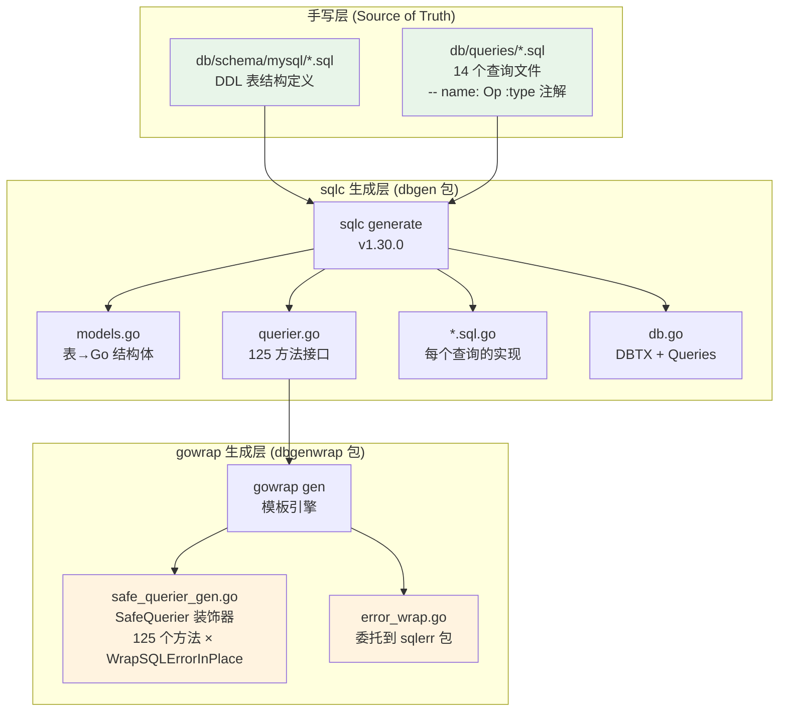
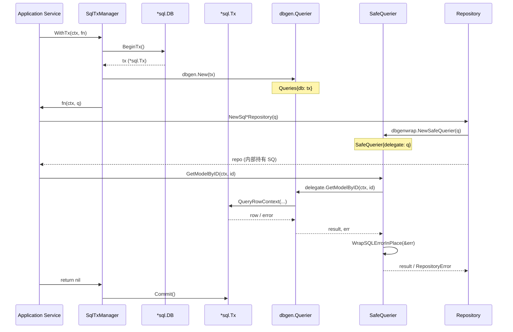
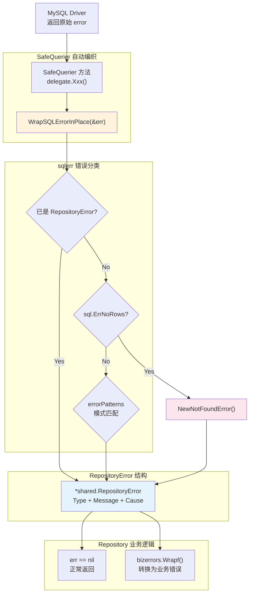
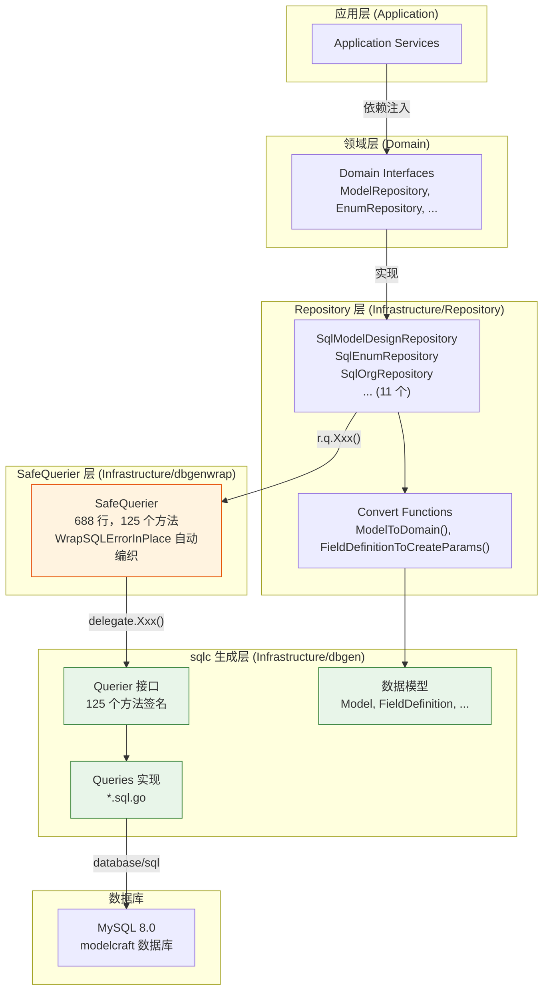

ModelCraft 后端放弃了传统 ORM（如 GORM），转而采用 **sqlc 代码生成 + Safe Querier 装饰器** 的数据层架构。这一选择的核心动机是：将 SQL 作为一等公民编写，由工具自动生成类型安全的 Go 代码，再通过 gowrap 模板引擎在运行时自动编织统一的错误处理横切关注点。整个数据层形成了一条从手写 SQL → 编译期类型检查 → 运行时错误分类的完整链条，使得 125 个数据库操作方法无需任何手工 `WrapSQLError` 调用即可获得一致的错误语义。

Sources: [sqlc.yaml](modelcraft-backend/sqlc.yaml#L1-L27), [querier.go](modelcraft-backend/internal/infrastructure/dbgen/querier.go#L1-L149)

## sqlc 代码生成管线

### 配置与生成目标

sqlc 的配置文件 `sqlc.yaml` 声明了 MySQL 引擎、查询文件路径、Schema 路径以及 Go 代码生成参数。关键配置项包括：`emit_interface: true`（生成 `Querier` 接口，为 Safe Querier 装饰器模式提供基础）、`emit_db_tags: false` / `emit_json_tags: false`（禁止生成 ORM 标签，保持纯数据结构），以及三个类型覆写——`json` 类型映射为 `encoding/json.RawMessage`、`tinyint(1)` 映射为 `bool`。

Sources: [sqlc.yaml](modelcraft-backend/sqlc.yaml#L1-L27)

执行 `just generate-sqlc`（底层调用 `sqlc generate`）后，工具会读取 `db/queries/` 目录下的 14 个 SQL 文件和 `db/schema/mysql/` 下的 10 个 Schema 文件，在 `internal/infrastructure/dbgen/` 目录生成以下产物：

| 生成文件 | 职责 | 特点 |
|----------|------|------|
| `db.go` | 定义 `DBTX` 接口与 `Queries` 结构体 | `DBTX` 抽象了 `*sql.DB` 和 `*sql.Tx` |
| `models.go` | 所有表的 Go 结构体映射 | 含枚举类型（如 `LogicalForeignKeysDirection`） |
| `querier.go` | 125 个方法的 `Querier` 接口 | 编译期接口约束，支持装饰器替换 |
| `*.sql.go` | 每个查询文件对应的实现代码 | 包含 SQL 常量、Params 结构体、方法实现 |

Sources: [db.go](modelcraft-backend/internal/infrastructure/dbgen/db.go#L1-L32), [models.go](modelcraft-backend/internal/infrastructure/dbgen/models.go#L1-L200), [querier.go](modelcraft-backend/internal/infrastructure/dbgen/querier.go#L1-L149)

### SQL 查询注解体系

sqlc 通过 SQL 注释约定（`-- name: OperationName :result_type`）来确定每个操作的返回类型。以 `db/queries/model.sql` 为例，项目使用了四种注解：

- **`:exec`** — 仅执行，返回 `error`（如 `CreateModel`、`DeleteModel`）
- **`:one`** — 返回单行记录 + `error`（如 `GetModelByID`、`GetModelByName`）
- **`:many`** — 返回切片 + `error`（如 `ListModels`、`GetAllModels`）
- **`:execresult`** — 返回 `sql.Result` + `error`（如 `UpdateModel`，用于检查 `RowsAffected`）

此外，`sqlc.slice('statuses')` 语法用于生成 `IN (...)` 动态参数（如 `FindModelsByDeploymentStatus`），而 `? IS NULL OR column LIKE CONCAT('%', ?, '%')` 模式实现了可选过滤条件的 nullable trick。

Sources: [model.sql](modelcraft-backend/db/queries/model.sql#L1-L64), [enum.sql](modelcraft-backend/db/queries/enum.sql#L1-L64)

以下 Mermaid 图展示了从手写 SQL 到运行时调用的完整代码生成流程：



Sources: [sqlc.yaml](modelcraft-backend/sqlc.yaml#L1-L27), [safe_querier_gen.go](modelcraft-backend/internal/infrastructure/dbgenwrap/safe_querier_gen.go#L1-L40)

## DBTX 抽象与事务管理

sqlc 生成的 `Queries` 结构体不直接持有 `*sql.DB`，而是依赖一个 `DBTX` 接口。该接口抽象了 `ExecContext`、`QueryContext`、`QueryRowContext` 和 `PrepareContext` 四个方法，使得 `*sql.DB` 和 `*sql.Tx` 都能满足约束。`Queries` 还提供了一个 `WithTx(tx *sql.Tx) *Queries` 方法，用于在事务中创建绑定到当前事务的新 `Queries` 实例。

Sources: [db.go](modelcraft-backend/internal/infrastructure/dbgen/db.go#L1-L32)

项目的 `TxManager` 正是基于这一机制构建的。`SqlTxManager.WithTx` 方法开启事务后，调用 `dbgen.New(tx)` 创建绑定到事务的 `Queries`，然后将原始的 `dbgen.Querier` 接口传递给业务回调函数。Repository 的工厂函数在回调内部被调用时，会自动将事务级别的 `Querier` 包装为 `SafeQuerier`，从而保证事务内操作同样享有统一的错误处理。

Sources: [tx_manager.go](modelcraft-backend/internal/infrastructure/repository/tx_manager.go#L1-L56)

以下流程图展示了一个典型事务场景中 `Querier` 的传递路径：



Sources: [tx_manager.go](modelcraft-backend/internal/infrastructure/repository/tx_manager.go#L1-L56), [safe_querier_gen.go](modelcraft-backend/internal/infrastructure/dbgenwrap/safe_querier_gen.go#L18-L40)

## Safe Querier 装饰器模式

### 设计动机与架构位置

在引入 Safe Querier 之前，每个 Repository 方法的每次 `Querier` 调用都需要手工编写 `if err != nil { return nil, WrapSQLError(err) }` 的样板代码。125 个方法 × 平均每个 Repository 调用 3-5 次 = 数百处重复的错误处理逻辑，极易遗漏且维护成本极高。

Safe Querier 采用 **装饰器模式（Decorator Pattern）**，在 `dbgen.Querier` 接口与具体实现之间插入一个透明的中间层。这个中间层对每个方法的返回值自动执行 `WrapSQLErrorInPlace(&err)`，使得上层 Repository 代码完全不需要关心 SQL 错误的分类与包装。

Sources: [safe_querier_gen.go](modelcraft-backend/internal/infrastructure/dbgenwrap/safe_querier_gen.go#L1-L40), [error_wrap.go](modelcraft-backend/internal/infrastructure/dbgenwrap/error_wrap.go#L1-L9)

### gowrap 模板驱动的代码生成

Safe Querier 不是手工编写的——它由 `scripts/generate-safe-querier.sh` 脚本调用 [gowrap](https://github.com/hexdigest/gowrap) 工具自动生成。脚本的核心逻辑是：创建一个临时 Go 模板文件，定义 `SafeQuerier` 结构体、构造函数 `NewSafeQuerier`，以及每个接口方法的包装逻辑。模板中使用 gowrap 的 `{{range .Interface.Methods}}` 遍历所有方法签名，对返回 error 的方法自动注入 `WrapSQLErrorInPlace(&err)` 调用。

生成命令通过 `just generate-safe-querier` 触发，最终产物是 `internal/infrastructure/dbgenwrap/safe_querier_gen.go`（688 行），以及一个手工维护的桥接文件 `error_wrap.go`（将 `WrapSQLErrorInPlace` 委托到 `sqlerr` 包）。

Sources: [generate-safe-querier.sh](modelcraft-backend/scripts/generate-safe-querier.sh#L1-L112), [justfile](modelcraft-backend/justfile#L326-L337)

每个生成的包装方法遵循统一模式。以 `GetModelByID` 为例：

```go
func (s *SafeQuerier) GetModelByID(ctx context.Context, id string) (m1 _sourceDbgen.Model, err error) {
    m1, err = s.delegate.GetModelByID(ctx, id)
    WrapSQLErrorInPlace(&err)
    return
}
```

这里利用了 Go 的**命名返回值（named return values）**特性——`err` 作为命名返回值，`WrapSQLErrorInPlace(&err)` 可以通过指针原地修改它。当 `err == nil` 时函数立即返回（零开销），当 `err != nil` 时才执行错误分类。

Sources: [safe_querier_gen.go](modelcraft-backend/internal/infrastructure/dbgenwrap/safe_querier_gen.go#L336-L341)

### Repository 层的统一接入模式

所有 Repository 构造函数遵循完全一致的模式：接收 `dbgen.Querier` 参数，立即包装为 SafeQuerier 后存储为内部字段。以 `SqlModelDesignRepository` 为例：

```go
type SqlModelDesignRepository struct {
    q dbgen.Querier
}

func NewSqlModelDesignRepository(q dbgen.Querier) modeldesign.ModelRepository {
    return &SqlModelDesignRepository{q: dbgenwrap.NewSafeQuerier(q)}
}
```

这意味着 Repository 中的业务代码（如 `GetByID`、`Save`、`Query`）可以直接调用 `r.q.GetModelByID(ctx, id)` 而无需任何 `if err != nil` 包装——SafeQuerier 已经确保所有返回的 `error` 要么是 `nil`，要么是经过分类的 `*shared.RepositoryError`。

Sources: [sql_modeldesign_repository.go](modelcraft-backend/internal/infrastructure/repository/sql_modeldesign_repository.go#L244-L250)

下表列出了所有接入 SafeQuerier 的 Repository 及其构造函数签名：

| Repository | 构造函数 | 领域接口 |
|------------|----------|----------|
| `SqlModelDesignRepository` | `NewSqlModelDesignRepository(q)` | `modeldesign.ModelRepository` |
| `SqlEnumRepository` | `NewSqlEnumRepository(q)` | `modeldesign.EnumRepository` |
| `SqlLogicalForeignKeyRepository` | `NewSqlLogicalForeignKeyRepository(q)` | `modeldesign.LogicalForeignKeyRepository` |
| `SqlModelGroupRepository` | `NewSqlModelGroupRepository(q)` | `modeldesign.ModelGroupRepository` |
| `SqlProjectRepository` | `NewSqlProjectRepository(q)` | `project.ProjectRepository` |
| `SqlDatabaseClusterRepository` | `NewSqlDatabaseClusterRepository(q)` | `cluster.DatabaseClusterRepository` |
| `SqlOrganizationRepository` | `NewSqlOrganizationRepository(q)` | `org.OrganizationRepository` |
| `SqlCasbinRoleRepository` | `NewSqlCasbinRoleRepository(q)` | `permission.RoleRepository` |
| `SqlAPIKeyRepository` | `NewSqlAPIKeyRepository(q)` | `auth.APIKeyRepository` |
| `SqlUserRepository` | `NewSqlUserRepository(q)` | `auth.UserRepository` |

Sources: [sql_api_key_repository.go](modelcraft-backend/internal/infrastructure/repository/sql_api_key_repository.go#L18-L20), [sql_casbin_repository.go](modelcraft-backend/internal/infrastructure/repository/sql_casbin_repository.go#L59-L61), [sql_database_cluster_repository.go](modelcraft-backend/internal/infrastructure/repository/sql_database_cluster_repository.go#L96-L99), [sql_enum_repository.go](modelcraft-backend/internal/infrastructure/repository/sql_enum_repository.go#L116-L118)

## SQL 错误分类体系

### 双层错误架构

ModelCraft 的数据层错误处理遵循 **Repository 错误（技术层） → 业务错误（语义层）** 的分层原则。`sqlerr` 包负责将原始的 `database/sql` 错误转换为结构化的 `*shared.RepositoryError`，而上层的 `bizerrors` 包则将 Repository 错误转换为面向用户的业务语义错误。这两层通过 SafeQuerier 透明连接，Repository 层代码无需感知任何错误转换逻辑。

Sources: [sqlerr.go](modelcraft-backend/internal/infrastructure/sqlerr/sqlerr.go#L1-L189), [repository_error.go](modelcraft-backend/internal/domain/shared/repository_error.go#L1-L132)

### 错误分类引擎

`sqlerr.AnalyzeSQLError` 是错误分类的核心入口，它按以下优先级处理错误：

1. **快速路径**：如果 `err` 已经是 `*shared.RepositoryError`，直接返回（防止重复包装）
2. **sql.ErrNoRows**：映射为 `NOT_FOUND` 类型，自动 wrap `ErrRecordNotFound` sentinel
3. **模式匹配**：遍历 `errorPatterns` 切片，按 MySQL 错误码和消息子串进行分类

模式匹配的顺序至关重要——更具体的模式（如 `"error 1062"`）排在更通用的模式（如 `"duplicate entry"`）之前，确保精确匹配优先：

| 错误模式 | 分类类型 | MySQL 场景 |
|----------|----------|------------|
| `error 1062` | `DUPLICATED_KEY` | 唯一索引冲突 |
| `error 1451` | `CONSTRAINT` | 外键约束（删除/更新父表） |
| `error 1452` | `CONSTRAINT` | 外键约束（插入/更新子表） |
| `error 1064` | `DML_SYNTAX_ERR` | SQL 语法错误 |
| `error 1146` | `NOT_FOUND` | 表不存在 |
| `timeout` | `TIMEOUT` | 操作超时 |
| `deadlock` | `TRANSACTION` | 死锁 |
| `access denied` | `PERMISSION` | 权限不足 |
| （其他） | `UNKNOWN` | 未分类错误 |

Sources: [sqlerr.go](modelcraft-backend/internal/infrastructure/sqlerr/sqlerr.go#L17-L80)

以下 Mermaid 图展示了错误从数据库驱动到业务层的完整流转路径：



Sources: [sqlerr.go](modelcraft-backend/internal/infrastructure/sqlerr/sqlerr.go#L55-L80), [repository_error.go](modelcraft-backend/internal/domain/shared/repository_error.go#L52-L92)

### sql.Null* 与 Go 类型的双向转换

`sqlerr` 包还承担了另一个重要职责：提供 `sql.NullString` ↔ `*string`、`sql.NullBool` ↔ `bool`、`sql.NullTime` ↔ `*time.Time` 等类型的双向转换函数。这些函数（如 `NullStrToPtr`、`PtrToNullStr`、`BoolToNullBool`）在 Repository 的 Convert 函数中被大量使用，将 sqlc 生成的数据库模型结构体与领域模型结构体之间的 nullable 语义差异桥接起来。

Sources: [sqlerr.go](modelcraft-backend/internal/infrastructure/sqlerr/sqlerr.go#L99-L189)

## 生成命令与工作流集成

项目的 `justfile` 定义了三个与数据层代码生成相关的命令，形成完整的开发工作流：

| Justfile 命令 | 底层执行 | 产物 |
|---------------|----------|------|
| `just generate-sqlc` | `sqlc generate` | `internal/infrastructure/dbgen/*.go` |
| `just generate-safe-querier` | `scripts/generate-safe-querier.sh` | `internal/infrastructure/dbgenwrap/safe_querier_gen.go` |
| `just clean-sqlc` | `rm -f dbgen/*.go` | 清理所有生成产物 |

开发者在添加新的 SQL 查询时，标准流程是：①在 `db/queries/*.sql` 中编写带注解的 SQL → ②执行 `just generate-sqlc` → ③执行 `just generate-safe-querier` → ④在 Repository 中使用新的方法（错误处理已自动编织）。整个过程无需手写任何错误包装代码。

Sources: [justfile](modelcraft-backend/justfile#L319-L350), [generate-safe-querier.sh](modelcraft-backend/scripts/generate-safe-querier.sh#L1-L112)

## 数据层整体架构一览



Sources: [querier.go](modelcraft-backend/internal/infrastructure/dbgen/querier.go#L1-L149), [safe_querier_gen.go](modelcraft-backend/internal/infrastructure/dbgenwrap/safe_querier_gen.go#L1-L40), [sql_modeldesign_repository.go](modelcraft-backend/internal/infrastructure/repository/sql_modeldesign_repository.go#L244-L250)

这一架构的核心优势在于：**SQL 是唯一的真相源**——Schema 定义表结构，查询注解定义操作语义，sqlc 保证类型安全，SafeQuerier 保证错误一致性。开发者只需关注业务逻辑和 SQL 本身，横切关注点全部由工具链自动处理。要深入理解错误如何在业务层被消费和转换，可继续阅读 [错误处理规范：bizerrors 与 RepositoryError 双轨体系](10-cuo-wu-chu-li-gui-fan-bizerrors-yu-repositoryerror-shuang-gui-ti-xi)；要了解 Repository 如何通过 DDD 分层融入整体架构，参见 [DDD 分层架构：Domain → Application → Infrastructure → Interfaces](6-ddd-fen-ceng-jia-gou-domain-application-infrastructure-interfaces)。