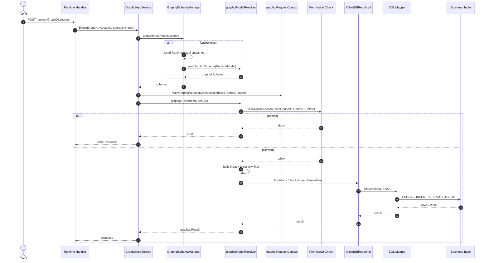
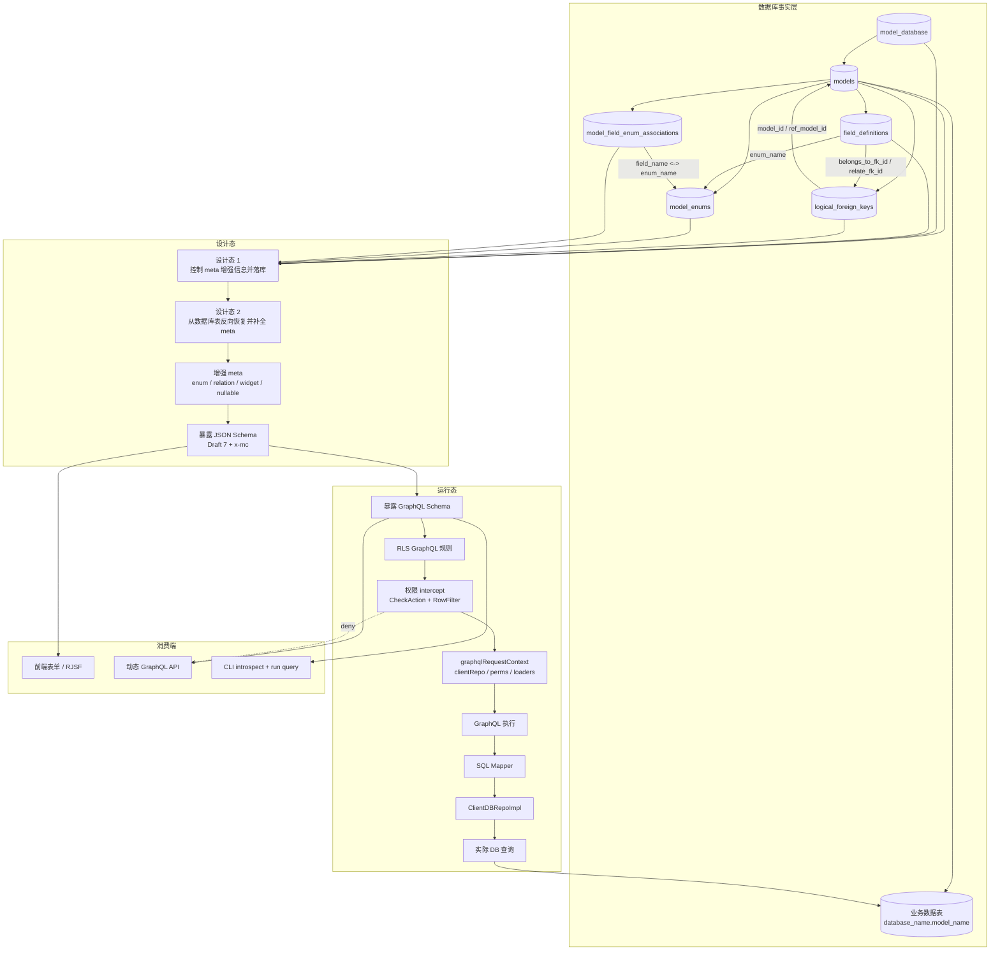

# Runtime 核心架构总结

> 这份总结描述 ModelCraft runtime 的真实数据流：
> **架构分为设计态和运行态两部分：设计态围绕 meta 增强与 JSON Schema 暴露，运行态围绕动态 GraphQL、RLS 拦截和 SQL 执行。**

## 一句话概括

runtime 不是“凭空生成 GraphQL”，而是一个分成设计态和运行态的闭环：

1. **设计态 1**：先把人工控制的 meta 增强信息落到数据库表中，形成可持久化的设计定义
2. **设计态 2**：再从数据库表反向读取事实数据，补全 enum、relation、widget、nullable、displayOrder 等增强 meta
3. **设计态输出**：基于增强 meta 暴露 JSON Schema，供前端动态组件和表单渲染使用
4. **运行态输出**：基于同一份增强 meta 暴露动态 GraphQL Schema，并把 GraphQL 请求翻译为真实 SQL，最终执行数据库查询
5. **运行态拦截**：RLS 规则也以 GraphQL 形式暴露，并在实际查询前被统一 intercept，用于 RBAC 和行级权限控制

---

## 1. 事实源是什么

runtime 的前提不是 `RuntimeModel`，而是数据库里的这些定义表：

- `model_database`：项目接管的数据库注册表
- `models`：模型主表
- `field_definitions`：字段定义表
- `logical_foreign_keys`：逻辑外键表，记录真实关系语义
- `model_enums`：枚举定义表
- `model_field_enum_associations`：字段和枚举的关联表
- `database_name.model_name`：实际业务数据表

这些表提供了 runtime 所需的事实基础：

- 一个模型属于哪个数据库
- 字段是什么类型
- 是否是主键、唯一、必填
- 是否关联枚举
- 是否关联逻辑外键
- 关系是 many-to-one 还是 one-to-many

---

## 2. meta 是怎么增强出来的

runtime 依赖的不是裸字段，而是增强后的 meta。

### 增强步骤

1. 加载 `models` 和 `field_definitions`
2. 根据 `enum_name` 补全枚举定义
3. 根据 `belongs_to_fk_id` / `relate_fk_id` 补全关系信息
4. 从 `logical_foreign_keys` 读取方向和基数
5. 把这些信息写进字段 metadata
6. 生成 JSON Schema 和 RuntimeModel 快照

### 增强后的 meta 典型内容

- `isPrimary`
- `isUnique`
- `displayOrder`
- `nullable`
- `widget`
- `relation`
- `enum`
- `validateRule`
- `precision`
- `scale`
- `minDate` / `maxDate`
- `minTime` / `maxTime`

这意味着：

- **数据库表定义的是事实**
- **meta 定义的是如何消费这些事实**

---

## 3. JSON Schema 的角色

JSON Schema 是前端表单渲染的唯一数据源。

### 设计原则

- 顶层只放标准 JSON Schema 字段
- ModelCraft 专有扩展统一放到 `x-mc`
- `x-mc.widget` 直接表达渲染意图，前端不做推断

### 典型结构

```json
{
  "$schema": "http://json-schema.org/draft-07/schema#",
  "type": "object",
  "title": "User",
  "required": ["name"],
  "properties": {
    "status": {
      "type": "string",
      "enum": ["active", "disabled"],
      "x-mc": {
        "widget": "enum-select",
        "isPrimary": false,
        "isUnique": false,
        "displayOrder": "a2",
        "nullable": true,
        "enum": {
          "name": "StatusEnum",
          "displayName": "状态",
          "isMultiSelect": false
        }
      }
    }
  }
}
```

### 作用

- 给前端表单提供字段类型、校验规则、控件类型
- 给前端提供 relation / enum 的显示信息
- 作为模型导入和同步时的重要契约

---

## 4. RuntimeModel 的角色

`RuntimeModel` 是运行时快照，不是设计态实体本身。

它的作用是把数据库里的模型定义压缩成 GraphQL 构建所需的最小集合：

- `ID`
- `OrgName`
- `ProjectSlug`
- `Name`
- `Title`
- `Description`
- `DatabaseName`
- `DisplayField`
- `Fields`

runtime 不直接依赖 `modeldesign` 的完整实体，而是依赖这个快照。
这样可以把：

- 设计态变更
- 运行态查询

分离开来。

---

## 5. Dynamic GraphQL 的角色

GraphQL 是 runtime 的执行入口。

### 生成方式

`GraphqlSchemaManager` 基于 `RuntimeModel` 构建 Schema：

- 为每个模型生成 Query / Mutation
- 为字段生成输入类型
- 为关系字段生成 resolver
- Schema 可缓存，因为 resolver 不持有请求级状态

### 关键约束

`graphqlModelResolver` 必须是无状态的：

- 不保存 `context.Context`
- 不保存 `clientRepo`
- 不保存 dataloader

请求级状态必须通过 `graphqlRequestContext` 注入。

---

## 6. 请求执行链路

runtime 请求执行时，真实链路大致如下：



---

## 7. 权限 intercept 放在哪

权限不是后置审计，而是 runtime 执行路径的一部分。

### 两层拦截

1. **动作级拦截**
   - `CheckAction(ActionSelect / ActionInsert / ActionUpdate / ActionDelete)`
   - 没权限直接拒绝

2. **行级拦截**
   - 如果是 self scope 或 row scope，会自动注入 row filter
   - 例如只允许当前用户看到自己的数据

### 作用点

权限过滤会在构建输入后、SQL 执行前进入查询条件：

- GraphQL where 条件
- 当前用户 ID
- model owner / end-user ref 字段
- deleted_at / soft-delete 相关约束

---

## 8. GraphQL 到 SQL 的示例

### GraphQL 示例

```graphql
query {
  findManyUser(where: { status: { equals: "active" } }) {
    items {
      id
      name
    }
  }
}
```

### 经过权限 intercept 后的语义

- 先检查是否允许 `select`
- 如果是 self scope，则注入当前用户的 row filter
- 合并用户传入的 where 条件

### 对应 SQL 语义

```sql
SELECT id, name
FROM users
WHERE status = 'active'
  AND owner_user_id = :currentUserID
  AND deleted_at = 0
ORDER BY created_at DESC
LIMIT 20;
```

这不是机械字符串拼接，而是：

1. GraphQL 参数构建 runtime input
2. 权限规则注入额外过滤条件
3. SQL mapper 把 input 翻译成 SQL
4. repository 执行数据库查询

---

## 9. Dataloader 的角色

关系字段解析时，runtime 用 dataloader 解决 N+1 问题。

### 典型场景

- many-to-one
- one-to-many
- 关联字段批量加载

### 为什么需要它

GraphQL resolver 是分字段执行的，如果每个关联字段都查一次数据库，会产生 N+1 问题。

runtime 的做法是：

- resolver 先返回 thunk
- graphql-go 先收集多个 thunk
- dataloader 批量合并请求
- 最终一次查出多条关联数据

---

## 10. 简化架构图



---

## 11. 这套架构最重要的边界

### 设计态负责

- 控制 meta 增强信息并将其落库
- 从数据库表反向生成和补全增强 meta
- 基于增强 meta 暴露 JSON Schema
- 为前端动态组件提供渲染所需的结构化数据

### 运行态负责

- 暴露动态 GraphQL Schema
- 将 GraphQL 请求翻译为 SQL
- 真正执行数据库查询
- 暴露 GraphQL 形式的 RLS 规则
- 在实际查询前 intercept 请求并完成 RBAC / 行级过滤
- 处理 dataloader 等运行时上下文

### 前端负责

- 消费 JSON Schema
- 渲染表单
- 调用动态 GraphQL API

---

## 12. 结论

runtime 的核心可以概括为以下 7 点：

1. **数据库表是唯一真实源**。所有模型、字段、关系和约束信息，都以数据库中的表结构和元数据为准。
2. **设计态负责维护和落库 meta 增强信息**。这些信息描述业务语义，而不只是数据库结构本身。
3. **运行时从数据库表反向恢复并补全 meta 增强信息**，形成可执行的 runtime meta。
4. **增强 meta 进一步生成两类核心产物：JSON Schema 和 GraphQL Schema**。
5. **JSON Schema 用于驱动动态组件和表单渲染**，GraphQL Schema 用于承载 runtime 的数据访问入口。
6. **运行态把 GraphQL 翻译为 SQL 并真正执行数据库查询**，同时把 RLS 规则也以 GraphQL 形式暴露出来，在实际查询前统一 intercept。
7. **CLI 通过 introspect + run query 进入同一套 runtime 能力**，从而支持自动化查询和 AI 工作流。

如果再压缩成一句话，可以记为：

> **ModelCraft runtime 分为设计态和运行态：设计态围绕 meta 增强与 JSON Schema 暴露，运行态围绕动态 GraphQL、RLS intercept 和 SQL 执行，二者共享同一套数据库事实源。**
