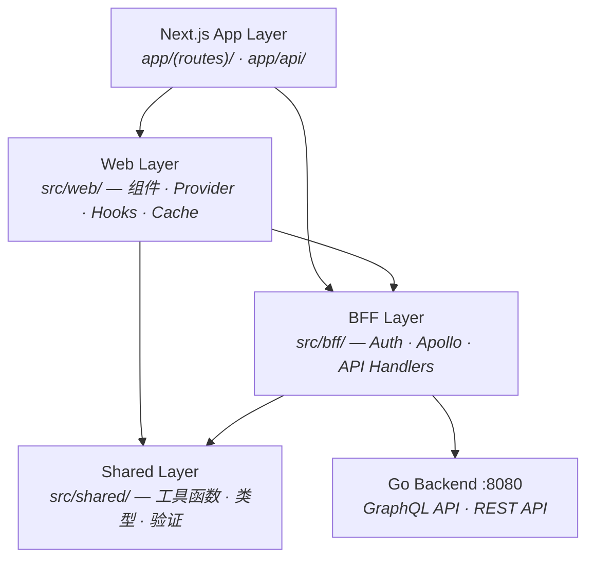
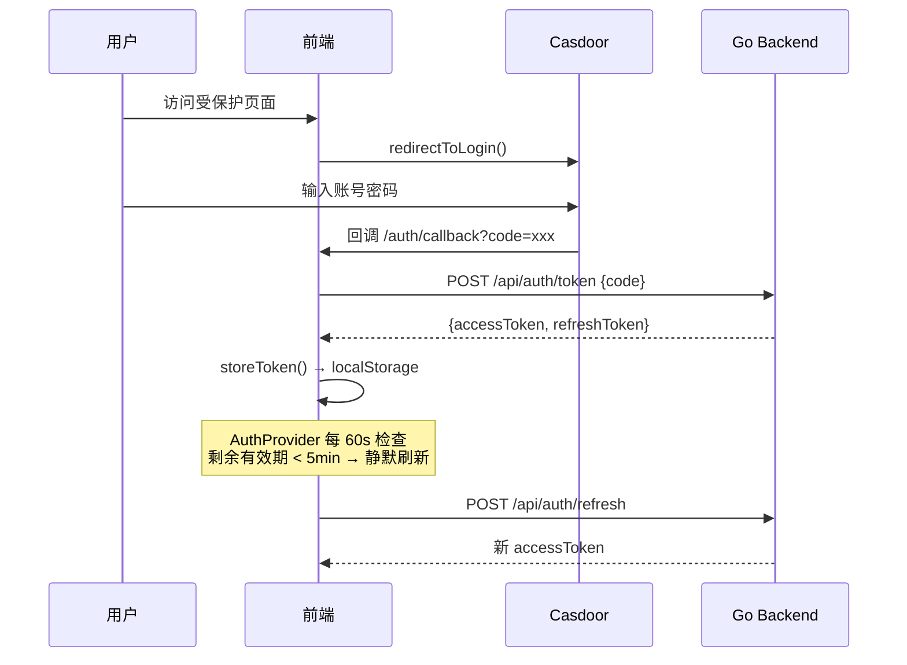

# 前端架构总览

本文档描述 ModelCraft 前端的整体架构、目录分层规范和核心设计约束。

---

## 技术栈

| 类别 | 技术 | 用途 |
|------|------|------|
| **框架** | Next.js 14 (App Router) | 路由、服务端渲染、API Routes |
| **语言** | TypeScript 5 (strict) | 类型安全 |
| **状态管理** | Zustand | 全局状态 |
| **数据获取 (GraphQL)** | Apollo Client 3 | 设计态 / 运行态 GraphQL |
| **数据获取 (REST)** | TanStack Query | 其余 REST 请求 |
| **UI 组件** | shadcn/ui + Radix UI | 基础 UI 原语 |
| **样式** | Tailwind CSS | 工具类样式 |
| **图标** | Lucide React | 统一图标库 |
| **认证** | Casdoor SDK (OAuth2/OIDC) | Token 生命周期管理 |
| **表单** | React Hook Form + Zod | 表单与验证 |

---

## 目录结构

```
src/
├── app/            # Next.js App Router — 路由 + API Routes
├── bff/            # Backend For Frontend 层
├── web/            # Web 层（组件、Provider、页面级 Hooks）
├── shared/         # 跨层共享工具（无 UI 依赖）
├── components/     # 全局公用 UI 组件（含 shadcn/ui 基础组件）
├── stores/         # Zustand 全局状态
├── hooks/          # 全局自定义 Hooks
├── graphql/        # GraphQL 查询 / 变更定义
└── types/          # 全局 TypeScript 类型定义
```

### 路径别名

```
"@/*"       → src/
"@bff/*"    → src/bff/
"@web/*"    → src/web/
"@shared/*" → src/shared/
```

---

## 分层架构



### 依赖规则

| 层 | 可依赖 | 禁止依赖 |
|----|--------|----------|
| App Layer | Web、BFF（通过 public 门面） | — |
| Web Layer | BFF（通过 public 门面）、Shared | — |
| BFF Layer | Shared | Web Layer |
| Shared Layer | 无 | BFF、Web |

---

## 路由结构

### 认证流程路由

| 路由 | 说明 |
|------|------|
| `/login` | 触发 Casdoor 登录跳转 |
| `/auth/callback` | OAuth 回调，交换 code 为 Token |
| `/org-selector` | 登录后选择组织 |
| `/org/create` | 创建新组织 |

### 功能路由（组织作用域）

| 路由 | 说明 |
|------|------|
| `/org/[orgName]/projects` | 项目列表 |
| `/org/[orgName]/projects/[projectSlug]/model-editor` | 核心模型设计器 |
| `/org/[orgName]/projects/[projectSlug]/enums` | 枚举管理 |
| `/org/[orgName]/settings` | 组织设置 |
| `/org/[orgName]/team` | 团队 & 成员管理 |

---

## 认证流程



---

## GraphQL 客户端策略

前端维护三种 Apollo Client 实例，按作用域隔离以防止缓存冲突：

| 客户端类型 | 端点 | 实例策略 | 用途 |
|----------|------|----------|------|
| Org-Scoped | `/graphql/org/{orgName}/` | 单例 | 项目、集群、用户、角色 |
| Project-Scoped | `/graphql/org/{orgName}/project/{slug}/` | 每次新建 | 模型、字段、枚举 CRUD |
| Model Runtime | `/org/{orgName}/project/{slug}/db/{db}/model/{model}` | 每次新建 | 运行时数据查询/变更 |

---

## 反向代理

`next.config.mjs` 将以下路径代理到 Go 后端（`http://localhost:8080`），前端组件从不直接访问后端端口：

| 路径前缀 | 说明 |
|---------|------|
| `/api/auth/*` | 认证相关 |
| `/api/user/*` | 用户信息 |
| `/api/org/*` | 组织管理 |
| `/graphql/org/**` | 设计态 GraphQL |
| `/org/*/project/*/db/*/model/*` | 运行态 GraphQL |

---


