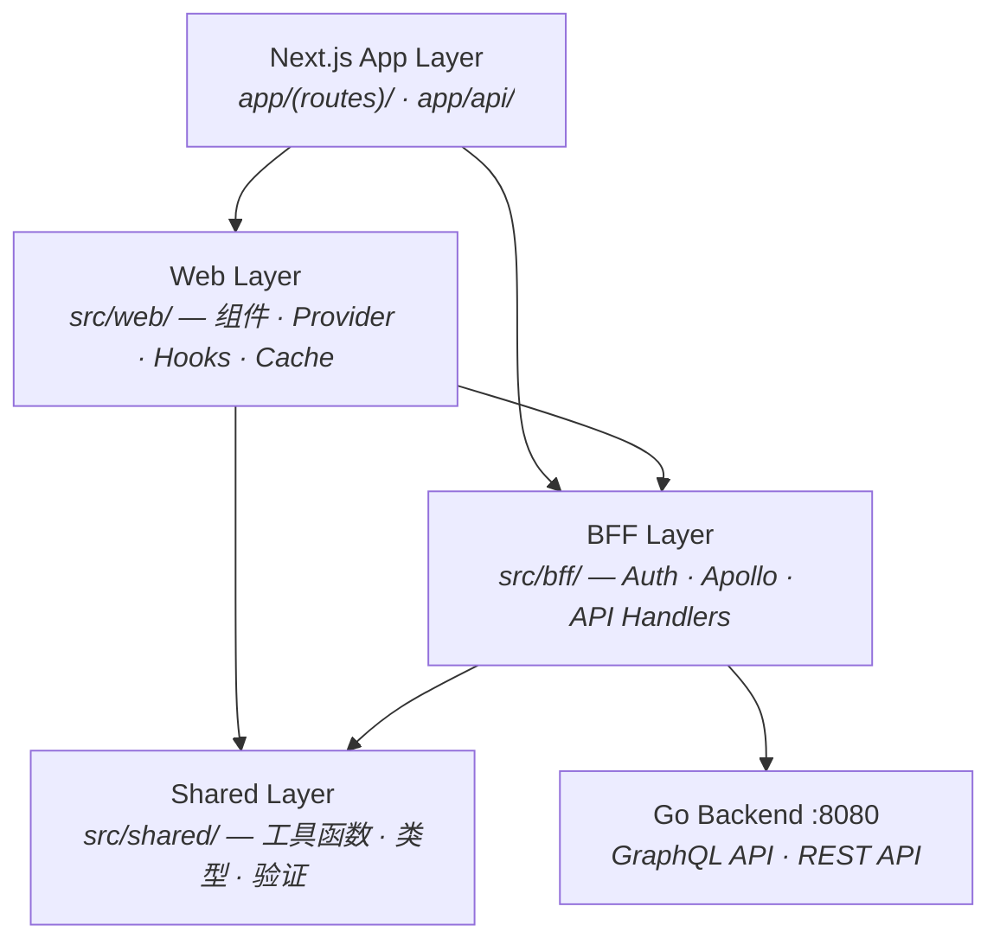
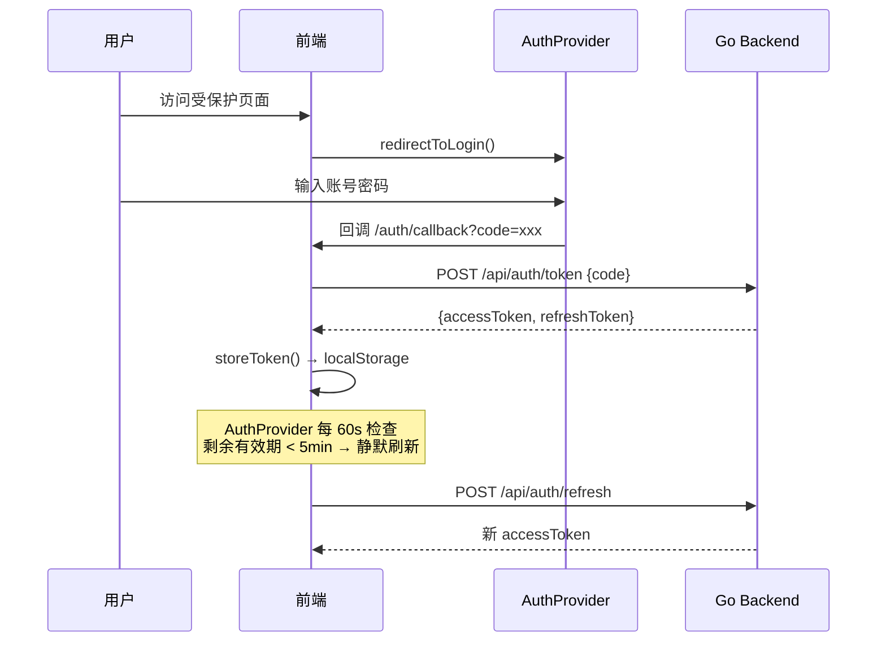

# 前端架构总览

本文档描述 ModelCraft 前端的整体架构、目录分层规范和核心设计约束。

---

## 技术栈

| 类别 | 技术 | 用途 |
|------|------|------|
| **框架** | Next.js 14 (App Router) | 路由、服务端渲染、API Routes |
| **语言** | TypeScript 5 (strict) | 类型安全 |
| **状态管理** | Zustand | 全局状态 |
| **数据获取 (GraphQL)** | Apollo Client 3 | 设计态 / 运行态 GraphQL |
| **数据获取 (REST)** | TanStack Query | 其余 REST 请求 |
| **UI 组件** | shadcn/ui + Radix UI | 基础 UI 原语 |
| **样式** | Tailwind CSS | 工具类样式 |
| **图标** | Lucide React | 统一图标库 |
| **认证** | AuthProvider SDK (OAuth2/OIDC) | Token 生命周期管理 |
| **表单** | React Hook Form + Zod | 表单与验证 |

---

## 目录结构

```
src/
├── app/            # Next.js App Router — 路由 + API Routes
│   ├── api/        # API Routes（代理到 BFF 层）
│   ├── login/      # 登录页
│   ├── auth/       # OAuth 回调处理
│   ├── org-selector/
│   └── org/[orgName]/          # 组织作用域路由
│       └── projects/[projectSlug]/
│           └── model-editor/
│               ├── _components/  # 页面私有组件（Next.js 约定）
│               └── _hooks/       # 页面私有 Hooks
├── bff/            # Backend For Frontend 层
│   ├── api/        # REST 接口封装（auth / org / user）
│   ├── apollo/     # Apollo Client 工厂（3 种实例策略）
│   ├── auth/       # AuthProvider Token 管理
│   └── cms/        # CMS 数据适配
├── web/            # Web 层（UI 渲染相关）
│   ├── components/
│   │   ├── common/     # 通用跨域组件（ErrorDialog、LoadingScreen、RouteValidator）
│   │   ├── features/   # 按业务域组织的功能组件
│   │   │   ├── auth/
│   │   │   ├── copilot/
│   │   │   ├── database/
│   │   │   ├── layout/
│   │   │   ├── model-editor/
│   │   │   ├── organization/
│   │   │   ├── project/
│   │   │   ├── providers/
│   │   │   └── settings/
│   │   ├── cms/        # CMS 专属组件
│   │   └── ui/         # shadcn/ui 基础组件（不手动修改）
│   ├── hooks/          # 按业务域分组的全局 Hooks
│   │   ├── auth/       # useAuth, usePermission
│   │   ├── common/     # use-mobile, useLocalStorage
│   │   ├── database/   # useDatabases
│   │   ├── error/      # useGraphQLErrorHandler
│   │   ├── model/      # useModels
│   │   ├── organization/
│   │   └── project/    # useProjects, useProjectContext 等
│   ├── graphql/        # GraphQL 查询 / 变更定义（.ts 文件）
│   │   ├── mutations/
│   │   └── queries/
│   ├── providers/      # React Context Provider
│   ├── stores/         # Zustand 页面级状态
│   ├── cache/          # Apollo / React Query 缓存策略
│   ├── routing/        # 路由守卫、跳转工具
│   └── cms/            # CMS Web 层
├── shared/         # 跨层共享工具（无 UI 依赖）
│   ├── utils/
│   ├── cache/
│   ├── stores/
│   └── cms/
├── generated/      # GraphQL Codegen 自动生成（禁止手动修改）
│   └── graphql.ts
└── types/          # 全局 TypeScript 类型定义（按业务域拆分）
    ├── index.ts        # 统一导出入口
    ├── model.ts
    ├── cluster.ts
    ├── enum.ts
    ├── foreign-key.ts
    ├── project.ts
    ├── user.ts
    └── schema-issue.ts
```

### 路径别名

```
"@/*"       → src/
"@bff/*"    → src/bff/
"@web/*"    → src/web/
"@shared/*" → src/shared/
```

---

## 分层架构



### 依赖规则

| 层 | 可依赖 | 禁止依赖 |
|----|--------|----------|
| App Layer | Web、BFF（通过 public 门面） | — |
| Web Layer | BFF（通过 public 门面）、Shared | — |
| BFF Layer | Shared | Web Layer |
| Shared Layer | 无 | BFF、Web |

---

## 路由结构

### 认证流程路由

| 路由 | 说明 |
|------|------|
| `/login` | 触发 AuthProvider 登录跳转 |
| `/auth/callback` | OAuth 回调，交换 code 为 Token |
| `/org-selector` | 登录后选择组织 |
| `/org/create` | 创建新组织 |

### 功能路由（组织作用域）

| 路由 | 说明 |
|------|------|
| `/org/[orgName]/projects` | 项目列表 |
| `/org/[orgName]/projects/[projectSlug]/model-editor` | 核心模型设计器 |
| `/org/[orgName]/projects/[projectSlug]/enums` | 枚举管理 |
| `/org/[orgName]/settings` | 组织设置 |
| `/org/[orgName]/team` | 团队 & 成员管理 |

---

## 认证流程



---

## GraphQL 客户端策略

前端维护三种 Apollo Client 实例，按作用域隔离以防止缓存冲突：

| 客户端类型 | 端点 | 实例策略 | 用途 |
|----------|------|----------|------|
| Org-Scoped | `/graphql/org/{orgName}/` | 单例 | 项目、集群、用户、角色 |
| Project-Scoped | `/graphql/org/{orgName}/project/{slug}/` | 每次新建 | 模型、字段、枚举 CRUD |
| Model Runtime | `/org/{orgName}/project/{slug}/db/{db}/model/{model}` | 每次新建 | 运行时数据查询/变更 |

---

## GraphQL 操作层约定

前端**单独划分 GraphQL 操作层**，统一管理所有查询和变更定义，禁止在组件内部直接裸调 GraphQL。

### 为什么禁止在组件中直接写 GraphQL 操作

- **查询定义分散**：GraphQL 操作散落在各个组件中，无法集中管理和发现
- **复用困难**：组件内的查询无法被其他组件复用
- **测试困难**：组件与 GraphQL 操作强耦合，难以单独测试
- **Codegen 不可见**：Codegen 无法扫描组件内的查询定义，导致类型生成不完整

### 正确做法：静态 GraphQL 定义

所有 GraphQL 操作必须定义在 `src/web/graphql/` 目录下的静态 `.ts` 文件中：

```
src/web/graphql/
├── mutations/
│   ├── index.ts
│   ├── project.ts
│   ├── model.ts
│   ├── cluster.ts
│   ├── enum.ts
│   └── ...
└── queries/
    ├── index.ts
    ├── project.ts
    ├── model.ts
    ├── cluster.ts
    ├── enum.ts
    └── ...
```

组件通过导入使用：

```typescript
// ✅ 正确：从 graphql 层导入
import { GET_MODELS } from '@web/graphql/queries/model'
import { CREATE_MODEL } from '@web/graphql/mutations/model'

function ModelList() {
  const { data } = useQuery(GET_MODELS)
  // ...
}
```

```typescript
// ❌ 禁止：在组件内直接定义 GraphQL 操作
function ModelList() {
  const { data } = useQuery(gql`query { models { ... } }`)
  // ...
}
```

### 依赖关系

```
src/web/graphql/          ← GraphQL 操作定义（静态 .ts 文件）
        ↓
src/generated/graphql.ts  ← Codegen 生成的类型（禁止手动修改）
        ↓
src/bff/apollo/           ← Apollo Client 实例管理
        ↓
src/web/components/       ← 组件只做 UI 渲染，不直接接触 GraphQL
```

组件层永远不直接 import Apollo Client 或写 gql 操作，必须通过：
1. 导入已定义的查询/变更
2. 或通过 BFF 层的门面函数（如 `@bff/model-enum/public.ts`）

---

## 反向代理

`next.config.mjs` 将以下路径代理到 Go 后端（`http://localhost:8080`），前端组件从不直接访问后端端口：

| 路径前缀 | 说明 |
|---------|------|
| `/api/auth/*` | 认证相关 |
| `/api/user/*` | 用户信息 |
| `/api/org/*` | 组织管理 |
| `/graphql/org/**` | 设计态 GraphQL |
| `/org/*/project/*/db/*/model/*` | 运行态 GraphQL |

---

## 组件架构约定

### `features/` vs `common/`

| 目录 | 放什么 | 原则 |
|------|--------|------|
| `web/components/features/<domain>/` | 绑定到特定业务域的组件（如 `ProjectCard`、`ModelSidebar`） | 只在对应业务场景下使用 |
| `web/components/common/` | 跨域通用组件（如 `ErrorHistoryDialog`、`LoadingScreen`、`RouteValidator`） | 无业务语义，可在任何地方复用 |
| `web/components/ui/` | shadcn/ui 原子组件 | 禁止手动修改，通过 shadcn CLI 管理 |

### 页面私有组件：`_components/` 和 `_hooks/`

复杂页面（如 `model-editor`）将私有组件和 Hooks 拆分到页面目录下的 `_components/` 和 `_hooks/` 中：

```
app/org/[orgName]/projects/[projectSlug]/model-editor/
├── page.tsx               ← 精简入口，仅负责组合
├── layout.tsx
├── _components/           ← 页面私有组件（下划线前缀 = Next.js 私有约定，不参与路由）
│   ├── ModelSidebar.tsx
│   ├── ModelDetailPanel.tsx
│   ├── ModelEditorView.tsx
│   ├── FieldEditSheet.tsx
│   ├── ForeignKeyPanel.tsx
│   ├── CreateModelDialog.tsx
│   ├── DeleteModelDialog.tsx
│   └── index.ts
└── _hooks/                ← 页面私有 Hooks
    ├── useModelEditorState.ts   # UI 状态管理
    ├── useModelCRUD.ts          # 模型增删改查
    ├── useFieldOperations.ts    # 字段操作
    ├── useForeignKeys.ts        # 外键操作
    ├── types.ts                 # 页面级类型
    └── index.ts
```

**规则**：
- 当 `page.tsx` 超过 200 行时，必须拆分为 `_components/` + `_hooks/`
- `_components/` 中的组件不得被其他页面直接引用；如需复用，升级到 `web/components/features/`
- `_hooks/` 中的 hook 只封装该页面的业务逻辑，数据请求 hook 放到 `web/hooks/<domain>/`

---

## GraphQL 类型生成

前端使用 **GraphQL Code Generator** 从 Schema 自动生成 TypeScript 类型，**禁止手动维护 GraphQL 操作类型**：

```
contract/graph/           ← API Contract（通过 git subtree 同步，禁止手动修改）
src/web/graphql/          ← GraphQL 操作定义（queries / mutations）
        ↓ codegen
src/generated/graphql.ts  ← 自动生成的类型和 hooks（禁止手动修改）
```

```bash
# 重新生成类型
npm run codegen
```

---

## Types 组织约定

全局类型按业务域拆分到 `src/types/` 下独立文件，通过 `index.ts` 统一导出：

```typescript
// ✅ 正确：从 index 导入
import { DataModel, FieldDefinition } from '@/types'

// ❌ 禁止：直接引用具体文件
import { DataModel } from '@/types/model'
```

新增类型时，选择对应业务域文件（`model.ts` / `cluster.ts` / `enum.ts` 等），不得堆回 `index.ts`。

---

## Hooks 组织约定

`src/web/hooks/` 按业务域分子目录，禁止在根目录新建 hook 文件：

```typescript
// ✅ 正确：按域放置
src/web/hooks/project/useProjects.ts

// ❌ 禁止：直接放在 hooks 根目录
src/web/hooks/useProjects.ts
```

---


