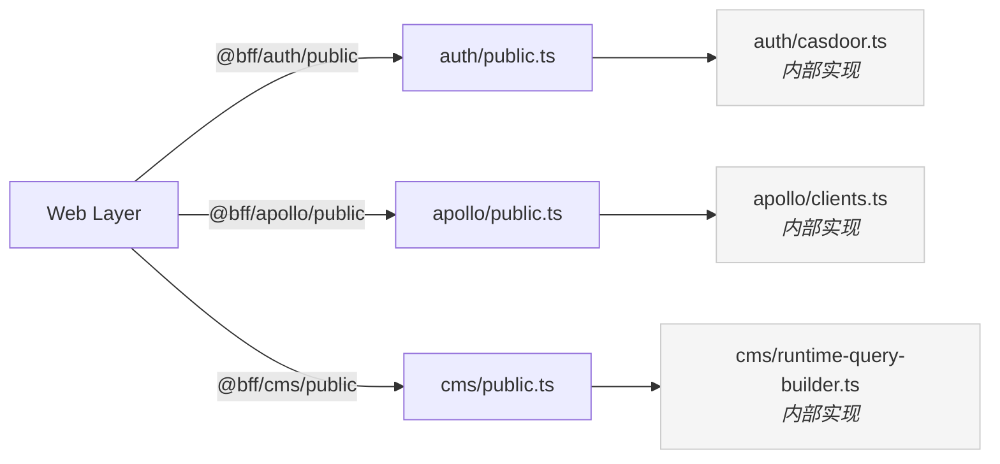
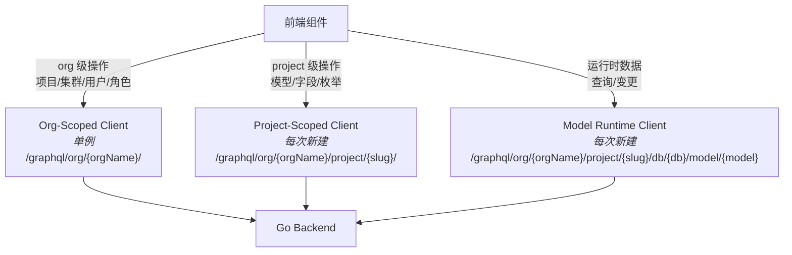
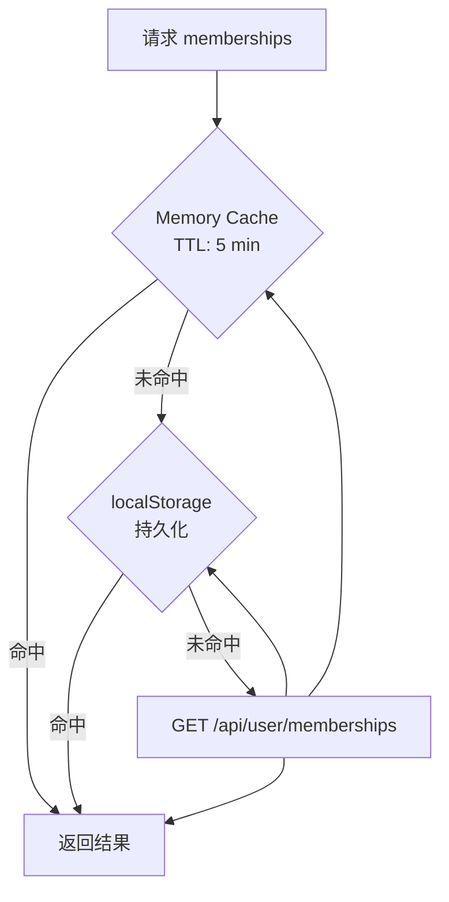

# BFF 层设计

BFF（Backend For Frontend）层是前端与 Go 后端之间的适配层，封装认证逻辑、GraphQL 客户端实例化和 HTTP 代理处理器。

---

## 目录结构

```
src/bff/
├── auth/
│   ├── casdoor.ts               # Casdoor SDK 封装：Token 生命周期管理
│   ├── token-utils.ts           # 从 localStorage 读取 org 上下文
│   └── public.ts                # 对外暴露的公开 API（门面）
│
├── apollo/
│   ├── clients.ts               # 三种 Apollo Client 工厂函数
│   └── public.ts                # 对外暴露的公开 API（门面）
│
├── cms/
│   ├── runtime-query-builder.ts # 动态 GraphQL 查询/变更构建器
│   └── public.ts                # 对外暴露的公开 API（门面）
│
└── api/
    ├── auth/token.ts            # POST /api/auth/token 处理器
    ├── auth/refresh.ts          # POST /api/auth/refresh 处理器
    ├── user/memberships.ts      # GET /api/user/memberships 处理器
    ├── org/init.ts              # POST /api/org/init 处理器
    └── copilotkit.ts            # POST /api/copilotkit 处理器
```

---

## 门面模式（Public Facade）

每个 BFF 子模块都有一个 `public.ts` 作为**唯一对外出口**，Web Layer 只能从门面导入，禁止访问内部模块。



ESLint 规则强制执行此边界：禁止 Web Layer 跳过 `public.ts` 直接访问 BFF 内部文件。

---

## 端点感知集中在 BFF

后端 API URL、路径拼接、认证头注入等细节**只存在于 BFF 层**。组件层禁止硬编码任何端点 URL。

```tsx
// ❌ 禁止：组件中硬编码端点
const url = `/graphql/org/${orgName}/project/${slug}/`

// ✅ 正确：通过 BFF 导出的函数获取
import { createProjectScopedClient } from '@bff/apollo/public'
const client = createProjectScopedClient(orgName, slug)
```

---

## GraphQL 端点规范

采用 `/graphql` 前缀模式，统一所有 GraphQL 端点。客户端只需一个 base URL，通过路径扩展访问不同资源。

| 通道 | 端点 | 客户端实例 | 用途 |
|------|------|-----------|------|
| Org-Scoped | `/graphql/org/{orgName}/` | 单例 | 项目、集群、用户、角色管理 |
| Project-Scoped | `/graphql/org/{orgName}/project/{projectSlug}/` | 每次新建 | 模型、字段、枚举 CRUD |
| Model Runtime | `/graphql/org/{orgName}/project/{projectSlug}/db/{db}/model/{model}` | 每次新建 | 运行时数据查询/变更 |

### 为什么用 prefix 模式

项目客户端只使用 GraphQL 协议。prefix 模式下客户端只需知道一个 base URL `/graphql`，通过路径扩展即可覆盖所有资源范围，便于在 nginx/proxy 层统一拦截。

---

## Auth 模块

负责 Casdoor OAuth2 集成和 JWT Token 的完整生命周期管理。

### Token 存储

| Key | 内容 |
|-----|------|
| `localStorage.auth_token` | JWT access token |
| `localStorage.auth_refresh_token` | Refresh token |

### 对外暴露的函数（via `public.ts`）

| 函数 | 说明 |
|------|------|
| `getToken()` | 获取当前 access token |
| `storeToken(access, refresh)` | 持久化 Token |
| `removeToken()` | 清除所有 Token（登出） |
| `isAuthenticated()` | 检查是否已登录且未过期 |
| `isTokenNearExpiry()` | Token 是否在 5 分钟内过期 |
| `getUserInfoFromToken()` | 从 JWT payload 解析用户信息 |
| `exchangeCodeForToken(code)` | OAuth 授权码换 Token |
| `refreshAccessToken()` | 静默刷新 Token（单例模式） |
| `redirectToLogin()` | 跳转 Casdoor 登录页 |

**Token 刷新采用单例 Promise**，确保并发场景下只发起一次刷新请求，其他请求等待同一个 Promise 结果。

---

## Apollo 模块

### 三种客户端实例



| 客户端 | 实例策略 | 原因 |
|--------|----------|------|
| Org-Scoped | 单例 | org 内操作共享缓存，减少重复请求 |
| Project-Scoped | 每次新建 | 不同 project 的模型数据不应互相污染缓存 |
| Model Runtime | 每次新建 | 动态 Schema，无法共享缓存 |

每种客户端均包含：Auth Link（注入 Bearer Token + x-request-id）、Error Link（401 自动跳转登录）。

---

## API Handlers 模块

Next.js API Routes 作为代理层，将请求转发至 Go 后端，统一由 BFF 处理认证 header 的注入。

| 路由 | 方法 | 说明 |
|------|------|------|
| `/api/auth/token` | POST | OAuth code → JWT |
| `/api/auth/refresh` | POST | refresh token → 新 access token |
| `/api/user/memberships` | GET | 获取用户所属组织列表 |
| `/api/org/init` | POST | 初始化组织（幂等） |
| `/api/copilotkit` | POST | AI Copilot 代理 |

---

## CMS 模块（动态查询构建器）

根据模型名和字段列表，在运行时动态生成 GraphQL 查询和变更语句，供 Model Runtime Client 使用。

| 函数 | 生成内容 |
|------|----------|
| `buildFindManyQuery` | 分页列表查询 |
| `buildFindUniqueQuery` | 按主键查询单条 |
| `buildCreateMutation` | 创建记录 |
| `buildUpdateMutation` | 更新记录 |
| `buildDeleteMutation` | 删除记录 |
| `buildCountQuery` | 统计数量 |

---

## Membership 三级缓存

对 `/api/user/memberships` 的结果进行三级缓存，减少组织切换时的重复网络请求。



同一时刻最多只有一个并发 API 请求（单例 Promise），防止 org 切换时重复发起请求。

---

## 参考文档

| 主题 | 文档 |
|------|------|
| 前端架构总览 | [architecture.md](./architecture.md) |
| ESLint 层边界规则 | [eslint-rules.md](./eslint-rules.md) |
| 代码规范 | [code-conventions.md](./code-conventions.md) |
