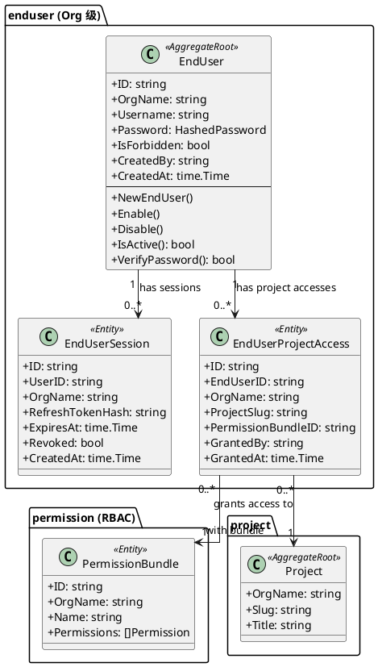

# EndUser 身份系统 v2 — 领域模型变更

---

## 变更摘要

| 实体 | 变更类型 | 说明 |
|------|---------|------|
| `EndUser` | **修改** | 去掉 `ProjectSlug` 字段，作用域上移到 Org |
| `EndUserSession` | **修改** | 隔离 key 从 `(org_name, project_slug)` → `(org_name)` |
| `EndUserProjectAccess` | **新增** | 表达 EndUser ↔ Project 的多对多授权关系 |

---

## EndUser（修改）

```go
// EndUser represents an end-user entity (aggregate root).
// v2: 账号作用域从 (OrgName, ProjectSlug) 上移到 OrgName。
// 同一 Org 内 Username 全局唯一。
type EndUser struct {
    ID          string         // UUID, primary key
    OrgName     string         // 归属 Org（v2 新增，替换 ProjectSlug 作为租户 key）
    Username    string         // 3-64 chars, ^[a-zA-Z0-9_-]+$, Org 内唯一
    Password    HashedPassword // bcrypt hashed
    IsForbidden bool           // whether the account is disabled
    CreatedBy   string         // developer user_id（空 = 自注册）
    CreatedAt   time.Time
    UpdatedAt   time.Time
}
```

**变更点**:
- 移除 `ProjectSlug` 字段（原来在 Repository 层通过 Context 传入）
- `OrgName` 成为显式字段（而不仅仅是 Context 中的 tenant key）

---

## EndUserProjectAccess（新增）

```go
// EndUserProjectAccess 表达一个 EndUser 对一个 Project 的访问授权。
// 一个 EndUser 可以有多条 ProjectAccess（访问多个 Project）。
// 一个 Project 内的同一个 EndUser 可以有多条（授予多个 PermissionBundle）。
type EndUserProjectAccess struct {
    ID               string    // UUID
    EndUserID        string    // FK → end_user_users.id
    OrgName          string    // 冗余字段，加速查询
    ProjectSlug      string    // FK → projects.slug
    PermissionBundleID string  // FK → permission_bundles.id（Developer RBAC 体系中的 Bundle）
    GrantedBy        string    // developer user_id
    GrantedAt        time.Time
}

// EndUserProjectAccessRepository defines persistence for project access control.
type EndUserProjectAccessRepository interface {
    // Grant 为某个 EndUser 授权某个 Project 下的某个 PermissionBundle
    Grant(ctx context.Context, access *EndUserProjectAccess) error

    // Revoke 撤销某条授权记录
    Revoke(ctx context.Context, id string) error

    // RevokeAllByEndUserAndProject 撤销某 EndUser 在某 Project 的所有授权
    RevokeAllByEndUserAndProject(ctx context.Context, endUserID, projectSlug string) error

    // ListProjectsByEndUser 返回某 EndUser 有权访问的所有 Project（用于登录后选择 Project）
    ListProjectsByEndUser(ctx context.Context, endUserID string) ([]*EndUserProjectInfo, error)

    // ListAccessByProject 列出某 Project 下所有被授权的 EndUser（含其 Bundle）
    ListAccessByProject(ctx context.Context, projectSlug string, query ListAccessQuery) ([]*EndUserProjectAccess, int64, error)

    // ListBundlesByEndUserAndProject 返回某 EndUser 在某 Project 内被授予的所有 Bundle
    ListBundlesByEndUserAndProject(ctx context.Context, endUserID, projectSlug string) ([]string, error)
}

// EndUserProjectInfo 登录后选 Project 时返回的精简信息
type EndUserProjectInfo struct {
    ProjectSlug  string
    ProjectTitle string
}
```

---

## PlantUML 类图



---

## 变更对比

### v1（现状）
```
Org
 └── Project A
       ├── EndUser 张三（id: uuid-1）
       └── EndUser 李四（id: uuid-2）
 └── Project B
       ├── EndUser 张三（id: uuid-3）  ← 完全独立的账号
       └── EndUser 王五（id: uuid-4）
```

### v2（目标）
```
Org
 ├── EndUser 张三（id: uuid-1）
 │     ├── ProjectAccess → Project A（Bundle: editor）
 │     └── ProjectAccess → Project B（Bundle: viewer）
 ├── EndUser 李四（id: uuid-2）
 │     └── ProjectAccess → Project A（Bundle: admin）
 └── EndUser 王五（id: uuid-5）
       └── ProjectAccess → Project B（Bundle: editor）
```

---

## EndUserRepository 变更

```go
// v2: EndUserRepository 的 tenant scope 变为 OrgName（去掉 ProjectSlug）
type EndUserRepository interface {
    Save(ctx context.Context, user *EndUser) error
    GetByID(ctx context.Context, id string) (*EndUser, error)
    GetByUsername(ctx context.Context, orgName, username string) (*EndUser, error)
    UpdateStatus(ctx context.Context, id string, isForbidden bool) error
    Delete(ctx context.Context, id string) error
    ListWithTotal(ctx context.Context, query ListEndUsersQuery) ([]*EndUser, int64, error)
}

// v2 ListEndUsersQuery：search 范围从 project → org
type ListEndUsersQuery struct {
    OrgName string // 必填
    Search  string // username 模糊搜索（可选）
    First   int    // 分页大小，默认 20，最大 100
    After   string // 游标（可选）
}
```
