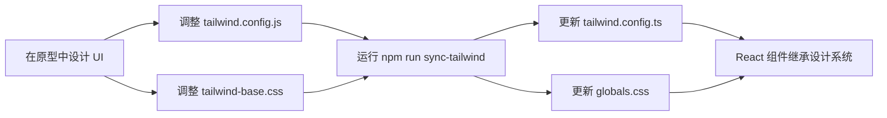

# Tailwind 配置同步指南

本指南介绍如何在 ModelCraft 项目中保持原型和 React 组件的 Tailwind 配置同步。

## 🎯 设计理念：原型优先 (Prototype-First)

ModelCraft 采用 **HTML-First Prototype 工作流**，遵循以下原则：

1. **原型是设计源** - 在 HTML 原型中设计和调整 UI
2. **设计流向实现** - 设计系统配置从原型流向 React 项目
3. **配置单向同步** - 主流程是 Prototype → React

## 📁 文件结构

```
modelcraft-front/
├── prototypes/
│   └── shared/
│       ├── tailwind.config.js      # 原型配置（设计源）
│       └── tailwind-base.css       # 原型 CSS（设计源）
├── tailwind.config.ts              # React 项目配置（同步目标）
├── src/app/globals.css             # CSS 变量定义（同步目标）
└── scripts/
    └── sync-from-prototype.js      # 同步脚本（原型 → React）
```

## 🔄 同步机制

### 工作流程：原型 → React



### 标准工作流程

1. **在原型中设计 UI**
   ```bash
   # 编辑原型配置
   code prototypes/shared/tailwind.config.js
   code prototypes/shared/tailwind-base.css
   
   # 在浏览器中预览效果
   open prototypes/workspace/index.html
   ```

2. **同步到 React 项目**
   ```bash
   npm run sync-tailwind
   ```

3. **实现 React 组件**
   ```tsx
   // 直接复制原型中验证过的 Tailwind 类名
   <button className="h-9 px-4 bg-[#2563eb] hover:bg-[#1d4ed8]">
     新建项目
   </button>
   ```

4. **验证 React 组件**
   ```bash
   npm run dev
   # 访问 http://localhost:3000
   ```

## 📝 常见使用场景

### 场景 1：添加新颜色（原型优先）

**步骤：**

1. 在原型中修改 `prototypes/shared/tailwind.config.js`：
   ```javascript
   colors: {
     brand: {
       DEFAULT: '#2563eb',
       hover: '#1d4ed8',
     }
   }
   ```

2. 在原型中测试效果：
   ```html
   <button class="bg-brand hover:bg-brand-hover">
     按钮
   </button>
   ```

3. **确认后同步到 React：**
   ```bash
   npm run sync-tailwind
   ```

4. 在 React 中使用：
   ```tsx
   <Button className="bg-brand hover:bg-brand-hover">
     按钮
   </Button>
   ```

### 场景 2：修改 CSS 变量（原型优先）

**步骤：**

1. 在原型中修改 `prototypes/shared/tailwind-base.css`：
   ```css
   :root {
     --primary: 220.9 39.3% 11%;
     --selected: 215 20% 88%;  /* 修改选中背景色 */
   }
   ```

2. 在原型中验证效果：
   ```html
   <div class="bg-selected">选中状态</div>
   ```

3. 确认后同步到 React：
   ```bash
   npm run sync-tailwind
   ```

4. React 自动继承新样式（无需修改代码）

### 场景 3：添加自定义类（原型优先）

**步骤：**

1. 在原型中添加 `prototypes/shared/tailwind-base.css`：
   ```css
   /* Custom Component Classes */
   .tech-card {
     background: white;
     border: 1px solid hsl(var(--border));
     border-radius: 8px;
     padding: 16px;
   }
   ```

2. 在原型中使用和验证：
   ```html
   <div class="tech-card">
     卡片内容
   </div>
   ```

3. 同步到 React：
   ```bash
   npm run sync-tailwind
   ```

## ⚠️ 注意事项

### DO ✅

- **在原型中设计和验证 UI** - 原型是设计的唯一真相源
- **使用 `npm run sync-tailwind` 同步到 React** - 这是标准工作流程
- **每次原型设计修改后运行同步脚本**
- **使用版本控制跟踪配置变更**
- **在原型中完全验证效果后再同步**

### DON'T ❌

- **不要直接修改 React 的 `tailwind.config.ts` 或 `globals.css`**
  - 这些文件应该从原型同步过来
  - 手动修改会在下次同步时被覆盖
  - 除非是 React 特定的配置（如插件）

- **不要跳过原型验证步骤**
  - 总是先在原型中验证设计
  - 再同步到 React 项目

## 🔍 验证同步结果

### 检查清单

运行同步后，验证以下内容：

- [ ] 脚本输出显示成功（绿色 ✅）
- [ ] `tailwind.config.ts` 已更新
- [ ] `src/app/globals.css` 已更新
- [ ] 备份文件已创建在 `.tailwind-backups/` 目录
- [ ] 重启 Next.js 开发服务器
- [ ] React 组件显示符合原型设计

### 手动验证

```bash
# 查看备份目录
ls -la .tailwind-backups/

# 查看同步后的文件
cat tailwind.config.ts | head -20
cat src/app/globals.css | head -20

# 重启开发服务器
npm run dev
```

## 🐛 故障排除

### 问题：脚本运行失败

**错误信息：**
```
❌ 文件不存在: /path/to/file
```

**解决方案：**
1. 检查原型文件是否存在
2. 确保项目结构完整
3. 运行 `git status` 检查文件是否被删除

### 问题：React 显示效果不对

**可能原因：**
1. Next.js 缓存未清理
2. 开发服务器未重启
3. 同步脚本未运行

**解决方案：**
```bash
# 1. 重新运行同步
npm run sync-tailwind

# 2. 清理 Next.js 缓存
rm -rf .next

# 3. 重启开发服务器
npm run dev
```

### 问题：同步后配置丢失

**可能原因：**
备份系统会自动保存旧配置

**解决方案：**
```bash
# 查看备份文件
ls -la .tailwind-backups/

# 恢复备份（如果需要）
cp .tailwind-backups/tailwind.config.ts.2026-03-15T02-54-33.backup tailwind.config.ts
```

### 问题：原型和 React 显示不一致

**可能原因：**
1. 使用了 React 特定的 Tailwind 插件
2. CSS 变量未正确同步
3. 浏览器缓存

**解决方案：**
```bash
# 1. 重新同步
npm run sync-tailwind

# 2. 强制刷新原型
# Chrome/Firefox: Cmd+Shift+R (Mac) 或 Ctrl+Shift+R (Windows)

# 3. 重启 React 开发服务器
npm run dev
```

## 📚 相关资源

- [HTML-First Prototype 工作流](.codebuddy/skills/html-first-prototype/SKILL.md)
- [Scripts README](scripts/README.md)
- [Prototypes README](prototypes/README.md)
- [设计系统规范](ai-metadata/style/STYLE.md)

## 🎓 最佳实践

1. **原型优先设计流程**
   ```bash
   # 1. 在原型中设计和调整
   open prototypes/workspace/index.html
   
   # 2. 验证设计效果
   # （在浏览器中测试交互和视觉）
   
   # 3. 同步到 React
   npm run sync-tailwind
   
   # 4. 实现 React 组件
   npm run dev
   ```

2. **每次设计修改后立即同步**
   ```bash
   # 编辑原型配置后立即运行
   npm run sync-tailwind
   ```

3. **将同步集成到工作流**
   ```bash
   # 可以添加到 pre-commit hook
   # .husky/pre-commit
   npm run sync-tailwind
   git add tailwind.config.ts src/app/globals.css
   ```

4. **在 PR 中包含设计系统更新**
   - 修改原型设计时，提交包含同步后的 React 配置
   - 让 reviewer 可以在原型中预览效果
   - 确保原型和实现保持同步

5. **使用备份功能**
   - 同步脚本自动创建备份
   - 出错时可以快速恢复
   - 定期清理旧备份文件

## 💡 核心原则

> **原型是设计的"唯一真相源"**

- ✅ 在原型中设计和验证 UI
- ✅ 使用 `npm run sync-tailwind` 同步到 React
- ✅ React 组件继承原型的设计系统
- ✅ Tailwind 类名 100% 兼容，直接复制即可
- ✅ 自动化减少错误，避免手动维护两套配置
