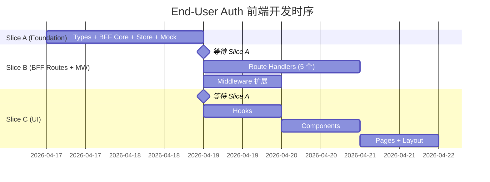

# 终端用户认证 — 前端架构切片与 Ownership

> **类型**：Worker 并行开发切片
> **父文档**：[end-user-auth-front-architecture.md](./end-user-auth-front-architecture.md)
> **日期**：2026-04-16

---

## 设计原则回顾

1. **对称现有开发者认证**：文件命名和结构完全对称 `auth/` 体系，以 `end-user-` 前缀区分
2. **零侵入开发者逻辑**：middleware 追加分支，不修改任何开发者 auth 文件
3. **Cookie 硬隔离**：`end_user_refresh_token` vs `refresh_token`，path 绑定到 Project 级
4. **全程 Mock**：此阶段禁止真实后端调用，BFF Route Handler 内联 mock 逻辑

---

## 1. 模块划分

### 1.1 模块边界表

| 模块 ID | 模块名 | 职责 | 所属层 | 依赖 |
|---------|--------|------|--------|------|
| **M1** | BFF End-User Auth Core | Cookie 操作 / JWT 签发验证 / Go Client（mock） | BFF | Shared (types) |
| **M2** | BFF Route Handlers | 5 个 API Route：login / register / logout / refresh / me | App (API Routes) | M1 |
| **M3** | Store + Client Utilities | Zustand store + 客户端侧 refreshToken / isAuthenticated | Shared + BFF | M1 |
| **M4** | Middleware Extension | 追加终端用户路由守卫分支 | App (middleware) | — |
| **M5** | End-User Auth Hooks | useRequireEndUserAuth / useEndUser / useEndUserLoginForm | Web (hooks) | M2, M3 |
| **M6** | End-User Login Page | 登录页 Server Component + Layout + Form 组件 | App + Web | M5 |
| **M7** | Data Layout Guard | `/data` 路由守卫 layout（调用 useRequireEndUserAuth） | App | M5 |
| **M8** | Types | end-user-auth.ts 类型定义 | Types | — |
| **M9** | Mock Data & Handlers | MSW handlers + 数据工厂（BFF REST 端点） | Mocks | M8 |

### 1.2 模块依赖关系图

```
              ┌───────────────────────────────────────────────────────────┐
              │                      Types (M8)                          │
              │               src/types/end-user-auth.ts                  │
              └───────────────────────────────────────────────────────────┘
                        ▲              ▲               ▲
                        │              │               │
        ┌───────────────┼──────────────┼───────────────┼───────────────┐
        │               │              │               │               │
   ┌────┴────┐    ┌─────┴─────┐   ┌────┴────┐    ┌─────┴─────┐   ┌─────┴─────┐
   │  M1     │    │   M9      │   │  M3     │    │   M5      │   │   M6/M7   │
   │BFF Core │    │  Mock     │   │Store/   │    │  Hooks    │   │  Pages    │
   │         │    │Handlers   │   │Client   │    │           │   │           │
   └────┬────┘    └───────────┘   └────┬────┘    └─────┬─────┘   └─────┬─────┘
        │                              │               │               │
        │                              │               │               │
        ▼                              ▼               ▼               ▼
   ┌─────────────────────────────────────────────────────────────────────────┐
   │                          M2: BFF Route Handlers                         │
   │                    src/app/api/bff/end-user/auth/*/route.ts             │
   └─────────────────────────────────────────────────────────────────────────┘
                                       │
                                       ▼
   ┌─────────────────────────────────────────────────────────────────────────┐
   │                        M4: Middleware Extension                          │
   │                            src/middleware.ts                             │
   └─────────────────────────────────────────────────────────────────────────┘
```

---

## 2. 目录结构规划

### 2.1 完整目录树

```
src/
├── app/
│   ├── api/bff/
│   │   └── end-user/
│   │       └── auth/
│   │           ├── login/
│   │           │   └── route.ts          # [M2] POST 登录 BFF Handler（含 mock）
│   │           ├── register/
│   │           │   └── route.ts          # [M2] POST 注册 BFF Handler（含 mock）
│   │           ├── logout/
│   │           │   └── route.ts          # [M2] POST 登出 BFF Handler（含 mock）
│   │           ├── refresh/
│   │           │   └── route.ts          # [M2] POST 刷新 BFF Handler（含 mock）
│   │           └── me/
│   │               └── route.ts          # [M2] GET 当前用户 BFF Handler（含 mock）
│   │
│   └── org/[orgName]/project/[projectSlug]/
│       ├── user/
│       │   └── login/
│       │       └── page.tsx              # [M6] 终端用户登录页
│       └── data/
│           └── layout.tsx                # [M7] 数据管理守卫 layout
│
├── bff/
│   └── end-user/                         # [M1] 对称 bff/auth/
│       ├── end-user-go-client.ts         # Go Client mock（不调真实后端）
│       ├── end-user-cookie-utils.ts      # Cookie 操作（path 绑定 Project）
│       ├── end-user-jwt-utils.ts         # JWT 签发/验证
│       ├── end-user-auth-client.ts       # [M3] 客户端侧工具（调 BFF refresh）
│       └── public.ts                     # 门面导出
│
├── shared/
│   └── stores/
│       └── end-user-auth-store.ts        # [M3] Zustand store
│
├── web/
│   ├── hooks/
│   │   └── end-user-auth/                # [M5] 对称 hooks/auth/
│   │       ├── use-end-user-auth.ts      # useRequireEndUserAuth / useEndUser
│   │       └── use-end-user-form.ts      # useEndUserLoginForm
│   └── components/
│       └── features/
│           └── end-user-auth/            # [M6] 登录业务组件
│               ├── EndUserLoginForm.tsx
│               └── EndUserLoginLayout.tsx
│
├── mocks/
│   ├── handlers/
│   │   └── end-user/                     # [M9] 终端用户 REST mock handlers
│   │       └── auth-handlers.ts
│   └── data/
│       └── end-user/                     # [M9] mock 数据工厂
│           └── end-user-factory.ts
│
├── types/
│   └── end-user-auth.ts                  # [M8] 类型定义
│
└── middleware.ts                         # [M4] 追加终端用户守卫分支
```

### 2.2 本次新增/修改文件清单

| 文件路径 | 操作 | 模块 | Ownership |
|----------|------|------|-----------|
| `src/types/end-user-auth.ts` | 新增 | M8 | **A** |
| `src/types/index.ts` | 修改（追加 re-export） | M8 | **A** |
| `src/bff/end-user/end-user-cookie-utils.ts` | 新增 | M1 | **A** |
| `src/bff/end-user/end-user-jwt-utils.ts` | 新增 | M1 | **A** |
| `src/bff/end-user/end-user-go-client.ts` | 新增 | M1 | **A** |
| `src/bff/end-user/end-user-auth-client.ts` | 新增 | M3 | **A** |
| `src/bff/end-user/public.ts` | 新增 | M1 | **A** |
| `src/shared/stores/end-user-auth-store.ts` | 新增 | M3 | **A** |
| `src/mocks/data/end-user/end-user-factory.ts` | 新增 | M9 | **A** |
| `src/mocks/handlers/end-user/auth-handlers.ts` | 新增 | M9 | **A** |
| `src/mocks/handlers/index.ts` | 修改（追加 import） | M9 | **A** |
| `src/app/api/bff/end-user/auth/login/route.ts` | 新增 | M2 | **B** |
| `src/app/api/bff/end-user/auth/register/route.ts` | 新增 | M2 | **B** |
| `src/app/api/bff/end-user/auth/logout/route.ts` | 新增 | M2 | **B** |
| `src/app/api/bff/end-user/auth/refresh/route.ts` | 新增 | M2 | **B** |
| `src/app/api/bff/end-user/auth/me/route.ts` | 新增 | M2 | **B** |
| `src/middleware.ts` | 修改（追加分支） | M4 | **B** |
| `src/web/hooks/end-user-auth/use-end-user-auth.ts` | 新增 | M5 | **C** |
| `src/web/hooks/end-user-auth/use-end-user-form.ts` | 新增 | M5 | **C** |
| `src/web/components/features/end-user-auth/EndUserLoginForm.tsx` | 新增 | M6 | **C** |
| `src/web/components/features/end-user-auth/EndUserLoginLayout.tsx` | 新增 | M6 | **C** |
| `src/app/org/[orgName]/project/[projectSlug]/user/login/page.tsx` | 新增 | M6 | **C** |
| `src/app/org/[orgName]/project/[projectSlug]/data/layout.tsx` | 新增 | M7 | **C** |

---

## 3. Worker Ownership 切片

### 3.1 切片划分原则

1. **写入边界互斥**：每个 worker 独占一组文件，无交叉
2. **依赖链顺序**：A（基础层） → B（BFF 路由 + middleware） → C（UI 层）
3. **可并行启动**：A 完成后，B 和 C 可并行（C 依赖 A 的类型和 store，B 依赖 A 的 BFF 工具）

### 3.2 Slice A — 基础设施层（Foundation）

**Owner**: `worker-a`
**职责**: 类型定义、BFF 核心工具、Store、Mock 数据

#### 文件清单

| 文件 | 说明 |
|------|------|
| `src/types/end-user-auth.ts` | 所有类型定义（BFF 请求/响应、Go 响应、错误码、JWT Payload） |
| `src/types/index.ts` | 追加 `export * from './end-user-auth'` |
| `src/bff/end-user/end-user-cookie-utils.ts` | Cookie 操作（path 绑定 Project） |
| `src/bff/end-user/end-user-jwt-utils.ts` | JWT 签发/验证（issuer = `modelcraft-end-user`） |
| `src/bff/end-user/end-user-go-client.ts` | Go Client **mock 实现**（不调真实后端） |
| `src/bff/end-user/end-user-auth-client.ts` | 客户端侧工具（refreshEndUserAccessToken 等） |
| `src/bff/end-user/public.ts` | 门面导出 |
| `src/shared/stores/end-user-auth-store.ts` | Zustand store |
| `src/mocks/data/end-user/end-user-factory.ts` | Mock 数据工厂 |
| `src/mocks/handlers/end-user/auth-handlers.ts` | MSW REST handlers（可选，若 BFF 内联 mock 则不需要） |
| `src/mocks/handlers/index.ts` | 追加 `endUserAuthHandlers`（可选） |

#### 交付物

- 所有类型可从 `@/types` 导入
- BFF 工具可从 `@bff/end-user/public` 导入
- Store 可从 `@shared/stores/end-user-auth-store` 导入
- Mock 数据可从 `@/mocks/data/end-user/end-user-factory` 导入

#### 验收标准

```bash
# 类型检查通过
npx tsc --noEmit

# ESLint 通过
npm run lint -- --no-fix
```

---

### 3.3 Slice B — BFF 路由 + Middleware

**Owner**: `worker-b`
**职责**: 5 个 API Route Handler + middleware 扩展
**前置依赖**: Slice A 完成

#### 文件清单

| 文件 | 说明 |
|------|------|
| `src/app/api/bff/end-user/auth/login/route.ts` | POST 登录（含 mock 逻辑） |
| `src/app/api/bff/end-user/auth/register/route.ts` | POST 注册（含 mock 逻辑） |
| `src/app/api/bff/end-user/auth/logout/route.ts` | POST 登出 |
| `src/app/api/bff/end-user/auth/refresh/route.ts` | POST 刷新 |
| `src/app/api/bff/end-user/auth/me/route.ts` | GET 当前用户 |
| `src/middleware.ts` | 追加终端用户守卫分支（不修改现有开发者逻辑） |

#### Mock 策略

每个 Route Handler 内部检测环境变量或固定返回 mock 数据：

```typescript
// 示例：login/route.ts
const USE_MOCK = process.env.NODE_ENV === 'development'

export async function POST(request: NextRequest) {
  const body = await request.json() as EndUserLoginRequest
  
  if (USE_MOCK) {
    // Mock 逻辑：根据 username 返回不同场景
    if (body.username === 'disabled') {
      return NextResponse.json(
        { error: { code: 'ACCOUNT_DISABLED', message: '该账号已被禁用' } },
        { status: 403 }
      )
    }
    if (body.username !== 'alice' || body.password !== 'password123') {
      return NextResponse.json(
        { error: { code: 'INVALID_CREDENTIALS', message: '用户名或密码错误' } },
        { status: 401 }
      )
    }
    // 成功场景
    const accessToken = await signEndUserAccessToken({ userId: 'mock-user-001', ... })
    setEndUserRefreshTokenCookie('mock-refresh-token', body.orgName, body.projectSlug)
    return NextResponse.json({ accessToken, expiresIn: 3600 })
  }
  
  // 真实调用（暂不实现，直接抛错）
  return NextResponse.json({ error: { code: 'NOT_IMPLEMENTED', message: '' } }, { status: 501 })
}
```

#### Middleware 修改规则

**只追加，不修改**：

```typescript
// 在现有开发者守卫之前插入终端用户守卫分支
// 新增代码块用 // ===== END USER AUTH START ===== / // ===== END USER AUTH END ===== 标记
```

#### 验收标准

```bash
# 类型检查通过
npx tsc --noEmit

# 本地启动，手动测试 BFF 端点
curl -X POST http://localhost:3000/api/bff/end-user/auth/login \
  -H 'Content-Type: application/json' \
  -d '{"orgName":"test","projectSlug":"demo","username":"alice","password":"password123"}'
# 期望：返回 { accessToken: "...", expiresIn: 3600 }

# 测试 middleware 重定向
# 无 cookie 访问 /org/test/project/demo/data → 重定向到 /org/test/project/demo/user/login?redirect=...
```

---

### 3.4 Slice C — UI 层（Hooks + 组件 + 页面）

**Owner**: `worker-c`
**职责**: Hooks、组件、页面
**前置依赖**: Slice A 完成（类型 + store），Slice B 完成（BFF 路由）

#### 文件清单

| 文件 | 说明 |
|------|------|
| `src/web/hooks/end-user-auth/use-end-user-auth.ts` | useRequireEndUserAuth / useEndUser |
| `src/web/hooks/end-user-auth/use-end-user-form.ts` | useEndUserLoginForm |
| `src/web/components/features/end-user-auth/EndUserLoginForm.tsx` | 登录表单组件 |
| `src/web/components/features/end-user-auth/EndUserLoginLayout.tsx` | 登录页 Layout |
| `src/app/org/[orgName]/project/[projectSlug]/user/login/page.tsx` | 登录页 Server Component |
| `src/app/org/[orgName]/project/[projectSlug]/data/layout.tsx` | 数据管理守卫 layout |

#### 验收标准

```bash
# 类型检查通过
npx tsc --noEmit

# 本地启动，访问登录页
# http://localhost:3000/org/test/project/demo/user/login
# 期望：显示登录表单，输入 alice/password123 → 跳转到 /org/test/project/demo/data

# 测试守卫
# 清除 cookie 后访问 /org/test/project/demo/data → 重定向到登录页
```

---

## 4. BFF Mock 契约定义

### 4.1 请求/响应类型汇总

#### POST `/api/bff/end-user/auth/login`

**请求**：
```typescript
interface EndUserLoginRequest {
  orgName: string
  projectSlug: string
  username: string
  password: string
}
```

**响应**：
| 场景 | HTTP | Body |
|------|------|------|
| 成功 | 200 | `{ accessToken: string, expiresIn: 3600 }` + Set-Cookie: `end_user_refresh_token` |
| 凭证错误 | 401 | `{ error: { code: 'INVALID_CREDENTIALS', message: '用户名或密码错误' } }` |
| 账号禁用 | 403 | `{ error: { code: 'ACCOUNT_DISABLED', message: '该账号已被禁用' } }` |
| Cluster 未配置 | 503 | `{ error: { code: 'CLUSTER_NOT_CONFIGURED', message: '服务暂时不可用' } }` |

#### POST `/api/bff/end-user/auth/register`

**请求**：
```typescript
interface EndUserRegisterRequest {
  orgName: string
  projectSlug: string
  username: string
  password: string
}
```

**响应**：
| 场景 | HTTP | Body |
|------|------|------|
| 成功 | 200 | `{ accessToken: string, expiresIn: 3600 }` + Set-Cookie |
| 用户名冲突 | 409 | `{ error: { code: 'CONFLICT', message: '该用户名已被使用' } }` |
| 参数无效 | 400 | `{ error: { code: 'PARAM_INVALID', message: '密码强度不足' } }` |

#### POST `/api/bff/end-user/auth/logout`

**请求**：无 body（读取 Cookie）

**响应**：
| 场景 | HTTP | Body |
|------|------|------|
| 成功 | 204 | 无 body + Delete-Cookie |

#### POST `/api/bff/end-user/auth/refresh`

**请求**：无 body（读取 Cookie）

**响应**：
| 场景 | HTTP | Body |
|------|------|------|
| 成功 | 200 | `{ accessToken: string, expiresIn: 3600 }` + Set-Cookie（新 token） |
| Cookie 缺失/无效 | 401 | `{ error: { code: 'INVALID_REFRESH_TOKEN', message: '...' } }` |

#### GET `/api/bff/end-user/auth/me`

**请求**：无 body（从 Authorization header 读取 JWT）

**响应**：
| 场景 | HTTP | Body |
|------|------|------|
| 成功 | 200 | `{ id: string, username: string, createdAt: string }` |
| JWT 缺失/无效 | 401 | `{ error: { code: 'UNAUTHORIZED', message: '...' } }` |
| 账号禁用 | 403 | `{ error: { code: 'ACCOUNT_DISABLED', message: '...' } }` |

### 4.2 Cookie 行为

| Cookie Name | Path | Max-Age | HttpOnly | Secure (prod) | SameSite |
|-------------|------|---------|----------|---------------|----------|
| `end_user_refresh_token` | `/org/{orgName}/project/{projectSlug}` | 7 days | true | true | strict |

**与开发者 Cookie 对比**：

| 属性 | 开发者 (`refresh_token`) | 终端用户 (`end_user_refresh_token`) |
|------|--------------------------|-------------------------------------|
| Path | `/`（全局） | `/org/{orgName}/project/{projectSlug}`（Project 级） |
| 作用域 | 整个应用 | 仅限特定 Project |

### 4.3 Mock 数据场景

#### 登录场景

| username | password | 返回场景 |
|----------|----------|----------|
| `alice` | `password123` | 成功 |
| `disabled` | 任意 | ACCOUNT_DISABLED (403) |
| 其他 | 任意 | INVALID_CREDENTIALS (401) |

#### 注册场景

| username | 返回场景 |
|----------|----------|
| `alice` | CONFLICT (409) |
| `weak` | PARAM_INVALID (400) |
| 其他 | 成功 |

#### /me 场景

| Authorization Header | 返回场景 |
|----------------------|----------|
| 有效 JWT | `{ id: 'mock-user-001', username: 'alice', createdAt: '2026-04-10T08:00:00Z' }` |
| 缺失/无效 | UNAUTHORIZED (401) |

---

## 5. 接口骨架

### 5.1 Types（Slice A）

```typescript
// src/types/end-user-auth.ts

// ============================================================
// BFF 请求/响应类型
// ============================================================

export interface EndUserLoginRequest {
  orgName: string
  projectSlug: string
  username: string
  password: string
}

export interface EndUserRegisterRequest {
  orgName: string
  projectSlug: string
  username: string
  password: string
}

export interface EndUserAuthResponse {
  accessToken: string
  expiresIn: number
}

export interface EndUserMeResponse {
  id: string
  username: string
  createdAt: string
}

export interface EndUserBffError {
  error: {
    code: EndUserErrorCode
    message: string
  }
}

// ============================================================
// 错误码
// ============================================================

export type EndUserErrorCode =
  | 'INVALID_CREDENTIALS'
  | 'ACCOUNT_DISABLED'
  | 'CONFLICT'
  | 'INVALID_REFRESH_TOKEN'
  | 'CLUSTER_NOT_CONFIGURED'
  | 'PARAM_INVALID'
  | 'UNAUTHORIZED'

export function mapEndUserErrorCode(code: string | undefined, httpStatus: number): string {
  // TODO: worker 实现
}

// ============================================================
// JWT Payload
// ============================================================

export interface EndUserJWTPayload {
  sub: string
  org_name: string
  project_slug: string
  role: 'end_user'
  exp?: number
  iat?: number
}

// ============================================================
// Store 类型
// ============================================================

export interface EndUserInfo {
  id: string
  username: string
  orgName: string
  projectSlug: string
}
```

### 5.2 BFF Core（Slice A）

```typescript
// src/bff/end-user/end-user-cookie-utils.ts

export function setEndUserRefreshTokenCookie(
  token: string,
  orgName: string,
  projectSlug: string,
): void {
  // TODO: worker 实现
}

export function getEndUserRefreshTokenFromCookie(): string | undefined {
  // TODO: worker 实现
}

export function clearEndUserRefreshTokenCookie(
  orgName: string,
  projectSlug: string,
): void {
  // TODO: worker 实现
}
```

```typescript
// src/bff/end-user/end-user-jwt-utils.ts

export interface EndUserTokenPayload {
  userId: string
  orgName: string
  projectSlug: string
}

export async function signEndUserAccessToken(
  payload: EndUserTokenPayload,
): Promise<string> {
  // TODO: worker 实现
}

export async function verifyEndUserAccessToken(
  token: string,
): Promise<EndUserTokenPayload> {
  // TODO: worker 实现
}
```

```typescript
// src/bff/end-user/end-user-go-client.ts
// Mock 实现，不调用真实后端

export interface EndUserLoginResult {
  userId: string
  refreshToken: string
  expiresAt: string
}

export class EndUserInvalidCredentialsError extends Error { /* TODO */ }
export class EndUserAccountDisabledError extends Error { /* TODO */ }
export class EndUserConflictError extends Error { /* TODO */ }
export class EndUserTokenError extends Error { /* TODO */ }

export async function callGoEndUserLogin(params: {
  orgName: string; projectSlug: string; username: string; password: string
}): Promise<EndUserLoginResult> {
  // TODO: worker 实现（mock）
}

export async function callGoEndUserRegister(params: {
  orgName: string; projectSlug: string; username: string; password: string
}): Promise<EndUserLoginResult> {
  // TODO: worker 实现（mock）
}

export async function callGoEndUserRefresh(params: {
  orgName: string; projectSlug: string; refreshToken: string
}): Promise<EndUserLoginResult> {
  // TODO: worker 实现（mock）
}

export async function callGoEndUserLogout(params: {
  orgName: string; projectSlug: string; refreshToken: string
}): Promise<void> {
  // TODO: worker 实现（mock，静默失败）
}

export async function callGoEndUserMe(params: {
  orgName: string; projectSlug: string; userId: string
}): Promise<{ id: string; username: string; createdAt: string }> {
  // TODO: worker 实现（mock）
}
```

### 5.3 Store（Slice A）

```typescript
// src/shared/stores/end-user-auth-store.ts

import { create } from 'zustand'
import type { EndUserInfo } from '@/types/end-user-auth'

interface EndUserAuthState {
  accessToken: string | null
  expiresAt: number | null
  userInfo: EndUserInfo | null
  setAccessToken: (token: string, expiresIn: number) => void
  setUserInfo: (info: EndUserInfo) => void
  clearSession: () => void
  isTokenExpired: () => boolean
}

export const useEndUserAuthStore = create<EndUserAuthState>((set, get) => ({
  // TODO: worker 实现
}))
```

### 5.4 Client Utilities（Slice A）

```typescript
// src/bff/end-user/end-user-auth-client.ts

export function getEndUserToken(): string | null {
  // TODO: worker 实现
}

export function removeEndUserSession(): void {
  // TODO: worker 实现
}

export async function refreshEndUserAccessToken(): Promise<string | null> {
  // TODO: worker 实现
}

export async function fetchAndCacheEndUserInfo(): Promise<EndUserInfo | null> {
  // TODO: worker 实现
}

export function isEndUserAuthenticated(): boolean {
  // TODO: worker 实现
}
```

### 5.5 Hooks（Slice C）

```typescript
// src/web/hooks/end-user-auth/use-end-user-auth.ts

export function useRequireEndUserAuth(): { isLoading: boolean } {
  // TODO: worker 实现
}

export function useEndUser(): { user: EndUserInfo | null; logout: () => Promise<void> } {
  // TODO: worker 实现
}
```

```typescript
// src/web/hooks/end-user-auth/use-end-user-form.ts

export function useEndUserLoginForm(orgName: string, projectSlug: string): {
  form: UseFormReturn<{ username: string; password: string }>
  onSubmit: (values: { username: string; password: string }) => Promise<void>
  isLoading: boolean
  error: string | null
} {
  // TODO: worker 实现
}
```

### 5.6 Components（Slice C）

```typescript
// src/web/components/features/end-user-auth/EndUserLoginForm.tsx

interface EndUserLoginFormProps {
  orgName: string
  projectSlug: string
}

export function EndUserLoginForm({ orgName, projectSlug }: EndUserLoginFormProps): JSX.Element {
  // TODO: worker 实现
}
```

```typescript
// src/web/components/features/end-user-auth/EndUserLoginLayout.tsx

interface EndUserLoginLayoutProps {
  orgName: string
  projectSlug: string
  children: React.ReactNode
}

export function EndUserLoginLayout({ orgName, projectSlug, children }: EndUserLoginLayoutProps): JSX.Element {
  // TODO: worker 实现
}
```

---

## 6. Worker 实现注意事项

### 6.1 Slice A (worker-a)

1. **类型文件**：在 `src/types/index.ts` 中追加 `export * from './end-user-auth'`
2. **JWT Secret**：复用现有 `JWT_SECRET` 环境变量，通过 issuer 区分（`modelcraft-end-user` vs `modelcraft`）
3. **Cookie Path**：必须使用 `/org/${orgName}/project/${projectSlug}` 格式，确保不同 Project 的 Cookie 隔离
4. **Go Client Mock**：
   - `alice` + `password123` → 成功
   - `disabled` → `EndUserAccountDisabledError`
   - 其他 → `EndUserInvalidCredentialsError`
5. **Store 无持久化**：页面刷新后 token 为 null，依赖 silent refresh 恢复

### 6.2 Slice B (worker-b)

1. **Route Handler 内联 Mock**：不依赖 MSW，直接在 handler 内部判断 `process.env.NODE_ENV === 'development'` 返回 mock 数据
2. **Middleware 修改规则**：
   - 在 `// Allow all /api/* routes` 之后、`// Allow public pages` 之前插入终端用户守卫分支
   - 使用正则 `/^\/org\/[^/]+\/project\/[^/]+\/data(\/.*)?$/` 匹配 `/data` 路由
   - 使用正则 `/^\/org\/[^/]+\/project\/[^/]+\/user\/login$/` 匹配登录页
   - 重定向参数用 `?redirect=`（区别于开发者的 `?returnUrl=`）
3. **Cookie 读写**：在 Route Handler 中使用 `cookies()` API
4. **错误响应格式**：统一使用 `{ error: { code, message } }` 结构

### 6.3 Slice C (worker-c)

1. **useRequireEndUserAuth**：
   - 检查 in-memory token → 若无则调 `refreshEndUserAccessToken()` → 若失败则重定向登录页
   - 成功后异步调 `fetchAndCacheEndUserInfo()` 填充 `userInfo`
2. **useEndUserLoginForm**：
   - 使用 `react-hook-form` + `zod` 校验
   - 登录成功后调 `useEndUserAuthStore.getState().setAccessToken()`
   - 异步调 `fetchAndCacheEndUserInfo()`（不阻塞跳转）
   - 跳转优先使用 `?redirect=` 参数
3. **EndUserLoginLayout**：
   - **不**引入 `AppLayout`、`AppSidebar` 等开发者组件
   - 使用居中 card 布局，只展示 Project 名称 + 登录表单
4. **登录页 Server Component**：
   - 从 `params` 获取 `orgName`/`projectSlug` 并以 props 传入客户端组件
   - 设置 `robots: noindex`

---

## 7. 并行开发时序



**关键路径**：A → (B 并行 C) → 集成测试

---

## 8. 集成测试 Checklist

完成所有 Slice 后，执行以下手动验收：

- [ ] **登录成功**：访问 `/org/test/project/demo/user/login`，输入 `alice`/`password123` → 跳转到 `/data`
- [ ] **登录失败（凭证错误）**：输入错误密码 → 显示「用户名或密码错误」，密码字段清空
- [ ] **登录失败（账号禁用）**：输入 `disabled` → 显示「该账号已被禁用」
- [ ] **守卫生效**：清除 cookie 后访问 `/data` → 重定向到登录页
- [ ] **登出**：登录后点击登出 → 清除 cookie → 重定向到登录页
- [ ] **页面刷新恢复**：登录后刷新页面 → silent refresh 恢复 token → 页面正常渲染
- [ ] **开发者路由不受影响**：访问 `/org/test/projects` → 仍走开发者 `refresh_token` 守卫

---

## 附录：关键差异对照表

| 对比项 | 开发者认证 | 终端用户认证 |
|--------|----------|-------------|
| Cookie 名 | `refresh_token` | `end_user_refresh_token` |
| Cookie Path | `/` | `/org/{orgName}/project/{projectSlug}` |
| JWT issuer | `modelcraft` | `modelcraft-end-user` |
| 登录页 | `/login` | `/org/.../project/.../user/login` |
| 守卫 hook | `useRequireAuth()` | `useRequireEndUserAuth()` |
| 重定向参数 | `?returnUrl=` | `?redirect=` |
| Store | `useAuthStore` | `useEndUserAuthStore` |
| BFF 路径 | `/api/bff/auth/*` | `/api/bff/end-user/auth/*` |
